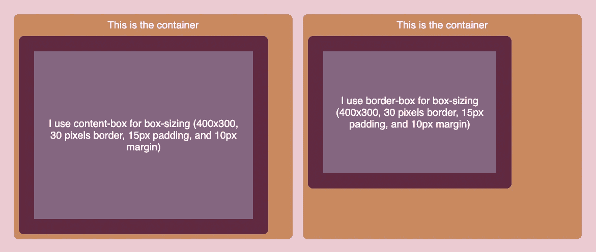

# 如何使用 CSS 边框盒子模型创建更直观的样式

> 原文：<https://javascript.plainenglish.io/how-to-create-more-intuitive-styling-using-css-border-box-box-model-1cfdc5d41227?source=collection_archive---------9----------------------->

## 使用 CSS 边框盒模型创建直观样式的指南。

前端开发最有争议的一个方面是样式。不管你用的是 React，Angular，Vue.js，Svelte，还是其他什么前端库，你要么讨厌它，要么喜欢它。但是不管你多么喜欢前端开发中的 CSS 部分，这是不可避免的。

就我个人而言，我发现 CSS 盒子模型是最简单但同时也是最复杂的概念之一。理论上，它负责元素的宽度和高度，你只需要考虑 4 件事:内容区域、填充、边框和边距。但是在实践中，很难让这四个方面直观地协同工作，从而产生灵活且响应迅速的用户界面。

有些人甚至会说，有时这可能会让人不知所措。我是其中之一。

# 默认`content-box`框模式

在 CSS 中，可以使用`box-sizing`规则改变元素的盒子模型。只有两个选项，默认情况下，箱式模型设置为`content-box`。在这个盒子模型中，在元素上设置的宽度和高度只适用于元素的内容区域。

假设我们有一个宽度为 400 像素、高度为 300 像素的元素。但由于设计原因，它现在还应该包括填充(15px)、边框(30px)和边距(10px)。在设置了这些 CSS 规则之后，元素现在不再仅仅是 400 乘 300 像素。这要归功于`content-box`箱型。相反，只有元素的内容是 400 x 300 像素。整个元素将是 490 像素宽(`400 + (15 + 30) * 2`)和 390 像素高(`300 + (15 + 30) * 2)`)。

虽然这是默认的，大多数人都会适应这种模式，但我觉得这是违反直觉的。我在使用这个盒子模型时遇到的问题是，它对待边框和填充的方式与我的心理模型不同。我不再仅仅根据内容来考虑元素的尺寸，而是将它们作为一个整体来考虑，包括填充和边框。

对我来说，这使得确定元素大小的过程相当繁琐。您必须从内容的内部开始，向外扩展整个元素以包括边框和填充，然后再次向内回溯以计算不同的大小。

# `border-box`箱式模型

这就是另一个盒子模型选项的用武之地，`border-box`。这个盒子模型考虑了所有的内容区域、填充和边框，而不是只考虑元素内容区域的宽度和高度。

所以使用前面的例子，整个元素本身仍然保持 400 像素宽和 300 像素高。不是在这些尺寸之外添加填充和边框，而是在内部添加。因此，内容最终将是 310 ( `400 - (15 + 30) * 2`)像素宽和 210 ( `300 - (15 - 30) * 2`)像素高。

这让事情对我来说更有意义，并允许我创建更直观的风格。现在，如果我提供了一个具有特定尺寸的元素，那么可以保证该元素的大小仍然符合这些规格。当`content-box`盒子模型在内容的层次上考虑 UI 的大小时，`border-box`盒子模型在整个元素的层次上考虑。

[*(在这个 CodeSandbox 这里试试)*](https://codesandbox.io/s/cranky-haze-nund7u?file=/src/App.js:559-595&resolutionWidth=1902&resolutionHeight=675)

如果你喜欢这篇文章，可以考虑看看[不凡反应](https://www.getrevue.co/profile/chakshunyu)时事通讯和我的[推特](https://twitter.com/keraito)中的其他条目，以便将来更新。

*更多内容请看* [***说白了。报名参加我们的***](https://plainenglish.io/)***[***免费每周简讯***](http://newsletter.plainenglish.io/) *。关注我们* [***推特***](https://twitter.com/inPlainEngHQ) *和**[***LinkedIn***](https://www.linkedin.com/company/inplainenglish/)*。加入我们的* [***社区不和谐***](https://discord.gg/GtDtUAvyhW) *。*****