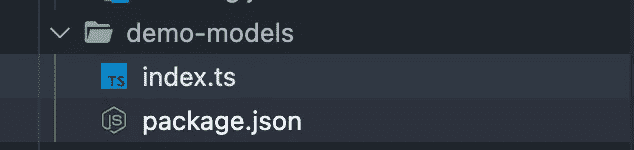

# 如何创建多模块 Node.js 应用程序

> 原文：<https://javascript.plainenglish.io/how-to-create-multi-module-nodejs-applications-9aff2d73dc17?source=collection_archive---------3----------------------->

多模块项目是 JVM 应用程序中的常见规范。大多数企业应用程序都会有它。它有它的优点和缺点。让我们看看如何在 Node.js 中实现多模块应用，它有什么好处。


# **什么是多模块项目？**

在 JVM 应用程序中，应用程序代码库被分割成逻辑子模块，并且这些子模块中的每一个都可以用作其他子模块中的依赖项。

让我们举个例子:


A simple Maven multi-module project

在这里，我们有:

1.  一个`core`模块，假设它包含所有领域类、核心配置和实用程序类
2.  一个包含所有外部 API 连接器的`clients`模块
3.  一个将服务和业务规则作为 rest api 公开的`api`模块
4.  一个`batch-job`模块，它将拥有每晚运行的任务来执行一些任务
5.  每个子模块都有自己的`pom.xml`来管理依赖关系。

# **那么，为什么是模块呢？**

1.  API 和批处理作业可以拆分成可单独部署的组件，并且可以单独扩展。对于批处理作业，API 可能需要的实例数量可能不相同。事实上，在大多数情况下，实例的数量会更少。
2.  某些配置可能非常特定于 API 或批处理作业，而您不希望它们在两者上都可用。
3.  发展更快。子模块一旦构建，就可以作为依赖项使用。只有正在处理的模块需要构建，因为其他模块已经编译并作为依赖项添加。如果被用作依赖项的模块发生了变化，您也需要构建它。

# **node . js 中多模块的优势是什么？**

上述优势同样适用于 Node.js 应用程序。当我在项目中拥有以下结构时，我发现它非常有用:


Sample NodeJs application with multiple modules

# **如何实现？**

我们需要使用名为`workspaces`的 npm 特性来创建多模块项目。此功能在 NPM 版本 7 及更高版本中可用。

> 以下代码演示是使用 npm 8.x 创建的

首先，让我们创建一个文件夹`demo-app`。在这方面，我们将有应用程序的模块。

```
npx create-react-app demo-frontend -template typescript
```

这将在文件夹`demo-frontend`中创建一个 React 应用程序。我们使用 TypeScript，因为它更容易展示依赖功能。

然后我们有另一个名为`demo-models`的文件夹，我们将在其中存放一个模型，并在前端和后端使用它。

最后，文件夹`demo-server`中的一个简单的 Express 应用程序。

现在在文件夹的根目录(`demo-app`)，让我们创建一个`package.json`并添加工作区配置。

```
{
   "name":"app",
   "version":"1.0.0",
   "workspaces":[
      "demo-models",
      "demo-frontend",
      "demo-server"
   ],
   "author":"Devayan",
   "license":"ISC"
}
```

`workspaces`参数将一个项目中的三个子模块相加。现在子模块可以找到彼此，并添加其他模块作为依赖项。

让我们添加一些代码。

在演示模型中，创建如下所示的结构:



demo-models housing simple models that can be reused in server and frontend

并添加一个这样的接口:

```
export interface SignupUserRequest { firstName: string;
   lastName: string;
   email: string;}
```

在`demo-server`中，添加 Express app 所需的依赖项，并添加`demo-models`作为 path 的依赖项。

```
{
   "name":"demo-server",
   "version":"1.0.0",
   "description":"Server app",
   "main":"src/app.ts",
   "scripts":{
      "start":"tsc src/app.ts --esModuleInterop && node src/app.js"
   },
   "author":"Devayan Sarkar",
   "license":"ISC",
   "devDependencies":{
      "[@types/express](http://twitter.com/types/express)":"^4.17.13",
      "[@types/node](http://twitter.com/types/node)":"^17.0.8",
      "ts-node":"^10.4.0",
      "typescript":"^4.5.4"
   },
   "dependencies":{
      "express":"^4.17.2",
      "demo-models":"../demo-models"
   }
}
```

在`app.ts`中，添加代码来运行一个简单的 hello-world Express 应用程序。


importing SignupUserRequest from ‘demo-models’

我们有一个来自`demo-models`的导入来使用`SignupUserRequest`。

同样，在 React app 的 package.json 中，添加对`demo-models`的依赖，导入包来使用`SignupUserRequest`。


importing SignupUserRequest in App.ts file of the react app

我们在前端和服务器上都使用相同的模型。这确保我们在两个地方使用相同的模型和结构，并且我们遵循 DRY 原则，不复制代码块。

类似地，实用程序类、函数和复杂模型类可以很容易地在前端和服务器之间共享。

任何突破性的变化都可以很容易地在前面识别出来。

让我们假设在`SignupUserRequest`中增加了一个额外的参数:

```
export interface SignupUserRequest {
    firstName: string;
    lastName: string;
    email: string;
    phone: number;}
```


phone number is required and shows an error in the App.ts file

根节点`package-lock.json`拥有应用程序中所有子模块的依赖信息。


package-lock.json

现在每个子模块都有自己的`node_modules`，但是根应用也有一个`node_module`，它包含了到实际文件夹的链接。


node_modules at the root of the app

> 弯曲的小箭头表示这些是到实际文件夹的链接。

设置这些子模块可以确保代码被分组到逻辑文件夹中。这种划分还确保了当您构建服务器或前端时，只构建那个模块，这样会更快。

就是这样。

现在，您可以添加更多的接口、函数或实用程序类，并在前端和服务器上使用它们。

*更多内容请看*[***plain English . io***](http://plainenglish.io/)*。报名参加我们的* [***免费周报***](http://newsletter.plainenglish.io/) *。在我们的* [***社区***](https://discord.gg/GtDtUAvyhW) *获得独家获得写作机会和建议。*