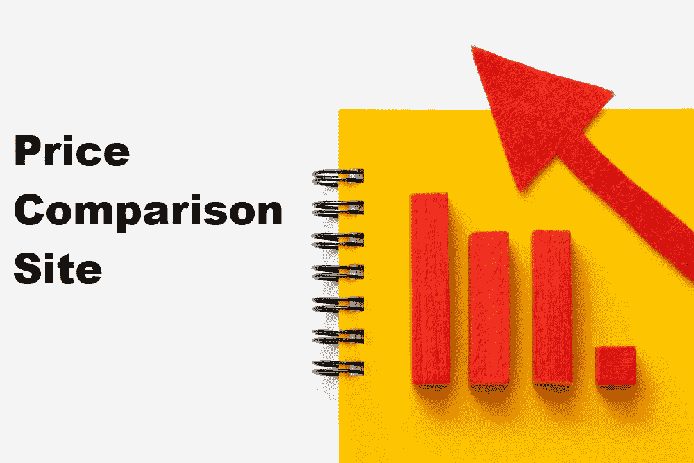
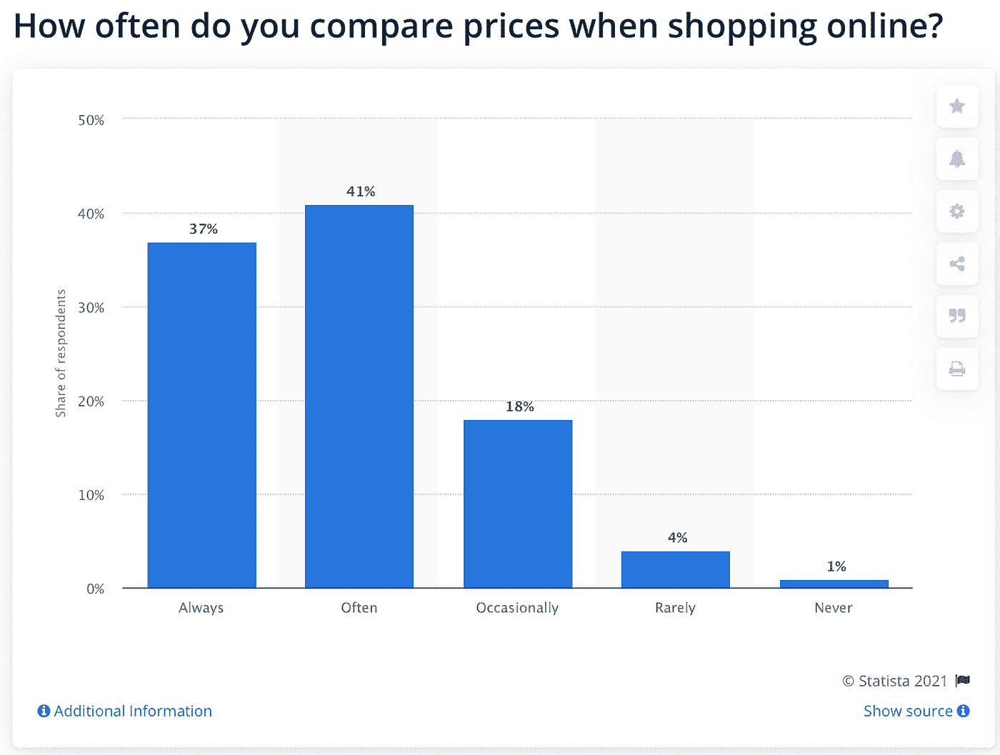
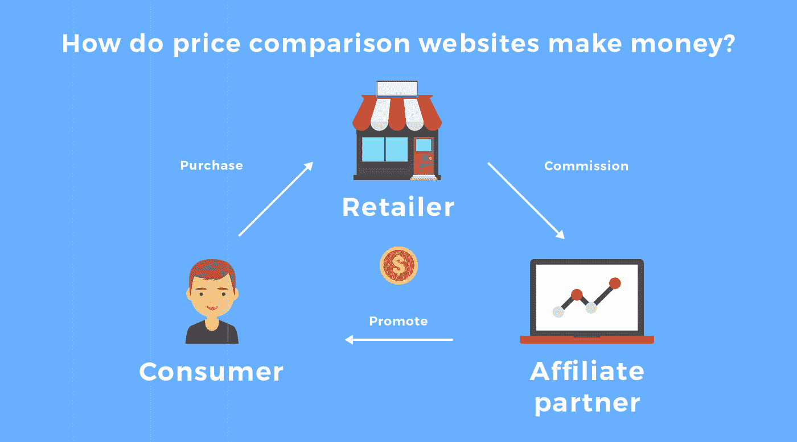

# 如何创建价格比较网站:成本和功能

> 原文：<https://javascript.plainenglish.io/how-to-create-price-comparison-site-cost-features-2f08b8bc0de5?source=collection_archive---------6----------------------->

当你想帮助顾客在网上找到最好的交易时，你可以考虑建立一个自己的价格比较网站。如果你想创建一个价格比较网站，你需要考虑一些因素。您还将看到哪些功能是必备的，哪些功能不是必需的。了解这些信息有助于你在选择商业模式时节省时间和金钱。

让我们来看看人们在网上购物时经常比较价格的统计数据:

不过，说到制造一个需要多少成本，你会花多少钱呢？价格比较网站需要什么样的功能才能成功？在你开始创业之前，一定要知道这些问题的答案以及更多！这个博客以全面的方式回答了所有这些问题。所以，我们开始吧！

## **比价网站的目的是什么？**

价格比较网站是一个具有与其他网站相同功能的网站，但它不是提供一种产品的信息，而是提供许多产品的信息。这是一个提供与其他比较购物网站相同类型服务的网站，但有一点不同；它提供多个品牌和商店的价格比较。

例如，如果您正在寻找打印机墨盒，并想知道哪家商店的墨盒价格最低，您可以访问一个在线墨盒商店比较网站，如美国墨盒世界。价格比较网站可以为购物者提供比价格更多的信息，因为它们提供专家或以前购买过这些产品的顾客对产品的评论，还可以显示某人通过在他们的网站上购物可以节省多少钱。

这些网站的成功很大程度上取决于它们的价格有多准确，以及它们更新价格数据的速度有多快。确保这种情况经常发生的一种方法是，使用计算机算法不断监控世界各地的价格变化。另一种方法是当每个零售商的价格发生变化时，手动更新每个零售商的价格——当你的网站上有这么多零售商时，这可能是必要的。

## **比价网站的好处**

让我们来看看比价网站的一些好处，以及你能从使用比价网站中获得什么。你应该 [**雇佣一个网络开发人员**](https://www.hiddenbrains.co.uk/hire-web-developers.html) ，记住这些好处。

**1)帮你省钱**

比价网站可以帮你在日常购物中省钱。你只需搜索你想要的产品，网站就会显示你所在地区当地商店的产品价格。

你可以很容易地看到价格的差异，所以你可以选择最符合你需要的商店。另外，如果你发现某样东西在当地商店买不到，在网上购买可能会更便宜。

**2)帮你节省时间**

找到最好的交易通常是困难和耗时的。价格比较网站可以帮助你在几秒钟内找到最好的交易，从而节省时间和金钱。你不需要搜索几十个甚至几百个不同的网站来找到最好的价格，因为现在大多数网站都免费提供这项服务。

你所需要做的就是输入你想要的东西，你想花多少钱，或者比较特定品牌的价格。一旦你点击搜索，你的搜索结果将会立即弹出一个商店列表，上面有你要找的东西，它们的位置和售价。

**3)比较可信零售商的价格**

由于有许多零售商可供选择，很难找到你需要的商品的最佳交易。价格比较网站会列出多家零售商的价格，并给出你想要的产品的最佳价格。使用价格比较网站有几个好处。

**4)给你一个市场概述**

比价网站可以帮你省钱，让购物更方便。买东西之前花时间比较价格是值得的。它不仅能帮你得到最好的价格，还能让你大致了解当时市场上有什么。

重要的是要记住，网上定价可能不准确或最新，所以在做出购买决定时不要仅仅依靠价格比较。

帮助你找到最划算的交易

价格比较网站通过比较不同商店的价格来帮助您找到最低价格，从而帮助您找到最佳交易。你也可以在购买之前使用这些网站来比较产品的功能和评论，这可以节省你的时间和金钱。

这些网站是找到最好的交易的一个简单的方法，而不用浪费你的时间在镇上的每个商店里逛来逛去。您可以快速地货比三家，寻找您感兴趣的任何产品或服务，然后直接从网站订购，送货上门！如果你不想出去购物，但想要一些具体的东西，比如一台新的笔记本电脑或家庭装修项目，这就特别方便了。

**6)提供客户评论**

价格比较网站让顾客能够找到最好的交易和产品评论。他们还可以帮你找出哪个零售商有该商品的库存，或者你的购买是否有折扣。

此外，许多网站为注册电子邮件列表提供折扣。像 ShopSavvy 这样的网站会在一件商品跌破某个价格门槛时提醒你，这样你就知道什么时候该买了。一些网站提供顾客评论，这样购物者在做出决定之前就能知道其他消费者喜欢或不喜欢该产品。

**7)帮助您避开欺诈网站**

你想确保你的产品得到最好的价格。价格比较网站不仅能帮你找到最优惠的价格，还能帮你避开欺诈网站，确保你从信誉良好的零售商那里购买商品。

通过比较价格，你通常可以发现该公司是否试图收取更多的钱，因为他们知道这是高需求，或者如果他们的价格普遍高于其他人。你还可以找到哪些零售商在某些商品或类别上的价格最低。这是很有帮助的，因为这样你就可以浏览并比较他们的价格和其他有类似商品的零售商。

**8)让你知道你愿意花多少钱**

价格比较网站让你知道你愿意花多少钱。你可以看到每个项目的价格，然后相互比较，以找到最好的交易。

该网站还允许你通过品牌、部门、颜色、产品类型和价格范围来限制你的搜索，如果有许多不同的品牌有类似的商品，这是非常好的。最重要的是，这些类型的网站为你提供以前购买过该产品的人的评价和评论。

**9)鼓励竞争**

你可能不相信，但是价格比较网站可以帮助你的竞争对手。是的，他们可以。事实上，它们鼓励市场竞争，让你的竞争对手更加努力地与你竞争。请继续阅读，了解使用比价网站的更多好处。

## **比价网站如何赚钱**？

价格比较网站，如 Nextag 和 Cheapism，有一个简单的功能——为您提供最全面的在线零售商和价格列表，以便您可以做出明智的决定，购买什么以及从哪里购买。

让我们来看看价格比较网站的一些不同的盈利模式，并揭示这些网站到底是如何以可能让你吃惊的方式赚钱的！

**1)广告**

比价网站通过广告赚钱，有六种流行模式。第一种模型是每次点击成本(CPC)模型，其中广告商为观看其广告的用户的每次点击付费。

第二种模型是每次行为成本(CPA)模型，在这种模型中，广告客户为用户点击他们的广告后发生的每个期望的行为付费。这包括购买产品、填写表格或下载应用程序。第三种模式是每笔销售成本(CPS ),广告商只在向点击其广告的客户销售其产品时支付费用。

**2)联盟营销**

联盟营销是比较购物网站最流行的赚钱方式[**B2B**](https://www.hiddenbrains.co.uk/web-design-development.html)的网络解决方案。这是一种零售商向网站支付佣金的模式，这些网站通过他们的网站产生销售线索。在这种情况下，任何公司都可以注册成为会员，并创建一个独特的链接，然后可以嵌入到他们的网站或通过电子邮件发送给潜在的客户。

当有人点击此链接并完成交易时，代销商将获得销售佣金。通过许多价格比较网站，如 FatWallet、Newegg 和 Slickdeals，可以获得联盟营销计划。

**3)赞助商列表**

比价网站最受欢迎的赚钱方式之一是通过赞助列表。这些是广告商为在这些网站上突出他们的产品/服务而支付的项目。

通过这种模式，双方都受益，因为广告客户被更广泛的观众看到，价格比较网站从广告中获得收入。这种模式的一种变化是，当广告商为一定数量的展示或点击支付固定费用时，这将允许他们在网站上突出显示。

**4)交易费用**

这是比价网站最常见的赚钱方式之一。交易费是你通过第三方，如亚马逊或易贝购物时支付的小额费用。当你通过比价网站买东西时，他们从零售商或制造商那里获得报酬，他们将这些交易费用转嫁给你。你可以将这笔费用视为你总账单中的附加费用。

例如，如果我通过亚马逊购买一本书，我可能需要支付 5-10 美元的交易费。这意味着我的购买最终会比我直接在亚马逊上购买多花 5-10 美元。这就是为什么许多人喜欢在网上买东西之前先货比三家，比较价格！

**5)数据出售**

数据销售意味着这些网站通过收集你的信息来赚钱，比如你的搜索历史，然后卖给那些想向你推销产品的公司。这种模式也被称为潜在客户生成，因为它为公司生成潜在客户。

来自价格比较网站的数据可能非常有价值，因为它们包括你正在查看的产品、这些产品的价格以及你正在浏览的时间等信息。这种类型的信息可以帮助零售商调整他们的营销策略，并在人们最有兴趣购买产品时向他们展示广告。

## **比价网站的特点**

价格比较网站可以帮你在家用产品和服务上节省很多钱，但是还有很多其他的事情可以帮你节省时间和金钱。这里是我们的价格比较网站的主要功能列表，你应该知道，同时利用**网站开发服务**。

**1)搜索&过滤器**

价格比较网站对于比较价格很有用，但是还有很多其他有用的功能可以考虑。一些网站允许用户根据品牌、颜色或材料进行过滤，这样他们就可以找到他们想要的特定商品。其他人有其他地方可能没有的特别优惠。您还可以注册接收产品销售通知的电子邮件。

**2)产品列表**

我们的产品列表比较网站的一个特点是购物者能够在一个页面上比较价格和阅读客户评论。

**3)价格更新提醒**

价格更新提醒功能在价格比较网站中并不常见，但它非常有用。当你设置提醒时，该服务会发邮件或短信让你知道你感兴趣的产品或服务何时会降价。用户不必回头查看网站，只需等待提醒即可。这对于那些寻找即将过期或脱销商品的人来说非常有用。

**4)用户评论&评级**

用户评论和评级为普通消费者提供了最相关的信息。这是因为它们提供了人们对产品或服务看法的无偏见数据，在广告、销售或营销活动中没有任何潜在的偏见。

**5)价格历史**

价格历史可以让你比较一段时间内的价格，看它们如何波动，以及哪一天购买最便宜。可以通过网站或手机上的 PricePop 应用程序访问价格历史记录。

**6)扫描二维码和条形码**

扫描二维码和条形码是找到最优惠价格的最简单方法之一。通过扫描二维码和条形码，你可以在一个地方比较不同商店的书籍和服装等商品的价格。当时间有限时，这也是一个比较购物的好方法。

**7)登记并签到**

注册并登录您最喜欢的价格比较网站是一种跟踪价格和销售的简单方法，而不必在每个单独的网站上搜索商品。

**8)奖励计划**

奖励是客户体验的重要组成部分，对企业来说也很重要。提供奖励计划是向你的客户表示感谢并鼓励他们再次光临的一种方式。

**9)集成支付网关**

支付网关功能有助于比较支付网关的不同价格。它可以很容易地比较价格，找到适合您的业务。该界面是直观的和用户友好的，因此它可以被任何没有这方面经验的人使用。

**10)管理和定制个人资料**

大多数人没有意识到的价格比较网站的一个主要特点是定制和管理个人资料的能力。这对那些喜欢做交易并需要不断寻找最佳价格的人来说尤其有益。

创建个人资料时，您可以输入有关您的偏好和需求的信息，以便更容易地找到新产品。您还可以保存对您很重要的项目，以便在浏览产品时首先显示出来。

## **价格比较网站开发所需的团队**

1.UI/UX 设计师:他们是设计网站外观的人。他们将使用 Photoshop 和 Sketch App 等工具来创建设计，您可以在浏览器和平板电脑、智能手机等不同设备上看到这些设计。例如，您可能希望 Instagram 风格的标题在桌面上看起来很棒，但在手机或小型平板电脑屏幕上看起来就不那么好了。如果是这种情况，那么最好选择他们的许多预建模板中的一个，而不是使用自定义设计。

2.开发人员:这些编码人员实际上是把网站运行所需的所有组件放在一起的。开发者将把 HTML、CSS 和 JavaScript 文件合并成一个功能单一的网站，如果需要的话，你可以在线发布(给主机提供商)。使用别人的模板的一个好处是，他们已经完成了所有的艰苦工作，所以没有必要从头开始学习如何编码。

3.QA &测试人员:一旦所有的东西都放在一起，开发人员将在把它交给其他人之前测试和审查整个项目。

4.支持和维护专家:在设计和开发网站后，你需要有人定期维护和更新网站。如果出现任何问题，你也需要支持。

## **创建网站的成本**

**以英镑计的平均成本(网站开发团队类型):**

内部团队— 100，000 人

外包团队— 60，000 到 70，000 人

地方发展机构——15 万

自由职业者——4 万到 5 万人

**以英镑为单位的平均费用(基于团队所在地/国家)**

美国——15 万

加拿大——12 万人

英国——11 万人

澳大利亚——10 万人

**结论**

读完这篇文章后，你应该对创建这样一个网站有所了解。这并不容易，但如果有正确的知识和计划，这是可以做到的。如果你正在考虑建立自己的价格比较网站，花时间彻底探索你的选择，不要忘记隐藏的成本。你需要的不仅仅是一个供人们访问的网站。

此外，你应该聘请一个有创建类似网站经验的网络应用开发机构。服务的费用取决于你想要多少功能，但是在项目的开始阶段获得专业人士的帮助是很重要的。

*更多内容看* [***说白了就是***](https://plainenglish.io/) *。*

*报名参加我们的* [***免费每周简讯***](http://newsletter.plainenglish.io/) *。关注我们关于*[***Twitter***](https://twitter.com/inPlainEngHQ)，[***LinkedIn***](https://www.linkedin.com/company/inplainenglish/)*，*[***YouTube***](https://www.youtube.com/channel/UCtipWUghju290NWcn8jhyAw)*[***不和***](https://discord.gg/GtDtUAvyhW) ***。****

****对缩放您的软件启动感兴趣*** *？检查出* [***电路***](https://circuit.ooo?utm=publication-post-cta) *。**