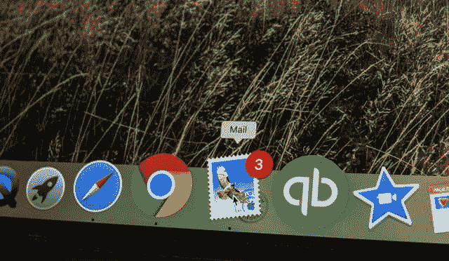

# 如何在 Node.js 网站上创建一个简单的电子邮件表单

> 原文：<https://javascript.plainenglish.io/how-to-create-simple-email-form-in-your-nodejs-website-fcbc42160584?source=collection_archive---------2----------------------->

## 在 Node.js 网站上创建简单电子邮件表单的快速指南。



大多数网页都有一些联系形式，通常不是很花哨，其后端可以是 SalesForce，任何其他潜在客户生成软件的变体，但通常它只是发送电子邮件。

发送电子邮件不是小事，你需要有一个 SMTP 服务器，仅此一项就会增加你的成本。幸运的是，我们生活在一个一切都是服务和 API 的时代。有大量的服务可以给你发送电子邮件。我的目标是尽可能便宜地完成它(最好是免费的)。我原本预计每天最多 5 封邮件。

经过一番研究，我决定使用[发送蓝色](https://www.sendinblue.com/)。他们的免费计划每天有 300 封电子邮件(对我来说绰绰有余)，你不需要信用卡来注册，没有 DNS 诡计，他们的 API 非常简单。

# Next.js 中的 API 端点

Next.js 提供了一种友好而简单的方法来创建 API 端点，从这里您可以调用任何外部 API，而无需将您的密钥实际暴露给浏览器。

在这个棒极了的[帮助页面](https://help.sendinblue.com/hc/en-us/articles/209467485-What-s-an-API-key-and-how-can-I-get-mine-)的帮助下，我从 Send in Blue 获得了 API 密匙，并将密匙添加到我的. env.local 文件中。

```
NEXT_PUBLIC_SEND_IN_BLUE_KEY=xxxxapikeyxxxx
```

我还将密钥放入同名的 Vercel 环境变量管理器中。

我创建了一个新文件 api/email.js，我将通过蓝色 api 发送电子邮件。

从表单中，我得到了发送者的姓名和电子邮件以及一条消息。我把它(发件人是表格中的电子邮件)发送到我的电子邮件地址，这样我就可以回复我的电子邮件客户端了。

# 联系方式

然后我创建了一个联系人表单组件。这是一个简单的表单，有三个字段和提交按钮。所有的发送魔法都发生在 handleSubmit 函数中。

我使用的是 React 材质 UI，但是你可以使用任何 UI 或者普通的输入。

这是你所需要的。简单而优雅。一个小时就完成了。

祝你编码好运。

【https://ppolivka.com】最初发表于[](https://ppolivka.com/posts/creating-email-form-nextjs)**。**

**更多内容请看*[***plain English . io***](https://plainenglish.io/)*。报名参加我们的* [***免费周报***](http://newsletter.plainenglish.io/) *。关注我们关于*[***Twitter***](https://twitter.com/inPlainEngHQ)**和*[***LinkedIn***](https://www.linkedin.com/company/inplainenglish/)*。查看我们的* [***社区不和谐***](https://discord.gg/GtDtUAvyhW) *加入我们的* [***人才集体***](https://inplainenglish.pallet.com/talent/welcome) *。***