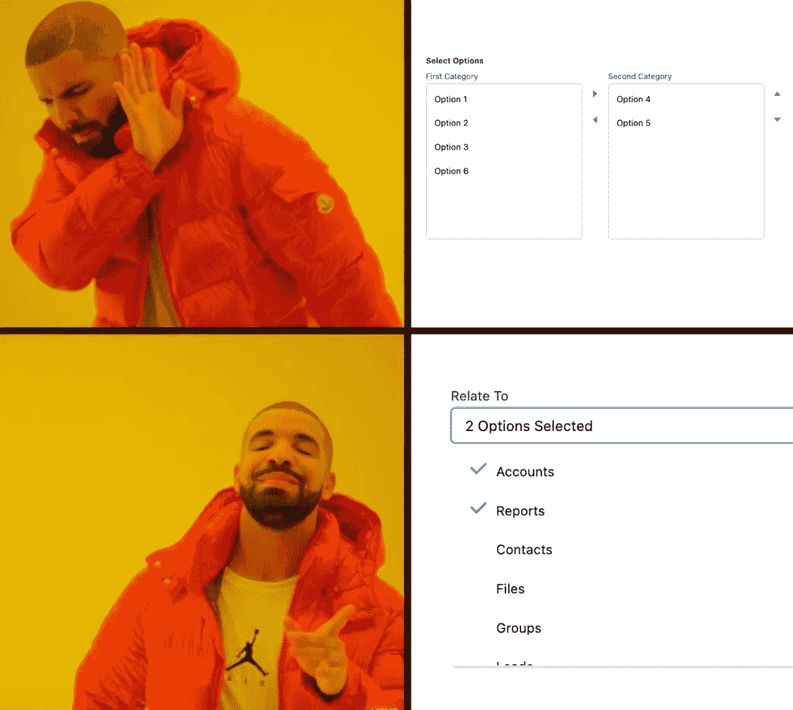
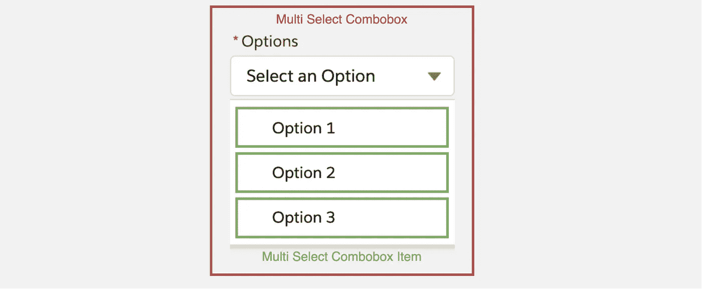
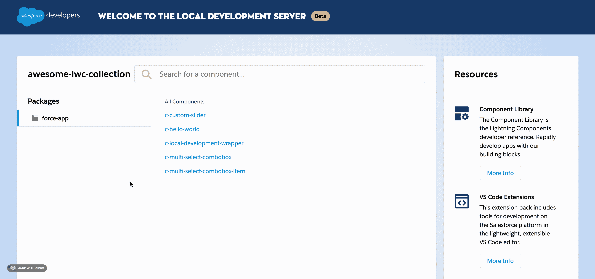

# 如何创建 Salesforce 仍然缺少的 LWC 多选组合框

> 原文：<https://javascript.plainenglish.io/how-to-create-the-lwc-multi-select-combobox-that-salesforce-is-still-missing-c7bf3a2850dd?source=collection_archive---------0----------------------->

## 使用 Salesforce Lightning 设计系统(SLDS)创建您自己的可重用自定义组件

如果你看看各种系统和网络应用，多选下拉是一种常见的模式。但是，如果您查看 Lightning Web 组件的 [Salesforce 组件引用](https://developer.salesforce.com/docs/component-library/overview/components)，仍然只有一个提供了单选的[组合框。如这里的](https://developer.salesforce.com/docs/component-library/bundle/lightning-combobox/example)[所述](https://developer.salesforce.com/docs/component-library/bundle/lightning-combobox/documentation)，Salesforce 推荐的解决方案是使用 [lightning-dual-listbox](https://developer.salesforce.com/docs/component-library/bundle/lightning-dual-listbox/example) 进行多值选择。然而，与你在网上所习惯的相比，这并不令人满意。此外，双重列表框也占据了屏幕上相对较大的空间。

Who would use a [Lightning Dual Listbox](https://developer.salesforce.com/docs/component-library/bundle/lightning-dual-listbox/example) instead of a Multi-Select Combobox? (created with [Kapwing Meme Generator](https://www.kapwing.com/meme-maker))

[SLDS](https://www.lightningdesignsystem.com/)(sales force Lightning 设计系统)甚至包括早期的多选组合框的[蓝图。那么为什么没有相应的现成组件呢？没关系，我们将简单地基于 SLDS 模板实现我们自己的多选组合框。这也允许我们使用现有的实用程序类，而不必自己用自定义 CSS 定义所有样式。](https://www.lightningdesignsystem.com/components/combobox/#Multiple-selections)

# LWC 组合框的结构

我们的多选组合框由以下两部分组成:

*   **多选组合框** -应该提供不同配置选项的组合框父组件。
*   **多选组合框项目** -代表父组件中单个可选项目的子组件。

Multi-Select Combobox component structure

# 创建父 combobox 组件

我们的组件应该具有官方 [lightning-combobox](https://developer.salesforce.com/docs/component-library/bundle/lightning-combobox/specification) 的基本功能、参数和行为，此外，它不仅应该支持单选，还应该支持多选。因此，我们需要首先定义适当的公共属性，并实现它们背后相应的逻辑。

除了标准的 combobox 属性之外，还有一个 *singleSelect* 属性，用于决定单选模式和多选模式。此外，还有一个名为 *showPills* 的附加属性，它允许在多选模式下将当前选择的选项显示为组合框下方的药丸容器。

对于父组件的模板，我们尽可能遵循 SLDS 模板。然而，我们不能只使用现有的 SLDS 实用程序类，还必须另外定义一些自己的 CSS 类。

模板中附加 CSS 类的定义如下所示:

# 生成子 combobox 项

在我们实现了父组件之后，我们需要关注 combobox 的单个可选项目。我们的子组件将从父组件接收要显示的项目，父组件具有以下属性:*标签*和*值*。此外，当用户选择相应选项时，它随后还接收*选择的*状态。

在我们的模板中，与父组件不同，这次我们不需要定制样式。使用现有的 SLDS 实用程序就足够了。

就这样，我们的组件现在可以使用了！

# 如何使用我们新的 LWC 组合框？

现在要使用我们的组件，我们可以简单地将它添加到 HTML 模板中的任何父组件，如下所示:

正如我们所看到的，我们已经指定了需要从父组件传递到 combobox 的可选选项以及一个“onchange”侦听器，这样我们就可以从父组件中访问当前选中的选项。为了实现这两个目标，代码如下所示:

在组件构建过程中，我使用了本地的 LWC 开发服务器，特别是在之后的测试中。如果你对使用本地开发感兴趣，我也写了一个[指南，里面有安装说明](https://medium.com/@svierk/local-development-for-lightning-web-components-7a3fdc1c4b7d)。

Preview of the Multi-Select Combobox

GitHub 上提供了完整的源代码，包括 JEST 单元测试和 JSDoc 注释:

 [## awesome-LWC-collection/force-app/main/default/LWC/multiSelectCombobox at main…

### ⚡️收集了一些现成的 Lightning Web 组件，可能会对您的 SFDX 项目有所帮助…

github.com](https://github.com/svierk/awesome-lwc-collection/tree/main/force-app/main/default/lwc/multiSelectCombobox) 

*更多内容看* [***说白了. io***](https://plainenglish.io/) *。报名参加我们的* [***免费周报***](http://newsletter.plainenglish.io/) *。关注我们关于*[***Twitter***](https://twitter.com/inPlainEngHQ)*和*[***LinkedIn***](https://www.linkedin.com/company/inplainenglish/)*。加入我们的* [***社区***](https://discord.gg/GtDtUAvyhW) *。*