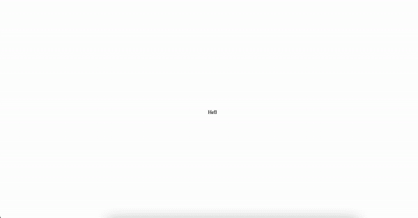

# 如何使用 JavaScript 创建打字机动画

> 原文：<https://javascript.plainenglish.io/how-to-create-the-typewriter-animation-using-javascript-9e1524ebf690?source=collection_archive---------11----------------------->

## 使用 JavaScript 创建打字机动画的教程


Photo by [Pixabay](https://www.pexels.com/@pixabay/) on [pexels](https://www.pexels.com/photo/black-vintage-typewriter-163084/)

在这篇博客中，我们将讨论如何用 JavaScript 创建打字机动画。下面你会看到我们将要创造的动画。



在开始之前，我们必须创建一个`index.html`文件。我还创建了一个包含一些基本样式的`styles.css`文件。下面你可以找到`index.html`和`styles.css`的代码。

现在，我们可以开始为打字机动画编写代码了。我们将首先创建两个文件:`typewriter.js`和`index.js`。`index.js`将负责初始化 typewriter 对象，并在 DOM 上显示动画。`typewriter.js`文件将保存与打字机动画相关的所有逻辑，并将是这个博客的主要焦点。考虑到这一点，我们可以开始为打字机的逻辑编码。

我将把下一部分分成许多部分，详细介绍每一步。如果你想看完整的代码，请滚动到这一部分的末尾。

我们从类属性和构造函数开始。可以看出，这个类有许多属性。它有一个`state`对象，该对象保存关于当前在 DOM 上显示的内容状态的重要信息。它有一个`options`对象，该对象保存关于应该显示什么以及如何显示的信息。最后，它有一个`nextStep`属性，是指向其他类函数的指针。下面我将详细介绍每个属性，并描述它们所代表的含义。

注意:选项是初始化期间唯一可以指定的属性。

```
optionstexts: a string array. Each element will be the text we want to print out on the DOM.element: this should be a valid HTML element. This element will be the parent element to which the typewriter will write to.
typingSpeed: integer value representing the wait time, in milliseconds, of appending a new character to the DOM.deletingSpeed: integer value representing the wait time, in milliseconds, of deleting the last character on the DOM.waitDurationBeforeDeleting: integer value representing the wait time, in milliseconds, before beginning to delete the text printed on the DOM.nextStep: This attribute will be pointer to either the type(text) or delete(text) function. We will use this attribute to keep track of what should happen next. On initialization, this attribute is set to type. Once the first word has been fully typed, it will be set to delete. We will cover this logic later when we cover the determineNextStep(text) function.statecurrentText: string value representing the current text as it is displayed on the DOM.index: integer value representing the index of the text we are currently interacting with in the options.texts array. We will use this value to keep track of what is currently being printed.isDeleting: boolean value representing if we are currently deleting or typing.timeoutDuration: integer value used to determine the wait time before the next action. If we are typing it should be set to options.typingSpeed. If we are deleting it should be set to options.deletingSpeed. And if we finished typing it should be set to options.waitDurationBeforeDeleting. On initialization the typewriter object will begin typing, thus this value must match options.typingSpeed. This can be seen in the class constructor.
```

接下来，我们可以介绍类方法。我们将从`start()`函数开始。逐行分析，`start()`函数的逻辑如下。我们首先从`options.texts`数组中确定我们当前正在交互的文本。然后我们完成`nextStep`(记住，`nextStep()`要么是`type(text)`要么是`delete(text)`)。一旦`nextStep()`完成，我们就更新 DOM 上的内容。最后，在等待指定的`timeoutDuration`(将是以下值之一:`options.typingSpeed`、`options.deletingSpeed`或`options.waitDurationBeforeDeleting`)后，再次调用`start()`函数。

接下来，我们可以讨论一下`type(text)`和`delete(text)`功能。这两种功能非常相似。它们接受一个代表`text`的`text`参数，这个参数来自`options.texts`数组，我们目前正在与之交互。从那里，它根据 DOM 上当前显示的内容更新`state.currentText`(根据我们是键入还是删除，是+1 字符还是-1 字符)。更新`state.currentText`后，运行`determineNextStep(text)`功能。

这个`determineNextStep(text)`功能决定了我们刚刚完成了哪一步，下一步应该做什么动作。打字机可以采取四种可能的行动。

1.  如果执行的最后一个动作是键入，并且当前文本等于完整的所需文本，那么下一个动作应该是删除屏幕上的文本。
2.  如果执行的最后一个操作是删除，并且当前文本被完全删除，那么下一个操作应该是开始键入 options.texts 中的下一个文本
3.  如果我们当前正在删除并且尚未完全删除当前文本，那么下一步操作应该是继续删除。
4.  如果我们当前正在键入，并且还没有完全键入所需的文本，那么下一个动作应该是继续键入。

下面你会看到`determineNextStep(text)`的代码。

综合所有这些，打字机类应该是这样的:

最后，我们必须初始化`index.js`中的打字机对象，这可以用下面的代码来完成。在这里，我们指定了想要显示的文本，以及打字机将更新的元素。因为我没有指定 typingSpeed、deletingSpeed 或 waitDurationBeforeDeleting，所以将使用默认值。

这就结束了如何创建打字机动画。如果你觉得这有帮助，考虑订阅。下次见，编码快乐！

*更多内容尽在* [***说白了. io***](https://plainenglish.io/) *。报名参加我们的* [***免费周报***](http://newsletter.plainenglish.io/) *。关注我们关于* [***推特***](https://twitter.com/inPlainEngHQ) *和*[***LinkedIn***](https://www.linkedin.com/company/inplainenglish/)*。查看我们的* [***社区不和谐***](https://discord.gg/GtDtUAvyhW) *加入我们的* [***人才集体***](https://inplainenglish.pallet.com/talent/welcome) *。*