# 如何利用 Firebase 动态链接创建世博会通用链接

> 原文：<https://javascript.plainenglish.io/how-to-create-universal-link-in-expo-using-firebase-dynamic-link-7c70eba737c2?source=collection_archive---------2----------------------->

## 使用 Firebase 动态链接创建世博会通用链接指南。

# **什么是 DeepLink**

DeepLink 是一种超链接，将用户发送到应用商店或应用程序。它是你的应用程序内部的一个链接。

深度链接有两种情况:

*   如果安装了应用程序，它将打开应用程序中的屏幕。
*   如果应用程序没有安装，那么它会打开 Play Store(在 Android 的情况下)或 App Store(在 iOS 的情况下)

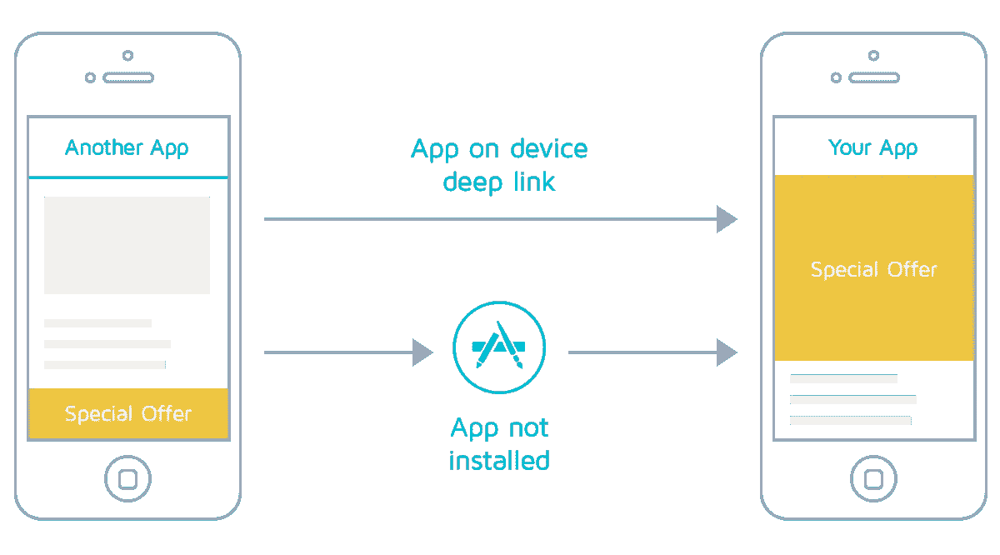

# 深度链接的类型

以世博会为例，深层链接可以有多种类型-

*   世博会的发展:

```
exp://127.0.0.1:19000/ — /path/into/app?hello=world
```

*   Expo Go 中发布的应用程序:

```
exp://exp.host/@community/with-webbrowser-redirect/ — /path/into/app?hello=world
```

*   独立发布的应用程序:

```
myapp://path/into/app?hello=world
```

*   已发布的独立应用程序(通用链接):

```
https://www.myapp.io/records/123
```

前两个链接只能在 Expo Go 中使用，这就是为什么我们不能在我们的生产应用程序中使用它们。

第三个环节是在所谓的**计划**的帮助下完成的。只有当我们从其他应用程序打开我们的应用程序时，方案链接才有用。例如， **App 1** 中的一个按钮打开 **App 2** 中的一个屏幕。

这些类型的链接在作为可共享链接共享时是不可点击的。😕

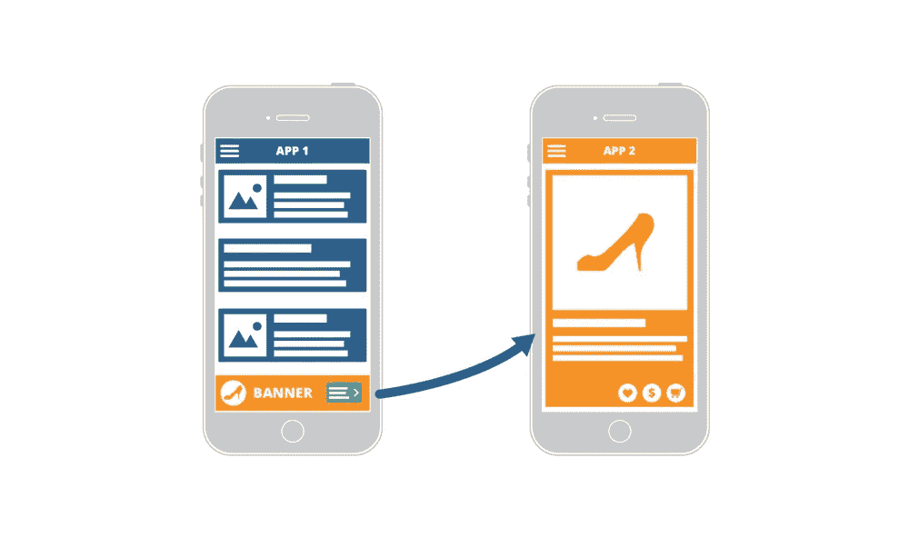

最后一个被称为**通用链接**，因为它可以在任何地方共享，并且可以点击(由 HTTPS 方案组成)。这是我们感兴趣的环节。🤩

# 用例

*   推送通知
*   可用于直接打开应用程序的电子邮件
*   可以分享屏幕(产品等)的链接。)

# 应用程序设置

让我们不要在理论上花更多的时间，开始设置应用程序😃。

我们将使用 expo-cli 创建我们的应用程序。

```
expo init deep-link
```

它会询问一些选项，选择**最小屏幕的打字稿和反应导航**。

我们将从添加两个屏幕开始—

*   **所有用户屏幕** —它将显示所有用户
*   **用户屏幕** —将显示个人用户屏幕

我们将把`userId`从所有用户屏幕传递到用户屏幕。

**AllUsersScreen.tsx**

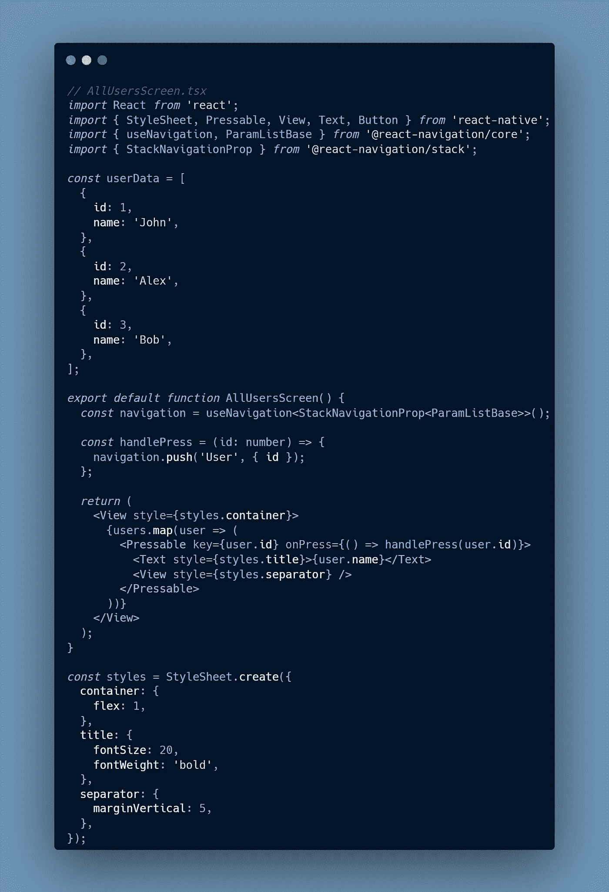

一个简单的功能组件，其中的用户数据是一个静态的对象数组。每当有人点击任何一个用户名，它就会和**用户 Id** 一起推送到新的屏幕。

将该组件导入到 **TabTwoScreen.tsx** 中。

```
import React from ‘react’;
import AllUsersScreen from ‘./AllUsersScreen’;export default function TabTwoScreen() {
 return <AllUsersScreen />;
}
```

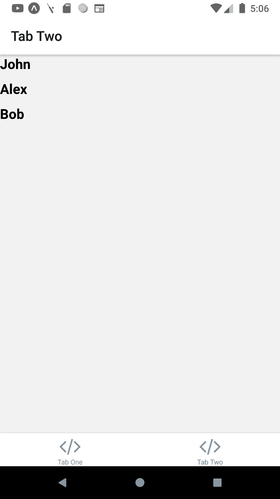

下一步是设置**用户屏幕。**

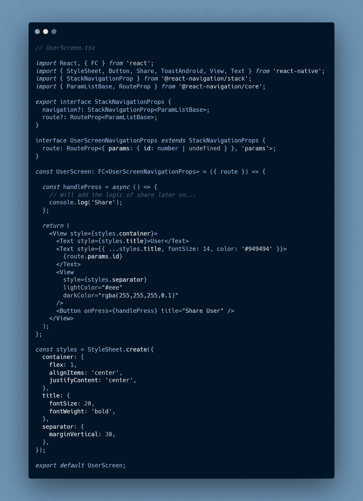

这是一个基本的功能组件，我们在其中创建了一个基本的**反应-导航**界面。然后，这个基本接口被一个特定于屏幕的接口继承，在我们的例子中，这个接口就是**UserScreenNavigationProps**。该接口用于接受 **id** 作为路线参数。

现在，我们需要将这个组件添加到**堆栈中。屏幕**定义我们的**堆栈导航器**中的屏幕。

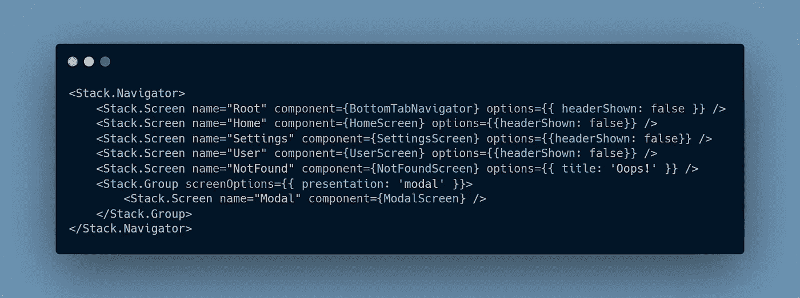

大多数屏幕都来自模板。我们的是用户。TypeScript 可能会给出一个错误，所以在 **types.tsx** 文件中，编辑 type**RootStackParamList**。

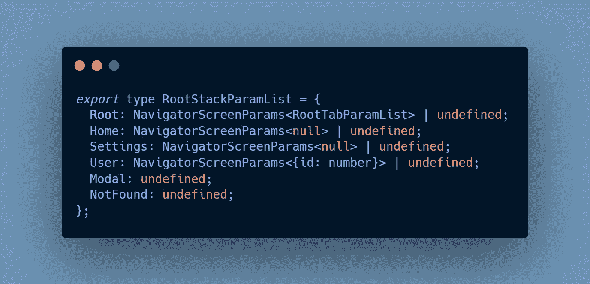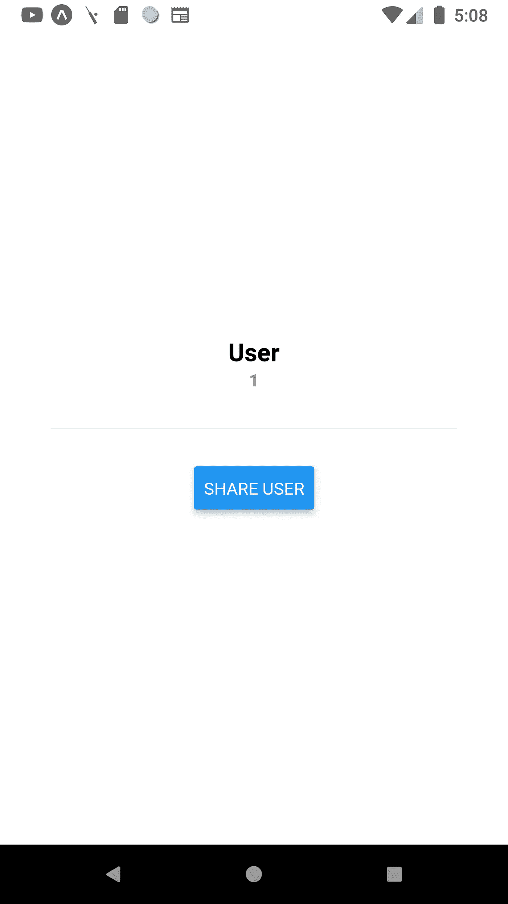

# Firebase 托管设置

我们稍后将设置共享链接逻辑，因为首先，我们需要在我们的 web 域端设置通用链接。世博文档说我们需要在一个 web 域上部署两个文件——`/.well-known/apple-app-site-association`**(iOS)**`/.well-known/assetlinks.json`**(Android)**。

我们可以通过创建一个 Firebase 项目，然后使用 Firebase 托管来轻松做到这一点。

所以，第一步是创建一个 Firebase 项目。打开 [**Firebase 控制台**](https://console.firebase.google.com/) ，点击**添加项目**。它会要求一个项目的名称，给它一个名称，就这样。项目已创建。😌

现在，我们可以打开 **Firebase 托管**并按照步骤操作。

1.`firebase login`
需要通过 CLI 登录 firebase。

2.创建一个目录，并在该目录中运行`firebase init`

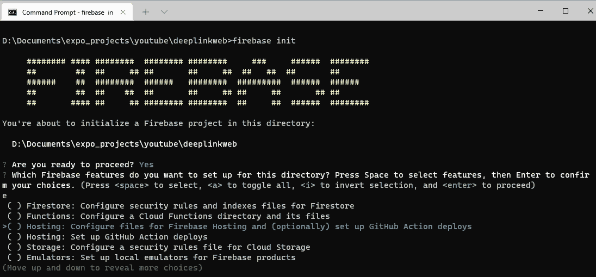

它会问很多问题，我们需要选择**托管:为 Firebase 托管配置文件，并(可选)设置 GitHub 动作部署**

然后在这之后是**项目 ID** ，它将与我们新创建的 Firebase 项目中的 ID 相同。

回答完所有问题后，它将创建我们的应用程序。

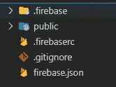

项目结构看起来像这样，一个基本的应用程序。我们可以先从 Android 设置开始。

1.在`public`目录下创建一个目录`.well-known`。
2。在`.well-known`目录中，创建`assetlinks.json`文件。
3。在文件中添加以下内容。关于这个文件的详细信息可以在 [**Android 文档**](https://developer.android.com/training/app-links/verify-site-associations) **上找到。**

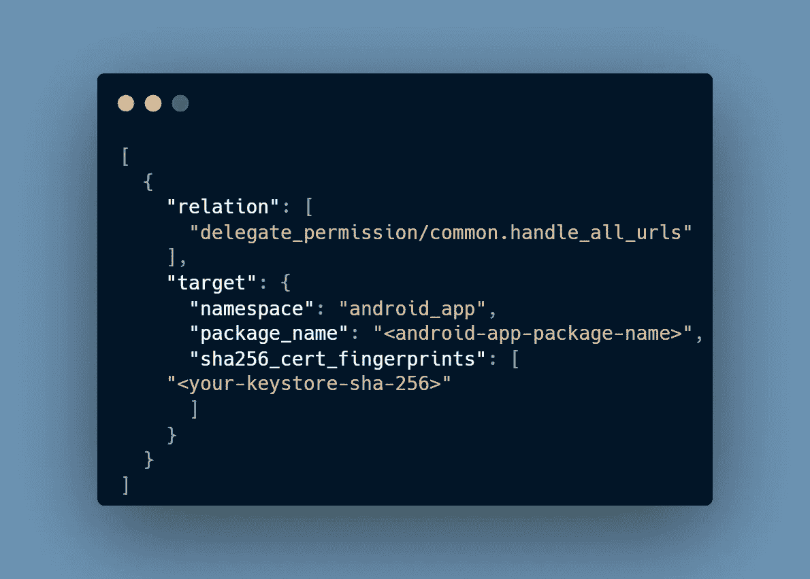

接下来，我们需要编辑 **firebase.json** 文件。在其中添加以下内容。

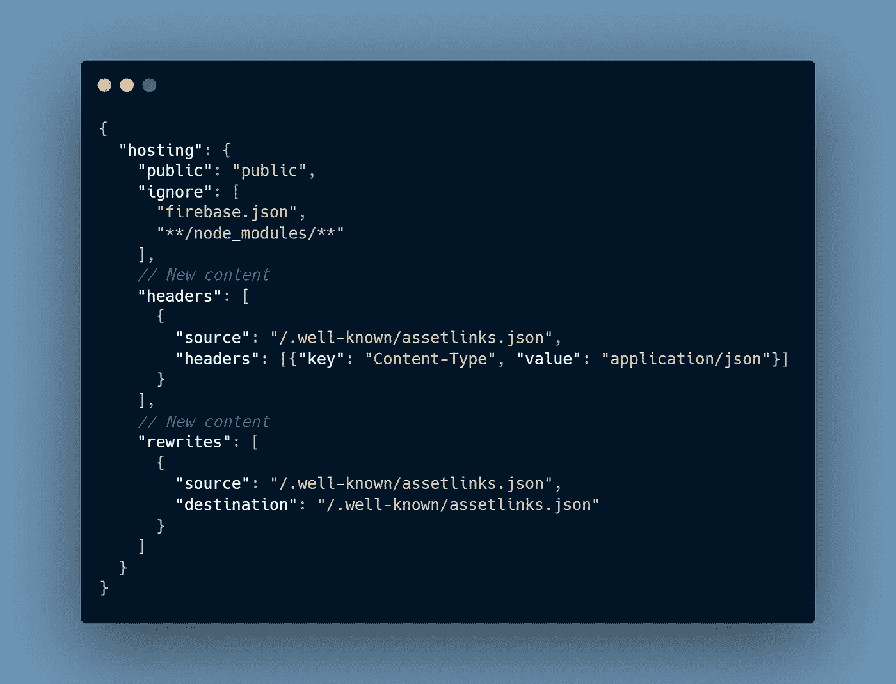

- **头**很重要，因为这个文件是 JSON，它需要有合适的头来提供 JSON 内容。

- **重写**被使用，因为文件说在创建自定义域链接的情况下使用它。

最后，我们可以使用`firebase deploy`来部署网站。

网站准备好了，我们可以打开 web app — `https://<domain>/.well-known/assetlinks.json`查看文件。它会显示文件的内容。

# Firebase 动态链接设置

这一步非常短。只需访问**接合**部分内的**动态链接**。
添加新的 URL 前缀。它可以是任何东西，也可以是你自己的域名，我们也可以使用 Firebase 提供的域名。

我将使用 **dynamiclink.page.link** 。 **.page.link** 子域由 Firebase 提供。

# 返回应用程序

现在，我们可以使用这些域值来恢复应用程序中的通用链接设置。
对于 Android，我们需要编辑 Expo 的 **app.json** 文件，添加 **intentFilters** 和**包名**。

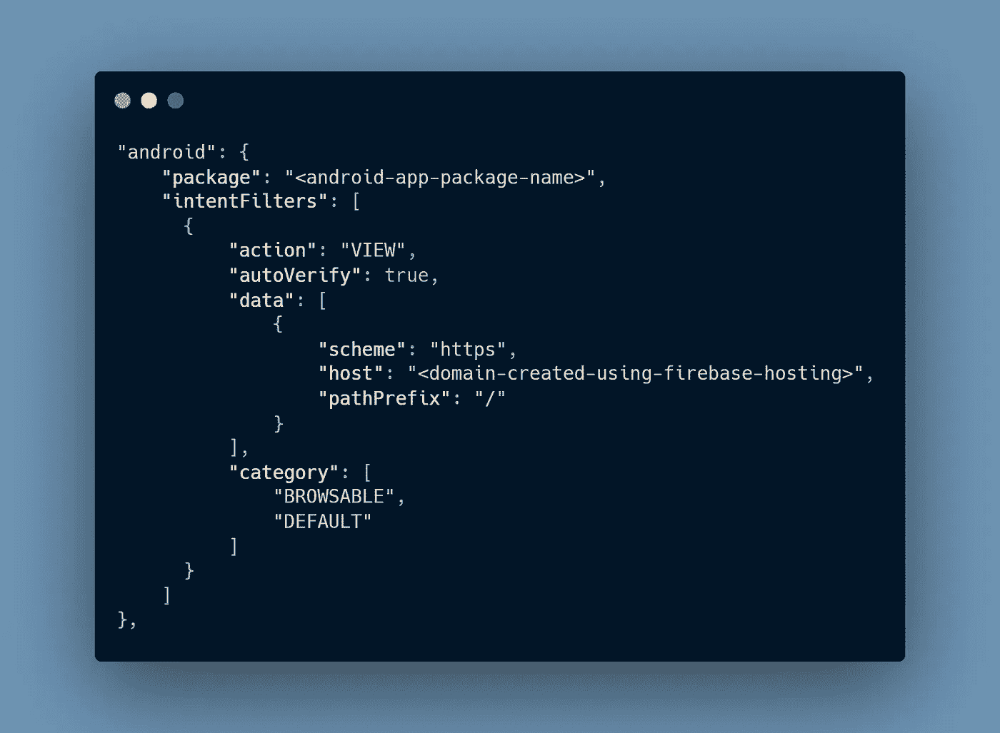

域将是使用 Firebase 托管创建的。

在这之后，我们需要在我们的**共享用户**按钮中添加逻辑。

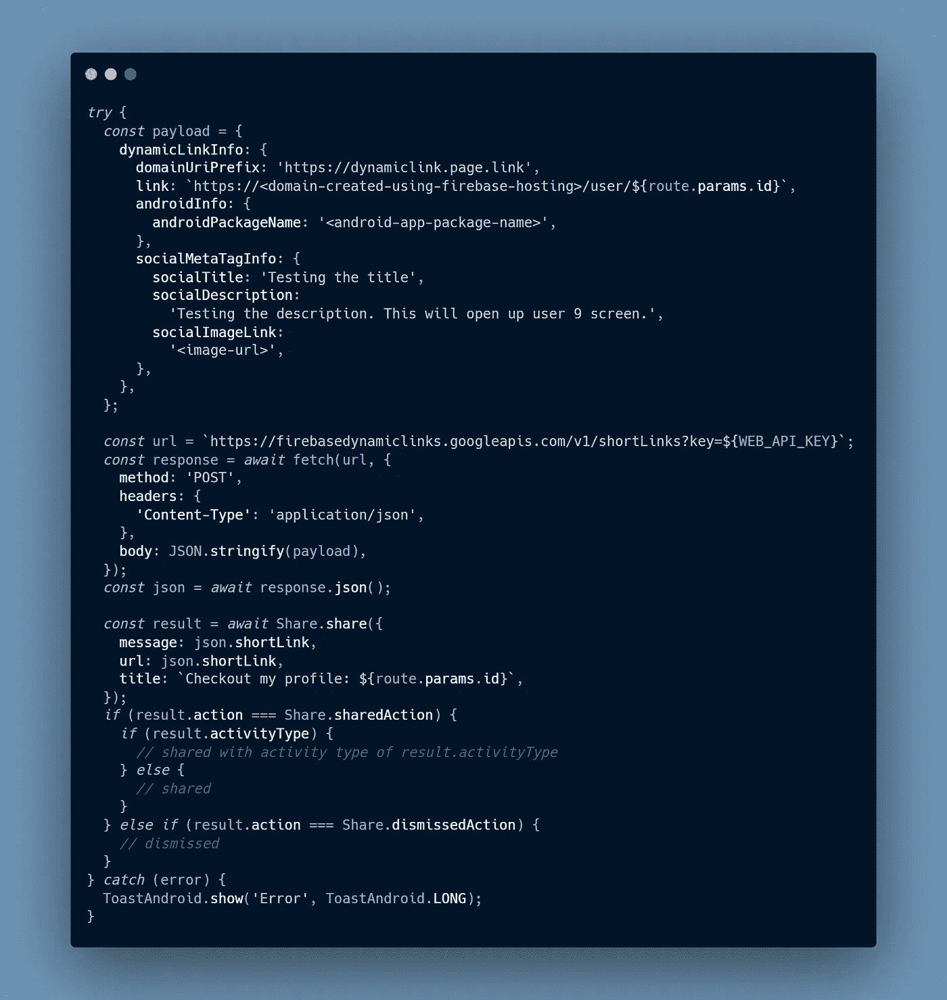

哈！😵代码太多😆。嗯，不能做任何事情，这是必要的。无论如何，让我们看看所有重要的事情。

有效载荷和 URL 是两件重要的事情。剩下的很简单，首先是对 URL 发出 HTTP 请求，另一个是 React-Native 的[**Share**](https://reactnative.dev/docs/0.66/share)**模块提供的模板。**

**URL 是为了生成我们可以共享的动态链接的简短版本。这是 Firebase 提供的，可以在 [**Firebase 动态链接— REST**](https://firebase.google.com/docs/dynamic-links/rest) 的文档中查到。**

**这是一个 POST 请求，也接受 **WEB_API_KEY** 。我们可以通过在 Firebase 项目中生成一个 web 应用程序来获得 API 密钥。POST 请求也需要一个有效负载对象。这就是为什么我们要传递一个给它。**

**这个有效载荷对象的有效属性可以在 这里找到 [**。我们只使用了几个重要的属性。**](https://firebase.google.com/docs/reference/dynamic-links/link-shortener)**

*   ****domainUriPrefix** :这个是使用 Firebase 动态链接生成的**
*   ****链接**:是我们 app 可以处理的路径。它应该打开我们的应用程序中的任何屏幕。**
*   ****安卓信息**:安卓相关信息**
*   **Social Meta taginfo:Social Meta info，每当我们在 Whatsapp 等其他应用程序上共享链接时，它就会显示该对象中提供的图片、标题和描述。😎**

**在链接属性中，我们不应该使用 Firebase 动态链接域，因为它会给出警告，并且不会打开应用程序。它只会打开应用程序的主屏幕。😪**

**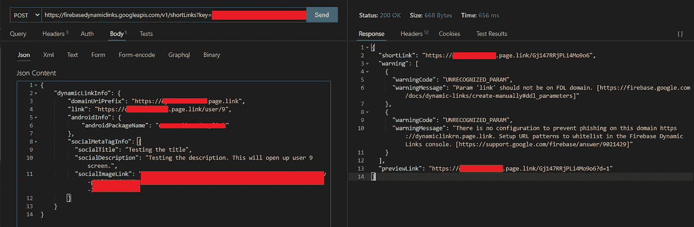**

**第一个警告— **参数链接不应该在 FDL 域**上。**

**如你所见，它生成了两个链接，**快捷链接**和**预览链接**。快捷链接是我们可以与其他应用程序共享的链接。previewLink 包含一个由 Firebase 创建的流程图，用于可视化应用程序的流程。**

**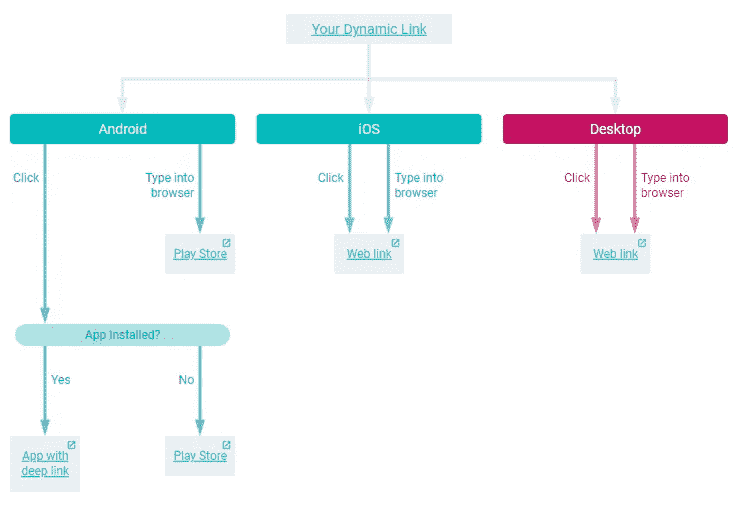**

**最后一步是编辑导航容器的链接配置。我们将添加前缀值并定义我们的**用户**路由。**

**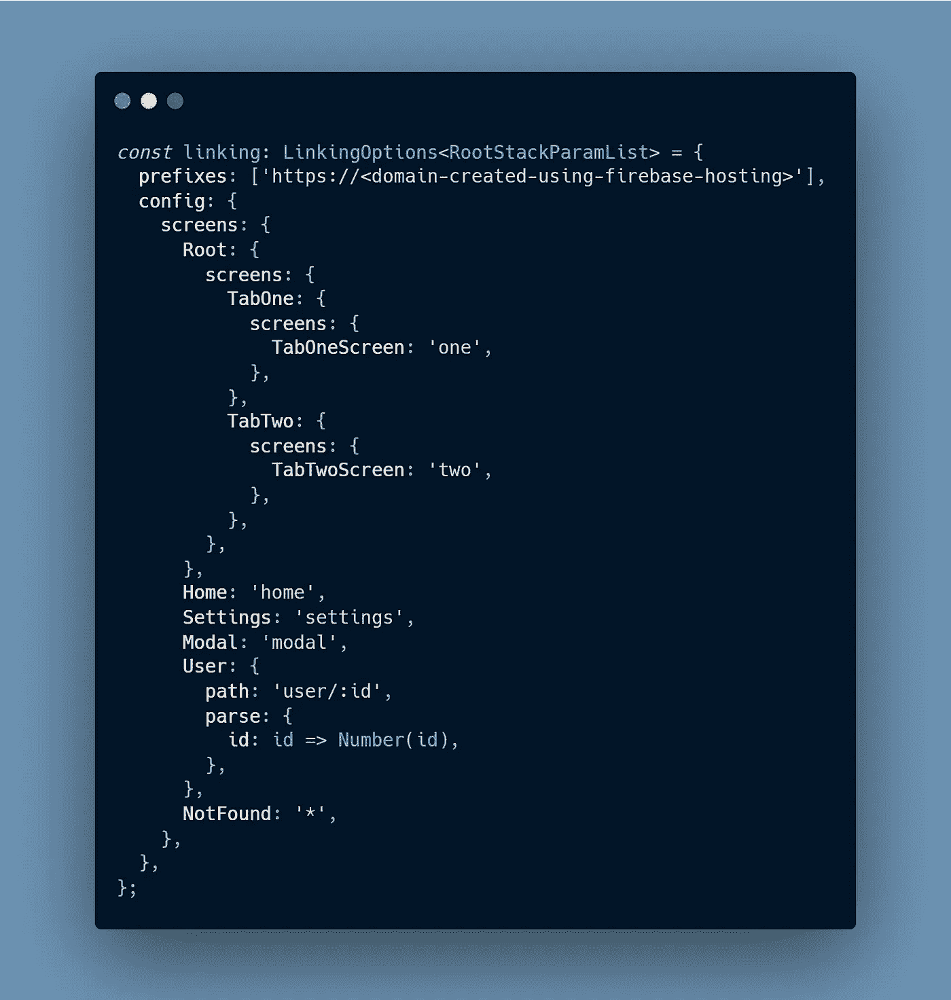**

**随着这最后一步，我们的准备工作已经就绪。我们可以使用 **eas build** 来构建应用程序。 [**文档**](https://docs.expo.dev/eas/) 非常好，所以你可以按照它们来创建构建。**

**iOS 的**几乎是一样的，只要跟着 Android 的文档走，你就能很容易地配置它。😛****

**最后，我们有我们的工作通用链接。🤩**

**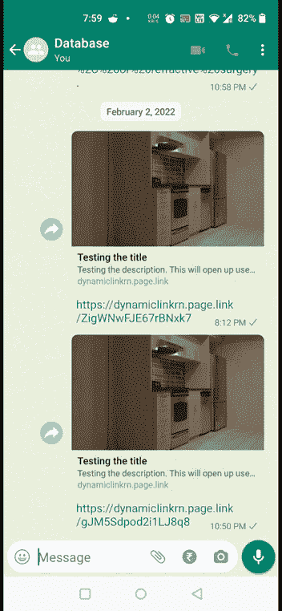**

**如果你能跟进到这一点，那么恭喜你。🥳:你终于知道如何在世博会上建立全球联系了。😎**

**就这样，这就是我们旅程的终点。我希望你能达到这一点。😃**

**谢谢！敬请关注 React/React-Native 的更多文章。🤩😎**

****【编辑 1】**—最好将共享逻辑移动到您的后端应用程序，以便通过隐藏 Firebase Web API 密钥为我们的应用程序提供一些安全性。**

***更多内容请看* [***说白了就是***](https://plainenglish.io/) *。报名参加我们的* [***免费每周简讯***](http://newsletter.plainenglish.io/) *。关注我们*[***Twitter***](https://twitter.com/inPlainEngHQ)*和*[***LinkedIn***](https://www.linkedin.com/company/inplainenglish/)*。加入我们的* [***社区不和谐***](https://discord.gg/GtDtUAvyhW) *。***