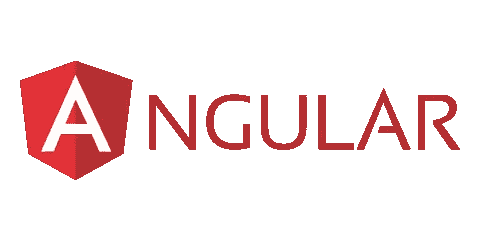

# 如何用 Node.js 创建你的第一个现代 Angular 应用

> 原文：<https://javascript.plainenglish.io/how-to-create-your-first-modern-angular-app-with-node-js-b9824869cbfa?source=collection_archive---------8----------------------->

## 有角的

## 如何在 Node.js 环境中创建 Angular 项目。



Angular 是一个构建移动、桌面和网络应用的平台。这个平台使用编程语言 TypeScript，如果您是从 React 迁移过来的，这可能是新的。有了 Angular，你可以用它不可思议的工具创建一些强大的应用程序。让我们花很多时间来创建一个。

## 1.安装 Node.js

如果您曾经使用过使用 Node.js 作为主要源代码的框架或库，您应该熟悉它的命令行。如果你以前从未使用过 Node.js，你需要在你的电脑上从[这里](https://nodejs.org/en/)安装环境。


## 2.安装角度 CLI

如果我们现在已经在机器上正确安装了 Node.js，我们将在机器上创建项目。我们需要安装一个 Angular CLI 来创建项目本身和生成角度属性。

我们可以到控制台运行以下命令:

```
npm i -g @angular/cli
```


installing Angular CLI

## 3.创建项目

在用 Node.js 和 Angular CLI 安装和设置好一切之后，我们终于可以创建一个 Angular 项目了。首先，我们需要在您想要创建项目的位置打开命令行。

现在，输入以下命令来初始化项目:

```
ng new <project-name>
```

如果您正在创建您的第一个项目，控制台可能会询问您是否要将数据发送回 Google 的分析团队来分析项目，您可以输入`y`或`n`。

接下来，控制台将询问您是否要添加路由，这意味着您可以选择将`/home`路由或任何其他路由添加到您的应用程序中。


接下来是应用程序的样式，它让你从 4 个选项中选择——CSS、SCSS、Sass 或更少。你可以用箭头键选择选项。


在您设置了所有被询问的项目信息后，项目将在一分钟内被创建。

## 4.从这里去哪里

推荐访问`Codevolution` YouTube 频道，重点从 Angular、ng 认证、ng 组件交互入手。

或者你可以访问官方的 Angular 文档。

 [## 有角的

### Angular 是一个构建移动和桌面 web 应用程序的平台。加入数百万开发者的社区…

angular.io](https://angular.io/docs) 

## 结论

了解 Angular 将扩展您在编程方面的外围设备，这绝对值得一试，如果您不喜欢它，还有很多其他框架或库可以尝试。我希望，这篇文章能帮助你创建你的第一个角度项目。

*更多内容请看*[***plain English . io***](https://plainenglish.io/)*。报名参加我们的* [***免费周报***](http://newsletter.plainenglish.io/) *。关注我们关于*[***Twitter***](https://twitter.com/inPlainEngHQ)*和*[***LinkedIn***](https://www.linkedin.com/company/inplainenglish/)*。查看我们的* [***社区不和谐***](https://discord.gg/GtDtUAvyhW) *加入我们的* [***人才集体***](https://inplainenglish.pallet.com/talent/welcome) *。*