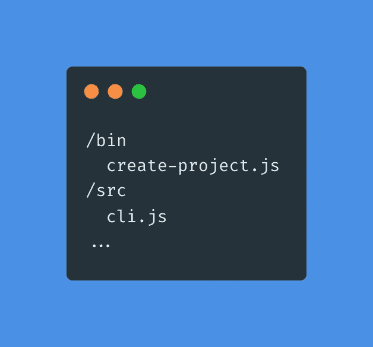
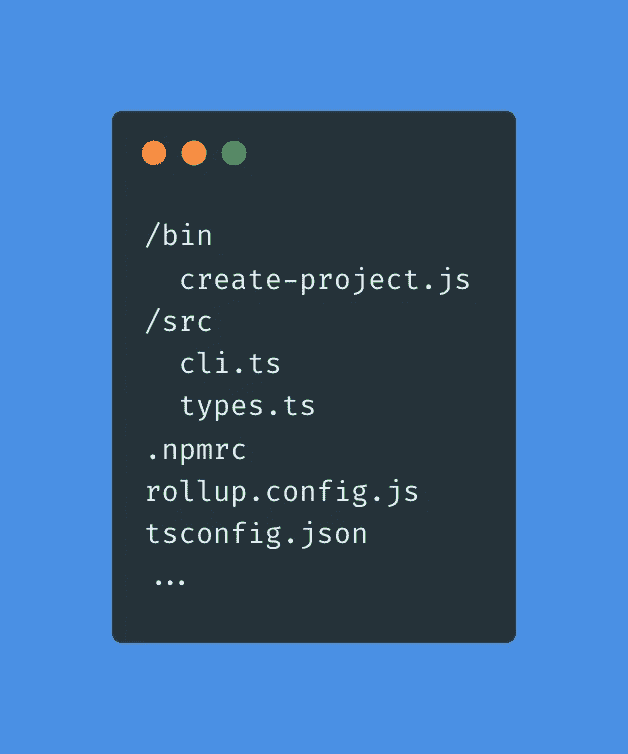
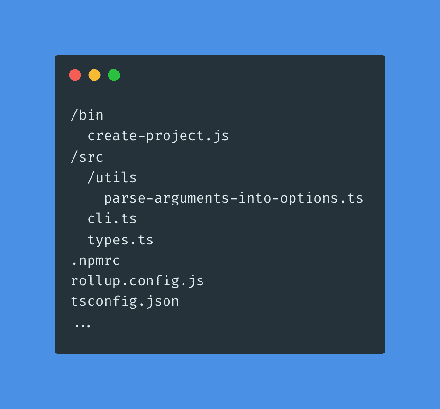
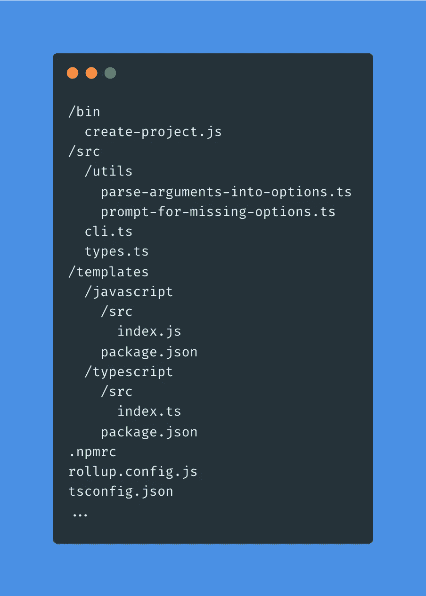

# 如何用 Node.js 创建自己的 CLI

> 原文：<https://javascript.plainenglish.io/how-to-create-your-own-cli-with-node-js-9004091a64d5?source=collection_archive---------3----------------------->

## 使用 Node.js、TypeScript 和 Rollup，通过一个命令从自定义模板创建自己的 CLI 来引导项目


Photo by [Jake Walker](https://unsplash.com/@jakewalker?utm_source=medium&utm_medium=referral) on [Unsplash](https://unsplash.com?utm_source=medium&utm_medium=referral)

您看到了一篇关于 React 的很棒的文章，您想尽快启动并运行一个新项目，并尝试一下您读到的内容。您可能不想安装依赖项、管理 NPM 脚本、配置 linters 和 formatters(如果您确实需要它们的话)以及手动设置 TypeScript。使用一个命令来做这件事会很好，对吗？你可以的！

React app 有 [CRA](https://github.com/facebook/create-react-app) ，Vue 有 [Vue CLI](https://cli.vuejs.org/) ，Svelte 有 [Degit](https://github.com/Rich-Harris/degit) 等等。这些是构建你的应用程序的非常有用的工具:易于使用，高效，[在某种程度上可扩展](https://create-react-app.dev/docs/custom-templates/)。但是如果你想用一些独特的或者完全定制的东西呢？你不能让上面的工具以不同的方式工作。

如果您对现有的工具不满意，或者您只想创建满足您需求的东西，那么是时候创建您自己的命令行界面了，也称为 CLI。本文将帮助您创建一个可以按照您想要的方式引导项目的 Node。

# 序

这篇文章的灵感来自张秀坤·昆德尔的这篇令人难以置信的[帖子](https://www.twilio.com/blog/how-to-build-a-cli-with-node-js)。我用它构建了我的第一个 CLI，并遇到了一些问题。我将依靠 Dominic 的文章，并向您展示如何避免我遇到的问题，以及如何向该项目添加 TypeScript。

# 项目概述

本文的主要目标是展示如何用 Node 构建 CLI。此外，我想在本文中谈谈 devexp，以及在下一篇中扩展这个 CLI 的功能。最终代码可在[这里](https://codesandbox.io/s/create-project-oweiqo)获得。这个项目将在节点 14 和以上。

如果您继续学习，在本文的结尾，您将拥有一个跨平台的 CLI 来帮助您用一行命令和一个方便的向导启动项目。它还可以随着您需求的增长而轻松扩展。

# 项目设置

让我们为我们的项目创建一个目录，然后在其中启动一个 Node.js 项目。

```
mkdir create-project && cd create-project
npm init --yes
```

之后，创建一些文件。

```
mkdir bin && touch bin/create-project.js
mkdir src && touch src/cli.js
```

项目结构应该如下所示:



Project structure at the beginning

让这些文件包含一点代码。

Entry point (cli.js) and executable (create-project.js)

然后确保你的`package.json`有`bin`条目，并且`type`等于`module`，因为我们在`create-project.js`文件中使用 es 导入。您可能还注意到了`keywords`字段，现在您可以跳过它。

bin entries define CLI commands exposed by our package

让我们反思一下我们刚刚所做的。

首先，我们创建了一个简单的项目结构:`cli.js`是我们的入口文件，`create-project.js`是我们的可执行文件。不要被`create-project.js`文件里面的第一行吓倒！这是 [shebang 行](https://en.wikipedia.org/wiki/Shebang_(Unix))，它的目的是告诉系统我们想要使用什么解释器来运行这个脚本。

其次，我们在`package.json`的`bin`字段中添加了`create-project.js`的路径。当一个包被全局安装(或[链接](https://docs.npmjs.com/cli/v8/commands/npm-link))时，它将使`bin`字段中指定的命令在系统的任何地方都可用，并且这些命令将指向相应值中指定的文件。你可以从 NPM 官方文件中了解更多。

现在奇迹发生了。确保您在项目文件夹中，并运行以下命令。我还推荐使用分离的终端标签或者不同的窗口，这样你就不会迷失在项目和测试目录中。为了使事情变得简单，我将在下面的代码片段的第一行用注释标记实际的终端选项卡。

```
// create-project tab
npm link// switch to another tab and create test-dir directory
// test-dir tab
cd ../
mkdir test-dir && cd test-dir
create-project
```

您的终端中应该有一个类似于下面的日志。

```
[
  '/Users/username/.nvm/versions/node/v14.19.2/bin/node',
  '/usr/local/bin/create-project'
]
```

瞧啊。我们有一个可以从任何地方调用的工作脚本。现在它没有做任何有用的事情，但是我们将在下一节中讨论它。

# 以打字打的文件

我们想要创建的 CLI 有一个简单的目的，只需要一点代码，因此使用 TypeScript 可能没有意义。但是，我想向您展示如何用 TypeScript 和 Rollup 设置这个项目。该项目可以扩展，并且有类型检查将是有用的，所以让我们马上添加它！

> 您可能想知道为什么我们需要 Rollup？
> 
> 编译`.ts`文件的第一个选项当然是`tsc`，它做得很好，但是有一个问题。Node 要求我们在使用 es 模块时指定扩展名，所以我们必须将每个文件作为`import something from './something.ts'`导入。当这段代码用`tsc`编译时，它保留了`.ts`扩展名，这使得它无法运行。编译后可以选择修改扩展名，但是用 bundler 可以很容易地完成。这就是为什么我们需要汇总。

首先，让我们安装一些依赖项并创建一个`tsconfig.json`。

```
// create-project tab
touch .npmrc && echo "save-exact=true" > .npmrc
npm i -D typescript rollup @rollup/plugin-typescript tslib @types/node
npx tsc --init
```

注意，我们还用`save-exact=true`创建了一个`.npmrc`文件，所以已安装软件包的版本将被固定。这与项目无关，但以可控的方式更新依赖关系是个好主意。

之后，创建汇总配置。

```
// create-project tab
touch rollup.config.js
```

并将项目文件重构为`.ts`。

```
// create-project tab
mv src/cli.js src/cli.ts
touch src/types.ts
```

具有 TypeScript 和 Rollup 配置的项目结构应该如下所示:



Project structure. Adding TS and Rollup

现在让我们更改我们的 TypeScript 配置并设置 Rollup。

TS setup. TSConfig and Rollup config

我们刚刚做了什么？

首先，我们从`tsconfig.json`中删除了一堆生成的选项和注释，留下了我们感兴趣的字段。注意，我们让`target`和`module`字段等于`esnext`，因为我们使用的是 ES 模块。

其次，我们直接从 [@rollup/plugin-typescript 文档](https://medium.com/r?url=https%3A%2F%2Fgithub.com%2Frollup%2Frollup-plugin-typescript%23usage)中使用基本的 Rollup 配置。我们添加的唯一内容是一个`output`字段，用于指示编译代码的位置。

之后，将第一个类型添加到`types.ts`中，并在`cli.ts`中使用。

Our first type for raw args

让我们检查一下一切是否正常。运行以下命令，使用 Rollup 编译和捆绑代码。

```
// create-project tab
npx rollup -c rollup.config.js
```

如果您遵循这些步骤，您将会看到一个汇总日志，告诉您我们的代码已经成功编译并打包到了`dist`目录中的一个文件中。我们需要做的最后一件事是重构`create-project.js`文件以使用编译后的代码代替源代码，并将`dist/cli.js`添加到`package.json`中的主字段。

create-project.js should now use compiled version of our code

一旦完成，让我们确保一切都按计划进行。

```
// create-project tab
npm link// test-dir tab
create-project
```

如果您看到和以前一样的日志，那么一切正常。

# DevExp

随着我们项目的增长，有几个步骤可以让我们的开发人员体验更顺畅。

首先，让我们将刚刚使用的 Rollup 命令存储在`package.json`的脚本部分，这样我们就有一个方便的方法来调用它。

其次，最好不要在每次接触文件时都运行它，而是让 Rollup 监视那些变化，并在它们发生时编译我们的代码。

Added build and dev scripts

让我们试一试。运行以下命令。

```
// switch to another tab and change into create-project directory
// watcher tab
npm run dev// test-dir tab
create-project
```

之后，向`cli.ts`添加一些额外的日志记录，并再次运行。

例如，我将`console.log('meow');`添加到`cli.ts`，它被记录到我的终端。

正如我们所见，Rollup 动态编译我们的代码，不需要额外的步骤。这将在未来为我们节省大量时间。现在一切都设置好了，我们可以专注于代码了。

# 解析参数

唷！是时候回到我们的项目了。正如我们在开始时所描述的，它的目的是:引导项目。但是可能有选择。例如，一个项目必须用普通 JavaScript 编写，而另一个项目必须使用 TypeScript。其中一个我们想为 React 应用程序设置，下一次我们可能想使用 Vue。必须使用我们将传递给 CLI 命令的参数来定义和处理这些选项。我们开始吧！

首先，我们必须定义我们想要使用的选项。我建议从这些标志开始:

1.  `--git`简写为`-g`——在一个创建的项目中初始化一个 git 存储库
2.  `--install`简写`-i` —安装所选模板的依赖项
3.  `--yes`用速记`-y`——跳过上面两个标志，并把它们解释为已经通过

此外，我们必须指定一个模板。什么是模板？这是我们需要复制到创建的项目中并安装依赖项的一组文件。在我们的例子中，它将是`javascript`或`typescript`。

之后，我们需要安装 [arg](https://www.npmjs.com/package/arg) 。这个包将帮助我们解析传递给 CLI 命令的参数。

```
// create-project tab
npm i arg
```

将解析参数的函数实际上是一个实用程序。把所有的工具放在一个地方很方便。让我们为这个函数创建一个`src/utils`目录和一个文件。

```
// create-project tab
mkdir src/utils
touch src/utils/parse-arguments-into-options.ts
```

带有 utils 的项目结构应该是这样的。



Project structure. Adding utils

现在让我们在`parse-arguments-into-options.ts`内部编写代码，并在`cli.ts`中使用。

Parsing args

我们来分解一下。

首先，我们创建了一个名为`parseArgumentsIntoOptions`的函数，它使用新安装的包`arg`。它将指定的标志(注意允许我们为标志指定短别名的语法)解析成对象`args`，并将模板传递给特殊的`args._`数组。例如，`create-project -g javascript`将产生下面的输出。

```
{
  git: true,
  install: false,
  skipPrompts: false,
  template: ‘javascript’
}
```

之后，我们更新了我们的类型。我们添加了`RawOptions`来表示解析的选项。

最后，我们在`cli.ts`中使用了`parseArgumentsIntoOptions`。

在 Rollup watcher 打开的情况下，我们需要做的就是运行带有一些参数的`create-project`来测试这段逻辑。如果您已经停止了观察器，请再次启动它。

```
// watcher tab
npm run dev
```

让我们试试这个。

```
// test-dir tab
create-project -g -i
```

这应该会产生下面的输出。

```
{ git: true, install: true, skipPrompts: false, template: undefined }
```

注意，它将在没有在`arg`调用中指定的标志上中断。例如，这个会抛出一个错误。

```
// test-dir tab
create-project -a// ArgError: unknown or unexpected option: -a
```

# 向导设置

能够使用传递的参数很好，但是有一个问题。我们如何告诉其他工程师他们可以使用什么论点？嗯，我们可以写一些文档，是的，这是一个好方法。但是如果我们更进一步呢？如果我们问用户他们想要什么类型的模板或者他们打算使用什么标志呢？在这一章中，我们将为我们的项目添加一个方便的向导。

像往常一样，我们将从安装依赖项开始。这次— [问询者](https://www.npmjs.com/package/inquirer)。

```
// create-project tab
npm i inquirer
npm i -D @types/inquirer
```

现在我们需要创建另一个实用程序来提示用户缺少选项。

```
// create-project tab
touch src/utils/prompt-for-missing-options.ts
```

在此之后，让我们写代码，将做实际的提示。

Prompting user for missing options

这是很多代码，让我们看看它做什么。

首先，我们编写了提示用户缺少参数的逻辑，将它们作为问题添加到`inquirer.prompt`方法中。我们还处理了`skipPrompts`选项来强制`git`和`install`选项。

其次，我们重构了我们的类型。我们现在有了一个`Options`类型，它表示将用于定制我们的 CLI 的选项。

最后，我们添加了对`cli.ts`的`promptForMissingOptions`调用。

让我们检查一下！

```
// test-dir tab
create-project
```

如果您继续操作，您应该会看到一个向导，引导您完成项目设置。

```
create-project
? Please choose which project template to use (Use arrow keys)
❯ JavaScript
  TypeScript
? Initialize a git repository? (y/N)
? Install packages? (Y/n)
{ git: false, install: true, template: 'javascript' }
```

这是一场胜利！我们有一个简单而有用的向导来帮助我们手动设置我们的项目，而不必记住我们需要传递什么参数或者我们当前支持什么模板。

# 创建项目

设置结束了。

1.  我们知道如何解析用户输入的参数。
2.  我们知道如何处理这些参数来获得创建项目的选项。
3.  我们甚至创建了一个漂亮的向导，使我们的 CLI 更方便使用！

现在我们必须使用这些选项来实际创建一个新项目。

首先，让我们创建自己的模板，并向其中添加一些文件。

```
// create-project tab
mkdir -p templates/javascript/src
mkdir -p templates/typescript/src
touch templates/javascript/src/index.js
touch templates/typescript/src/index.ts
touch templates/javascript/package.json
touch templates/typescript/package.json
```

项目结构正在增长，现在看起来是这样的。



Project structure. Adding templates

之后，给两个创建的`package.json`文件添加合理的内容。

package.json stubs for JS and TS templates

我们还需要一堆依赖项。

```
// create-project tab
npm i execa chalk listr ncp pkg-install
npm i -D @types/inquirer @types/listr @types/ncp @types/node
```

关于他们的几句话:

1.  [execa](https://www.npmjs.com/package/execa) 用于运行命令。
2.  粉笔是一种终端管柱造型工具。
3.  [listr](https://www.npmjs.com/package/listr) 是一个终端任务列表。
4.  [ncp](https://www.npmjs.com/package/ncp) 是一个异步递归复制的工具。
5.  [pkg-install](https://www.npmjs.com/package/pkg-install) 提供了一个独立于平台的软件包安装程序。

现在，让我们根据我们的选项指定可能发生的操作。提醒一下，我们有三个选择:

1.  `template` —用于已创建项目的启动器。
2.  `git` —是否初始化 git 存储库。
3.  `install` —是否从复制的`package.json`安装包。

基于此，我们看到了三个额外的实用函数:初始化 git 存储库、复制模板和安装包。此外，最好将项目创建管道与参数处理逻辑分开，这样它也有自己的文件。让我们创建这些文件。

```
// create-project tab
touch src/main.ts
touch src/utils/init-git-repo.ts
touch src/utils/copy-template-files.ts
touch src/utils/install-packages.ts
```

之后，在其中编写一些代码。

Project tasks

我们来分解一下。

首先，我们创造了`main.ts`。这是一个简单的运行器，它使用`listr`任务管理器根据传入的参数创建任务队列。

其次，我们已经将所有的任务描述为上面提到的工具。

最后，我们在`cli.ts`中使用了`createProject`流道。

是时候测试我们的杰作了。让我们再次运行我们的 CLI 命令。

```
// test-dir tab
create-project -y
```

一旦你完成了向导，一个绿色的日志将出现在终端中，宣布你刚刚创建的项目！似乎是时候纵情享乐，把帽子抛向天空了，但是有一个小障碍。运行以下命令。

```
// test-dir tab
create-project jabbascript
```

这将抛出一个错误，因为没有 jabbascript 这样的模板！虽然没有这样的模板是非常不幸的，但是我们不应该让一个不受支持的模板破坏项目的创建。我们必须用与`arg`检查其他参数相同的方式来检查这一点。

为此，我们还需要一个实用函数来检查传递的模板的正确性。让我们创造它。

```
// create-project tab
touch src/utils/check-template-validity.ts
```

现在让我们写代码。

Template validation

我们在`types.ts`中添加了与模板相关的类型，用它们在`check-template-validity.ts`中验证模板(注意，它将未定义的模板视为有效，所以我们不会抛出不必要的警告)，然后在`parse-arguments-into-options.ts`中添加了验证。让我们再次尝试创建一个 jabbascript 项目。

```
// test-dir tab
create-project jabbascript
WARNING You passed incorrect template: jabbascript. List of supported templates: javascript, typescript
? Please choose which project template to use (Use arrow keys)
❯ JavaScript
  TypeScript
```

您应该看到上面的日志。我们首先通知用户还没有 JavaScript 模板，然后让他们选择一个支持的模板。否则一切照旧。

# 结论

看起来我们成功了！我们已经创建了一个有用的命令行界面，允许我们只用一个命令就可以启动我们喜欢的项目。虽然有像这样功能更多的工具，但拥有自己的工具是很棒的。没有什么比你和*为*你写的更能满足你的需求了。

[这个系列的第二部](/how-to-create-your-own-cli-with-node-js-7646a976f8fa)已经有了！我们将扩展 CLI 的功能，使其更加方便。如果你喜欢这篇文章，看看第二部分。我会很高兴在那里见到你！

祝你今天开心！玩的开心！

*更多内容请看*[***plain English . io***](https://plainenglish.io/)*。报名参加我们的* [***免费周报***](http://newsletter.plainenglish.io/) *。关注我们关于*[***Twitter***](https://twitter.com/inPlainEngHQ)*和*[***LinkedIn***](https://www.linkedin.com/company/inplainenglish/)*。查看我们的* [***社区不和谐***](https://discord.gg/GtDtUAvyhW) *加入我们的* [***人才集体***](https://inplainenglish.pallet.com/talent/welcome) *。*