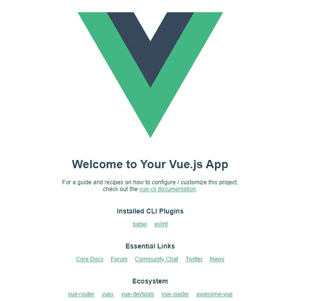
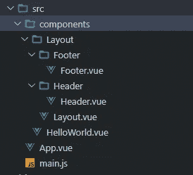
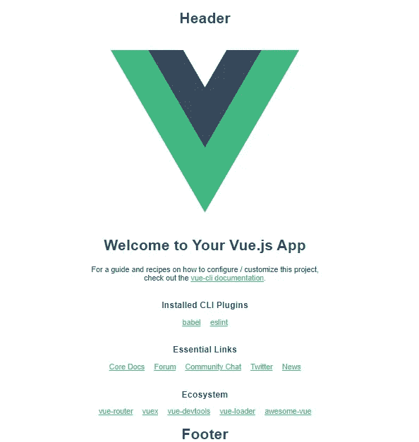

# 如何在 Vue.js 中创建自己的布局组件

> 原文：<https://javascript.plainenglish.io/how-to-create-your-own-layout-component-in-vue-js-32ad6ddc0d8f?source=collection_archive---------0----------------------->

## Vue 基本布局组件

## 关于如何创建具有页眉、页脚和内容部分的基本布局组件的指南。


Photo by [Yura Fresh](https://unsplash.com/@mr_fresh?utm_source=medium&utm_medium=referral) on [Unsplash](https://unsplash.com?utm_source=medium&utm_medium=referral)

## 布局组件

组件是应用程序 UI 中可重用的独立部分。布局组件是用于跨多个页面共享公共部分的组件。布局组件通常有公共的页眉、侧栏和页脚部分。

*   1.创建应用程序
*   2.文件夹结构
*   3.创建标题组件
*   4.创建页脚组件
*   5.创建布局组件
*   6.向根组件添加布局

## 1.创建应用程序

使用`[create-vue](https://github.com/vuejs/create-vue)`创建你的 Vite 驱动的 Vue 项目

```
npm init vue@latest✔ Project name: … <your-project-name>
✔ Add TypeScript? … No / Yes
✔ Add JSX Support? … No / Yes
✔ Add Vue Router for Single Page Application development? … No / Yes
✔ Add Pinia for state management? … No / Yes
✔ Add Vitest for Unit testing? … No / Yes
✔ Add Cypress for both Unit and End-to-End testing? … No / Yes
✔ Add ESLint for code quality? … No / Yes
✔ Add Prettier for code formatting? … No / Yes

Scaffolding project in ./<your-project-name>...
Done.
```

如果您不确定某个选项，现在只需按 enter 键选择`No`。创建项目后，按照说明安装依赖项并启动开发服务器:

```
> cd <your-project-name>
> npm install
> npm run dev
```



## 2.文件夹结构

在组件文件夹中创建布局文件夹。此外，创建页眉和页脚组件。



## 3.创建标题组件

使用下面的代码创建页眉和页脚组件

src/components/Layout/Header/表头. vue

```
<template>
  <h1>Header</h1>
</template><script>
export default {
  name: 'Header'
}
</script>
```

## 4.创建页脚组件

src/components/Layout/Footer/页脚. vue

```
<template>
  <h1>Footer</h1>
</template>

<script>
export default {
  name: 'Footer'
}
</script>
```

## 5.创建布局组件

现在我们要创建我们的`Layout`组件。将页眉和页脚组件导入布局组件。`<slot>`用于显示组件的内容。

src/components/Layout/Layout . vue

```
<template>
    <Header />
    <slot />
    <Footer />
</template>

<script>
import Header from './Header/Header.vue'
import Footer from './Footer/Footer.vue'

export default {
  name: 'Layout',
  components: {
    Header,
    Footer
  }
}
</script>
```

## 6.向根组件添加布局

App 组件是我们应用程序的根组件。将布局添加到根组件。

src/App.vue

```
<template>
  <div id="app">
    <Layout>
      
      <HelloWorld msg="Welcome to Your Vue.js App"/>
    </Layout>
  </div>
</template>

<script>
import HelloWorld from './components/HelloWorld.vue'
import Layout from './components/Layout/Layout.vue'

export default {
  name: 'App',
  components: {
    Layout,
    HelloWorld
  }
}
</script>
```

## 输出



该示例代码可在 https://github.com/balajidharma/vue-basic-layout 的[获得](https://github.com/balajidharma/vue-basic-layout)

## 堆栈式应用

我们成功地创建了自己的布局组件。这是一个基本的 Vue 布局组件，希望它能帮助你理解基本的布局流程。

感谢您的阅读。

敬请关注更多内容！

*跟我来*[***balajidharma.medium.com***](https://balajidharma.medium.com/)。

*更多内容请看*[***plain English . io***](https://plainenglish.io/)*。报名参加我们的* [***免费周报***](http://newsletter.plainenglish.io/) *。关注我们关于*[***Twitter***](https://twitter.com/inPlainEngHQ)[***LinkedIn***](https://www.linkedin.com/company/inplainenglish/)*[***YouTube***](https://www.youtube.com/channel/UCtipWUghju290NWcn8jhyAw)***，以及****[***不和***](https://discord.gg/GtDtUAvyhW) *对成长黑客感兴趣？检查* [***电路***](https://circuit.ooo/) ***。*****