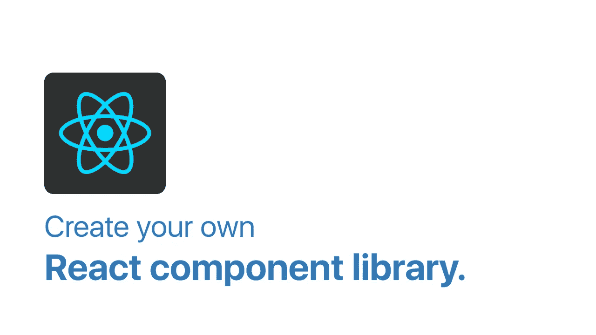
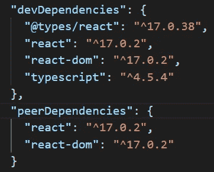
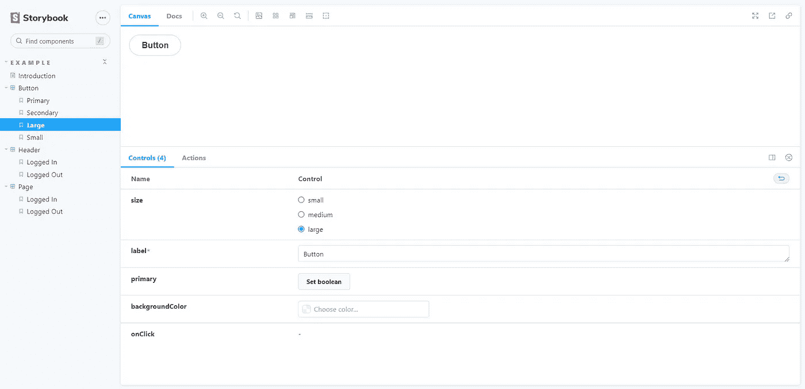
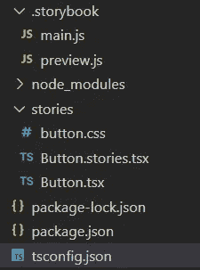

# 如何创建自己的 React 组件库

> 原文：<https://javascript.plainenglish.io/how-to-create-your-own-react-component-library-e305a1a53b49?source=collection_archive---------1----------------------->



所以我们已经为这个系列中的 [Node.js](/create-and-publish-your-own-npm-module-216bffe82dc5) 和 [Angular](/create-your-own-angular-component-library-e5f062b902a8) 创建并发布了包。现在是时候做出反应了。在 Angular 的例子中，我们可以选择本地创建一个“**库**项目，然后在一个“**应用**项目中测试它。我们能够对库进行更改，并在应用程序中看到这些更改，就像典型的单页面 web 应用程序一样。在 React 的例子中，为了测试我们的组件，我们必须使用第三方库。我们将要使用的图书馆叫做故事书。

> YouTube 上也有这个的视频版本。

## 为什么是故事书

Storybook 为您提供了一个环境，在这个环境中，您可以独立地创建您的组件，并进行更改检测，就像您在典型的单页应用程序中所做的那样。它还提供了一个简洁的用户界面，允许您查看正在创建的组件的不同变体。

## 项目设置

因此，让我们快速设置我们的项目。因为我们将创建一个 React 组件库，而不是 React 应用程序，所以我们不会使用 **create-react-app** 。我们将从零开始建造骨架。因此，在 VSCode 中打开一个空文件夹，键入`npm init -y`来初始化一个新的包。您将在文件夹中找到一个 package.json 文件。现在您需要安装以下依赖项列表。

```
npm install --save-dev react react-dom typescript @types/react
```

我们需要安装 **react** 和 **react-dom** 来创建组件的 UI 并与 dom 交互。我还为 React 添加了**类型脚本**和**类型声明**，以使用静态类型检查。如果您愿意，可以跳过 typescript。

因为我们正在构建 react 组件，所以我们还需要在 package.json 文件中添加 React 和 react-DOM 作为**对等依赖**。这将基本上确保这个包的消费者将是一个 React 应用程序。因此，在 package.json 文件中，添加一个对等依赖对象。



Peer dependencies inside package.json

一旦完成，我们将通过键入`npx tsc --init`来初始化 typescript

这应该会在您的项目中创建一个带有一些默认选项的 tsconfig.json 文件。您可以用以下选项替换这些选项

```
{
   "compilerOptions": {
      "jsx": "react",
      "target": "es2016",
      "outDir": "dist",
      "allowJs": true,
      "skipLibCheck": true,
      "strict": true,
      "forceConsistentCasingInFileNames": true,
      "module": "ES2020",
      "allowSyntheticDefaultImports": true,
      "moduleResolution": "Node",
      "declaration": true,
      "declarationDir": "dist"
   },
   "include": [
      "stories"
   ]
}
```

1.  jsx: 在 React 组件中与 jsx 一起工作
2.  **目标**:改变哪些 JS 特性降级，哪些保持不变。例如，如果`target`是 ES5 或更低，箭头函数`() => this`将变成等价的`function`表达式。
3.  **outDir** :文件编译后会被放到这个目录下。
4.  **allowJs** :允许 Js 文件导入到我们的项目中。
5.  **skipLibCheck** :跳过声明文件的类型检查。
6.  **严格的**:更加健壮的类型检查，这导致了更好的整体正确性。
7.  **forceconsistencasingfilenames:**如果基于文件系统的大小写命名不一致，将抛出错误
8.  **模块**:设置模块的类型(es6、es2020、commonjs、umd)
9.  **allowSyntheticDefaultImports**:这基本上让你以一种更方便的方式导入你的模块，比如你可以通过设置这个选项为真来使用`import React from 'react'`而不是`import * as React from 'react';`。
10.  **moduleResolution** :您可以使用它来设置模块解析策略，在我们的例子中，它将是 Node。
11.  **声明**:为项目内部的每个 TypeScript 或 JavaScript 文件生成`.d.ts`文件。
12.  **declarationDir** :存放声明文件的目录
13.  **包含**:编译时要包含的文件

您还可以添加一个 **exclude** 选项，如果您希望它们不包含在编译过程中，该选项会接收一系列文件/文件夹。

现在我们可以通过键入`npx sb init`来初始化 Storybook。

此命令在空项目中不起作用。它查看我们的项目依赖项，并对我们的项目类型进行计算猜测(在本例中，是 React)。

完成后，在 package.json 文件中，您会发现一些额外的依赖项，以及一些运行/构建 Storybook 的新脚本。您的项目中将有两个新文件夹。**。storybook** 文件夹将会有你默认的 storybook 配置，而 **stories** 文件夹将会有一些你可以测试的虚拟故事。

现在在你的终端里，输入`npm run storybook`。(该脚本是在初始化 Storybook 时添加的)。Storybook 的交互式 UI 将在您的浏览器中打开，并显示所有虚拟组件。



Storybook playground

这里我们只关心按钮组件，所以您可以继续删除 stories 文件夹中的其他内容。



Keep only button component files.

故事是 React 组件的渲染状态。因此，对于每个 React 组件，每当您运行 Storybook 时，我们都会有一个相应的故事呈现在浏览器上。你可以对这些故事作出反应性的修改，并摆弄它们的控件，看看你的按钮在应用程序中会是什么样子。一旦您完全测试了您的组件，您就可以将该组件推送到 npm。这些故事文件不会包含在产品构建中，所以您不必担心包的大小。

所以我们有了我们的 **Button.tsx** 文件，这是一个 React 组件。

这个 react 组件是一个带有一组道具的典型按钮。这个按钮有一个对应的故事文件叫做 **Button.stories.tsx** 。

在这个故事中，首先导入按钮 react 组件。之后，您为您的按钮创建一个默认的带有一些配置(标题，组件)的导出。**参数**或**参数**选项通过为我们的道具提供一组缺省值来定义组件应该如何呈现。

在这个默认导出下面，我们有一系列命名导出，它们只是这个默认按钮的不同变体(你将需要这些来在 Storybook 上呈现你的按钮)。

```
const Template: ComponentStory<typeof Button> = (args) => <Button {…args} />;
```

只是创建模板的一种奇特方式，可以用于我们的每个变体。因此，您在这些变量中提供的任何参数都将覆盖默认参数。

现在，如果你回到浏览器上的故事书游戏区，你会看到按钮被渲染，并且在底部有一个控件部分。该控件部分允许您通过调整属性值来自定义组件。

您可以看到使用 Storybook 孤立地测试组件变得多么容易。既然我们已经创建并测试了 React 组件，那么是时候发布它了。

## 捆绑您的组件

有几个工具可以用来编译和捆绑他们的项目。Webpack 是粉丝们的最爱，但它最常用于应用程序，而不是组件库。另一方面，Rollup 非常适合我们的用例，所以我们将使用 Rollup。安装这些库和插件。

```
npm i --save-dev **rollup** **@rollup/plugin-node-resolve** **@rollup/plugin-babel** **rollup-plugin-uglify** **rollup-plugin-postcss** **rollup-plugin-typescript2** **rollup-plugin-peer-deps-external**
```

[**汇总**](https://www.npmjs.com/package/rollup) —主模块捆绑器库。

[**@ roll up/plugin-node-resolve**](https://www.npmjs.com/package/@rollup/plugin-node-resolve)—用于定位我们项目内部使用的第三方模块(目前我们的应用中没有任何第三方模块，但这可能会在未来发生变化)。

[**@ roll up/plugin-babel**](https://www.npmjs.com/package/@rollup/plugin-babel)——与 babel 整合。

[**roll up-plugin-uglify**](https://www.npmjs.com/package/rollup-plugin-uglify)——缩小你的最终捆绑包。

[**【roll up-plugin-postcss**](https://www.npmjs.com/package/rollup-plugin-postcss)——包括我们在包中作为单独文件创建的 css。它通过从*中生成缩小的 CSS 来实现这一点。css 文件，并通过在组件中使用的`<head>`标签包含它们。

[**roll up-plugin-TypeScript 2**](https://www.npmjs.com/package/rollup-plugin-typescript2)—这个插件为我们的最终包将类型脚本代码编译成 JavaScript，并为`package.json`中的`types`键生成类型声明。

[**roll up-plugin-peer-deps-external**](https://www.npmjs.com/package/rollup-plugin-peer-deps-external)**—这个插件将在最终的包中具体化我们的`peerDependencies`(在我们的例子中是 react 和 react-dom)，因为这些将由消费者应用程序提供。**

**这就是 rollup 的伟大之处。你有许多插件，你可以把它们添加到你的项目中去完成特定的任务，而不需要你自己去做。你可以在他们的 GitHub repo 上查看所有可用的插件[。](https://github.com/rollup/awesome)**

**安装后，在根目录下创建一个名为 rollup.config.js 的配置文件，并复制以下代码。**

**我们简单地导出一个具有一组属性的对象。会有一个**输入**和**输出**选项。输入选项是应用程序的入口点。所以在我们的根目录中，您需要创建这个入口点文件(index.js ),它将从我们的组件库中导出所有的组件。**

```
import { Button } from './stories/Button'export { Button }
```

**汇总配置文件中的输出键将是编译后生成的产品包。所以当你构建你的组件时，完成后你会发现一个 dist 文件夹，里面有一个 index.js，它本质上是我们的组件库。**

**最后，我们传递插件数组中安装的所有插件。**

**完成后，您需要转到 package.json 文件。在 scripts 对象中，添加以下脚本`buildLib: "rollup -c”`。该命令将在项目中查找配置文件，并根据文件中提供的选项运行编译和绑定过程。您还需要将 package.json 文件中的主键更改为“dist/index.js ”,如果您还没有这样做的话。**

**现在在您的终端内部，运行 **buildLib** 命令`npm run buildLib`。完成后，您的项目中就会有一个 dist 文件夹，其中会有一个 index.js 文件。在下一个也是最后一个步骤中，您将把该文件发布到 npm 存储。**

## **将组件发布到 npm**

**在将组件发布到商店之前，您需要遵循几个步骤。所有这些步骤都已经在之前的博客文章中有所涉及，你可以在这里找到或者在这里找到[视频](https://www.youtube.com/watch?v=f0h-0d6Y_94&ab_channel=AkileshRao)。**

1.  ****创建并登录您的 npm 帐户。**
    [您需要先创建一个 npm 帐户](https://www.npmjs.com/signup)。注册后，您需要在 VSCode 中登录您的 npm 帐户。因此，在您的终端中，键入“ **npm 登录**”。它会要求您提供注册帐户时填写的同一组凭据。一旦完成，你就可以进入下一步了。**
2.  ****向包中添加范围。** NPM 不允许两个包有相同甚至相似的名字。所以您需要在您的包中添加一个作用域，这将使您的包名唯一。在这种情况下，范围将是您的用户名。所以在 package.json 文件内部，name 键目前设置为 **react-component-library。**改成@“你-用户名”/ **反应-组件-库**。所以由于我的 npm 用户名是“akileshro 19”，所以我的包名将是@ akileshro 19/react-component-library。同样，这样做背后的原因在[之前的博文](https://www.youtube.com/watch?v=f0h-0d6Y_94&ab_channel=AkileshRao)中有详细解释。**

**一旦你完成了这些步骤，你就可以把它发布到商店`npm publish --access=public`**

**默认情况下，名称中带有范围的包是私有的，要发布私有包，您需要按月付费订阅。因此，我们将通过添加“ **access=public** ”标志来公开发布它。**

**如果你跟随并正确地做了每一件事，你会得到一个成功的回应，可能看起来像这样**

```
+@YOUR-USERNAME/react-component-library@1.0.0
```

**你可以去 npm 的网站登录。在您的 packages 部分，您会发现您新创建的 React 组件。您可以通过将该组件导入 React 应用程序来测试它，就像您通常在第三方包中所做的那样。**

## **结论**

**至此，您已经成功地创建、测试并向 npm 商店发布了我们的 React 组件。您可以从 Github repo 中访问该项目的代码库。**

**[本教程的视频版本也可以在 Youtube 上找到。](https://youtu.be/d8oztfRBGrI)**

**您还可以访问以下链接，了解如何将节点包或角度组件发布到 npm 存储。**

**[创建你的角度组件库(博文)](/create-your-own-angular-component-library-e5f062b902a8)
[创建你的角度组件库(视频)](https://youtu.be/Xs-L_QpG8OU)**

**[创建你的 NPM 模块(博文)](/create-and-publish-your-own-npm-module-216bffe82dc5)
[创建你的 NPM 模块(视频)](https://youtu.be/f0h-0d6Y_94)**

**如果你有任何疑问或建议，你可以在评论中提出，或者通过下面提到的任何一个社交网站与我联系。干杯！**

**[YouTube](https://www.youtube.com/channel/UCaktnqx_IENyT5T2lJ3F09w)
[LinkedIn](https://www.linkedin.com/in/akilesh-rao-610357137/)
[Twitter](https://twitter.com/themangalorian)
[GitHub](https://github.com/AkileshRao)**

## **进一步阅读**

**[](https://bit.cloud/blog/building-a-composable-ui-component-library--l33jy1vs) [## 构建可组合的 UI 组件库

### 如何构建组件库？React 组件库，包含可组合的组件。

比特云](https://bit.cloud/blog/building-a-composable-ui-component-library--l33jy1vs) 

*更多内容请看*[***plain English . io***](https://plainenglish.io/)*。报名参加我们的* [***免费周报***](http://newsletter.plainenglish.io/) *。关注我们关于*[***Twitter***](https://twitter.com/inPlainEngHQ)[***LinkedIn***](https://www.linkedin.com/company/inplainenglish/)*[***YouTube***](https://www.youtube.com/channel/UCtipWUghju290NWcn8jhyAw)***，以及****[***不和***](https://discord.gg/GtDtUAvyhW) *对成长黑客感兴趣？检查* [***电路***](https://circuit.ooo/) ***。*******