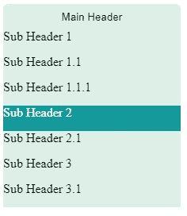

# 如何用 React 创建你的递归列表？

> 原文：<https://javascript.plainenglish.io/how-to-create-your-recursive-list-with-react-1001dc57b3c0?source=collection_archive---------9----------------------->

## 如何通过制作递归列表来制作下拉列表？


Photo by [Jace & Afsoon](https://unsplash.com/@jacegrandinetti?utm_source=medium&utm_medium=referral) on [Unsplash](https://unsplash.com?utm_source=medium&utm_medium=referral)

再次大家好，

今天我将递归下拉。我创建了模拟数据。在此之上，我将解释如何通过制作递归列表来制作下拉列表。我没有使用任何样式库，我关注的部分是递归列表。众所周知，嵌套结构有时会给我们带来麻烦。你可以根据自己的反应来编辑我写的代码。我只是举了一个例子。你可以从 [**这个链接**](https://stackblitz.com/edit/react-ts-bghqv2?file=components%2Fdropdown-component.tsx,components%2Fdropdown.module.scss) 进入这个例子，如果你愿意，你可以分叉它。

我从共享样本模拟数据开始。

我为开放列表创建一个状态；

`const [openMenu, setOpenMenu] = useState(false);`

默认状态应为 false，点击按钮后状态将为`!openMenu`

```
<button
    className={openMenu ? styles.wrapperClick : styles.wrapper}
    onClick={() => {
        setOpenMenu(!openMenu);
    }}
 >
    {data.title}
 </button>
```


The main title of the data

它将包含我定义的按钮数据的标题。当点击它时，它会打开一个列表。

```
{openMenu &&
  data.nodes.map((nodes) => (
    <div className={styles.menu}>
    <div className={styles.item}>{nodes.title}</div>
       {childNodes(nodes.children)}
    </div>
 ))}
```

如果打开菜单状态为**真**，将显示该部分。这里我们进入数据的节点。第一个节点的标题将显示在 div 中。

```
{childNodes(nodes.children)}
```

那么这个`childList`是什么？让我们看看他。我在这里的目的是调用递归列表中的元素。`nodes.children`来自映射数据的子代。

```
 const childNodes = (child: any[]) => {
    console.log(child);
    return child.map((childNode) => (
      <div>
        <div className={styles.item}> {childNode.title} </div>
        {childNodes(childNode.children)}
      </div>
    ));
  };
```

如您所见，子参数是 array。在这个`console.log()`中，你可以看到来自`{childNodes(nodes.children)}`的数据。

现在，我们又需要`child.map()`了。在`child`里面，又会有`children`。我们需要再次得到它。得到孩子的称号后我们需要再次调用`{childNodes(childNode.children)}`。

在所有这些过程之后，我们的嵌套列表就准备好了。你准备好了吗？



Nested list

如果要显示所有代码；

```
 const DropdownComponent = () => {
  const [openMenu, setOpenMenu] = React.useState(false);

  const childNodes = (child: any[]) => {
    console.log(child);
    return child.map((childNode) => (
      <div>
        <div className={styles.item}> {childNode.title} </div>
        {childNodes(childNode.children)}
      </div>
    ));
  };

  return (
    <div>
      <button
        className={openMenu ? styles.wrapperClick : styles.wrapper}
        onClick={() => {
          setOpenMenu(!openMenu);
        }}
      >
        {data.title}
      </button>
      {openMenu &&
        data.nodes.map((nodes) => (
          <div className={styles.menu}>
            <div className={styles.item}>{nodes.title}</div>
            {childNodes(nodes.children)}
          </div>
        ))}
    </div>
  );
};

export default DropdownComponent;
```

或者你可以访问这个链接。

[](https://stackblitz.com/edit/react-ts-bghqv2?file=components%2Fdropdown-component.tsx,components%2Fdropdown.module.scss) [## 递归下拉列表/反应功能组件- StackBlitz

### React + TypeScript 启动项目

stackblitz.com](https://stackblitz.com/edit/react-ts-bghqv2?file=components%2Fdropdown-component.tsx,components%2Fdropdown.module.scss) 

谢谢你，

`Bestte..`

再见。

[](https://bestte.medium.com/membership) [## 用我的推荐链接加入媒体

### 阅读 Beste(以及 Medium 上成千上万的其他作家)的每一个故事。你的会员费直接支持 Beste 和…

bestte.medium.com](https://bestte.medium.com/membership) [](/graphql-services-and-mongodb-connection-b48b86289e93) [## GraphQL 服务和 MongoDB 连接

### 如何使用 GraphQL 服务写入 MongoDB？

javascript.plainenglish.io](/graphql-services-and-mongodb-connection-b48b86289e93) [](/various-uses-of-the-javascript-library-particles-js-with-next-js-212e630bd538) [## JavaScript 库 Particles.js 与 Next.js 的各种用法

### 用 npm 包给你的页面添加一些动画怎么样？

javascript.plainenglish.io](/various-uses-of-the-javascript-library-particles-js-with-next-js-212e630bd538) [](/how-to-work-with-the-angular-nebular-ui-library-and-use-a-simple-splash-screen-3dd0d1790478) [## 如何使用 Angular Nebular UI 库并使用简单的闪屏

### 闪屏在某些情况下是必要的，所以我想用一种非常简单的方式来展示它，我将谈谈…

javascript.plainenglish.io](/how-to-work-with-the-angular-nebular-ui-library-and-use-a-simple-splash-screen-3dd0d1790478) [](/how-to-avoid-runtime-errors-for-frontend-development-d24741df4a52) [## 如何避免前端开发的运行时错误

### 作为开发人员和测试人员，我们经常会遇到我们没有注意到的运行时错误。我们可以用…来摆脱它们

javascript.plainenglish.io](/how-to-avoid-runtime-errors-for-frontend-development-d24741df4a52) [](/how-to-create-marker-and-marker-cluster-with-leaflet-map-95e92216c391) [## 如何使用传单地图创建标记和标记簇

### 在活页地图架构中创建标记和图层，然后对标记进行聚类的方法。

javascript.plainenglish.io](/how-to-create-marker-and-marker-cluster-with-leaflet-map-95e92216c391) 

*更多内容请看*[***plain English . io***](https://plainenglish.io/)*。报名参加我们的* [***免费周报***](http://newsletter.plainenglish.io/) *。关注我们关于*[***Twitter***](https://twitter.com/inPlainEngHQ)[***LinkedIn***](https://www.linkedin.com/company/inplainenglish/)*[***YouTube***](https://www.youtube.com/channel/UCtipWUghju290NWcn8jhyAw)*[***不和***](https://discord.gg/GtDtUAvyhW) *。对增长黑客感兴趣？检查* [***电路***](https://circuit.ooo/) *。***