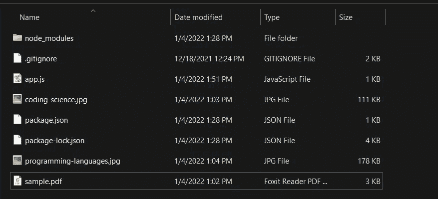
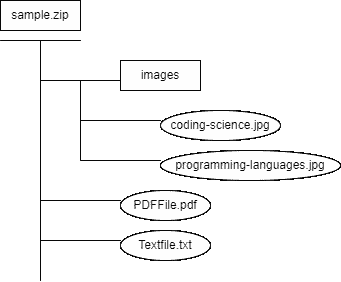
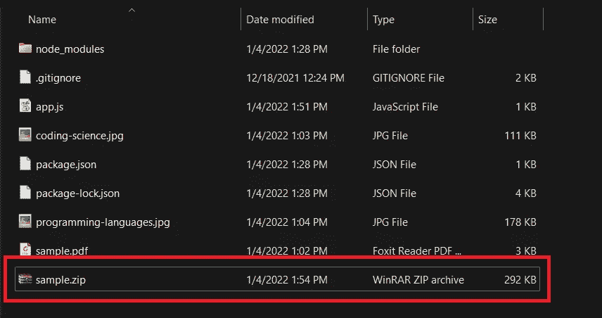
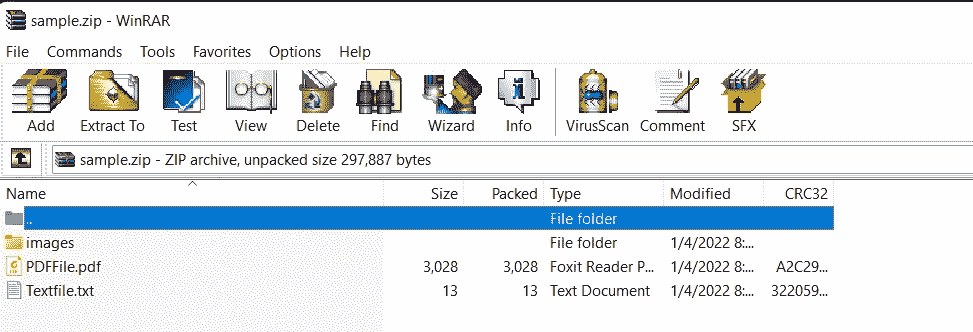
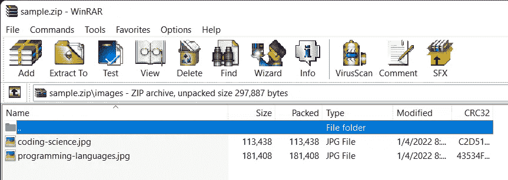

# 如何用 Node.js 创建 Zip 文件

> 原文：<https://javascript.plainenglish.io/how-to-create-zip-files-with-node-js-505e720ceee1?source=collection_archive---------0----------------------->


Photo by [Viktor Talashuk](https://unsplash.com/@viktortalashuk?utm_source=unsplash&utm_medium=referral&utm_content=creditCopyText) on [Unsplash](https://unsplash.com/s/photos/files?utm_source=unsplash&utm_medium=referral&utm_content=creditCopyText)

这里我们来看看如何使用 [JSZIP](https://www.npmjs.com/package/jszip) 库用 Node.js 创建 zip 文件。

## 创建项目

*   创建一个新文件夹，并在其中打开命令终端。
*   键入`**npm init -y**` 来初始化项目 ***。***
*   用`**npm i jszip**` 命令安装包。
*   在项目文件夹中创建 app.js 文件。

这是我创建的示例项目。



Project structure

这里我们有一个 PDF 文件“sample.pdf”和两个图像(“coding-science.jpg”和“programming-languages.jpg”)。我们的目标是创建一个 zip 文件，它由一个包含两张图片的文件夹、一个 PDF 和生成的文本文件组成。



Zip folder structure

## 履行

我们可以用几行代码做到这一点。

*   首先，我们使用 readFileSync 方法读取本地 PDF 并将其添加到 zip 文件中。
*   接下来，我们用下面的代码生成一个包含一些文本的样本文本文件。

```
zip.file("Textfile.txt", "Hello NodeJS\n");
```

*   然后我们用下面一行创建一个文件夹“images”。

```
const img = zip.folder("images");
```

*   我们可以使用一个循环将两张图片添加到文件夹中，如下所示。

```
for (const image of images) {
    const imageData = fs.readFileSync(image);
    img.file(image, imageData);
}
```

*   最后，我们可以生成并输出创建的 zip 文件夹。

让我们运行并验证代码。键入以下内容运行该程序。

```
**node app.js**
```

然后，您将看到 sample.zip 文件已经在您的项目文件夹中创建，如下所示。



Project folder after zip file generation

这是压缩文件夹。里面有图像文件夹、PDF 文件和文本文件。



Zip folder

图像文件夹包含两个图像。



images folder

就是这样。注意，JSZIP 不仅仅适用于 Node.js，它也可以和 Angular 这样的前端框架一起使用。

您可以在这里找到工作示例。

[](https://github.com/Kanchana46/nodejs-zip.git) [## GitHub - Kanchana46/nodejs-zip

### 此时您不能执行该操作。您已使用另一个标签页或窗口登录。您已在另一个选项卡中注销，或者…

github.co](https://github.com/Kanchana46/nodejs-zip.git) 

希望你喜欢这个。编码快乐！。

*更多内容看* [*说白了. io*](http://plainenglish.io/) *。报名参加我们的* [*免费每周简讯*](http://newsletter.plainenglish.io/) *。在我们的* [*社区不和谐*](https://discord.gg/GtDtUAvyhW) *获得独家获得写作机会和建议。*