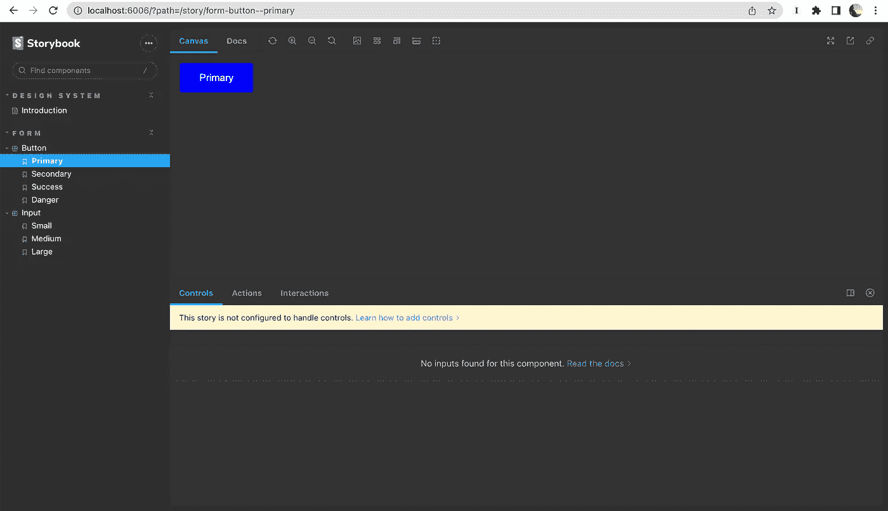
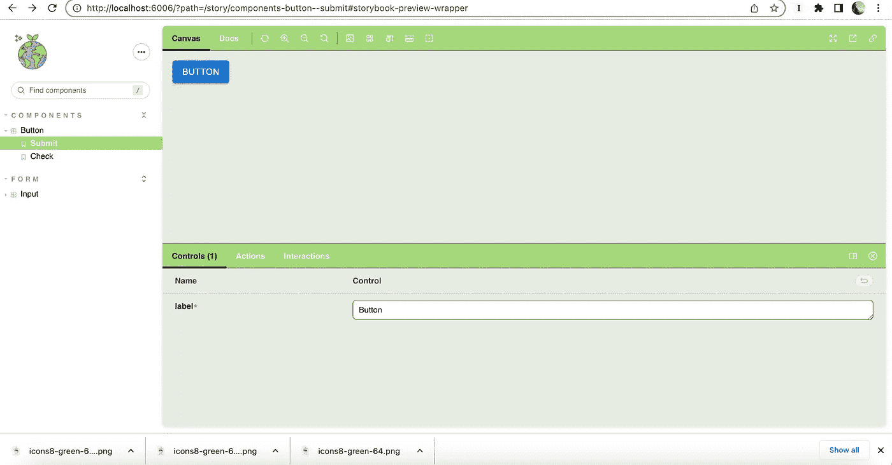

# 如何定制故事书

> 原文：<https://javascript.plainenglish.io/how-to-customize-storybook-635aa1ac8894?source=collection_archive---------1----------------------->

Storybook 是一个 UI 库，可以用来记录组件，它在前端领域很流行。大多数时候，我们可能需要定制我们的故事书来匹配客户的品牌。这篇博客讲述了如何定制你的故事书。


Photo by [Oskar Yildiz](https://unsplash.com/@oskaryil?utm_source=medium&utm_medium=referral) on [Unsplash](https://unsplash.com?utm_source=medium&utm_medium=referral)

我将直接从主题化开始，假设你已经创建了你的故事。如果你不熟悉故事书，请点击下面的链接阅读更多关于如何写故事的内容。

[](/how-to-implement-storybook-for-react-typescript-material-ui-application-f2dcbdca2ce3) [## 如何在 React + TypeScript + Material UI 应用中实现故事书

### Storybook 是一个 UI 开发工具，可以让你在一个非常丰富的库设计中预览你的组件，这将有助于…

javascript.plainenglish.io](/how-to-implement-storybook-for-react-typescript-material-ui-application-f2dcbdca2ce3) [](https://storybook.js.org/docs/react/writing-stories/introduction) [## 如何写故事

### 故事捕获 UI 组件的呈现状态。这是一个函数，它返回一个组件的状态，给定一组…

storybook.js.org](https://storybook.js.org/docs/react/writing-stories/introduction) 

第一步是确保您已经安装了`[@storybook/addons](https://www.npmjs.com/package/@storybook/addons)`和`[@storybook/theming](https://www.npmjs.com/package/@storybook/theming)`包。如果还没有，请运行下面的命令。

```
yarn add --dev @storybook/addons @storybook/theming
```

现在让我们学习主题化在故事书中实际上是如何工作的。

比如，我们试试把故事书的主题改成**深色**(故事书默认总是有浅色主题)。

将`manager.js`文件添加到`.storybook`文件夹中。

```
// .storybook/manager.js

import { addons } from '@storybook/addons';
import { themes } from '@storybook/theming';

addons.setConfig({
  theme: themes.dark,
});
```

这应该把我们的故事书变成黑暗模式。



现在让我们添加更多的样式。

让我们在`.storybook`中创建一个名为`myTheme.js`的文件，并在那里添加我们所有的风格。

```
// .storybook/YourTheme.js

import { create } from '@storybook/theming';

export default create({
  base: 'light',

  colorPrimary: 'white',
  colorSecondary: '#A4D87B',

  // UI
  appBg: 'white',
  appContentBg: '#E5ECE0',
  appBorderColor: 'grey',
  appBorderRadius: 6,

  // Typography
  fontBase: '"Open Sans", sans-serif',
  fontCode: 'monospace',

  // Text colors
  textColor: 'black',
  textInverseColor: 'rgba(255,255,255,0.9)',

  // Toolbar default and active colors
  barTextColor: 'white',
  barSelectedColor: 'black',
  barBg: '#A4D87B',

  // Form colors
  inputBg: 'white',
  inputBorder: '#4B9611',
  inputTextColor: 'black',
  inputBorderRadius: 6,

  brandTitle: 'My custom storybook',
  brandUrl: 'https://example.com',
  brandImage: 'https://i.postimg.cc/pLp2tZjx/icons8-green-64.png',
  brandTarget: '_self',
});
```

在`manager.js`中导入并设置为`theme`。

```
import { addons } from '@storybook/addons';
import { themes } from '@storybook/theming';
import myTheme from './myTheme';

addons.setConfig({
  theme: myTheme,
});
```

我们找到了。故事现已定制。



仅此而已。您将在这里找到 git 库[的链接](https://github.com/Sanchithasharma/storybook-react-ts/tree/customizes-storybook)。

# 参考资料:

1.  [https://storybook.js.org/docs/react/configure/theming](https://storybook.js.org/docs/react/configure/theming)

*更内容于* [***普通英语***](https://plainenglish.io/) *。报名参加我们的* [***免费周报***](http://newsletter.plainenglish.io/) *。* [***推特***](https://twitter.com/inPlainEngHQ)[***领英***](https://www.linkedin.com/company/inplainenglish/)*[***YouTube***](https://www.youtube.com/channel/UCtipWUghju290NWcn8jhyAw)*、*T43*和*[T47*不和*](https://discord.gg/GtDtUAvyhW) *对成长黑客感兴趣？查看* [***电路***](https://circuit.ooo/) ***。****