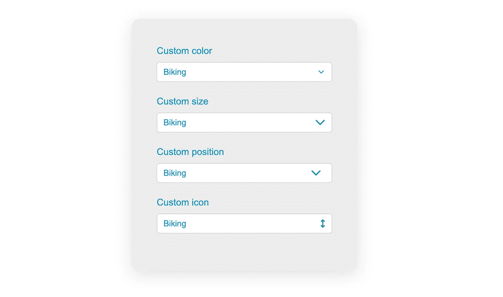
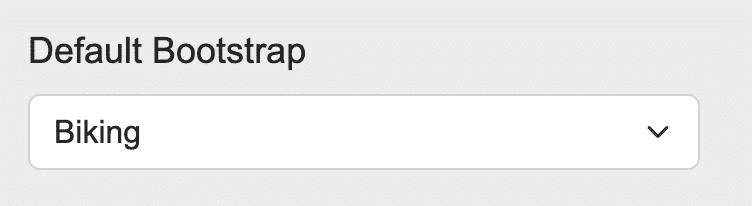
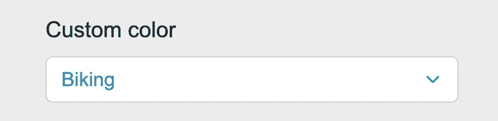
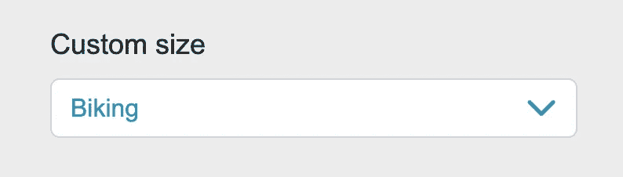
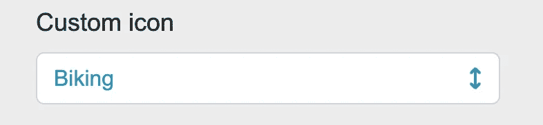

# 如何自定义引导程序中的选择图标

> 原文：<https://javascript.plainenglish.io/how-to-customize-the-select-icon-in-bootstrap-87080e3d3ad2?source=collection_archive---------5----------------------->

## 从图标到颜色的任何改变。



Bootstrap 为我们提供了一个漂亮、干净的 select 元素——不像浏览器应用的相当难看的默认样式。有时，定制选择箭头并创建一个独特的外观仍然很好。



让我们看看这样做有多快多容易。

我们在这里使用 [Bootstrap 5](https://getbootstrap.com/docs/5.2/forms/overview/) ，这是一个重要的区别，因为与 Bootstrap 4 相比，表单元素发生了变化。

## 自定义颜色

图标实际上是设置在 select 元素上的背景图像。众所周知，我们不能对背景图像应用颜色。由于背景图像是一个 svg 图标，我们需要调整 svg 的 stroke **属性。**

如果我们检查元素，我们会看到使用了数据 url。

```
background-image: url("data:image/svg+xml,%3csvg xmlns='http://www.w3.org/2000/svg' viewBox='0 0 16 16'%3e%3cpath fill='none' stroke='%23343a40' stroke-linecap='round' stroke-linejoin='round' stroke-width='2' d='m2 5 6 6 6-6'/%3e%3c/svg%3e");
```

顺便提一下，这里也可以使用外部 svg 文件的路径。第一个逗号之后的内容只是 svg 文件的 url 编码内容。

请注意，该字符串是 url 编码的。

```
stroke='%23343a40'
```

如果我们将它放入一个 url [编码器/解码器](https://www.urlencoder.org/)中，我们会得到默认的颜色。

```
stroke='#343a40'
```

现在，让我们把它改成一种漂亮的蓝色:#2596be。您可以复制默认样式规则并覆盖描边值。确保将散列符号替换为 **%** 23，以便正确编码。

我还将添加颜色属性来匹配图标的文本。

```
.form-select {
    background-image: url("data:image/svg+xml,%3csvg xmlns='http://www.w3.org/2000/svg' viewBox='0 0 16 16'%3e%3cpath fill='none' stroke='%232596be' stroke-linecap='round' stroke-linejoin='round' stroke-width='2' d='m2 5 6 6 6-6'/%3e%3c/svg%3e");
    color: #2596be;
}
```

结果是:



## 自定义尺寸

这个很简单。但是为了完整起见，我也把它包括在内。我们已经确定，我们在这里处理的是背景图像。这就是为什么我们可以简单地调整背景大小属性。

默认值:

```
.form-select {
    background-size: 16px 12px;
}
```

我们将宽度设置为 20px，高度会根据图标的比例自动调整。

```
.form-select {
    background-size: 20px auto;
}
```

结果(包括颜色和背景图像的先前代码)。



## 自定义图标

甚至有可能完全改变图标。有人可能会说，这些图标应该在网站之间保持至少模糊的一致，以免让用户感到困惑。所以在定制时，最好坚持使用指示切换下拉菜单的图标。例如向下箭头的任何变体。我选择了一个相当丑的，只是因为它是 fontawesome 的免费产品。只需在 fontawesome 上复制 svg 代码，将其放入 url 编码器，然后粘贴它，作为数据 url 或 svg 文件。然后你可以调整颜色，就像我们之前做的那样。我还调整了背景尺寸。

```
.custom-select-icon {
    background-image: url("data:image/svg+xml,%3Csvg%20xmlns%3D%22http%3A%2F%2Fwww.w3.org%2F2000%2Fsvg%22%20viewBox%3D%220%200%20320%20512%22%20fill%3D%22%232596be%22%3E%3C%21--%21%20Font%20Awesome%20Pro%206.2.0%20by%20%40fontawesome%20-%20https%3A%2F%2Ffontawesome.com%20License%20-%20https%3A%2F%2Ffontawesome.com%2Flicense%20%28Commercial%20License%29%20Copyright%202022%20Fonticons%2C%20Inc.%20--%3E%3Cpath%20d%3D%22M182.6%209.4c-12.5-12.5-32.8-12.5-45.3%200l-96%2096c-12.5%2012.5-12.5%2032.8%200%2045.3s32.8%2012.5%2045.3%200L128%20109.3V402.7L86.6%20361.4c-12.5-12.5-32.8-12.5-45.3%200s-12.5%2032.8%200%2045.3l96%2096c12.5%2012.5%2032.8%2012.5%2045.3%200l96-96c12.5-12.5%2012.5-32.8%200-45.3s-32.8-12.5-45.3%200L192%20402.7V109.3l41.4%2041.4c12.5%2012.5%2032.8%2012.5%2045.3%200s12.5-32.8%200-45.3l-96-96z%22%2F%3E%3C%2Fsvg%3E");
    background-size: 10px auto;
}
```

结果是:



正如我所说，这不是最漂亮的图标，但它可以作为一个例子。

## 结论

定制标准的引导选择图标非常容易。您可以调整大小、颜色和图标本身。不过，不要疯狂地替换选择图标，因为它应该是跨网站切换动作的一致指示器。当使用数据 url 时，记得对它们进行 URL 编码。

*更多内容请看*[***plain English . io***](https://plainenglish.io/)*。报名参加我们的* [***免费周报***](http://newsletter.plainenglish.io/) *。关注我们上*[***Twitter***](https://twitter.com/inPlainEngHQ)[***LinkedIn***](https://www.linkedin.com/company/inplainenglish/)*[***YouTube***](https://www.youtube.com/channel/UCtipWUghju290NWcn8jhyAw)**和* [***不和***](https://discord.gg/GtDtUAvyhW) *对成长黑客感兴趣？检查* [***电路***](https://circuit.ooo/) ***。*****