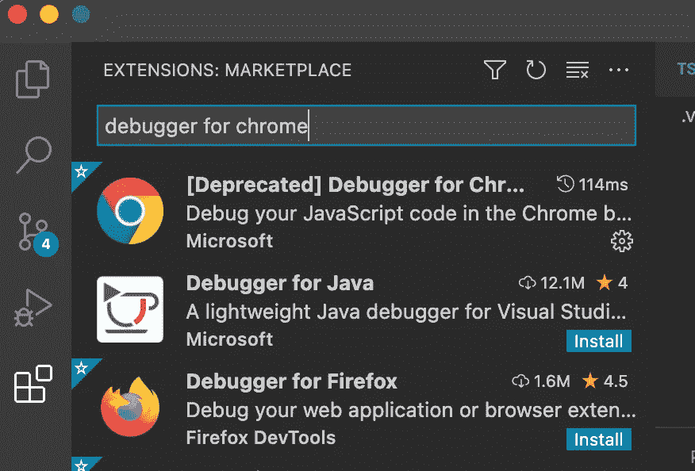
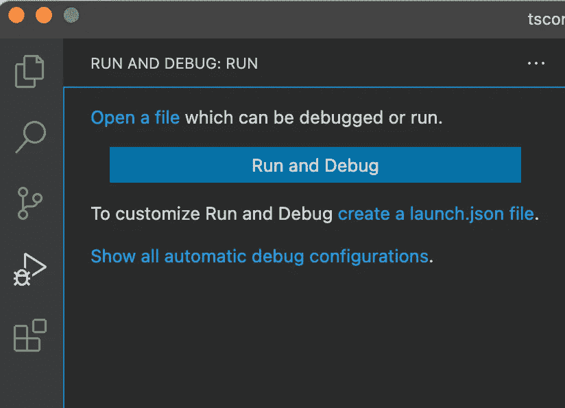
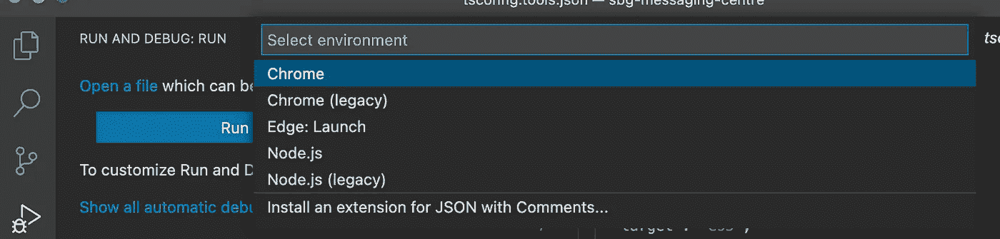
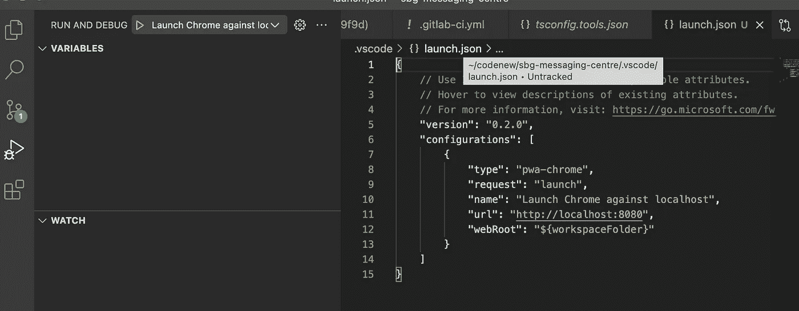
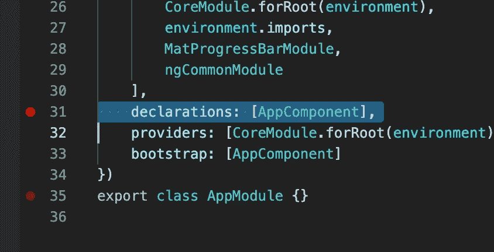

# 如何在 Visual Studio 代码中调试角度应用程序

> 原文：<https://javascript.plainenglish.io/how-to-debug-angular-applications-in-visual-studio-code-39b0acc417a8?source=collection_archive---------6----------------------->

## 如何在 Visual Studio 代码中以调试模式运行 Angular？

Image by Jan Alexander from [pixabay.com](https://pixabay.com/?utm_source=link-attribution&amp;utm_medium=referral&amp;utm_campaign=image&amp;utm_content=2680204)

调试模式可以帮助您逐句通过代码并观察变量的状态和每一行执行的结果，从而大大提高生产率。

**总结**

*   步骤 1:为 Chrome 扩展安装调试器
*   步骤 2:在 Visual Studio 中配置调试环境
*   步骤 3:在代码中创建断点
*   步骤 4:运行应用程序并调试

**详情**

**第一步**

通过访问 VS 代码市场中的扩展并搜索 debugger for Chrome 或访问以下链接来安装 debugger for Chrome 扩展:

 [## [已弃用]Chrome-Visual Studio market place 调试器

### Visual Studio 代码扩展——在 Chrome 浏览器或任何其他支持的目标中调试您的 JavaScript 代码

marketplace.visualstudio.com](https://marketplace.visualstudio.com/items?itemName=msjsdiag.debugger-for-chrome) 

Extensions Marketplace

**第二步**

设置调试配置。在 VS 代码中，单击屏幕左侧的这个按钮。

然后单击“创建一个 launch.json”文件

选择 Chrome 作为环境

编辑 launch.json 以指向运行 Angular 应用程序的端口

**第三步**

通过单击文件中行号的左侧，在代码中创建断点。例如 app.module.ts。

**第四步**

按照常规在本地运行您的角度应用程序。

从调试标签中点击“启动 Chrome 对抗本地主机”按钮

Chrome 将在新窗口中打开，app.module.ts 中的断点应在 VS 代码中命中。

调试控件应该是可见的，允许您继续、跨过该行或进入您所在的行。现在，您可以检查变量并单步执行代码。

我希望你已经发现这是有用的，如果你有任何问题得到这个工作，请留下评论，我会尽力协助。感谢您的阅读。

在 LinkedIn 上联系我:[https://www.linkedin.com/in/sadha-moodley/](https://www.linkedin.com/in/sadha-moodley/)

*更多内容看* [***说白了就是***](http://plainenglish.io/) *。报名参加我们的* [***免费周报***](http://newsletter.plainenglish.io/) *。在我们的* [***社区不和谐***](https://discord.gg/GtDtUAvyhW) *获得独家获取写作机会和建议。*