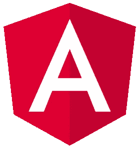
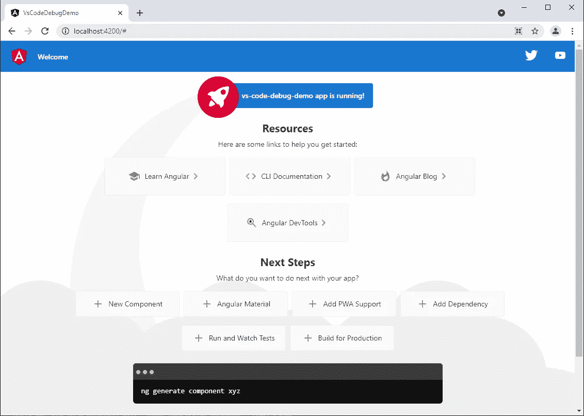
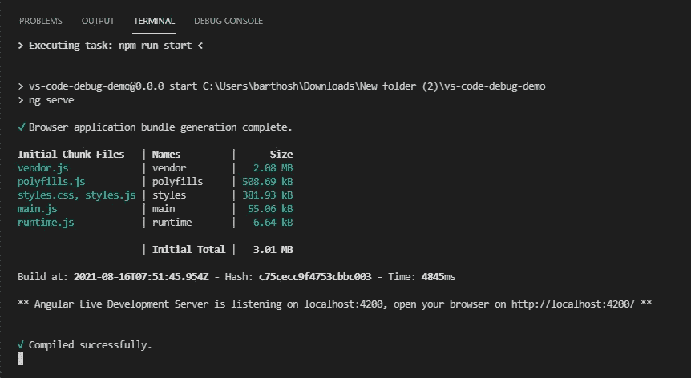

# 如何在 VSCode 中调试 Angular 应用程序

> 原文：<https://javascript.plainenglish.io/how-to-debug-angular-apps-in-vscode-dea29b2be223?source=collection_archive---------0----------------------->

# 概观

**VSCode** 是编辑*的绝佳 IDE<在这里插入你最喜欢的语言>* 源代码。同样， **Angular** 也是开发前端网络应用的一个很好的框架。

在开发应用程序时，我们开发人员通常将大部分时间花在调试器上。但是，在使用 VSCode 时，开箱即用需要一些设置来启用 Angular TypeScript 应用程序的调试。

在这篇文章中，我将向你展示如何使用**谷歌 Chrome** 网络浏览器为 **Angular TypeScript** 应用程序配置 **VSCode** 调试。



# 前同步码…

出于本文的目的，我将使用以下 Angular CLI 命令**创建一个虚拟 Angular web 应用程序**:

```
ng new vs-code-debug-demo
```



# 逐步指南

现在我们需要配置 VSCode 来启用调试。过程如下。

1.首先，更换**。vs code/*launch . JSON***文件，内容如下。如果这个文件不存在，那么创建它。

理想情况下，您的应用程序应该在同一个根目录中，而不是嵌套在子文件夹中，否则您将需要修改“webRoot”路径，例如“$ { workspace folder }/my-nested-app-files”。

```
{
    "version": "0.2.0",
    "configurations": [
      {
        "name": "ng serve",
        "type": "pwa-chrome",
        "request": "launch",
        "preLaunchTask": "npm: start",
        "url": "http://localhost:4200/#",
        "webRoot": "${workspaceFolder}",
        "sourceMapPathOverrides": {
          "webpack:/*": "${webRoot}/*",
          "/./*": "${webRoot}/*",
          "/src/*": "${webRoot}/*",
          "/*": "*",
          "/./~/*": "${webRoot}/node_modules/*"
        }
      }
    ]
  }
```

2.使用以下配置将以下任务添加到您的 **tasks.json** 文件中。

```
{
    "version": "2.0.0",
    "tasks": [
      {
        "type": "npm",
        "script": "start",
        "isBackground": true,
        "presentation": {
          "focus": true,
          "panel": "dedicated"
        },
        "group": {
          "kind": "build",
          "isDefault": true
        },
        "problemMatcher": {
          "owner": "typescript",
          "source": "ts",
          "applyTo": "closedDocuments",
          "fileLocation": [
            "relative",
            "${cwd}"
          ],
          "pattern": "$tsc",
          "background": {
            "activeOnStart": true,
            "beginsPattern": {
              "regexp": "(.*?)"
            },
            "endsPattern": {
              "regexp": "Compiled |Failed to compile."
            }
          }
        }
      }
    ]
  }
```

3.就是这样。我们都完了！现在该开始调试了。

要开始调试会话，按下 **F5** 键或点击**运行>开始调试**，将会打开一个终端，开始为您的 web 应用提供服务，同时还会打开一个浏览器窗口。现在，如果您向应用程序代码添加断点，您将能够逐句通过代码。



*更多内容请看*[***plain English . io***](https://plainenglish.io/)*。报名参加我们的* [***免费周报***](http://newsletter.plainenglish.io/) *。关注我们关于*[***Twitter***](https://twitter.com/inPlainEngHQ)[***LinkedIn***](https://www.linkedin.com/company/inplainenglish/)*[***YouTube***](https://www.youtube.com/channel/UCtipWUghju290NWcn8jhyAw)*[***不和***](https://discord.gg/GtDtUAvyhW) ***。*****

*****对缩放您的软件启动感兴趣*** *？检查* [***电路***](https://circuit.ooo/?utm=publication-post-cta) *。***