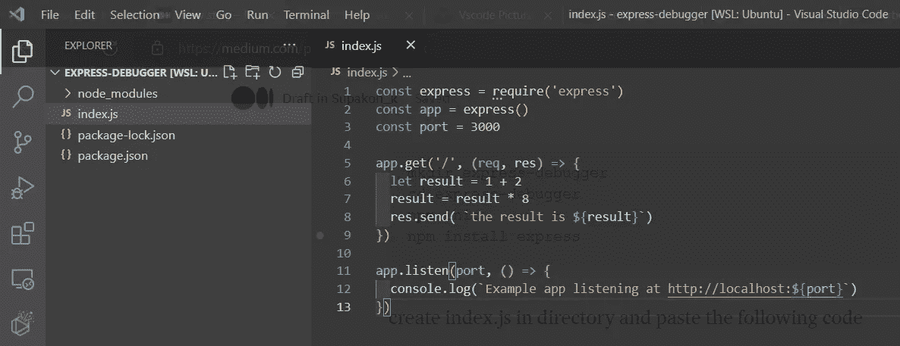
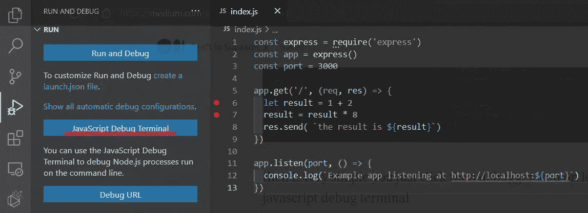
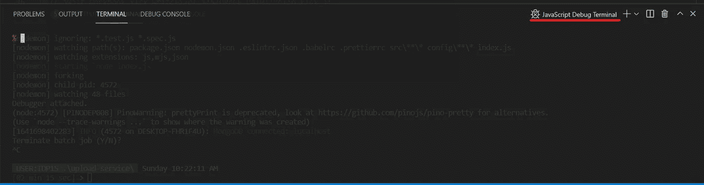
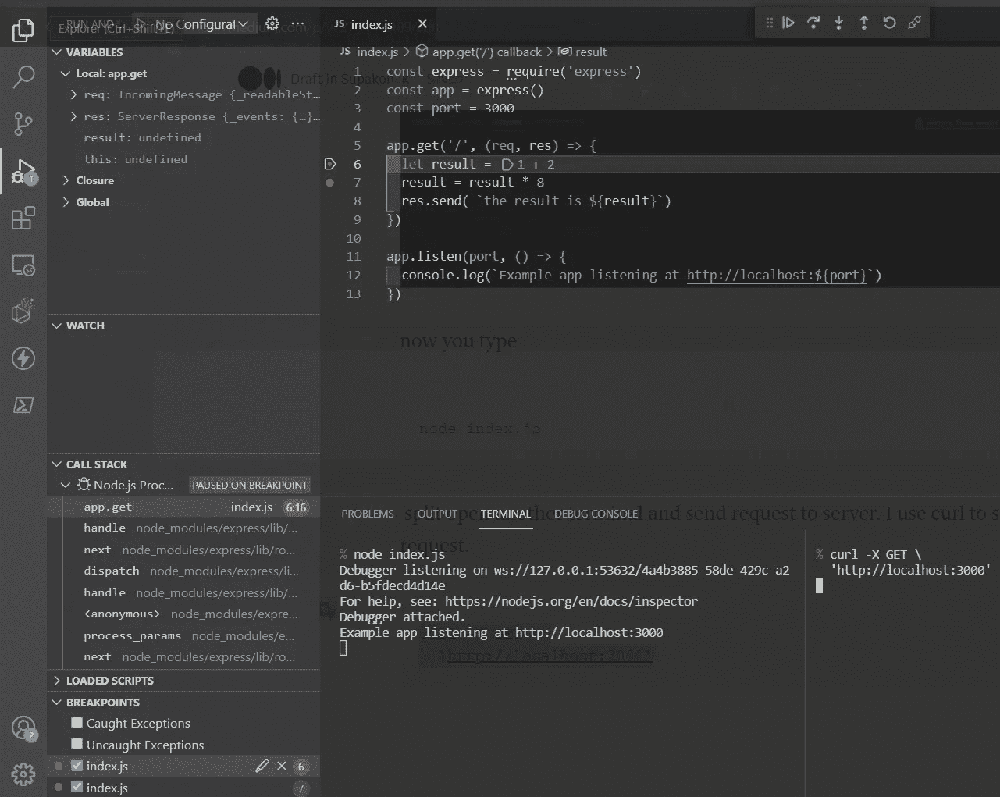

# 如何用 VS 代码调试 Node.js 后端服务器

> 原文：<https://javascript.plainenglish.io/how-to-debug-nodejs-backend-server-in-vs-code-9727d141ef09?source=collection_archive---------10----------------------->


Photo by [Mohammad Rahmani](https://unsplash.com/@afgprogrammer?utm_source=unsplash&utm_medium=referral&utm_content=creditCopyText) on [Unsplash](https://unsplash.com/s/photos/vscode?utm_source=unsplash&utm_medium=referral&utm_content=creditCopyText)

在这篇博文中，我将向您展示如何使用 Visual Studio 代码来调试 Node.js 后端服务器。

在开始之前，我将使用 Express 来演示本教程。

首先，我们必须初始化 express 项目。

```
mkdir express-debugger
cd express-debugger
npm init
npm install express
```

在目录中创建 index.js 并粘贴以下代码。

现在你应该有一个这样的项目。



然后很简单你在编辑器中点击行号前面。然后单击左侧面板上的调试器图标，并单击 JavaScript Debug Terminal。



您将在下面看到一个集成的终端，它被标记为 JavaScript 调试终端。



然后启动节点服务器。

```
node index.js
```

打开另一个终端，向服务器发送请求。我使用 curl 发送请求。

```
curl -X GET \
  '[http://localhost:3000'](http://localhost:3000')
```



恭喜你！您现在可以在节点后端服务器上进行调试。

感谢您的阅读，并享受您的编码。

*更多内容请看*[***plain English . io***](http://plainenglish.io/)*。报名参加我们的* [***免费周报***](http://newsletter.plainenglish.io/) *。在我们的* [***社区***](https://discord.gg/GtDtUAvyhW) *获得独家获得写作机会和建议。*