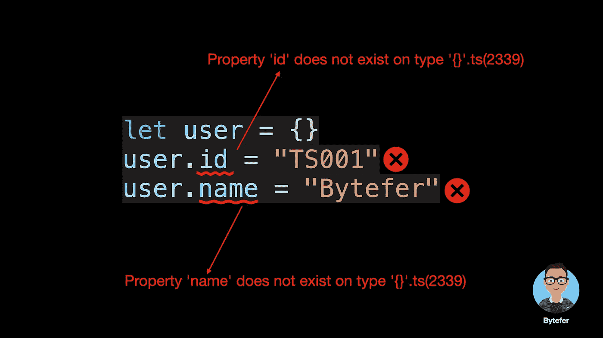
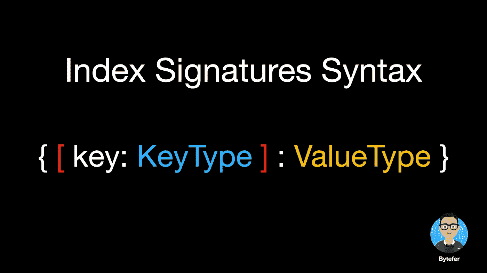
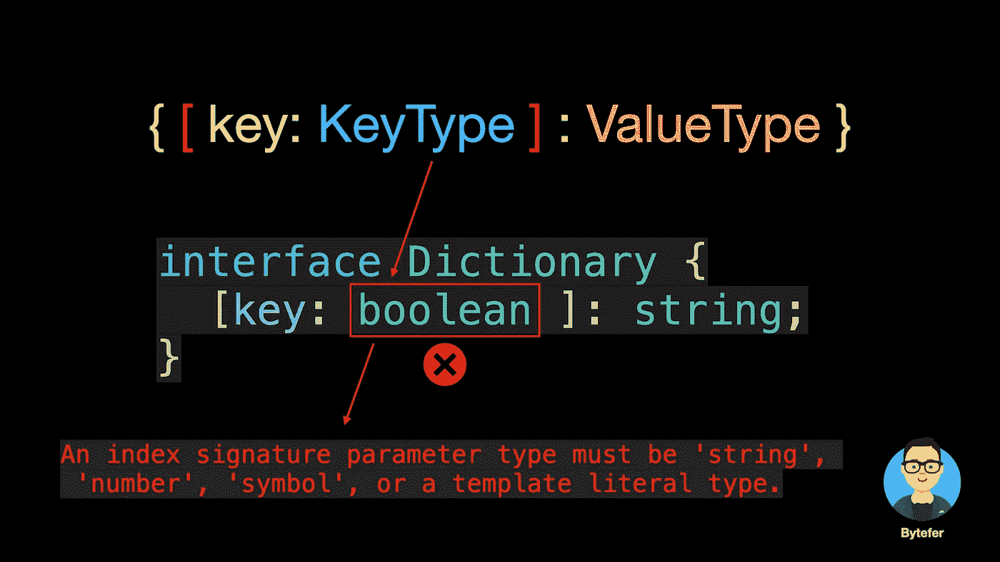
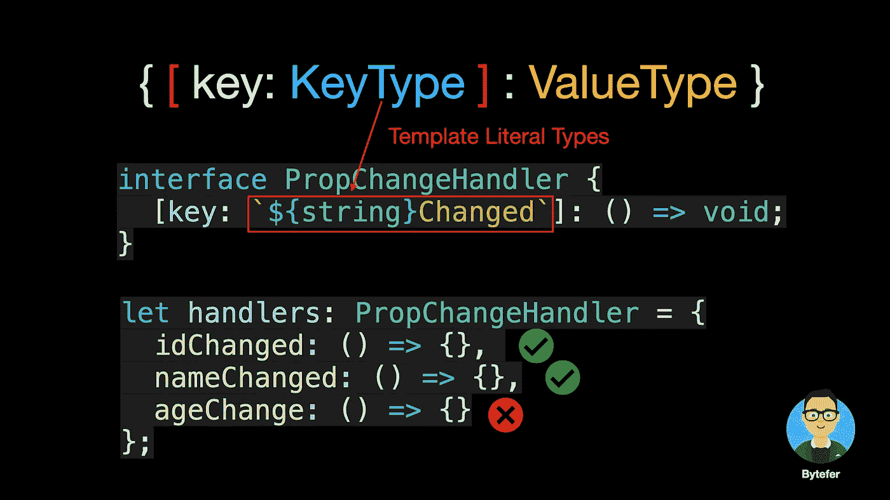
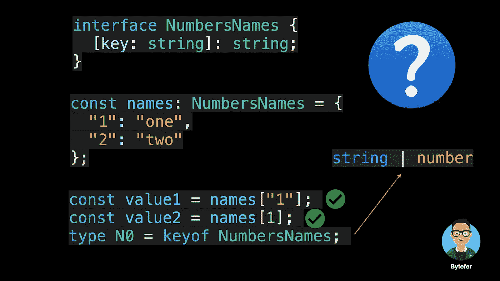
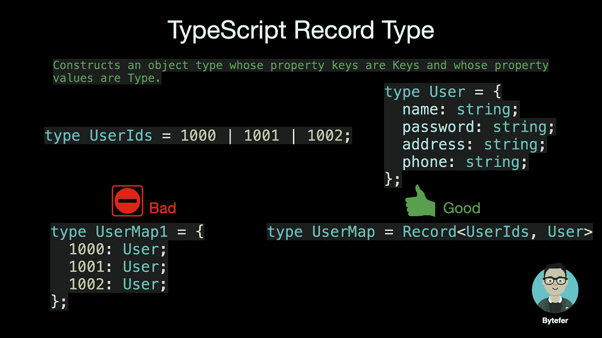
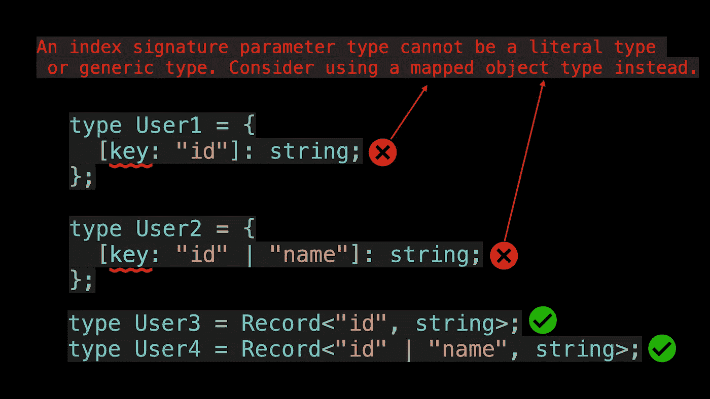

# 如何在 TypeScript 中定义具有未知结构的对象类型

> 原文：<https://javascript.plainenglish.io/how-to-define-objects-type-with-unknown-structures-in-typescript-c35e7b8462b0?source=collection_archive---------4----------------------->

## 大多数人在学习 TypeScript 时遇到的一个问题，你能想到多少种解决方案？


Photo by [Greg Rakozy](https://unsplash.com/@grakozy?utm_source=medium&utm_medium=referral) on [Unsplash](https://unsplash.com?utm_source=medium&utm_medium=referral)

欢迎来到**掌握打字稿**系列。本系列将以动画的形式介绍打字稿**的核心知识和技巧。让我们一起学习吧！以前的文章如下:**

*   [**TypeScript 泛型中的 K、T、V 是什么？**](https://medium.com/frontend-canteen/what-are-k-t-and-v-in-typescript-generics-9fabe1d0f0f3)
*   [**使用 TypeScript 像 Pro 一样映射类型**](/using-typescript-mapped-types-like-a-pro-be10aef5511a)
*   [**使用 TypeScript 条件类型像亲**](/use-typescript-conditional-types-like-a-pro-7baea0ad05c5)
*   [**使用 TypeScript 交集类型像亲**](/using-typescript-intersection-types-like-a-pro-a55da6a6a5f7)
*   [**使用打字稿推断像亲**](https://levelup.gitconnected.com/using-typescript-infer-like-a-pro-f30ab8ab41c7)
*   [**使用 TypeScript 模板字面类型像亲**](https://medium.com/javascript-in-plain-english/how-to-use-typescript-template-literal-types-like-a-pro-2e02a7db0bac)
*   [**可视化打字稿:15 种最常用的实用类型**](/15-utility-types-that-every-typescript-developer-should-know-6cf121d4047c)
*   [**关于类型脚本类你需要知道的 10 件事**](https://levelup.gitconnected.com/10-things-you-need-to-know-about-typescript-classes-f58c57869266)
*   [](/purpose-of-declare-keyword-in-typescript-8431d9db2b10)**中‘declare’关键字的用途**
*   **[**不再混淆打字稿的‘任何’和‘未知’**](/no-more-confusion-about-typescripts-any-and-unknown-98c4b53f8924)**

**你在学习 TypeScript 的时候遇到过类似的错误吗？**

****

**要修复这个错误，一个非常暴力的方法是使用`any`类型:**

```
let user: any = {}
user.id = "TS001";
user.name = "Bytefer";
```

**除了用`any`型，你还知道几种方案？在本文中，我将介绍另外 3 种解决方案。在你继续阅读之前，我建议你花点时间考虑一下。**

****

**Photo by [Aron Visuals](https://unsplash.com/es/@aronvisuals?utm_source=medium&utm_medium=referral) on [Unsplash](https://unsplash.com?utm_source=medium&utm_medium=referral)**

**解决方案之一是使用`type`或`interface`定义一个`User`类型:**

```
interface User {
  id: string;
  name: string;
}let user = {} as User;
user.id = "TS001";
user.name = "Bytefer";
```

**虽然用的是`User`型，但是可以解决前面的问题。但是如果您为用户对象设置一个新的`age`属性，将会显示以下错误消息:**

```
Property 'age' does not exist on type 'User'.ts(2339)
```

**那么应该如何解决动态的财产分配问题呢？此时，我们可以使用 TypeScript 的索引签名。当我们只知道对象键和值的类型时，我们可以使用索引签名来定义该对象的类型。索引签名的语法如下:**

****

****键的类型只能是字符串、数字、符号或模板文字类型**，而值的类型可以是任意类型。**

****

****模板文字类型**是 TypeScript 4.1 中引入的新类型，结合**索引签名，**我们可以定义更强大的类型。**

****

**如果你想进一步了解 [**模板文字类型**](/how-to-use-typescript-template-literal-types-like-a-pro-2e02a7db0bac) ，我推荐你阅读这篇文章:**

**[](/how-to-use-typescript-template-literal-types-like-a-pro-2e02a7db0bac) [## 像专家一样使用 TypeScript 模板文本类型

### 用动画解释。掌握 TypeScript 模板文字类型，知道如何用模板编写更好的代码…

javascript.plainenglish.io](/how-to-use-typescript-template-literal-types-like-a-pro-2e02a7db0bac) 

一旦我们理解了索引签名的语法，我们就可以很容易地定义一个新的`User`类型:

```
interface User {
  id: string;
  name: string;
  [key: string]: string;
}
```

在 id 和 name 已经是属性的情况下，我们通过索引签名将`User`类型的其他属性的类型设置为字符串类型。使用索引签名时，您可能会遇到以下困惑:



*   为什么可以通过字符串“1”和数字 1 访问对应的属性值？
*   为什么 keyof NumbersNames 返回字符串和数字类型的联合类型？

这是因为当在属性访问器中用作键时，JavaScript 隐式地将数字强制为字符串，并且 TypeScript 也执行这种转换。

除了使用索引签名，我们还可以使用 TypeScript 的内置实用程序类型`Record`来定义`User`类型。`Record`实用程序类型的作用如下:



```
type User = Record<string, string>let user = {} as User;
user.id = "TS001"; // Ok
user.name = "Bytefer"; // Ok
```

那么索引签名和记录实用程序类型之间有什么区别呢？在某些情况下，它们都定义了预期的类型。

```
const user1: Record<string, string> = { name: "Bytefer" }; *// Ok*
const user2: { [key: string]: string } = { name: "Bytefer" }; *// Ok*
```

对于索引签名，键类型只能是字符串、数字、符号或模板文字类型。**对于记录实用程序类型，键类型可以是文字类型或文字类型的联合**:



为了更好地理解`Record`实用程序类型，让我们看看它的内部实现:

```
/**
 * Construct a type with a set of properties K of type T.
 * typescript/lib/lib.es5.d.ts
 */
type Record<K extends keyof any, T> = {
    [P in K]: T;
};
```

`Record`实用程序类型在内部使用 TypeScript 映射类型，这在其他内置实用程序类型中使用。如果您想了解有关 TypeScript 映射类型的更多信息，我建议您仔细阅读以下文章:

[](/using-typescript-mapped-types-like-a-pro-be10aef5511a) [## 像专业人员一样使用 TypeScript 映射类型

### 映射类型—用动画解释。掌握 TypeScript 映射类型并理解 TypeScript 的内置…

javascript.plainenglish.io](/using-typescript-mapped-types-like-a-pro-be10aef5511a) 

读完这篇文章，我相信你已经理解了 TypeScript 索引类型和记录`Record`实用程序类型。如果你想学习打字，那么不要错过**掌握打字**系列。


[Bytefer](https://medium.com/@bytefer?source=post_page-----c35e7b8462b0--------------------------------)

## 掌握打字稿系列

[View list](https://medium.com/@bytefer/list/mastering-typescript-series-688ee7c12807?source=post_page-----c35e7b8462b0--------------------------------)47 stories

在 [Medium](https://medium.com/@bytefer) 或 [Twitter](https://twitter.com/Tbytefer) 上关注我，阅读更多关于 TS 和 JS 的内容！

*更多内容看* [***说白了。报名参加我们的***](https://plainenglish.io/) **[***免费周报***](http://newsletter.plainenglish.io/) *。关注我们关于* [***推特***](https://twitter.com/inPlainEngHQ) ，[***LinkedIn***](https://www.linkedin.com/company/inplainenglish/)*，*[***YouTube***](https://www.youtube.com/channel/UCtipWUghju290NWcn8jhyAw)*，以及* [***不和***](https://discord.gg/GtDtUAvyhW) *。*****