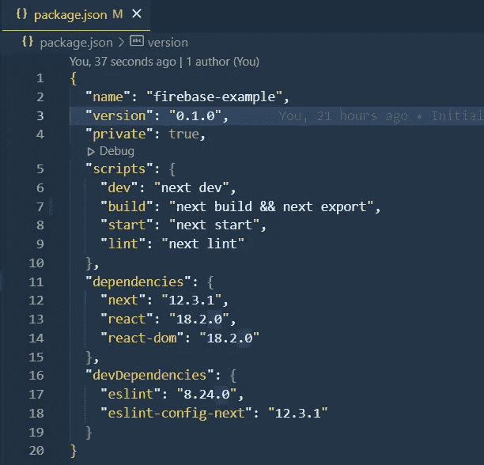

# 如何部署 Next.js 前端应用程序

> 原文：<https://javascript.plainenglish.io/how-to-deploy-a-nextjs-website-33b65765d54d?source=collection_archive---------8----------------------->

## 关于如何使用 Firebase 将 Next.js 应用程序部署为静态应用程序的教程。

在本教程中，我们将学习如何使用 Firebase 将 Next.js 应用程序部署为静态应用程序(类似于我们将 React 应用程序部署为没有 API 的前端的方式)。


Photo by [Max Duzij](https://unsplash.com/es/@max_duz?utm_source=medium&utm_medium=referral) on [Unsplash](https://unsplash.com?utm_source=medium&utm_medium=referral)

有许多方法可以部署 Next.js 应用程序，大多数人会选择 Vercel，因为 Next.js 是由 Vercel 的团队创建的。然而，据我所知，如果不选择 Vercel 上的付费计划，我就无法在 GitHub 组织中部署回购，所以我在为我的小创业项目寻找替代方案。然后我找到了 [Firebase](https://firebase.google.com/) ，所以我们将把它作为免费的 Next.js 部署平台。

# 1.在 Firebase 控制台上创建一个新项目

首先，你需要使用你的 Gmail 账户登录[应用控制台](https://console.firebase.google.com/u/0/)，创建一个新项目。


然后，只需为您的项目添加一个名称，不要忘记点击生成的 URL 并根据您的意愿进行更改。


部署后，此名称将成为您的应用程序的域(例如，[https://example-nextjs-pro . web . app)](https://example-nextjs.web.app))。根据我的记忆，在这一步之后，您将无法更改此 URL。然后，你只需要为谷歌分析选择一个默认设置，然后等到设置完成。


这就是你在网站上需要做的一切。第二步，您需要安装 Firebase CLI。非常简单，您只需要在终端中运行这个命令:

```
npm install -g firebase-tools
```

# 2.创建 Next.js 应用程序(如果您已经知道如何创建 Next.js 应用程序，请跳过这一步)

接下来，我们将通过在您的终端中运行以下命令，从 npm/yarn 创建一个示例 Next.js 应用程序:

```
npx create-next-app your-project
```

如果您收到此错误:


command not found: create-next-app

然后，您可以通过运行以下命令来修复它:

```
npm i -g create-next-app
```

一切都会像下图一样正常工作，现在你只需要等到它完成:)


之后，您可以运行`npm run dev`或`yarn dev`并转到 localhost:3000 来查看实时应用程序，但这里并不要求这样做。


# 3.初始化 Firebase 虚拟主机连接

您可能已经在步骤 1 中安装了 Firebase CLI。现在，您需要在终端中使用以下命令登录:

```
firebase login
```


您的默认浏览器中将弹出一个窗口，您只需选择您在步骤 1 中使用的 gmail 帐户，然后在该提示下单击“允许”。成功登录后，您将看到下图:


现在，让我们回到您的 Next.js 项目，确保您的终端在您的应用程序根目录中。然后，运行以下命令来初始化与 Firebase 上的远程项目的连接:

```
firebase init
```

Firebase CLI 会问你一些问题，请跟着我读并选择正确的答案:


不要忘记**按空格键**选择第一个主机选项**，然后按 Enter** 进入下一部分。在这里，您**选择第一个选项**，它将列出您帐户中的所有项目，选择您在步骤 1 中创建的项目。


对于托管设置，您将回答**“out”作为您的公共目录**，因为这是我们的 Next.js 应用程序在上一部分中创建的文件夹。因为我们的应用程序是一个类似于 ReactJS 站点的单页应用程序，所以我们也将**将所有 URL 重写为/index.html** 。

完成后，您将看到如下输出:


# 4.导出 Next.js 应用程序

在 package.json 文件中，需要将构建脚本从`"build": "next build"`修改为`"build": "next build && next export"`。



After changing script

之后，转到 next.config.js 文件并添加这些行以停用图像优化 API。否则，您无法在下一步运行构建过程。


next.config.js

最后，在终端运行`npm run build`或`yarn build`。一旦脚本在终端中完成，您将在根目录中看到一个名为“out”的新文件夹。


The building script

恭喜你！您已经完成了 90%,只需再多一点点，您将最终成功部署您的站点，并获得免费域名和 SSL 证书！

我知道已经很多了！别担心，只剩下一件事要做了。在您的终端上键入以下命令，将您的应用程序部署到 Firebase:

```
firebase deploy
```

命令结束后，您可以通过提供的网址访问您的直播网站，我的网址是[https://example-nextjs-pro . web . app](https://example-nextjs-pro.web.app)。你可以访问我的网址来查看最终结果。


就是这样！你已经成功部署了一个静态的 Next.js 前端应用，拥有免费域名，免费托管，免费 SSL 证书！

如果你在评论区遇到任何问题，请告诉我。

部署愉快！

*更多内容请看*[***plain English . io***](https://plainenglish.io/)*。报名参加我们的* [***免费周报***](http://newsletter.plainenglish.io/) *。关注我们关于*[***Twitter***](https://twitter.com/inPlainEngHQ)[***LinkedIn***](https://www.linkedin.com/company/inplainenglish/)*[***YouTube***](https://www.youtube.com/channel/UCtipWUghju290NWcn8jhyAw)***，以及****[***不和***](https://discord.gg/GtDtUAvyhW) *对成长黑客感兴趣？检查* [***电路***](https://circuit.ooo/) ***。*****