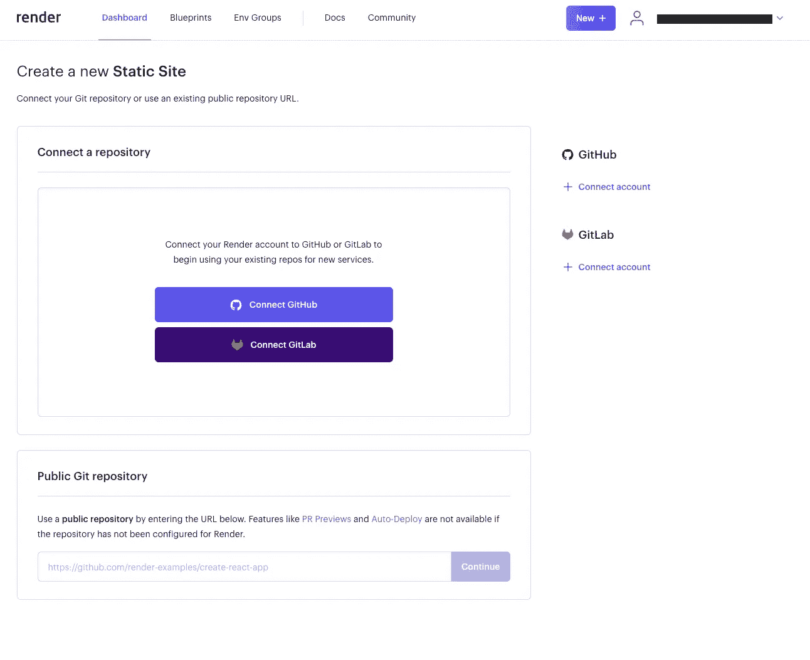
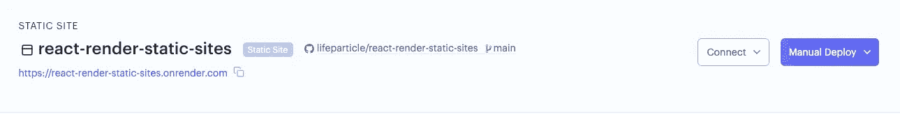

# 如何部署 React 应用程序进行渲染

> 原文：<https://javascript.plainenglish.io/how-to-deploy-a-react-application-to-render-611ef3aca84a?source=collection_archive---------2----------------------->

## 免费部署 React 应用程序

Photo by [ThisisEngineering RAEng](https://unsplash.com/@thisisengineering?utm_source=medium&utm_medium=referral) on [Unsplash](https://unsplash.com?utm_source=medium&utm_medium=referral)

我们可以在本地机器上快速开发和运行 React 应用程序。在开发过程中的任何时候，我们都可能想要部署和托管我们的应用程序，为此，我们有不同的选项，如 Netlify、Cloudflare Pages 等。在这篇文章中，我将讨论我们如何使用 [Render](https://render.com/) 来部署和托管 React 应用程序。

那么什么是渲染呢？它是一个云平台，可以托管静态站点、web 服务、数据库等等。此外，它还提供 TLS 证书、全球 CDN、DDoS 保护、专用网络等功能。你可以查看他们的定价[页面](https://render.com/pricing)以获得进一步的澄清。

# 设置

对于这个设置，我们将使用[静态网站](https://render.com/docs/static-sites)托管服务和 GitHub。之后，我们将链接我们的 GitHub [库](https://github.com/lifeparticle/react-render-static-sites)进行渲染。然后，每当我们将代码推送到 GitHub 存储库时，Render 将通过全球 CDN(内容交付网络)构建和服务我们的应用程序。

首先，访问[仪表板](https://dashboard.render.com/)，然后点击静态站点卡内的**新建静态站点**按钮。

New Static Site — Image by the author

现在我将通过点击**连接 GitHub** 按钮来连接一个存储库。

Connect GitHub — Image by the author

现在点击**授权渲染**按钮。

Authorize Render — Image by the author

我们快到了。对于这一步，我选择了访问一个选定的存储库，因为我有其他不需要渲染的存储库。神奇，现在点击**安装**按钮。

Install — Image by the author

现在从渲染面板导航到创建一个新的静态站点页面，并点击**连接**按钮。

Connect — Image by the author

您应该看到下面的表单，并且应该预先填写了**构建命令**和**发布目录**字段。对于**名称**字段，为了保持一致，我选择了存储库名称。现在点击**创建静态站点**按钮。

Create Static Site — Image by the author

正如我们所看到的，Render 生成了一个 URL，我们可以在部署完成后访问该 URL。

Automatic deploy — Image by the author

由于某种原因，第一次自动部署失败了，我不得不手动启动另一次部署。我们可以从**手动部署**下拉菜单中选择**部署最新提交**选项。

Manual Deploy — Image by the author

最后，我们可以通过[https://react-render-static-sites.onrender.com/](https://react-render-static-sites.onrender.com/)访问应用程序。

太棒了，现在您可以部署 React 应用程序了。这对你的副业项目和作品集有超级大的帮助。因此，请继续部署您的 React 应用程序吧！如果您想部署 web 服务或数据库，请查阅他们的[文档](https://render.com/docs)。编码快乐！

# 相关职位

 [## 如何将 React 应用程序部署到 Cloudflare 页面

### 免费部署您的 React 应用

javascript.plainenglish.io](/how-to-deploy-a-react-application-to-cloudflare-pages-e334466109c3)  [## 如何将 React 应用程序部署到 Netlify

### 在几分钟内部署您的 React 应用

javascript.plainenglish.io](/how-to-deploy-a-react-application-to-netlify-e120d2de2654) 

*更多内容看* [***说白了就是***](https://plainenglish.io/) *。报名参加我们的* [***免费周报***](http://newsletter.plainenglish.io/) *。关注我们关于* [***推特***](https://twitter.com/inPlainEngHQ) ， [***领英***](https://www.linkedin.com/company/inplainenglish/) *，*[***YouTube***](https://www.youtube.com/channel/UCtipWUghju290NWcn8jhyAw)*，以及* [***不和***](https://discord.gg/GtDtUAvyhW) *。对增长黑客感兴趣？检查* [***电路***](https://circuit.ooo/) *。*