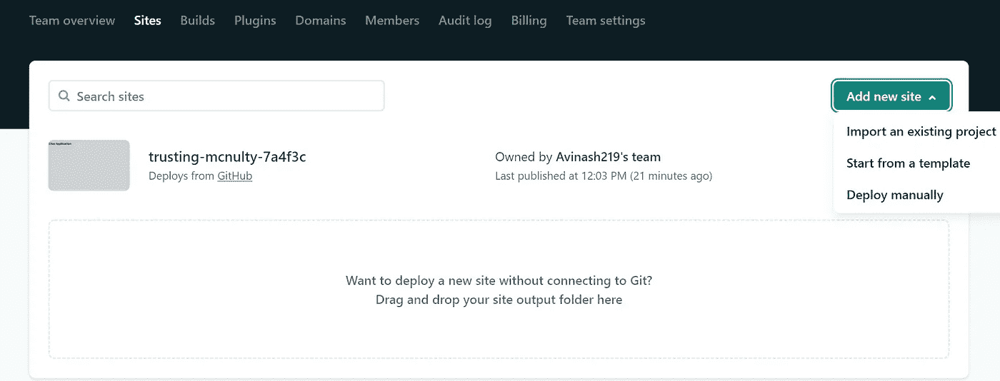
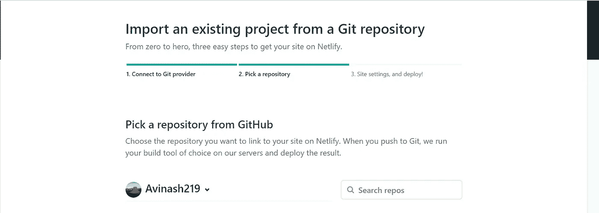
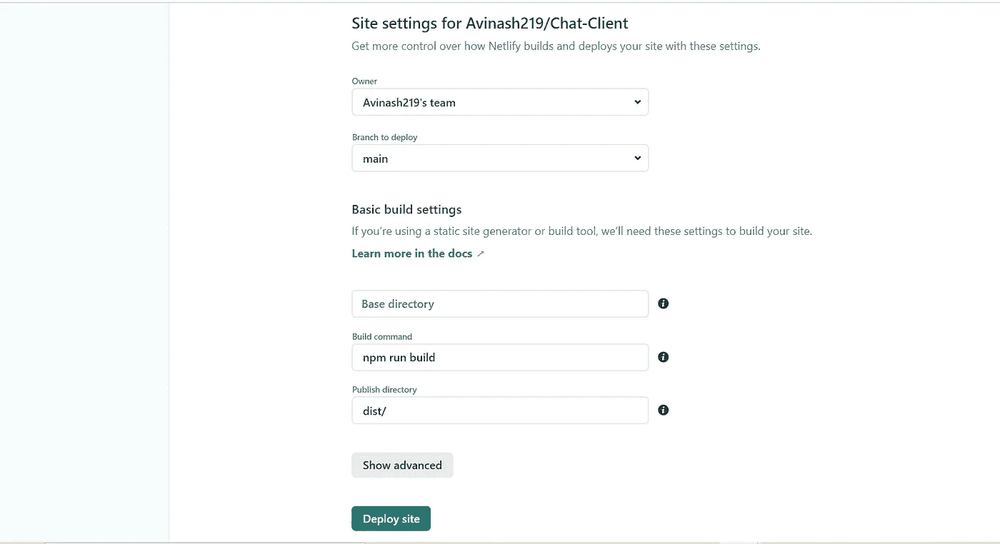
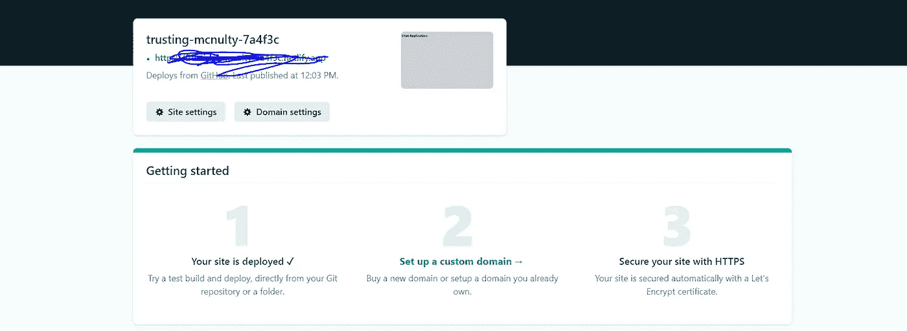

# 如何在 Netlify 上部署 Angular App

> 原文：<https://javascript.plainenglish.io/how-to-deploy-angular-app-on-netlify-215aad88505?source=collection_archive---------4----------------------->

## 如何在 5 分钟内通过 GitHub 在 Netlify 上部署 Angular 应用程序的分步指南。


Photo by [Tianyi Ma](https://unsplash.com/@tma?utm_source=medium&utm_medium=referral) on [Unsplash](https://unsplash.com?utm_source=medium&utm_medium=referral)

对于任何学习开发人员来说，一件事就是部署应用程序，并将其与封闭的同行共享，以获得即时反馈。
今天，在这个分步指南中，我们将了解如何在 5 分钟内通过 GitHub 在 Netlify 上部署 Angular 应用程序。

**步骤 1:** 创建一个新的角度应用程序

```
ng new angular-app
```

**步骤 2:** 初始化 GitHub 存储库，并将您的更改推送到创建的存储库中。

第三步:前往[https://www.netlify.com/](https://www.netlify.com/)创建你的账户。

**第 4 步:**创建帐户后，点击“站点”菜单，然后点击“添加新站点”。



**第五步:**从下拉列表中选择，导入一个已有的项目。

**第六步:**授权您的 Netlify 账户访问您的 GitHub 账户。


**第 7 步:**从搜索仓库中，选择您要部署的项目。(确保在您的 GitHub 中将项目的访问权限设置为 public)。



**步骤 8:** 一旦选择了项目，您将被重定向到构建设置页面，该页面具有为 Angular 项目设置的默认配置。如果你想做任何改变，你可以做，但是现在，我们很好。点击部署。



**步骤 9:** 站点部署完成后，您将能够在下面的截图中的模糊位置看到您的站点已部署的检查和相应的 URL。



因此，通过这简单的 9 个步骤，您可以在 Netlify 上部署您的 angular 应用程序。

还有一点需要注意的是，Netlify 会自动为步骤 8 中提到的分支中部署的更改部署您的应用程序。

希望你今天学到一些新东西。请在评论区分享您的反馈。干杯🍺。

## 进一步阅读

[](https://bit.cloud/blog/deploying-a-composable-react-app-to-netlify-l7rlluzs) [## 将可组合的 React 应用程序部署到 Netlify

### 在这篇博文中，我们将学习如何使用 Bit 来构建和部署一个可组合的 React 应用程序到 Netlify。在位…

比特云](https://bit.cloud/blog/deploying-a-composable-react-app-to-netlify-l7rlluzs) 

*更多内容请看*[***plain English . io***](https://plainenglish.io/)*。报名参加我们的* [***免费周报***](http://newsletter.plainenglish.io/) *。关注我们关于*[***Twitter***](https://twitter.com/inPlainEngHQ)[***LinkedIn***](https://www.linkedin.com/company/inplainenglish/)*[***YouTube***](https://www.youtube.com/channel/UCtipWUghju290NWcn8jhyAw)*[***不和***](https://discord.gg/GtDtUAvyhW) *。对增长黑客感兴趣？检查* [***电路***](https://circuit.ooo/) *。***