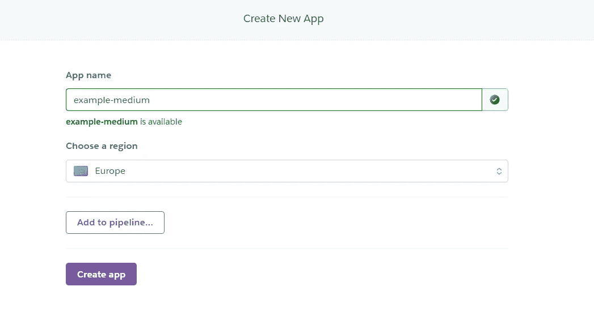
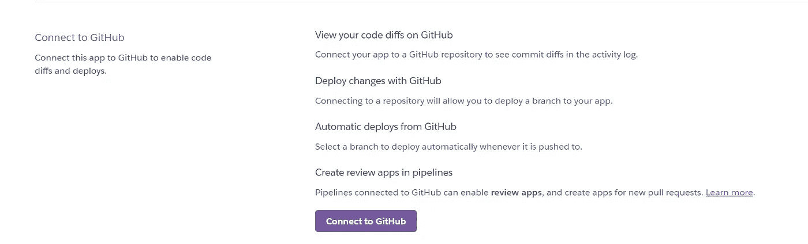
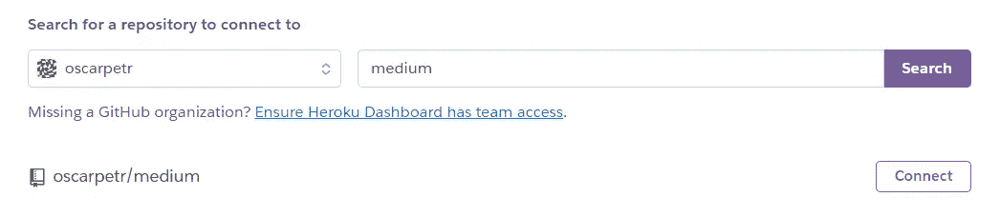
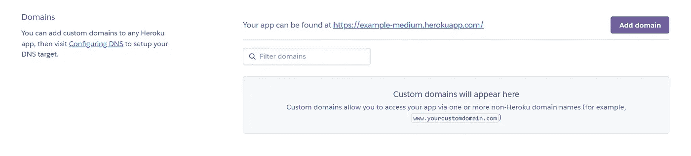

# 如何免费部署和托管 Node.js 应用程序

> 原文：<https://javascript.plainenglish.io/how-to-deploy-host-your-node-js-app-for-free-e061440ffd37?source=collection_archive---------14----------------------->

## 发展

## 如何在网上免费部署和托管 Node.js 网站？

Photo by [Carlos Muza](https://unsplash.com/@kmuza?utm_source=medium&utm_medium=referral) on [Unsplash](https://unsplash.com?utm_source=medium&utm_medium=referral)

拥有自己的网站可以促进你从事的工作类别的销售。大多数设计师、开发人员和作家都有自己的网站组合，让人们更多地注意到他们，并链接到他们所有的成就。今天，我们将看看如何免费部署一个网站。

## 1.技术和账户

在我们部署站点的过程中，我们将使用一种叫做 [Heroku](http://heroku.com) 的技术。Heroku 是一个云平台服务，支持多种编程语言(Node.js、Ruby、Java、Python、Scala、Clojure、PHP 和 Go)。

如果您在 Heroku 网站上还没有帐户，您可以在这里创建一个免费的帐户[。](https://signup.heroku.com/login)

heroku.com

## 2.Node.js 项目—端口

我们需要在运行应用程序的主 JavaScript 文件中做一点小小的改动。Heroku 使用自己的端口，我们需要一种方法将端口连接到我们的应用程序。

只需使用`process.env`变量来访问它。这行代码告诉我们，如果一个名为`PORT`的变量存储在 env。变量来使用它，这意味着我们在 Heroku 上处于部署状态。

port setting

当我们处于本地状态(测试/开发)时，应用程序将使用编号`8080`作为端口，因为我们在 env 中没有`PORT`。变量。

## 3.Node.js 项目— Procfile

现在，我们需要告诉 Heroku 如何运行我们的应用程序，这非常简单。创建一个名为`Procfile`的文件，插入将要运行它的设备和启动脚本。

procfile setting

## 3.创建项目

一旦我们的帐户设置完毕，我们就可以进入下一步，即创建我们想要部署的项目。点击网站上半部分的`New`按钮，选择`Create new app`。

在此输入应用程序的名称，该名称将在以后用作此应用程序的子域，然后选择您希望运行托管的区域。

heroku.com

然后，您可以点击`Create app`按钮。

## 4.链接存储库

最初，Heroku 给了我们 3 个选项来进行部署。其中两个包括安装一个 Heroku CLI，这只是无用的工作，因为我们可以从`GitHub`库完成。

heroku.com

之后，我们选择了`GitHub`选项，我们可以通过`Connect to GitHub`按钮将 GitHub 存储库连接到它。GitHub 授权应用程序将会出现，只需点击`Authorize`。

heroku.com

现在，我们可以键入我们的存储库的名称并点击`enter`。搜索到的存储库会显示出来(甚至是私有的)，然后点击`Connect`。

heroku.com

## 5.部署存储库

现在，我们有两个如何部署的选项，`automatic`和`manual`。如果你启用了自动部署，每次你推送这个 GitHub 库，Heroku 都会部署这个应用的一个新版本。

或者您可以选择手册，并在每次手动推送到这个 GitHub 存储库时进行部署(可以防止代码中的错误)。现在是您决定如何部署它的时候了。

出于这些目的，我将单击手动部署，我们可以在`app-name.herokuapp.com`上找到该项目。

project’s success

如果你想要一个自定义域，进入项目的`Settings`，向下滚动到`Domains`部分，点击`Add domain`按钮。

heroku.com

## 结论

你可以使用 Heroku 服务进行大量部署，它支持多种开发语言。

我希望，你会发现这篇文章对你的情况有所帮助，并且你会开始使用这个免费的网络功能来创造更多独特的体验。

*更多内容看* [***说白了。报名参加我们的***](https://plainenglish.io/) **[***免费周报***](http://newsletter.plainenglish.io/) *。关注我们关于*[***Twitter***](https://twitter.com/inPlainEngHQ)*和*[***LinkedIn***](https://www.linkedin.com/company/inplainenglish/)*。查看我们的* [***社区不和谐***](https://discord.gg/GtDtUAvyhW) *加入我们的* [***人才集体***](https://inplainenglish.pallet.com/talent/welcome) *。***