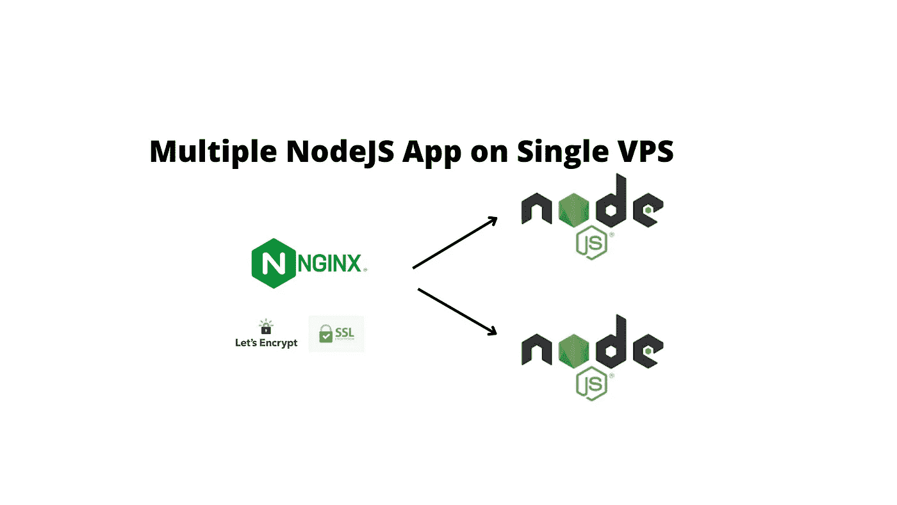

# 如何用 SSL、Nginx、PM2 在一台服务器上部署多个 Node.js 应用

> 原文：<https://javascript.plainenglish.io/how-to-deploy-multiple-nodejs-apps-on-a-single-server-with-ssl-nginx-pm2-part-2-91ea028473a5?source=collection_archive---------2----------------------->

## 第 2 部分:用 SSL 在一台服务器上部署多个 Node.js 应用程序，Nginx，PM2

# 先决条件

请在这里阅读[系列的第一部分](https://dev.to/ranjan/deploy-multiple-nodejs-apps-on-single-server-with-ssl-nginx-pm2-part-1-4841)。



我们已经为第一个应用程序设置了 NGINX、PM2 和 SSL，我们将设置一个新的 Node.js 应用程序。

我们只需几个步骤就能让新应用启动并运行

# 步骤 08 —克隆新项目或用文件创建新项目

这与“步骤 02”非常相似，我们将创建一个新文件夹，创建一个新应用程序，并在不同的端口号上运行它。

```
mkdir App2
cd App2
```

现在只需创建一个名为 index.js 的新文件:

```
nano index.js
```

现在，将以下代码粘贴到 index.js 中:

```
const http = require('http');const hostname = 'localhost';
const port = 4000; //make sure this port no is different from the first oneconst server = http.createServer((req, res) => {
  res.statusCode = 200;
  res.setHeader('Content-Type', 'text/plain');
  res.end('Hello Everyone from APP 2 !\n');
});server.listen(port, hostname, () => {
  console.log(`Server running at http://${hostname}:${port}/`);
});
```

# 步骤 09 —用 PM2 启动应用程序

我们将从 PM2 开始应用程序，并给它一个名字(这是可选的):

```
pm2 start index.js --name "APP 2"
```

这将在端口号 4000 启动应用程序。我们还可以使用以下命令查看所有运行 PM2 的应用程序:

```
pm2 list
```

这将给你一个所有正在运行的应用程序的列表。您也可以使用 id 或名称来启动/停止/重启。

# 步骤 10 —使用 NGINX 添加反向代理

我们还需要为这个应用程序再添加一次服务器配置。

要更新服务器，首先打开配置:

```
sudo nano /etc/nginx/sites-available/default
```

并将这个新块添加到服务器块的**位置**部分:

```
server_name yourdomain2.com www.yourdomain2.com; location / {
        proxy_pass http://localhost:4000; 
        proxy_http_version 1.1;
        proxy_set_header Upgrade $http_upgrade;
        proxy_set_header Connection 'upgrade';
        proxy_set_header Host $host;
        proxy_cache_bypass $http_upgrade;
    }
```

如果你计划在**子域**上托管第二个应用，只需用类似`api2.yourdomain.com`的子域替换`yourdomain2.com`即可。

然后检查并重启 NGINX:

```
# Check NGINX config
sudo nginx -t# Restart NGINX
sudo service nginx restart
```

如果域被指向，你应该看到你的应用程序在端口 80 上运行。还需要一步——添加 SSL。

# 步骤 11 —为第二个应用程序添加 SSL

我们已经安装了 certbot，因此添加额外的域不成问题。

```
sudo certbot --nginx -d yourdomain2.com -d [www.yourdomain2.com](http://www.yourdomain2.com)
```

或者对于**子域:**

```
sudo certbot --nginx -d api2.yourdomain.com
```

仅此而已！您的新应用程序也应该在新的 SSL 域上运行。

感谢阅读。干杯！

*更多内容请看*[***plain English . io***](https://plainenglish.io/)*。报名参加我们的* [***免费周报***](http://newsletter.plainenglish.io/) *。关注我们关于*[***Twitter***](https://twitter.com/inPlainEngHQ)[***LinkedIn***](https://www.linkedin.com/company/inplainenglish/)*[***YouTube***](https://www.youtube.com/channel/UCtipWUghju290NWcn8jhyAw)*[***不和***](https://discord.gg/GtDtUAvyhW) *。***