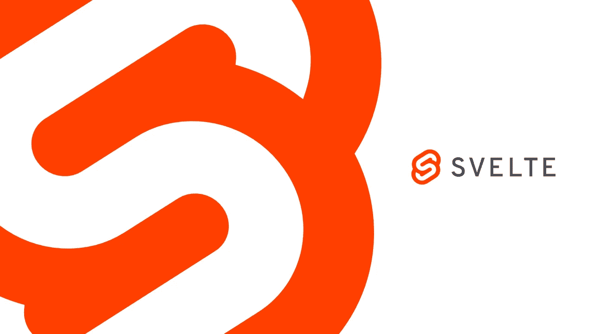
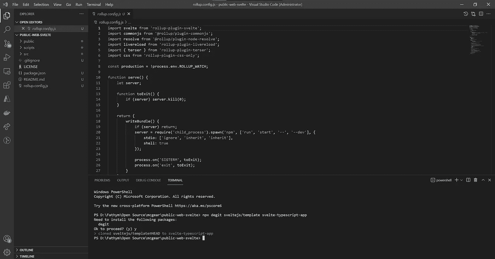
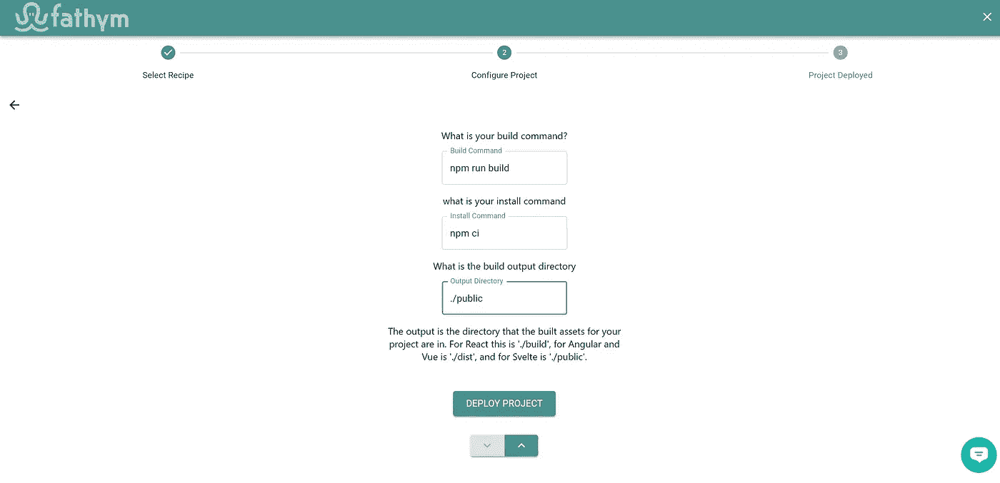

# 如何在 Fathym 上部署苗条的站点

> 原文：<https://javascript.plainenglish.io/how-to-deploy-svelte-sites-on-fathym-471930c4173c?source=collection_archive---------21----------------------->

## 在 Fathym 上部署苗条网站的指南。



用 Fathym 让你的下一个网站运行起来很简单。在这里，我们将学习一些基础知识:一个通用的苗条网站和 Fathym 设置(为开发和部署提供动力),这样您就可以专注于定制您的用户体验。

在我们开始部署之前，让我们做一些关于苗条的背景。

Svelte 最初是由 Rich Harris 在 2016 年创建的，它基本上是一个类似于 Angular，React 和 Vue.js 的 JavaScript 框架。它与众不同的是，它实际上根本不是一个框架，更像是一个编译器。

React 和 Vue.js 加载到浏览器中，而 Svelte 没有。你只需安装简单的 repo 并编写简单的代码，这些代码在到达浏览器之前会被编译成最少的 JavaScript。这意味着加载速度比 React 更快。

现在我们已经解决了这个问题，让我们开始部署吧！

*如果你想直接开始部署，试试这个* [*苗条例子*](https://www.fathym.com/dashboard/create-project?recipeId=00000000-0000-0000-0000-000000000004) *的分叉，然后在几分钟内完成编码。*

## 设置代码

本指南的第一步将是建立我们的源代码和初始苗条项目。

## 源代码控制

让我们开始设置我们的 GitHub 存储库。在 GitHub 中选择组织(或您的个人帐户)，选择“存储库”标签，然后选择新的存储库。给 repo 一个惟一的名称和描述，选择 public，我们希望用一个许可文件(通常是类似这样的 MIT 许可)作为 repo 的种子。现在我们已经建立了一个存储库，让我们将它克隆到我们的本地系统，并使用 VS 代码打开文件夹。

## 苗条项目

这篇文章的目的不是全面、深入地探究苗条身材。一般来说，当你创建一个新项目的时候，你会想要跟随[最新的苗条文档](https://svelte.dev/)。有时事情会有所改变，但一般来说，您会希望在新项目中运行以下命令来进行设置(用您选择的名称替换`svelte-typescript-app`)。

```
npx degit sveltejs/template svelte-typescript-app
```

接下来，我们希望将`svelte-typescript-app`(或者您可能已经命名的项目)目录的内容移动到项目的根目录。这将留下一个类似如下的起点:



或者，如果您想要启用 TypeScript，请运行以下命令:

```
node scripts/setupTypeScript.js
```

现在安装软件包，然后使用以下命令在本地启动并运行站点:

```
npm install
npm run build
npm start
```

随着站点的建立和运行，继续将更改提交回您的存储库，这样我们的工作(尽管是基本的)苗条站点就建立起来并准备好部署了。

## 部署代码

随着代码准备就绪，我们可以为构建、部署和宿主设置我们的 Fathym 项目。您需要 Fathym 的免费帐户才能开始。打开创建项目向导，进入[自定义项目](https://www.fathym.com/dashboard/create-project?recipeId=custom)流程。

## 项目设置

在向导的自定义项目流程中，您可以从连接到 GitHub 开始(如果您还没有连接的话),然后输入项目名称并单击“下一步”。现在是通过选择组织、存储库和分支设置来设置源代码的时候了。单击下一步，您将出现在最终构建屏幕上。您可以将构建和安装命令保留为默认值(分别为`npm run build`和`npm ci`)。确保输出目录设置为`./public`(这是编译后的应用程序和 index.html 或其他默认文件的内容所在)。



您现在可以部署您的项目，并在完成后进入仪表板。一个新的构建将运行，一旦完成，您可以启动您的自定义 Svelte 项目，并看到它在您的临时域中运行。

## 自定义域

作为额外的最后一步，您可以遵循我们的[自定义域指南](https://www.fathym.com/docs/getting-started/global-edge-network)从开始到让您的站点在您自己的域上运行。

## 下一步

现在，您已经为您的 Svelte 项目建立了一个功能完善的开发工作流程。进行更改并将其提交到您的存储库中，然后遵循我们的[更新视图指南](https://www.fathym.com/docs/guides/applications/updating)了解更多有关更新构建的信息，并使用我们的[测试用例](https://www.fathym.com/docs/guides/applications/testing-use-cases)了解如何在向用户发布新构建之前对其进行测试。快乐编码！

Fathym 是一个运行 web 项目的一体化平台。这意味着您可以使用 Fathym 部署大多数(如果不是全部)web 项目。Fathym 使用和设置都很简单，当你有一个基本的网站，你想快速建立并开放给全世界使用时——就像这个等离子网站。[在 Fathym.com](https://auth.fathym.com/fathymcloudprd.onmicrosoft.com/oauth2/v2.0/authorize?p=b2c_1_sign_up_sign_in&client_id=98f014f1-2547-4bcc-a583-3edc8f1190f2&redirect_uri=https%3A%2F%2Fwww.lowcodeunit.com%2F.oauth%2FB2C_1_SIGN_UP_SIGN_IN&response_type=id_token&scope=openid%20profile&response_mode=form_post&nonce=637789907534834707.OWNhMWZkZGMtODQ2NC00YTg0LWFjZWQtYjlkNzg0YTIzMDhkYTcxMzVkZmYtN2E2Mi00ZDRlLWIxODQtZjMxMjBkNWI2OTEx&state=CfDJ8C5COa2dn0dMrEVjdLxcXm-FCakeBxrXIOHa_lF_u0ckh9rvLFuKJ30MWBprExUQA_N5HmWWWPdxqWlni-KFqpg_jVjPahrQdGw79U0sMBN8dTvgrlAMeT9--L-7VgMBsZfFPAho9dcKUN1jO6lAaxL13PM1_vGer-vJc6tcpigRpNr5jcHtitGIKjexLmQqkIslp3MFKCKAi-5IiVd3JbpibPm4gbmDQpYtgstmG9SSlpjvEqJk_2AIqtMHkiojK3kE4WSc5mcYS3FQ3hiRqVQRPlL3jI7U3bUsqGYtLuoJr_St6mGBbHvGmB6M0MCeFn_G5LDsRzyHZhBWf9a1qo6dktz_kEcsAahYPLWjAI_2&x-client-SKU=ID_NETSTANDARD2_0&x-client-ver=6.11.1.0)报名。

*最初发表于*[T5【https://www.fathym.com】](https://www.fathym.com/docs/guides/deploying/frameworks/svelte)*。*

*更多内容看* [***说白了。报名参加我们的***](https://plainenglish.io/) **[***免费周报***](http://newsletter.plainenglish.io/) *。关注我们关于*[***Twitter***](https://twitter.com/inPlainEngHQ)*和*[***LinkedIn***](https://www.linkedin.com/company/inplainenglish/)*。加入我们的* [***社区不和谐***](https://discord.gg/GtDtUAvyhW) *。***