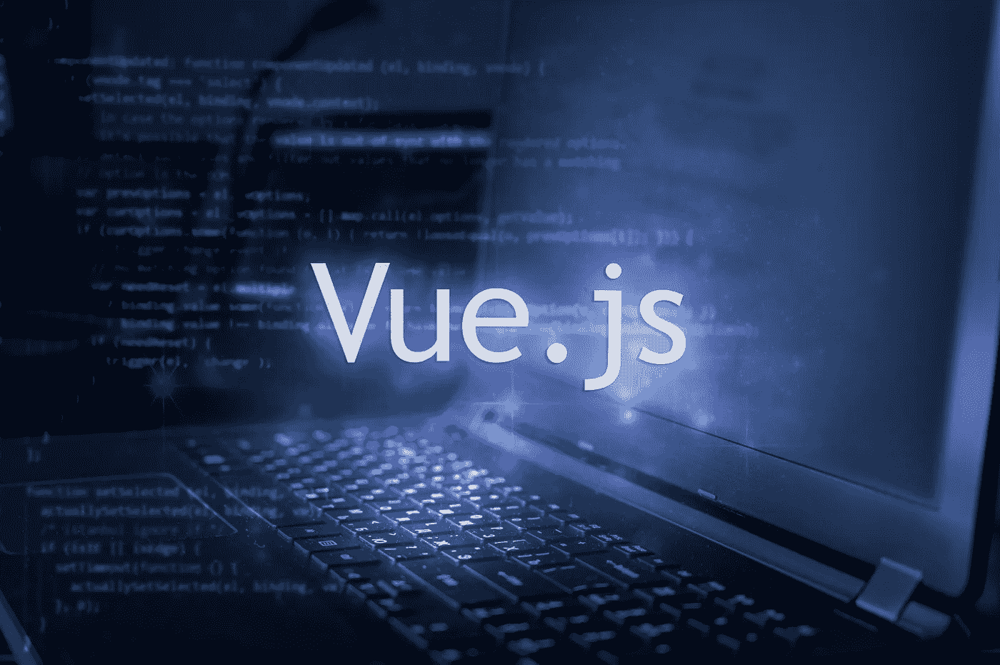
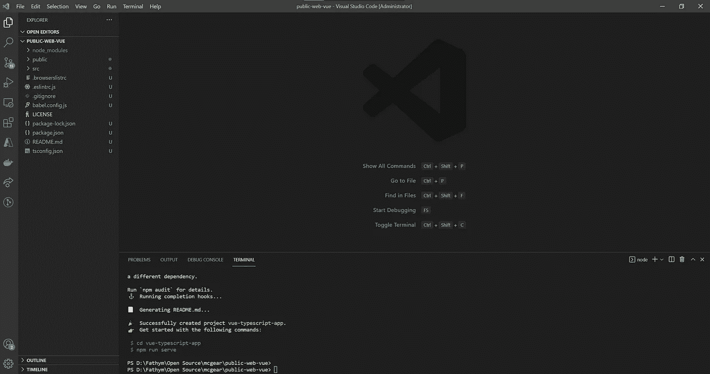
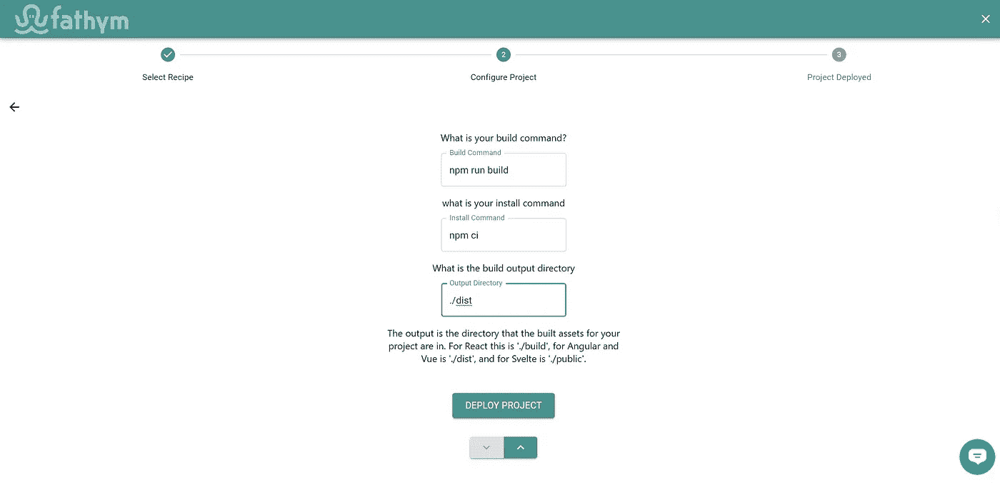

# 如何在 Fathym 上部署 Vue.js 站点

> 原文：<https://javascript.plainenglish.io/how-to-deploy-vue-sites-on-fathym-190a45b43bd2?source=collection_archive---------17----------------------->

## 用 Vue.js 创建网站的简单教程。



使用 Vue.js 创建并运行您的下一个网站比使用 Fathym 更容易。在这里，我们将快速查看设置基础:一个通用的 Vue.js 站点和 Fathym 设置，以支持开发和部署，这样您就可以专注于定制和开发您的用户体验。

如果你想直接开始部署，试试这个 [Vue.js 示例](https://www.fathym.com/dashboard/create-project?recipeId=00000000-0000-0000-0000-000000000003)的分支，然后在几分钟内完成编码。

但首先，我们来看看 Vue.js 的历史。

## Vue.js 历史

Vue.js 于 2014 年推出，由尤雨溪开发。这是一个开始流行的 JavaScript 框架。

Vue.js 被认为是 Angular 和 React 等流行 JavaScript 框架中最容易学习的一个。它有很棒的文档，但是社区比其他两个小很多。另一个缺点是与 Angular 和 React 相比，资源较少。

然而，文档很简洁，您甚至可以将它集成到其他框架中。

## 设置代码

本指南的第一步是设置我们的源代码和初始 Vue.js 项目。

## 源代码控制

让我们开始设置我们的 GitHub 存储库。在 GitHub 中选择组织(或您的个人帐户)，选择“存储库”选项卡，然后选择“新建存储库”。给 repo 一个惟一的名称和描述，选择 public，我们希望用一个许可文件(通常是类似这样的 MIT 许可)作为 repo 的种子。现在我们已经有了一个存储库设置，让我们将它克隆到我们的本地系统，并使用 VS 代码打开文件夹。

## Vue.js 项目

对 Vue.js 进行全面、深入的探究并不是本文的目的。一般来说，当你创建一个新项目时，你会想要跟随[最新的 Vue.js 文档](https://vuejs.org/v2/guide/)。有时事情会有所改变，但一般来说，您会希望在新项目中运行以下命令来进行设置(用您选择的名称替换`vue-typescript-app`)。

```
npm install -g [@vue/cli](http://twitter.com/vue/cli)
vue create vue-typescript-app
```

你会被提示一些选择，选择对你有意义的。我们将选择`Manually select features`选项并选择我们喜欢的，特别是启用 Typescript。使用空格键启用和禁用功能，准备就绪后按 enter 键完成 CLI 的最后步骤，我们建议保存您的设置以供将来使用。接下来，我们希望将`vue-typescript-app`(或者您可能已经命名的项目)目录的内容移动到项目的根目录。这将留下一个类似如下的起点:



npm 软件包已经安装，因此您现在可以运行以下命令来启动您的站点:

站点在`localhost:8080`上启动并运行后，继续将更改提交回您的存储库，这样我们的工作(尽管是基本的)Vue.js 站点就可以启动并准备部署了。

## 部署代码

代码准备就绪后，我们可以为构建、部署和托管设置 Fathym 项目。**你需要一个来自 Fathym** 的免费账户才能开始。打开创建项目向导到[定制项目](https://www.fathym.com/dashboard/create-project?recipeId=custom)流程。

## 项目设置

在向导的定制项目流中，如果您还没有连接到 GitHub，那么您可以从连接到 GitHub 开始，然后输入一个项目名并点击 next。现在是时候设置源代码控制了，方法是选择之前使用 Vue.js 示例代码设置的组织、存储库和分支。单击“下一步”,您将进入最终的构建屏幕。您可以保留构建和安装命令的默认值(分别是`npm run build`和`npm ci`)。确保输出目录设置为`./dist`(这是编译后的应用程序的内容，以及 index.html 或其他默认文件所在的位置)。



您现在可以部署您的项目，并在完成后进入仪表板。新的构建将会运行，一旦完成，您就可以启动您的自定义 Vue.js 项目，并在您的临时域中看到它的运行。

## 自定义域

作为额外的最后一步，你可以按照我们的[自定义域名指南](https://www.fathym.com/docs/getting-started/global-edge-network)从入门开始让你的网站在你自己的域名上运行。

现在，您已经为您的 Vue.js 项目建立了一个功能性开发的部署工作流。做出更改并提交到您的存储库中，然后遵循我们的[更新视图指南](https://www.fathym.com/docs/guides/applications/updating)来了解更多关于更新您的构建的信息，并使用我们的[测试用例](https://www.fathym.com/docs/guides/applications/testing-use-cases)来了解如何在向您的用户发布之前测试新的构建。编码快乐！

Fathym 是一个运行 web 项目的一体化微前端平台。这意味着您可以使用 Fathym 部署大多数(如果不是全部)web 项目。Fathym 易于使用和设置，当你有一个基本的网站，你想快速打开让世界使用时，它可以完美地工作——就像这个 Docusaurus 网站。在[www.fathym.com](https://www.fathym.com)报名。

*最初发表于*[T5【https://www.fathym.com】](https://www.fathym.com/docs/guides/deploying/frameworks/vue)*。*

*更多内容看* [***说白了。报名参加我们的***](https://plainenglish.io/) **[***免费周报***](http://newsletter.plainenglish.io/) *。关注我们关于*[***Twitter***](https://twitter.com/inPlainEngHQ)*和*[***LinkedIn***](https://www.linkedin.com/company/inplainenglish/)*。加入我们的* [***社区不和谐***](https://discord.gg/GtDtUAvyhW) *。***