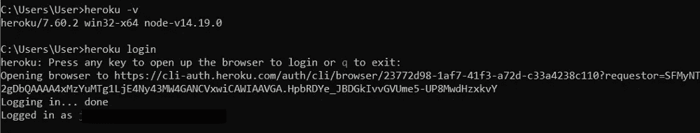
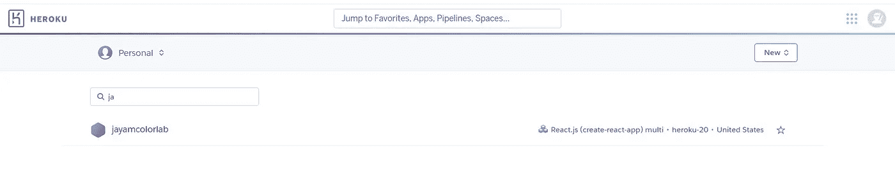
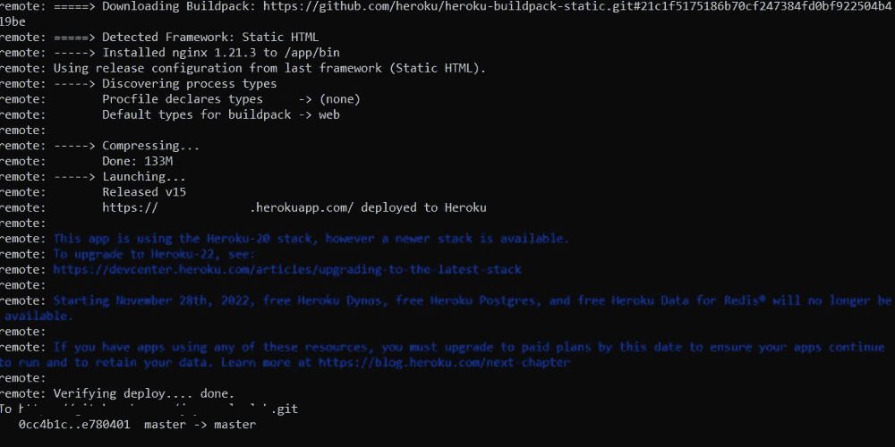
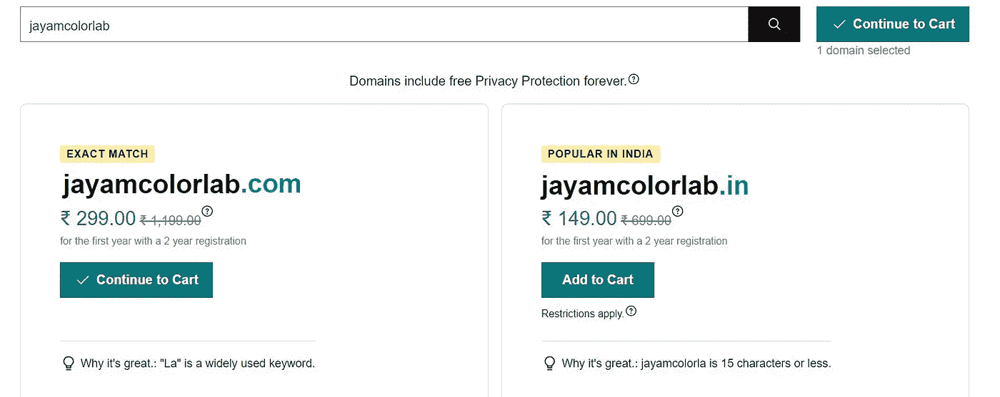
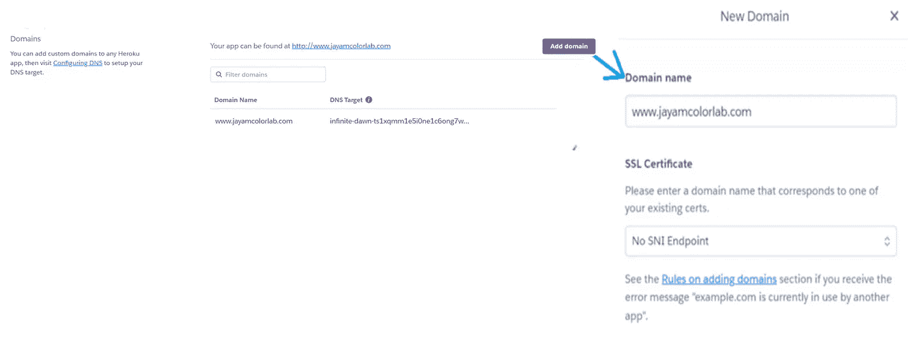
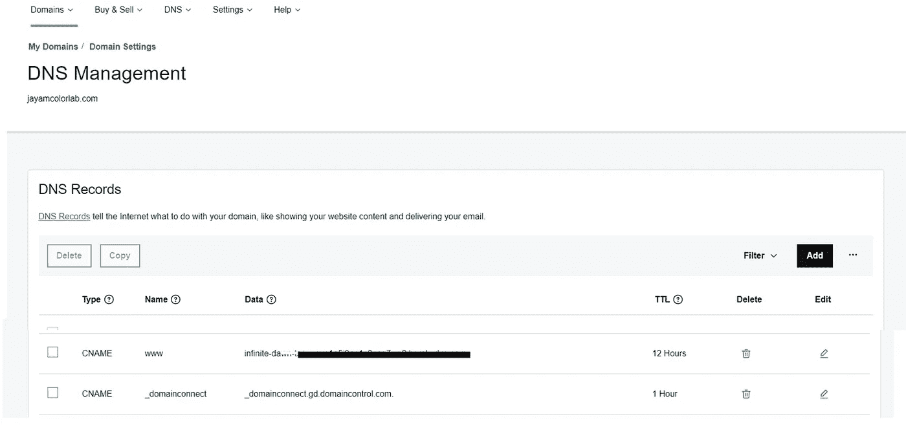
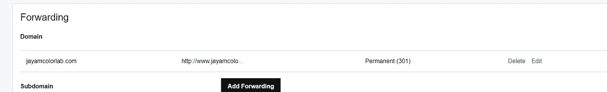

# 几分钟后在 Heroku 和 GoDaddy 自定义域中部署您的 React 应用程序

> 原文：<https://javascript.plainenglish.io/how-to-deploy-your-react-app-in-heroku-with-godaddy-custom-domain-1a763c09715c?source=collection_archive---------7----------------------->

## 在 Heroku 部署带有自定义 GoDaddy 域的静态 React 应用程序的分步指南。


[上一篇帖子是关于使用 create-react-app](https://medium.com/@jeevaramanathan/how-to-set-up-a-react-project-with-create-react-app-in-windows-4f30895daefa) 创建和设置 React 应用程序的。这篇文章是关于在 Heroku 部署带有自定义 GoDaddy 域的静态 React 应用程序。让我们从它开始。

*这里有四个步骤的流程:*

*   **在本地系统中拥有一个正在运行的反应应用程序，或者创建一个新的应用程序，如图** [**所示**](https://medium.com/@jeevaramanathan/how-to-set-up-a-react-project-with-create-react-app-in-windows-4f30895daefa) **。**
*   **将反应应用程序部署到 Heroku**
*   **在 GoDaddy 购买域名**
*   **使用 Heroku 应用程序配置购买的域**

# **1。创建反应应用程序**

启动服务器并使用“ **npm start”检查您的 react 应用程序，**如果没有创建应用程序，则使用**“npx create-react-app-you-app-name”**命令创建一个应用程序。 [**(如何使用 create-react-app 创建反应应用)**](https://medium.com/@jeevaramanathan/how-to-set-up-a-react-project-with-create-react-app-in-windows-4f30895daefa)

一旦您的应用程序成功运行，我们就可以在 Heroku *中部署了(这里，使用一个已设计好的 react 应用程序进行部署)*

# **2 .将反应应用程序部署到 Heroku**

Heroku 的优势之一是不需要了解服务器配置或网络管理——Heroku 是一个基于容器的云平台即服务(Paas)，其构建和部署变得更加简单。

[如果您是新用户，在 Heroku 创建新账户](https://signup.heroku.com/)。我们可以通过 Heroku CLI 或使用 Heroku 仪表盘在 Heroku 中创建新的应用程序。*在这里使用 Heroku CLI 吧*。

在系统中安装 [Heroku CLI](https://devcenter.heroku.com/articles/heroku-cli) 。一旦安装成功，您可以通过**“hero ku-v”进行验证。**在终端/命令提示符下使用**“hero ku log in”**登录您的账户。它将导航到您的浏览器，一旦您成功登录，您可以根据截图看到以下信息。

```
heroku -v
heroku login
```



**在 Heroku 仪表盘中创建应用程序**

我们必须在 Heroku 中为我们的应用程序创建一个应用程序。我们还可以使用“heroku 创建应用程序名称”或“heroku 创建”为我们的应用程序命名，这将创建一个随机命名的应用程序*【heroku 的应用程序名称在所有用户中是唯一的】*。

```
heroku create <APP_NAME>
```

***添加构建包-*** *H* eroku 构建包是一组开源脚本，用于在 Heroku 上编译应用。我们将使用“create-react-app”构建包，它们是 react 应用程序所必需的。添加这个是必须的。
这个特殊的构建包用于部署一个静态网站 React 应用程序。

```
heroku buildpacks:set mars/create-react-app
```

以下命令是单独执行上述步骤的单行命令，也可以在 Heroku dashboard 中的 app settings>build pack 部分添加这个[https://github.com/mars/create-react-app-buildpack](https://github.com/mars/create-react-app-buildpack)。

```
heroku create <APP_NAME> --buildpack mars/create-react-app
```

**注意:这个*create-react-app*****build pack 已被弃用，在 Heroku-22 或更新的栈上不受支持。因此，请确保您的 heroku 应用程序堆栈是 20 个而不是 22 个。使用下面的命令可以改变应用程序的堆栈:**

```
heroku stack:set heroku-20
```

之后，您可以在 Heroku 仪表盘中找到您的应用程序。



接下来就是把代码推送到 heroku app 了！

此外，如果项目位置中没有 git 存储库，请将其初始化。因为我们要用 git 把我们的代码推送到 heroku app 里。在您的项目位置终端中，按照这些 git 命令进行推送。

```
git init
git add .git commit -m "deploy to heroku"git push heroku master
```

如果您正在初始化一个新的 git 存储库，而不是重新初始化它，那么在将应用程序推送到 heroku 之前，使用 remote 注册创建的 heroku 应用程序并使用`heroku git:remote -a <APP_NAME>`链接它们。

一旦你的应用在 Heroku 成功部署，你会在你的终端上找到它。



现在，您可以在浏览器中直接点击 url，或者使用此`heroku open`在浏览器中打开。


您将找到带有。herokuapp 扩展。因此，现在要建立与自定义域的链接，首先，我们需要购买一个域。

# **3。从 Go Daddy 购买域名**


GoDaddy 是值得信赖的最大的域名注册商和虚拟主机公司之一。搜索你想要的域名，并根据可用性购买域名。



购买域名后，您将能够在个人资料>账户>我的产品或 dashboard.godaddy.com[下找到您的域名](http://dashboard.godaddy.com)

# **4。使用 Heroku 应用程序配置购买的域名**

这是最后一步。配置部分不太复杂，Heroku 和 GoDaddy 里每一步都有。

**Heroku:** 作为第一步，添加卡的详细信息到只是为了验证目的而添加的域名中。不要担心你不会被开帐单。只有 Godaddy 领域，你将在这整个过程中支付。Heroku 主机是免费的，它可以免费使用 dyno。只有当你需要更多的动力，你将需要支付。

I .进入 Heroku 应用程序并导航至设置。
二。在“域”下，添加所需的域名。它将生成一个新的 DNS 目标。
三世。此 DNS 目标将用于 GoDaddy 的 CNAME。



**GoDaddy:** 在 [GoDaddy](https://www.godaddy.com/) 下您购买的域名导航到“*我的域名>域名设置> DNS 管理”*



**i)编辑名为“www”的 CNAME，将其替换为从 Heroku 域创建的 DNS 目标值。** CNAME 是一种将别名映射到真实或规范域名的 DNS 记录。这里别名是 DNS 目标。

**DNS TTL:** DNS TTL(生存时间)就像是 DNS 记录上的一种到期日期。TTL 用来告诉递归服务器应该将所述记录保存在其高速缓存中多长时间。TTL 越长，解析器在缓存中保存信息的时间就越长，TTL 越短，解析器在缓存中保存信息的时间就越短。

**ii)添加转发选项:**

现在你的应用程序可以像 your-domain-name.com T21 一样被访问，但是为了让你的域名和“www”一起工作，你需要给你的域名添加转发功能。

点击添加转发，在*目的 URL* 中添加带有“www”的域名，如 www.your-domain-name.com



就是这样！部署完成。([www.jayamcolorlab.com](http://www.jayamcolorlab.com))


# **结论**

因此，最后，它已被部署，你可以找到你的网站与自定义域名已购买 GoDaddy。最后，一旦您准备好静态 react 应用程序，您将创建一个 Heroku 应用程序并部署它，在 GoDaddy 中购买域后，您将配置它们。

请随意评论你的观点😊！

*更多内容请看*[***plain English . io***](https://plainenglish.io/)*。报名参加我们的* [***免费周报***](http://newsletter.plainenglish.io/) *。关注我们关于*[***Twitter***](https://twitter.com/inPlainEngHQ)[***LinkedIn***](https://www.linkedin.com/company/inplainenglish/)*[***YouTube***](https://www.youtube.com/channel/UCtipWUghju290NWcn8jhyAw)*[***不和***](https://discord.gg/GtDtUAvyhW) *。***