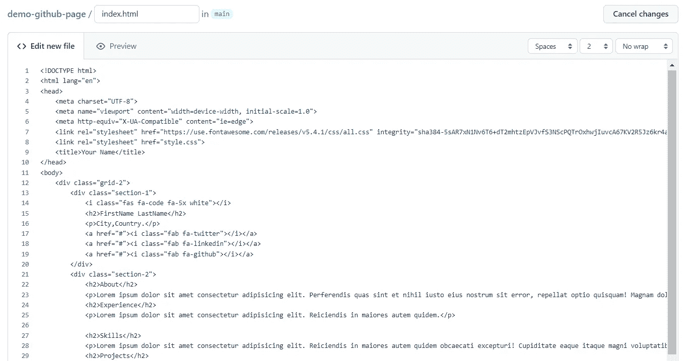

# 如何在 GitHub 页面上免费部署带有路线的 React 应用程序

> 原文：<https://javascript.plainenglish.io/how-to-deploy-your-react-app-with-routes-on-github-pages-for-free-f86375c42780?source=collection_archive---------4----------------------->

## GitHub 页面的免费静态站点托管


当我在构建[电子商务反应模板](/how-to-build-an-ecommerce-reactjs-template-chapter-1-the-beginning-bf67f0500e92)时，我需要一个演示 URL 来展示我完成的模板。GitHub 已经有了一个在 [GitHub 页面](https://pages.github.com/)上托管静态站点的解决方案。在这篇博客中，我将分享创建 GitHub 页面的步骤。

## 什么是 GitHub 页面？

GitHub 页面用于托管一个关于您自己、您的组织或您的项目的网站，直接来自 GitHub.com 上的一个存储库

> GitHub Pages 是一个静态的站点托管服务，它直接从 GitHub 上的存储库中获取 HTML、CSS 和 JavaScript 文件，可以选择在构建过程中运行这些文件，并发布一个网站。

因此，我们可以使用 GitHub 页面来托管您的个人资料或演示项目。同样，它也有一些限制，[点击这里](https://docs.github.com/en/pages/getting-started-with-github-pages/about-github-pages)阅读更多关于 GitHub 页面的信息。

# 在几分钟内建立自己的网站

在开始 React 网站设置之前，我们要在 GitHub 上花几分钟时间建立一个静态的[投资组合网站](https://giotsere.github.io/minimalist-portfolio/)。

## 1.创建新的存储库

转到[https://github.com/new](https://github.com/new)页面，创建新的公共存储库。


## 3.创建索引文件

创建存储库后，通过单击添加文件->创建新文件菜单来创建新文件


将文件命名为`index.html`，并将下面的 HTML 添加到编辑器中。



```
<!DOCTYPE html>
<html lang="en">
<head>
    <meta charset="UTF-8">
    <meta name="viewport" content="width=device-width, initial-scale=1.0">
    <meta http-equiv="X-UA-Compatible" content="ie=edge">
    <link rel="stylesheet" href="https://use.fontawesome.com/releases/v5.4.1/css/all.css" integrity="sha384-5sAR7xN1Nv6T6+dT2mhtzEpVJvfS3NScPQTrOxhwjIuvcA67KV2R5Jz6kr4abQsz" crossorigin="anonymous">
    <link rel="stylesheet" href="style.css">
    <title>Your Name</title>
</head>
<body>
    <div class="grid-2">
        <div class="section-1">
            <i class="fas fa-code fa-5x white"></i>
            <h2>FirstName LastName</h2>
            <p>City,Country.</p>
            <a href="#"><i class="fab fa-twitter"></i></a>
            <a href="#"><i class="fab fa-linkedin"></i></a>
            <a href="#"><i class="fab fa-github"></i></a>
        </div>
        <div class="section-2">
            <h2>About</h2>
            <p>Lorem ipsum dolor sit amet consectetur adipisicing elit. Perferendis quas sint et nihil iusto eius nostrum sit error, repellat optio quisquam! Magnam dolore iusto cumque. Nostrum error iste neque maiores.</p>
            <h2>Experience</h2>
            <p>Lorem ipsum dolor sit amet consectetur adipisicing elit. Reiciendis in maiores autem quidem.</p>

            <h2>Skills</h2>
            <p>Lorem ipsum dolor sit amet consectetur adipisicing elit. Reiciendis in maiores autem quidem obcaecati excepturi! Cupiditate eaque itaque magni voluptatibus neque nobis est dolor? Atque sunt minus ipsa asperiores. At.</p>
            <h2>Projects</h2>
            <a href="#">Project 1</a>
            <a href="#">Project 2</a>
            <a href="#">Project 3</a>
            <a href="#">Project 4</a>
            <a href="#">Project 5</a>
            <h2>Contact</h2>
            <p>myEmail@email.com</p>
        </div>
    </div>
</body>
</html>
```

提交文件


对于样式，创建 style.css 文件并复制以下代码

```
/* global */
@import url('https://fonts.googleapis.com/css?family=Roboto');

.grid-2{
    display: grid;
    grid-template-columns: repeat(2,1fr);
}

body{
    margin: 0;
    padding: 0;
    font-family: 'Roboto', sans-serif;
    background-color: #101214;
    color: #7A7C80;

}

h2,.white{
    color: #fff;
}

a{
    color: #7A7C80;
    text-decoration: none;
}
/* section 1 */
.section-1{
    padding-top: 40vh;
    text-align: center;
}

.section-1 p{
    font-size: 1.1rem;
    padding-bottom: 10px;
    margin:0;
}

.section-1 h2{
    font-size: 1.7rem;
    margin-bottom: 10px;
}

.section-1 a{
    font-size: 1.5rem;
    padding: 10px;
}
/* section 2 */
.section-2{
    padding-top: 10vh;
    width: 70%;
}

.section-2 h2{
    font-size: 1.7rem;
    margin-bottom: 10px;
}

.section-2 p{
    font-size: 1.1rem;
    padding-bottom: 10px;
    margin:0;
}

.section-2 a{
    display: block;
    padding: 5px;
    font-size: 1.2rem;
    padding-left: 0;
    width: 100px;
}
/* animations / utilities */
.section-2 a:hover{
    font-size: 1.3rem;
    color: #fff;
    cursor: pointer;
    transition: 0.2s;
}

.section-1 a:hover{
    color: #fff;
    cursor: pointer;
    transition: 0.3s;
}

.white:hover{
    position: relative;
    padding-left: 10px;
}

/* media queres */
@media(max-width:780px){
    .grid-2{
        grid-template-columns: 1fr;
    }
    .section-1{
        padding:0;
        padding-top: 5rem;
    }
    .section-2{
        padding: 0;
        padding-left: 1.5rem;
        padding-top: 2rem;
    }
}
```

现在，我们在存储库上创建了两个文件。


## 3.存储库设置

转到“存储库设置”选项卡，然后单击“页面”菜单。


选择主分支后，保存更改


## 4.网站准备好了

现在，进入[**http://*username*. github . io/*repository***](http://username.github.io/repository)访问您的网站

我的演示 GitHub 页面:[https://balajidharma.github.io/demo-github-page/](https://balajidharma.github.io/demo-github-page/)


# 如何部署 React 应用程序

我已经使用 [Create React App](https://github.com/facebook/create-react-app) 创建了 React 存储库。这是反应电子商务模板。

我们将为这个[https://github.com/balajidharma/tailwindcss-nordic-store](https://github.com/balajidharma/tailwindcss-nordic-store)仓库创建 GitHub 页面。

我已经创建了一个新的 [gh-pages-build](https://github.com/balajidharma/tailwindcss-nordic-store/tree/gh-pages-build) 分支来添加我的 GitHub 页面更改。


## 1.安装 gh-pages 包

[gh-pages](https://github.com/tschaub/gh-pages) 包用于将文件发布到 GitHub 上的`gh-pages`分支

```
npm install gh-pages --save-dev
```

## 2.更新主页 URL

默认情况下，Create React App 会生成一个构建，假设您的应用程序托管在服务器根目录下。

为了覆盖它，我们需要改变你的`package.json`中的`homepage`

```
 "homepage": "http://balajidharma.github.io/tailwindcss-nordic-store",
```

## 3.创建预部署和部署脚本

`package.json`文件上的“`scripts`属性支持许多内置脚本。现在我们要添加额外的脚本。

`predeploy` 脚本用于构建最终代码，`deploy`脚本在`gh-pages`分支上部署和发布代码。因为 GitHub pages 默认将更改发布到`gh-pages`分支。

```
 "scripts": {
    "predeploy": "npm run build",
    "deploy": "gh-pages -d build",
    // other scripts
  },
```

## 4.开始部署

现在，通过运行下面的部署命令开始部署

```
npm run deploy
```

```
PS C:\development\react\tailwindcss-nordic-store> npm run deploy

> tailwindcss-nordic-store@0.1.0 predeploy
> npm run build

> tailwindcss-nordic-store@0.1.0 build
> react-scripts build

Search for the keywords to learn more about each warning.
To ignore, add // eslint-disable-next-line to the line before.

File sizes after gzip:

  54.7 kB  build\static\js\main.ca1164bf.js
  2.14 kB  build\static\css\main.29566e68.css

The project was built assuming it is hosted at /tailwindcss-nordic-store/.
You can control this with the homepage field in your package.json.

The build folder is ready to be deployed.

Find out more about deployment here:

  https://cra.link/deployment

> tailwindcss-nordic-store@0.1.0 deploy
> gh-pages -d build

Published
PS C:\development\react\tailwindcss-nordic-store> 
```

现在验证`gh-pages`分支，可以看到文件更新的时间。


# 结论

我已经告诉过你 GitHub 页面对于托管你的作品集网站和你的开源项目演示非常有用。此外，GitHub 页面支持[自定义域](https://docs.github.com/en/pages/configuring-a-custom-domain-for-your-github-pages-site)。

感谢您的阅读。

敬请关注更多内容！

*跟我来【balajidharma.medium.com】[](https://balajidharma.medium.com/)*。**

**更多内容请看*[***plain English . io***](https://plainenglish.io/)*。报名参加我们的* [***免费周报***](http://newsletter.plainenglish.io/) *。关注我们关于*[***Twitter***](https://twitter.com/inPlainEngHQ)[***LinkedIn***](https://www.linkedin.com/company/inplainenglish/)*[***YouTube***](https://www.youtube.com/channel/UCtipWUghju290NWcn8jhyAw)*[***不和***](https://discord.gg/GtDtUAvyhW) ***。******

*****对缩放您的软件启动感兴趣*** *？检查* [***电路***](https://circuit.ooo?utm=publication-post-cta) *。***