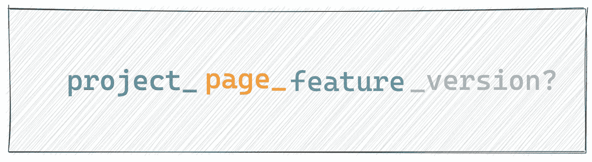

# 如何在 Web 应用程序中设计缓存

> 原文：<https://javascript.plainenglish.io/how-to-design-cache-in-a-web-app-e34d30a8c32?source=collection_archive---------0----------------------->

## 在 web 应用程序中设计干净、可靠的缓存的准则。


Photo by [Artur Aldyrkhanov](https://unsplash.com/@aldyrkhanov?utm_source=medium&utm_medium=referral) on [Unsplash](https://unsplash.com?utm_source=medium&utm_medium=referral)

# 前言

当我访问一个交互非常慢的网站时，我会变得很烦躁。例如，当我们点击一个按钮时，几秒钟后页面没有反馈。而且我相信每个人都应该有同感。作为开发人员，如果我们开发的页面太慢，我们将面临挑战。

改善用户体验的更好方法是缓存数据。如果我们没有通过 http 头`cache-control`禁用动作，浏览器将缓存静态文件。后端服务器将使用 Redis 来缓存数据，而不是直接从数据库中查询。在 web 应用程序中，缓存无处不在。在 React 项目中，我们可以用`memo`缓存组件，`useCallback`缓存函数，`useMemo`缓存数据，

缓存是有用的。本文将介绍如何在 web 应用程序中设计缓存，并包含以下章节:

1.  如何选择存储数据的位置
2.  如何管理数据的生命周期
3.  如何确保缓存的可靠性

# 如何选择存储数据的位置

在一个 web 应用程序中，存储数据的方式有很多种，我们可以通过 memory、cookie、localStore/sessionStorage、IndexedDB 保存在本地浏览器中。我们还可以通过频繁的 http 请求将数据发送到后端服务器。

如果网站不是纯文本的，一般会有以下两种类型的数据:


**系统数据**总是从后端服务器获取。在大多数情况下，我们需要转换数据，然后将其呈现到页面上。如果转换数据很耗时，并且可能发生多次，我们可以将结果缓存在内存中。我们可以在 React 项目中使用`useMemo`,或者只使用一个全局变量来保存结果，如下所示:

```
let cacheResult = null;
function calculateSomething(params) {
  if (cacheResult) {
    return cacheResult;
  }
  // do some thing 
  ...
  cacheResult = theFinalResult;
  return cacheResult;
}
```

您甚至可以使用 function 属性缓存数据:

```
// Don't need variable, but the property may be changed.
function calculateSomething(params) {
  if (calculateSomething.__cached){
     return calculateSomething.__cached;
  }
  ....
  return (calculateSomething.__cached = theFinalResult);
}
```

**用户动作**是指用户与网站交互时的状态，比如搜索数据、在页面上前进/后退、写东西等等。用户行为产生的数据在不同的场景下需要使用不同的存储方式。

如果需要跨设备或浏览器访问数据，最好将其存储在后端。例如，一篇中型文章的草稿，在我们停止编辑时，它将在大约 5s 后被发送到后端服务器。


autosave code of medium

如果在重新打开页面时需要恢复页面状态，最好使用 localStorage 将其存储在磁盘中。比如当页面支持大量过滤操作时，我们可以缓存用户的过滤项，当页面再次打开时，可以显示最后浏览的数据。

如果我们想在不同的页面中共享一些数据，我们可以使用 sessionStorage 来存储它。例如，在下面的例子中，我们必须从应用程序 1 页面 a 导航到另一个应用程序 2，执行一些操作，然后返回到应用程序 1 页面 b。


如果后端服务需要感知用户的状态，建议使用 cookies。例如用户是否点击了灰度功能或 ab 测试。

IndexedDB 用于大量的结构化数据，它在大多数项目中并不需要，我还没有使用过。

# 如何管理数据的生命周期

每次创建数据时，考虑如何清理数据是一个好主意。在 JavaScript 中，我们创建变量，并在不需要的时候由 GC 清理掉。当我们使用内存缓存数据时，它将被清理。sessionStorage 类似于内存，在窗口关闭时被清除。但是如果我们使用 cookie 或者 localStorage，最好考虑一下什么时候清理。

Cookie 支持设置过期时间，所以我们只需要提供一个过期策略。

本地存储需要手动管理生命周期。我们可以实现一个方法来做到这一点:

我们可以用一个额外的键`${key}__expires__`来存储时间戳。当我们从 localStorage 中获取值时，我们会判断它是否过期，如果过期，就会被清除。我们还可以使用`removeExpired`方法在安装应用程序时删除所有过期的密钥。

如果我们的草稿数据保存在后端服务器上，最好有一个版本来记录数据是否从另一个页面被修改过。例如，当选项卡被激活时，媒体编辑器页面将检查草稿是否是最新的，如果您在其他浏览器或页面中编辑，则可能会给出提示:


# 如何确保缓存的可靠性

最重要的是缓存可以命中，但是需要保证我们从缓存中获取的日期是正确的。例如，当我们使用一个对象作为 localStorage 的键时，会出现意想不到的结果:


原因是当我们发布一个对象时，localStorage 的键必须是一个字符串，通过使用对象的`toString`属性将它转换成字符串。


**首先，我们需要确保 key 是字符串类型**，如果不是字符串类型，我们需要提示或者提供一个自动序列化 util。

如果我们在一个复杂的应用程序中使用 localStorage，**我们需要确保缓存键是惟一的**。我通常使用以下结构来命名键:



如果缓存数据将在项目或不同页面中共享，则键可能类似于`project_feature`。只有当数据结构经常改变时，版本字段才是可选的。

最后，如果我们想使用 localStorage 来存储函数或对象，我们需要先对它们进行序列化，然后在获得它们时再进行反序列化。通常的做法是使用 JSON.stringify 和 JSON.parse，但对 function 没用。

# 结论

缓存对于页面性能非常重要。在本文中，我们学习如何选择内存、cookie、会话存储/本地存储或后端服务器。当我们使用缓存时，如何处理生命周期并为数据提供唯一的键。

感谢阅读，希望这篇文章对你有所帮助。

*更多内容请看*[***plain English . io***](https://plainenglish.io/)*。报名参加我们的* [***免费周报***](http://newsletter.plainenglish.io/) *。关注我们关于*[***Twitter***](https://twitter.com/inPlainEngHQ)[***LinkedIn***](https://www.linkedin.com/company/inplainenglish/)*[***YouTube***](https://www.youtube.com/channel/UCtipWUghju290NWcn8jhyAw)***，以及****[***不和***](https://discord.gg/GtDtUAvyhW) *对成长黑客感兴趣？检查* [***电路***](https://circuit.ooo/) ***。*****