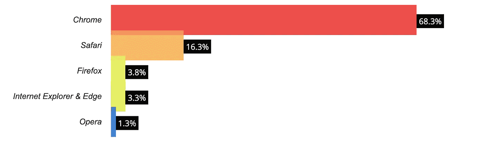

# 如何设计网页浏览器——这真的重要吗？

> 原文：<https://javascript.plainenglish.io/how-to-design-with-web-browsers-in-mind-does-it-really-matter-7f61c0b8c116?source=collection_archive---------3----------------------->

## 回顾哪种浏览器最受欢迎，以及如何优化您的网页以适应所有用户


Photo by [Domenico Loia](https://unsplash.com/@domenicoloia?utm_source=medium&utm_medium=referral) on [Unsplash](https://unsplash.com?utm_source=medium&utm_medium=referral)

你有没有想过人们浏览内容的浏览器是否会影响他们与内容的交互方式？总之，答案是肯定的。

每个 web 浏览器解析 HTML/CSS 文件内容的方式都略有不同。根据您编写的代码，这有时会导致意想不到的结果。

近年来，随着移动用户的增加和可用浏览器选项的增加，这种变化显著增加。

这篇文章将先看看不同的 web 浏览器使用统计，然后再回顾为什么这很重要，以及哪些资源可以帮助提供跨所有平台的正常工作的 web 页面。

# 最常用的浏览器是什么？

作为一个喜欢数据的人，我觉得这个问题最好用一张图表来回答——准确地说是两张图表。

下图描述了对最近调查的回应，这些调查询问人们在访问网络内容时使用哪种浏览器，它们显示了有趣的结果。



Desktop browser distribution from [W3Counter](https://www.w3counter.com/globalstats.php?year=2022&month=6)


Mobile browser distribution from [statcounter](https://gs.statcounter.com/browser-market-share/mobile-tablet/worldwide/#monthly-202106-202206-bar)

在这两个案例中，Chrome 都是市场的主导者。然而，大约 30%的移动和桌面用户正在使用不同的东西。桌面市场被其他几个选项所分割，而移动市场有更多的竞争浏览器。

考虑这一点很重要，因为即使你的网站在 Chrome 上运行良好，但如果它与其他浏览器不兼容，你就会疏远很大一部分原本可能成为潜在客户的市场。

# 为什么人们使用什么浏览器很重要？

个人使用的浏览器会在几个方面影响内容的显示方式:

*   **默认属性**
    在没有定义属性的情况下，每个浏览器都有一个应用于该内容的样式表。如果您还记得您第一次学习并编写没有 CSS 样式表的 HTML 代码时，您可能还记得浏览器仍然使用一些基本样式显示内容，给标题指定某种字体或文本大小。这些默认值因浏览器而异，因此如果您依赖默认属性，内容可能会有所不同。
*   **支持的属性**
    除了默认属性，并不是所有的浏览器都支持所有的 CSS 特性。至于他们支持哪些功能，这取决于浏览器和浏览器版本。当一个新的 CSS 特性推出时，公司通常需要一段时间来采用它，或者只在他们的最新版本中采用它。在不支持该属性的情况下，浏览器将显示该属性的默认属性，这会对您的样式产生很大影响

# 如何才能保证兼容性？

有很多资源可以用来预先检查特定的属性/元素将如何出现在屏幕上。利用这些以及一些前瞻性的设计技术将极大地提高网站的跨浏览器兼容性。

## **1。检查默认属性，如果有疑问，应用通用样式**

如果你想检查浏览器将应用的默认样式,“浏览器默认样式”web 资源是一个很好的起点。它完全按照您的预期工作，并返回您搜索的 HTML 元素的默认样式(按浏览器类型拆分)。

[](https://browserdefaultstyles.com/) [## 浏览器默认样式

### 从所有主要的渲染引擎(WebKit、Blink、Gecko 等)中搜索标准化和默认样式的任何元素

browserdefaultstyles.com](https://browserdefaultstyles.com/) 

如果您希望覆盖或标准化这种差异，可以通过在 CSS 文件的开头添加一个通用声明来实现。例如，以下是我的首选:

```
* {
    margin: 0;
    padding: 0;
    box-sizing: border-box;
  }
```

## **2。使用新的 CSS 属性时，检查它是否受支持**

当使用一个你以前没有使用过的 CSS 属性时，明智的做法是检查它是否被所有主流浏览器所支持。虽然这听起来像一个复杂的过程，这就是“我可以使用”的由来。他们的网站允许你搜索任何 HTML 或 CSS 属性，并输出支持它的浏览器(和浏览器版本)列表。

 [## 我可以使用 HTML5、CSS3 等的支持表吗

### 测试功能我们与 BrowserStack 的合作现在可以让您测试您的网站在 2，000 多个真实的…

caniuse.com](https://caniuse.com/) 

例如，如果你有任何关于`nth-child`选择器的样式，快速检查一下就会发现 IE 不支持它们。

## **3。利用 webkits 开发可能不完全受支持的新功能**

当使用 CSS 时,`-webkit`前缀用于常规 web 浏览器没有正式实现的属性。不同的浏览器使用不同的方法来加载内容，因此有许多不同的类型。

所有“webkit”扩展都以相同的语法开始，这取决于它们所使用的浏览器:

*   `-webkit-`针对 Chrome、Safari、新版 Opera，以及几乎所有 iOS 浏览器，包括 iOS 版火狐
*   `-moz-`针对火狐
*   `-ms-`适用于 ie 浏览器和微软 Edge
*   `-o-`对于 WebKit 之前的旧版本 Opera

如果使用不支持的功能，您应该确保为上述每种浏览器类型列出一个 webkit 选项，以确保一致性。

## **4。设置回退属性以最小化变化**

如果您确实想使用某个属性，但它并不是所有浏览器都支持，那么请确保列出了一个后备属性。

CSS 是从上到下读取的，因此要添加一个后备参数，你需要在 main 选项上面写一个重复的 CSS 声明。在较低的选项不适用的情况下，将使用最高的选项

```
div {
   background-color: /*fallback color*/
   background-color: /*main color*/
    }
```

## **5。在发布之前，在多个浏览器中查看您的内容**

最后，一旦你完成了网站的创建，在发布之前一定要在所有不同的浏览器中进行测试，找出任何不一致的地方。这应该是避免项目完成后过多返工的最后措施，但却是该过程中的重要一步。

# 摘要

虽然 Chrome 是最常用的浏览器，占所有互联网流量的 70%左右，但重要的是在设计时要考虑到所有浏览器，以确保所有潜在用户/客户都能正确地与您的网站进行交互。有很多很棒的资源可以用来检查所有浏览器中的默认和支持的属性，每当使用一个新特性时，都推荐使用它们。大多数挑战将来自 IE，它支持最少的功能，因此在这种情况下，利用后备属性和 webkits 会有所帮助。

我希望这篇文章对你有用，如果有什么不清楚的地方或者你觉得遗漏了什么，请告诉我🙂

*感谢阅读！如果你喜欢这个帖子并想阅读更多，请务必查看我的个人资料或* [*订阅*](https://medium.com/subscribe/@simply_stef) *获取类似的帖子。*

*订阅 Medium，无限获取所有可用的内容和想法。如果你通过这个链接加入 Medium，我会从你的费用中收取很少的一部分——而且不会花你任何额外的费用！*

*更多内容请看*[***plain English . io***](https://plainenglish.io/)*。报名参加我们的* [***免费周报***](http://newsletter.plainenglish.io/) *。关注我们关于*[***Twitter***](https://twitter.com/inPlainEngHQ)**和*[***LinkedIn***](https://www.linkedin.com/company/inplainenglish/)*。查看我们的* [***社区不和谐***](https://discord.gg/GtDtUAvyhW) *加入我们的* [***人才集体***](https://inplainenglish.pallet.com/talent/welcome) *。**