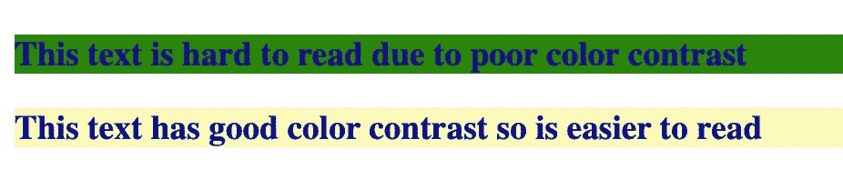

# 如何在设计网站时考虑到可访问性

> 原文：<https://javascript.plainenglish.io/how-to-design-your-website-with-accessibility-in-mind-a6d80e8ddedf?source=collection_archive---------12----------------------->


Unlocking the key to Accessible Web Design — Image by [Daniel Ali](https://unsplash.com/@untodesign_) via Unsplash

在规划一个新网站时，可访问性可能不是你首先想到的，但它是做好的最重要的事情之一。如果做得好，一个易访问的设计很可能会被忽视——但是如果做得不好，它会激怒用户，使你的网站无法使用！

下面我列出了一些在设计下一个项目之前需要考虑的关键领域。

# 彩色选择

如果您选择的颜色缺乏足够的对比度，任何内容都将变得难以阅读，尤其是对于有视觉障碍的用户。

这里有一个惊人的资源是 [WebAIM 对比度检查器](https://webaim.org/resources/contrastchecker/)。这个网站允许你选择背景和前景色的组合，并会告诉你是否有足够的对比度。



Example of the Impact color selection can have on Readability

尝试各种颜色组合以及考虑某些选择对色盲用户的影响是很重要的。

# 字体大小

当在页面上放置任何文本时，它需要以一种清晰的方式显示。毕竟，如果没人能读懂，为什么还要写呢？

有许多参数可以用来控制这一点:字体类型，字体大小，字母间距，行距等。

首先，你应该确保选择的字体适合不同的屏幕尺寸。一种方法是设置你的字体使用[相对大小](https://www.w3schools.com/cssref/css_units.asp)(例如使用“1.5 雷姆”作为参数，而不是“20px”)。从那里你可以创建一些媒体查询来优化基本单元和控制整个网站的规模。

虽然看起来很难知道使用哪种间距或大小，但是[网站内容可访问性指南(WCAG)](https://www.w3.org/TR/2008/REC-WCAG20-20081211/#visual-audio-contrast-visual-presentation) 为所有这些规定了标准——比如字体大小超过 18px，行距为 1.5。

 [## 网站内容可访问性指南(WCAG) 2.0

### 本节是规范性的。单词、短语或名称的缩写形式，其中缩写没有变成…

www.w3.or](https://www.w3.org/TR/2008/REC-WCAG20-20081211/) 

# 直觉互动

当滚动网页时，有很多方法可以让设计变得直观。如果我们看到一段蓝色的带下划线的文字，我们的大脑会联想到一个链接，所以会尝试点击它。如果我们的光标悬停在一个框上并变成指针，我们会感觉到它应该是可点击的内容。在设计网站时利用这些直觉反应是很重要的，这样用户在搜索链接时就不会感到沮丧。


Using standard formatting allows users to be more confident in knowing where links might be located in the text.

另一种实现方式是使用“::focus”状态来显示哪个字段当前是活动的。这对不用鼠标导航的用户很有帮助。您还可以设置状态，以便在输入字段填写错误时发出错误或警告。

# 页面结构

你如何组织内容对理解内容的难易程度有很大影响。确保适当的标题流(从 h1 开始，向下到 h6 ),可以让用户知道他们何时进入新的部分，或者下一段是否是上一段的子部分。

文本的布局也很重要。作为一个曾经喜欢对齐内容的人，这实际上是你应该最后选择的对齐方法，因为不均匀的单词间距会使阅读内容变得困难。

作为一个标准，在你的网站上发布文本时，你的目标应该是每行 45-85 个字符(在 WCAG 规定——链接在上面的部分)。为了实现这一点，你可以使用“ch”单位来保持每行的最佳文本，即使你的网站被缩放。

# 替代文本

替代文本为有视觉障碍的用户提供了图像的上下文。在 Alt 文本字段中填充一些东西总是很重要的，这样屏幕阅读器和有视觉障碍的用户才能充分享受你的站点。这是通过在 HTML 代码中添加 alt 属性来实现的:

```

```

使用的文字应该简洁，应该清楚地解释图像。如果图像内容不重要或无法解释，使用空格(" ")让使用替代文本的读者知道描述没有被忘记。

# 语言设置

这似乎是一个小问题，但是在 HTML 中声明你使用哪种语言是很重要的。这使得浏览器(或任何辅助设备，如屏幕阅读器)知道网站是用哪种语言编写的。

```
<!DOCTYPE HTML>
<HTML lang="en">
```

这个声明应该总是在 HTML 标记中，而不是在 Body 标记中，以便包含对部分中任何元数据的解析。

# 打印设置

我相信你一定遇到过这样的网页，尽管它们在屏幕上很容易浏览，但当你试图打印它们时，内容却变得难以辨认。大的侧边栏或标题填满了打印区域，遮住了您真正想看的内容。

可以编写“media print”查询来删除不需要的元素，并确保只解析可打印的内容。例如，您可以设置查询来删除侧边栏、导航链接，甚至显示页面上引用的链接源。

*我真的希望这篇文章对你有所帮助。如果你有兴趣将这些应用到你的项目中，我强烈推荐你查看下面 A11y Coffee 页面的链接，它详细介绍了让你的网站更易访问的各种方法。*

[](https://a11y.coffee/start-testing/) [## 开始测试网页可访问性

### 对各种易访问性测试工具的简单介绍。边喝咖啡(或其他东西)边做一些审计…

a11y .咖啡](https://a11y.coffee/start-testing/) 

> 如果你喜欢这篇文章并想阅读更多，一定要查看我的类似文章。考虑成为一个媒体成员，以获得无限的接触最好的想法和作家。
> 
> [**如果你通过这个链接加入 Medium，我会从你的费用中收取很少的一部分——而且不会花你任何额外的钱！提前感谢。**](https://medium.com/@simply_stef/membership) **💰**
> 
> *感谢阅读！*

*更多内容看* [***说白了。报名参加我们的***](https://plainenglish.io/) **[***免费周报***](http://newsletter.plainenglish.io/) *。关注我们关于*[***Twitter***](https://twitter.com/inPlainEngHQ)*和*[***LinkedIn***](https://www.linkedin.com/company/inplainenglish/)*。加入我们的* [***社区不和谐***](https://discord.gg/GtDtUAvyhW) *。***