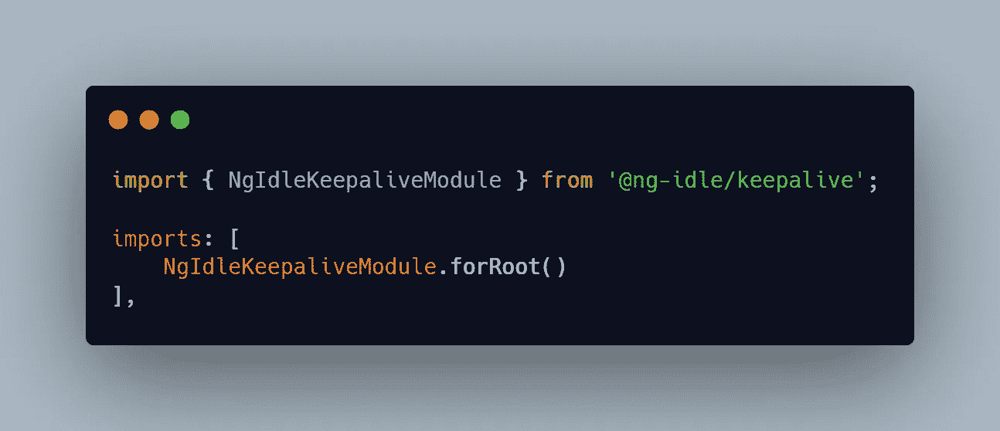
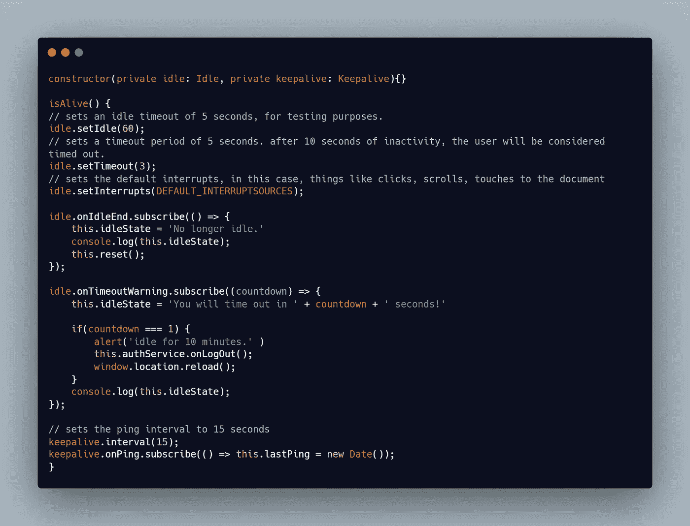

# 如何在 JavaScript 中检测空闲时间

> 原文：<https://javascript.plainenglish.io/how-to-detect-idle-time-in-javascript-9b517f3881ff?source=collection_archive---------6----------------------->


空闲时间是用户不与网站交互的时间。这种交互可以是移动鼠标、点击页面或使用键盘。可以检测到这个时间来执行可能在某一段不活动时间之后发生的某些事件。

经过一番研究，我得到了一个用于跟踪 angular 中空闲时间的包。

## Ng 空闲内核

Angular 应用程序中响应空闲用户的模块。这是对 [ng-idle 模块](https://github.com/moribvndvs/ng-idle)的重写；但是，如果使用 Angular 1，则必须使用该模块。

```
npm install --save @ng-idle/core
```

## Ng 空闲保持活动

```
npm install --save @ng-idle/keepalive
```

在您的模块中



在你的角度分量中



最后，它跟踪应用程序的不活动状态。经过一段时间的不活动浏览器打开一个警告框，注销应用程序。

`@ng-idle`通过 [npm](https://www.npmjs.com/) 发货。对于最新支持的 Angular 版本，您可以使用以下命令安装该软件包:

```
npm install --save @ng-idle/core
```

将包集成和配置到您的应用程序中还需要几个步骤。请访问 [@ng-idle-example](https://github.com/moribvndvs/ng2-idle-example.git) 获取源代码和如何开始的说明。

## 设计考虑

该模块的主要应用是检测用户何时空闲。它还可以用来警告用户即将超时，然后让他们超时。这个模块的核心是`Idle`服务，它根据您的配置尽力检测用户是活动的还是空闲的，并将信息传递给您的应用程序，以便它能够做出适当的响应。

## 模块化

核心功能可以通过 [npm](https://www.npmjs.com/) 在`@ng-idle/core`包中找到。

扩展功能的附加模块:

*   `@ng-idle/keepalive`(见下文)

## 可扩展保活集成

在用于会话管理的常见用例中，您可能需要定期向服务器发送信号，告知用户仍处于登录和活动状态。如果您需要该功能，`@ng-idle`可以选择将**与`@ng-idle/keepalive`集成。`@ng-idle`会指示`@ng-idle/keepalive`在用户活动时 ping，一旦用户空闲或超时就停止。当用户恢复活动或空闲状态被重置时，它将立即 ping，然后恢复 ping。**请注意**keepalive 集成是可选的，您必须单独安装和配置`@ng-idle/keepalive`才能获得此功能。您可以通过扩展`KeepaliveSvc`并将其配置为应用程序中`KeepaliveSvc`类的提供者来实现您自己的。**

## 可扩展中断

中断是任何输入源(通常来自用户，但也可能是其他标签或事件),可用于向`Idle`发送信号，指示空闲手表应被中断或重置。不像`ng-idle`，这些源码不是硬编码的；您可以扩展`InterruptSource`或任何内置的源代码来满足您的需求。该特性对于处理可能困扰您的特定用例的输入噪声也很有用。它还可以用于定位页面上的特定元素，而不是整个文档或窗口。该软件包内置了以下资源:

*   `InterruptSource`(摘要):一个你可以实现自己的源码的基类。
*   `EventTargetInterruptSource`:任何实现`EventTarget`的对象，如`HTMLElement`或`Window`。接受作为源的对象和一个空格分隔的字符串，该字符串包含导致中断的事件。
*   `DocumentInterruptSource`:查找冒泡到`document.documentElement` ( `html`节点)的事件(在空格分隔的字符串中)。
*   `WindowInterruptSource`:查找冒泡到`Window`的事件(在空格分隔的字符串中)。
*   `StorageInterruptSource`:只查找`Window`对象的`Storage`事件。`LocalStorageExpiry`必备。

**注意**:初始化应用程序时，您必须自己配置源代码。默认情况下，不会配置中断。您可以通过导入`DEFAULT_INTERRUPTSOURCES`并将该引用传递给`Idle.setInterrupts(DEFAULT_INTERRUPTSOURCES);`来使用类似于默认`ng-idle`的配置。

## 可延期到期

从`ng-idle`移植的另一个特性是能够在一些存储中存储到期值，运行相同应用程序的多个标签或窗口可以写入。一般来说，这家店是`localStorage`，但也可能是饼干或任何你想要的东西。此到期和到期存储的目的有两个:第一，防止窗口在休眠或暂停时间超过配置的超时时间时不超时。第二，可以使用它来防止同一应用程序中的其他标签或窗口超时。

默认情况下，提供了一个`LocalStorageExpiry`类型，它只跟踪本地存储中的到期时间。它将实现上述所有目的。如果不想支持多个标签页或窗口，可以使用`SimpleExpiry`。换句话说，`SimpleExpiry`不协调选项卡或窗口之间的最后活动。如果您想将到期值存储在另一个存储中，如 cookies，您需要使用或创建一个支持它的实现。您可以通过扩展`IdleExpiry`或`SimpleExpiry`并将其配置为`IdleExpiry`类的提供者来创建自己的。

## 多空闲实例支持

Angular 中的依赖注入器支持分层注入策略。这允许您在任何需要的范围内创建一个`Idle`的实例，并且可以有多个实例。这允许你两个有两个单独的手表，例如，在页面上的两个不同的元素。
如果您使用默认到期日(`LocalStorageExpiry`)，您将需要使用`Idle.setIdleName('yourIdleName')`为每个空闲定义一个名称，否则，相同的密钥将被用于本地存储，该功能将无法按预期工作。

## 示例使用案例

例如，考虑电子邮件应用程序。为了提高安全性，应用程序可能希望确定用户何时处于非活动状态，并注销他们，如果他们仍然在计算机前，只是分心了，则给他们一个延长会话的机会。此外，为了获得更好的安全性，服务器可能会向用户的会话颁发一个安全令牌，该令牌会在用户处于非活动状态 5 分钟后过期。用户可能要花更多的时间来打出并发送他们的电子邮件。当你正在使用软件的时候，发现自己被注销了，这是一件令人沮丧的事情！

`@ng-idle/core`可以检测到用户正在点击、打字、触摸、滚动等。并且知道用户仍然是活跃的。它可以与`@ng-idle/keepalive`合作，每隔几分钟 ping 一次服务器，以保持他们登录。在这种情况下，只要用户在做什么，他们就保持登录状态。如果他们离开电脑，我们可以显示一个警告对话框，然后在倒计时后，让他们退出。[求更](https://www.npmjs.com/package/@ng-idle/core)

*更多内容看* [***说白了就是***](https://plainenglish.io/) *。报名参加我们的* [***免费周报***](http://newsletter.plainenglish.io/) *。关注我们关于* [***推特***](https://twitter.com/inPlainEngHQ) ， [***领英***](https://www.linkedin.com/company/inplainenglish/) ***，***[***YouTube***](https://www.youtube.com/channel/UCtipWUghju290NWcn8jhyAw)***，以及****[***不和***](https://discord.gg/GtDtUAvyhW) *对成长黑客感兴趣？检查出* [***电路***](https://circuit.ooo/) ***。****