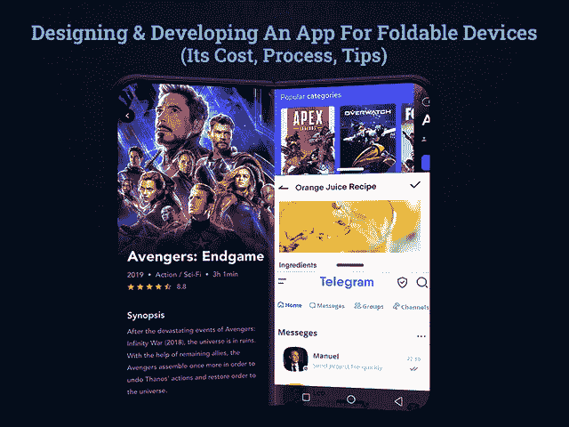
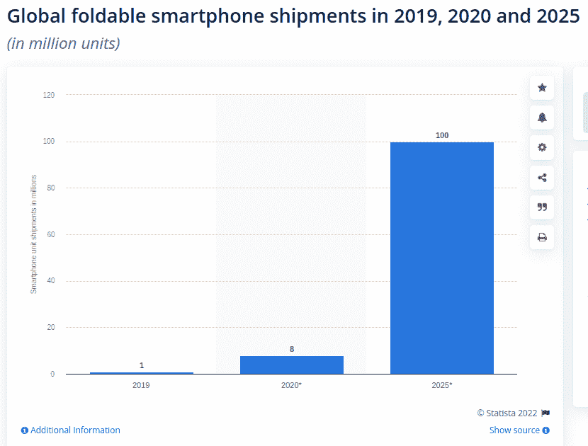

# 如何为可折叠设备开发移动应用程序:流程、功能和技术规范

> 原文：<https://javascript.plainenglish.io/how-to-develop-a-mobile-app-for-foldable-devices-its-process-functionalities-technical-ecebb000bab7?source=collection_archive---------13----------------------->

## 如何开发一款可折叠智能手机的手机 App？

像市场的其他技术领域一样，应用开发行业也在快速发展。你知道这个市场逐渐增长背后的原因吗？只有不断增长的客户需求和新兴技术才继续影响着移动应用的发展趋势。因此，如果你也计划成为这个蓬勃发展的行业的一部分，那么你需要继续把握市场的脉搏。

随着即将到来的智能手机行业的快速转型和不断变化的显示技术，是时候关注新的机遇了。

可折叠设备的市场规模在 2018 年为 6500 万美元，预计将增长 75%，并在 2025 年达到 180 亿美元，可以说可折叠设备将在 2022 年迅速好转。

想知道可折叠设备如何彻底改变市场吗？在你相信可折叠设备是迅速征服世界的新事物这一事实之前，你需要明白可折叠设备从未从市场上淡出。

这一次，他们再次出击，动摇了移动应用开发行业的根基。因此，这是科技创业公司不得不重新思考 app 开发解决方案的时候了。

然而，想知道为可折叠设备开发应用程序对你的企业来说是否是一个值得的决定？如果是，那么我们已经为您收集了所有信息。让我们直接进入博客的关键亮点:

## 您的目录:

*   *市场统计:为什么开发一款可折叠的移动应用是有价值的？*
*   *可折叠手机的状态:衡量对开发过程的影响*
*   *为多屏设备开发移动应用时需要考虑的因素？*
*   *如何开发一款可折叠设备的 App？
    -可折叠手机需要考虑的 UI/UX 设计方面
    -可折叠设备的技术准备*
*   *为可折叠设备创建一个移动应用需要多少成本？*
*   *结论:让你的应用程序可以在多个屏幕上运行*

为了更好地理解，让我们深入了解每一点，以便更好地理解…

## **市场统计:为什么开发可折叠的移动应用是有价值的？**

尽管有太多的设备可用，但可折叠设备正在大胆地为移动行业铺平道路。而且，说可折叠智能手机从未消亡也不会错。他们已经在那里，但这一次，他们已经开始采取重大步骤。无论你已经做了一个多么辉煌的 app，你都需要雇佣一个 [**的手机 app 开发公司**](https://www.xicom.biz/services/mobile-app-development/) 。是时候重新思考一下，让它适应多屏尺寸了。当我们谈论可折叠设备时，它们与传统手机完全不同。大屏幕要求应用程序能够毫无麻烦地从覆盖屏幕快速过渡到全屏。我明白，你们大多数人都想知道投资一个应用程序是否合乎逻辑，所以我的答案是肯定的。

> 你不必相信我们的话。在这里，我们收集了一些资料，帮助你理解让你的应用为可折叠设备做好准备的重要性。

*   根据调查，到 2025 年，可折叠显示市场的智能手机和平板电脑预计将见证 [63.2%的增长率。](https://www.gminsights.com/industry-analysis/foldable-display-market)
*   2017 年全球可折叠市场价值 9100 万美元，预计到 2027 年底将达到[15.494 亿美元。](https://www.marketresearchfuture.com/reports/foldable-display-market-7675)
*   可折叠智能手机出货量的分析预计将从 2019 年的 100 万部转移到 2022 年的全球 5010 万部。

[Image Source](https://www.statista.com/statistics/1101618/global-foldable-smartphone-shipments/)

这些统计数据肯定会帮助你理解可折叠手机是如何快速进入市场的。然而，问题是什么让他们如此苛求？

普通智能手机用户花 92%的移动时间浏览移动应用。平均每个人一个月使用 30 多个应用程序。

也就是说，从所有这些统计数据和事实中可以得出结论，智能手机设备和移动应用程序现在已经成为现代生活的必需品。由于行业正在从传统的智能手机转向多屏，是时候让你的应用适应这些屏幕尺寸了。

*但问题是如何开始应用程序开发流程及其对应用程序开发的影响？*

## **可折叠手机的状态:衡量对开发过程的影响**

可折叠设备改变了创建应用程序的场景。它提供了尝试新事物的完整途径，使您能够抓住用户的注意力并确保出色的体验。你所需要的就是 [**雇佣一个移动应用开发者**](https://www.xicom.biz/offerings/hire-mobile-developers/) 来帮你把应用的想法转化成一个完美的解决方案。由于可折叠设备为你提供了不同的屏幕来试验全新的想法，因此，开发者有更好的机会为用户提供一些令人印象深刻的东西。

但是，理解一个为单屏开发的 app 和“如何把 app 从盖屏调整到全屏”完全是两码事？

> 这里有一些创新的技巧和见解，可以帮助你思考开箱即用的应用程序开发选项。

*   **银行应用**:可折叠设备让你可以全屏打开多个窗口。所以只要想想在多窗口的 app 屏幕中打开多个账户信息会有多方便。你不需要在屏幕之间切换来获取信息。
*   新闻和商务应用:商务应用具有多种功能，如阅读电子邮件、文档等。因此，可折叠设备将帮助您在同一个屏幕上打开多个窗口。
*   **日历应用:**允许用户在一个地方访问整个月份，而不是只提供访问一周的选项。
*   **游戏应用/流媒体应用:**由于屏幕尺寸更宽，可折叠手机可以确保更好的质量和分辨率。用户总是乐于在更大的屏幕上观看视频。

如果你已经掌握了为可折叠设备开发应用程序的口头禅，你一定很想知道如何开始应用程序开发过程。在此之前，让我们评估一下开发可折叠设备应用程序的一些因素…

# **为多屏设备开发移动应用时需要考虑的因素**

可折叠设备旨在浏览应用程序时提供出色而灵活的用户体验。展开屏幕可能会改变应用程序对用户的影响。当然，在流媒体应用程序中访问视频内容，在更大的屏幕上使用商业应用程序的丰富功能会更令人印象深刻。有了多窗口，多任务处理变得更加容易和愉快。但是你确定从覆盖屏幕切换到全屏是没有瑕疵的吗？

为了让它顺利工作，我们在这里向您解释一些在开发可折叠设备应用程序时需要记住的因素:

*   **App 开发质量是关键要素**

如果你最终决定为可折叠设备开发一款应用，请记住质量高于一切。可折叠设备可能会有多个方向，但用户总是希望应用程序的质量。你可以 [**雇佣一个应用程序开发人员**](https://www.xicom.biz/solutions/hire-developers/) 来确保无与伦比的质量解决方案，因为他们总是喜欢提供无瑕疵、无故障质量的应用程序。一个能在多个屏幕间流畅运行的应用是用户真正的期望。为可折叠设备开发应用程序意味着你的应用程序应该能够适应不同的屏幕尺寸。

*   **测试次数**

可折叠手机刚刚开始这场游戏，有许多不同型号的手机将很快进入智能手机市场。因此，请确保你雇佣的应用程序开发团队能够处理大量的测试案例。在不同的平台上测试它将解决您在开发具有多窗口应用配置的应用时可能遇到的问题。

和可折叠手机真正不同的一个因素是需要支持多屏比例。因此，开发者的选择非常有限，他们必须支持至少两种分辨率——展开和折叠。如果他们希望超出这个范围，那么就计划支持应用程序的旋转方向。

*   **广泛收集反馈**

为可折叠设备创建成功的移动应用的关键是考虑用户的扩展反馈收集。因为你正在将传统的应用程序开发过程带入一个全新的空间。因此，做好面对大量反馈的准备。考虑并解决每一个问题将有助于您成功地适应应用程序中的变化。

为可折叠设备创建应用程序的整体做法将增加应用程序开发时间和成本。你的下一个关注点肯定是了解实际的应用程序开发成本。但是在深入研究应用程序开发成本之前，让我们先了解一下到底是什么因素促成了应用程序开发过程。

## **如何开发一款可折叠设备的 App？**

当谈到为可折叠设备创建移动应用程序时，您需要考虑两种方式。应用程序的技术细节和用户界面/UX 设计。为了便于理解，我们将开发过程分为两个部分。

*   *可折叠手机的用户界面/UX 设计考虑因素*
*   *可折叠设备的技术准备*

让我们深入了解一下它在应用程序开发过程中到底涉及到什么…

> **可折叠手机的用户界面/UX 设计考虑因素**

## **1。兼容两种状态和屏幕**

对于不可折叠的设备，只有一个标准的屏幕尺寸，您需要在应用程序开发中考虑。但是，当用户同时并排使用双屏时，可折叠屏幕就会出现。因此，真正的挑战是设计一个与双屏幕具有相同特性和功能的应用程序，自动调整屏幕的折叠和展开转换。你可以 [**雇佣移动应用开发者**](https://www.xicom.biz/offerings/hire-mobile-developers/) ，他们了解需求，能够配置可折叠设备中不可避免的变化。设计可折叠设备的一个专业技巧是使用 FoldingFeatureClass，它可以直接检查以下状态:

*   状态 _ 平面
*   状态 _ 半开

## **2。添加对多窗口的支持**

当用户访问可折叠手机时，提供对多屏的支持是重要的功能之一。早期的用户被限制在可折叠设备上使用两个应用程序，这是主要的缺点。最重要的是，他们必须从两个应用程序中选择一个保持活动，而另一个则被暂停。然而，随着可折叠手机的推出，人们可以在同一个屏幕上运行三个以上的应用程序，而不会让其他应用程序暂停。只有在您的应用程序中添加了多屏支持并允许拖放功能时，这才是可能的。

## **3。关注屏幕连续性**

正如我们反复说过的，应用程序从单一折叠到可展开屏幕的过渡必须完美无缺。这是确保出色用户体验的唯一方法。用户应该在屏幕上有相同的体验，并应对应用程序的屏幕流发生的最小变化。因此，请确保该应用程序将确保从一个屏幕状态到另一个屏幕状态的完美过渡。那么，你会怎么做呢？

这里有两件事要记住:

*   让开发者通过动态调整大小来调整应用的大小。
*   设置 resizeableActivity=true

但是，如果你错过了这一步，那么你可以找到一个可以自动调整应用程序大小的系统。虽然这是一种确保应用程序连续性的简单方法，但它不能保证正确的大小、纵横比和配置。

> **可折叠设备的技术准备**

## **1。使您的应用程序响应迅速或可调整大小**

在开始应用程序开发过程之前，进行适当的研究和分析是值得的。它将帮助您了解如何创建一个与可折叠手机兼容的应用程序。

在响应时代，需要发明不同的数字设备，开发人员将不得不在相同的基础上工作，以使您的应用程序适用于可折叠设备。

确保每个应用程序必须与多窗口显示兼容，以向用户提供积极的体验。也可以选择**租用一个 app** 开发公司在 app 中设置***" resizableActivity = false "***。它将不再支持多窗口模式。主要需要关注的是字体和其他设计相关元素的调整。对于双屏，你需要放大大屏幕的字体，反之亦然。

## **2。添加不同的屏幕比例**

在可折叠设备的情况下，应用程序的屏幕大小可以从 1.1 到 21.9 不等。你只需要考虑尽可能多的设备。测试应用程序的各种屏幕比例，从 1:1、3:2、4:3、5:3、16:10、16:9、21:1、21:9 等。这将帮助您使您的应用程序适应可折叠设备。

可折叠智能手机的外形可能取决于您选择的设备类型。一些设备推出了更薄、更长、非常高的屏幕。而其余设备可能以更大更短的屏幕为特征。你只需要让你的应用程序兼容尽可能多的设备，以提供无缝的用户体验。

## **3。多窗口支持**

而谷歌已经把同时运行两个应用程序变成了惯例。那么在开发可折叠设备的 app 时，还需要注意什么呢？嗯，可折叠技术带来了访问更多应用程序的灵活性。你可以在同一个屏幕上同时运行三个甚至更多的应用，而无需暂停任何应用。此外，用户可以通过保持另一个用户活动来彼此共享内容。

为了使该功能在可折叠设备上工作，您需要选择加入多简历功能，该功能跟随要添加的清单元数据-

该命令将帮助您在手机应用程序中轻松实现多窗口支持。事实上，它可以让你获得不间断的体验。

*这些是你在开发可折叠设备应用时需要记住的几件必要的事情。但我敢肯定，你最关心的问题一定是——“为可折叠设备开发一个应用要花多少钱”？*

## **为可折叠设备创建一个移动应用需要多少成本？**

毫无疑问，为可折叠设备创建一个应用程序的成本是昂贵的，但是，多少钱呢？

要估算为多屏设备创建一个应用程序的成本，首先需要了解到底是什么影响了应用程序的开发成本。

一般来说，影响应用程序开发成本的主要因素是应用程序的复杂性、特性和功能。除了操作系统的选择，应用程序开发人员的每小时成本也影响应用程序开发成本。综合所有这些因素，创建一个应用程序的平均成本将达到 20，000 到 25，000 多美元，具体取决于业务需求。然而，为可折叠设备创建一个应用程序的成本几乎是单屏应用程序的两倍。

可折叠设备包括双屏功能。因此，需要大量的设计、开发和测试工作。更复杂的业务需求将导致更高的开发时间和成本。

这只是一个估计，所以应用程序开发的价格可以根据需要更高或更低。为了得到真实的估计，有必要向专家预约一个免费的咨询时段。

## **结论:让你的应用程序可以在多个屏幕上运行**

为可折叠设备开发应用是一项复杂的任务，但实施起来并不陌生。这一切都是为了测试开发者的技能和创造力，看看他们能在多大程度上发挥这些应用的功能。它们与可折叠设备的协调性。虽然可折叠设备是移动技术领域的一项新发明，但雇佣一家 [**移动应用程序开发公司**](https://www.xicom.biz/services/mobile-app-development/) 来让你的应用程序为这种新奇做好准备是有意义的。

而可折叠设备的特征与传统设备完全不同。因此，值得寻找专家，使您能够相应地重新设计开发过程。通过采取这些必要的行动，包括最大限度的测试和接收用户反馈，你可以轻松地构建一个与可折叠设备兼容的成功应用。

====================================

*更多内容请看*[*plain English . io*](http://plainenglish.io/)*。报名参加我们的* [*免费周报*](http://newsletter.plainenglish.io/) *。在我们的* [*社区获得独家写作机会和建议*](https://discord.gg/GtDtUAvyhW) *。*