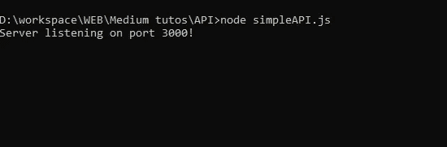
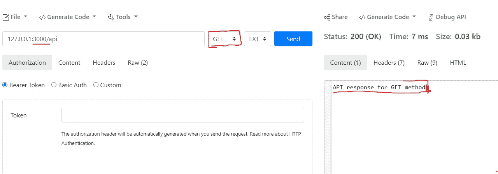
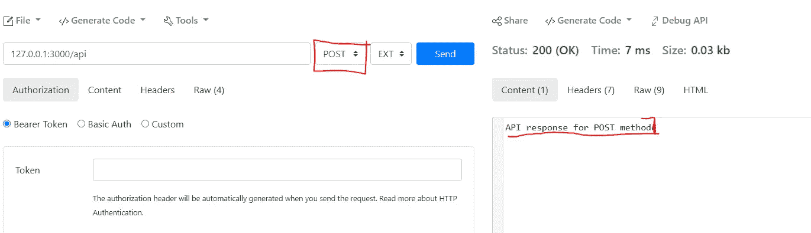

# 如何用 Node.js 和 Express 开发自己的 API

> 原文：<https://javascript.plainenglish.io/how-to-develop-your-own-api-with-node-js-and-express-25d4000564af?source=collection_archive---------9----------------------->

## 使用 Node.js 和 Express 从头开始设置自己的 API 的分步指南。

在本教程中，您将学习如何从头开始建立自己的 API。我将一步一步地指导你，到本教程结束时，你将能够基于 Node.js 和 Express 开发自己的 API。


Photo by [Ian Battaglia](https://unsplash.com/@ianjbattaglia?utm_source=medium&utm_medium=referral) on [Unsplash](https://unsplash.com?utm_source=medium&utm_medium=referral)

# 什么是 API？

API 代表应用程序编程接口。它是 web 应用程序的后端，通常运行在服务器上。API 总是用来为你的前端服务，也可以作为第三方集成的接口。API 由一组服务组成，用于获取数据或将数据推送到后端服务器。

# 你需要什么？

首先，您需要安装 Node.js，您按照以下链接中的说明进行操作:

[](https://nodejs.org/en/download/) [## 下载| Node.js

### Node.js 是基于 Chrome 的 V8 JavaScript 引擎构建的 JavaScript 运行时。

nodejs.org](https://nodejs.org/en/download/) 

现在，因为我们将使用 Express，所以我们必须安装它，但是什么是 Express 呢？

***"Express.js*** *，或者简称为* ***Express*** *，是一个* [*后端*](https://en.wikipedia.org/wiki/Front_end_and_back_end)*[*web 应用框架*](https://en.wikipedia.org/wiki/Web_application_framework) *为*[*node . js*](https://en.wikipedia.org/wiki/Node.js)*，发布为* [*免费开放它是为构建*](https://en.wikipedia.org/wiki/Free_and_open-source_software) [*web 应用*](https://en.wikipedia.org/wiki/Web_application) *和*[*API*](https://en.wikipedia.org/wiki/API)*而设计的。*[](https://en.wikipedia.org/wiki/Express.js#cite_note-ExpressJS-3)**它被称为* [*事实上的标准*](https://en.wikipedia.org/wiki/De_facto_standard) *服务器框架为*[*node . js*](https://en.wikipedia.org/wiki/Node.js)*。”——维基百科***

**要安装 Express:**

```
**npm install express --save**
```

**这就是你现在所需要的！**

# **编码时间！(您自己的 API)**

**在下面的例子中，我们将设置一个 API 来捕捉 HTTP POST 和 GET，并简单地返回一条消息，看看它是否工作。**

**在第一部分中，我们加载 Express 模块，然后创建服务器并指定服务器将监听的端口。**

**在第二部分:**

```
**// Test HTTP GET Method 
server.get('/api/', (req, res) => {  return res.send('API response for GET method');});**
```

**在第二部分:**

**使用这段代码，如果一个 GET 请求通过" <server ip="">/api/"发送，它将被捕获，服务器将响应:" api 对 GET 方法的响应"</server>**

**对于 POST 请求也是如此。**

**最后一部分是开始倾听，通过以下方式完成:**

```
**// Start the server
server.listen(port, () =>  console.log(`Server listening on port ${port}!`),);**
```

**port:是服务器将要监听的端口(上面设置为 3000)。**

**现在，您必须使用以下命令执行代码:**

```
**node simpleAPI.js**
```

**js:是我编写服务器代码的脚本文件。**

**结果是:**

****

**Server launched**

**而且很管用！**

**现在我们可以使用这个工具测试 API 了:**

**[](https://reqbin.com/) [## 在线 API 测试工具|在线测试您的 API

### ReqBin 是世界上最流行的针对 REST、SOAP 和 HTTP APIs 的在线 API 测试工具。直接从您的…测试您的 API

reqbin.com](https://reqbin.com/) 

结果如下:



对于 POST 方法:



*注意:由于服务器运行在 localhost，服务器 IP 为 127.0.0.1，端口为 3000。*

就是这样！你发布了你的第一个 API :-)

如果你想要更多，请**关注我**并给我留下评论，告诉我下一个教程是否必须是:

*   如何在真实的云中免费运行您的 API！把你的 API 放到网上。
*   如何编写一个 REST API？

留言评论，敬请关注。

如果您感兴趣，请查看我的教程，了解如何使用 Node.js 设置 UDP 服务器:

[](https://medium.com/quick-code/how-to-udp-server-with-nodejs-570d24638566) [## 如何:具有 NodeJs 的 UDP 服务器

### 在本教程中，你将学习如何用简单的单词和一步一步地用 NodeJs 建立和编码一个 UDP 服务器

medium.com](https://medium.com/quick-code/how-to-udp-server-with-nodejs-570d24638566) 

**请不要忘记“跟随”按钮**

谢谢！

*更多内容看* [***说白了就是 io***](http://plainenglish.io/) *。报名参加我们的* [***免费周报***](http://newsletter.plainenglish.io/) *。在我们的* [***社区获得独家访问写作机会和建议***](https://discord.gg/GtDtUAvyhW) *。***