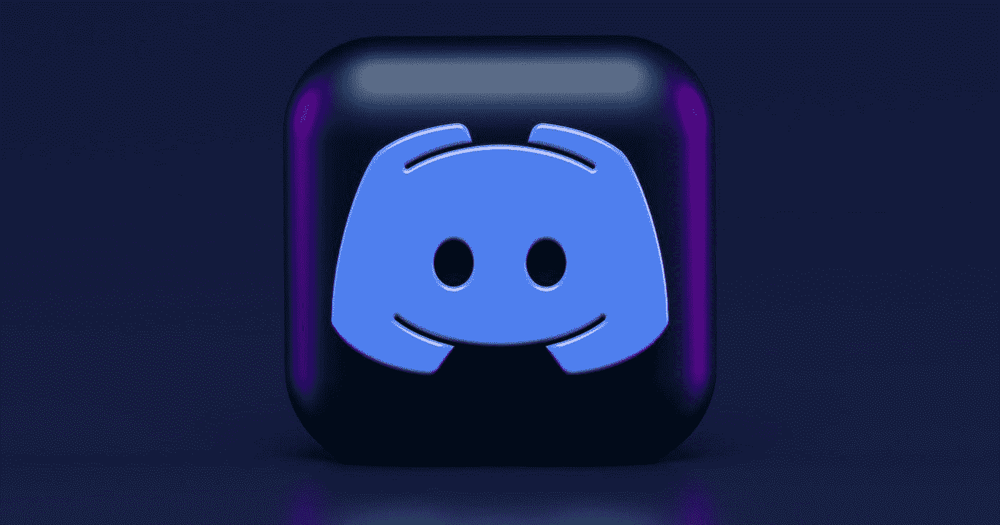

# 如何开发你自己的机器人

> 原文：<https://javascript.plainenglish.io/how-to-develop-your-very-own-bot-722cb78af568?source=collection_archive---------10----------------------->

## 用 Javascript 构建一个简单的不和谐机器人



## 老实说，你想到的第一个词是什么？

也许有一个；*复杂，酷，令人惊讶，不和谐，电报，脸书信使，黑客，有趣，不适合我，我想试试，机器人，只是如何，还有很多…*

先了解一些背景吧！

# 什么是机器人？

机器人或简称为 bot，是一个简单的计算机程序(软件应用程序)，旨在模仿互联网上的人类活动。它可以用于自动化任务或消息传递，就像现代商业中的聊天机器人，或者可能是调节或监控或其他任何东西，这都没有关系。

如果你愿意，你可以让一个机器人在早上叫醒你或者提醒你吃早餐。我想这就是警报的作用，是的，它们也是机器人！

这么说吧，让机器人为你做同样的事情，最有可能让任何单调乏味和重复的事情受益。

为什么？我猜是给你买了些咖啡和午睡时间！

现在你知道了什么是机器人，它们的用途是什么，让我们开始行动吧，我今天没打算在这里说太多，你明白我的意思吧。

# 入门指南

那么，下一步是什么？嗯，我能想到几个方法，但这都归结到一个问题和解决方案的需要，我想这就是我们要开始的地方。

## 问题陈述示例

我不希望每次有人加入我的亲密小组时，我都必须向每个人打招呼。那么我能有一种自动化的方法吗？答案是肯定的，我们可以让机器人为我们做这些，明白吗？

因此，现在我们有一个问题，解决方案是创建一个机器人来迎接任何时候加入社区的人。

然而，我们今天要构建的东西非常简单，到本文结束时，您应该有一个将部署在云服务上的工作不和谐机器人。

让我们开始吧！

**注意:**在我们继续之前，我想再次强调，我们将构建一个 discord 机器人，这不是部署或开发你的机器人的唯一方式，你可以制作 Twitter 机器人，slack 机器人，telegram 机器人，FB messenger 机器人，WhatsApp 机器人，甚至是定制的机器人。

但不和谐为我们提供了平台和服务，我们只需设计机器人的创造和逻辑，使其按应有的方式运行，我认为这是机器人的灵魂/心脏/大脑，没有它，机器人只是空中的想法，明白吗？

为了简单起见，我将把教程分成两个阶段。我们走吧！

# 第一相

由于我们将创建一个不和谐机器人，我们需要首先创建一个不和谐服务器，我们的机器人将在那里启动。

需要记住的一点是，不和谐机器人只是另一个不和谐用户帐户。

因此，如果这是有意义的，那么前往这个链接[这里](https://discord.com/developers/applications)并点击页面右上角的按钮`New Application`。

一个对话框会立即出现在你的屏幕上，所以你必须键入你的机器人主机帐户的名称，这通常会与你的机器人同名，我们应该叫它`buddy`。

然后点击`Create`按钮。这将创建您的 bot 应用程序。

这里有一些输入字段，但现在忽略它们，它们实际上是不言自明的，我相信如果需要的话，你可以在以后找出这部分。

然后你要做的下一件事是从网页左窗格的菜单选项中点击`SETTINGS`标签下的`Bot`标签。

然后点击`Add Bot`按钮，会出现一个弹出窗口，点击`Let's do it`按钮创建一个机器人用户帐户。

恭喜你，你现在已经创建了一个用户机器人帐户，但它还没有安装在任何地方。

请注意，您当前所在的页面非常敏感，不应该共享，它还有一个令牌，一旦创建了 bot 供以后使用，您需要复制它，但如果您丢失了它，请不要担心，只需单击`Reset Token`按钮生成一个新的令牌并复制它。

这是你对机器人的所有权，我指的是令牌，这个令牌非常强大，可以用来控制你的机器人，也可以利用机器人可以访问的任何地方，稍后会详细介绍。

如果你的机器人需要的话，在你有足够的经验去使用其中的一些选项之前，让这个页面上的其他东西保持原样。

无论如何，再看左边的菜单选项，点击`OAuth2`选项卡，它会下拉一些其他选项，点击`URL Generator`下拉选项，并选择范围标签下的机器人。

现在在 bot 权限下，这决定了您的 bot 可以在您的服务器上做什么。如果没有必要，不要给你的机器人管理特权，这是非常重要的，因为如果令牌被破坏，那么如果拥有它的人是坏人，那就有大问题了。他们可以在你的服务器上为所欲为。

也就是说，您应该选择除了`Send TTS message`之外的`Text Permission`标签下的所有内容，在这种情况下没有必要。

然后在页面的底部，在`generated url`标签下有一个 URL，点击按钮打开一个新的标签并粘贴到那里，然后点击 enter 加载它。在这里，您将邀请您的机器人作为用户加入您的服务器。

但是我们还没有服务器，我也不想在这篇文章中教授这个，这是一个显而易见的问题，所以我将外包给互联网来帮助你，以防你做不到。

前往这个网址[这里](https://www.ionos.com/digitalguide/server/know-how/how-to-set-up-a-discord-server/)。它详细解释了如何使用指导步骤和图片参考来设置您的服务器。当你完成后，你可以回到这里继续阅读。

现在您已经有了您的服务器，并且已经加载了您从 bot 创建页面复制的 URL，然后您应该在页面的下拉列表中看到您的服务器，选择它，然后单击 continue。它会告诉你检查你的机器人的特权，然后当你对更改感到满意时，点击授权。完成人工验证步骤(验证码)就大功告成了。

前往您的服务器，您应该会看到您新创建的机器人在那里，但您会注意到它现在是离线和非活动的。

唷！！如果你做到了这一步，那么恭喜你完成了本教程的第一阶段，你需要休息一下。

下一阶段是非常技术性的，更多的是机器人的编程部分，通过在云服务上编码其逻辑来赋予其生命和功能，尽管如果你愿意，这可以是本地主机，它根本不需要在线，所以你可以跟随你最喜欢的代码编辑器。但是在网上不需要任何额外的设置就很容易。

# 第二相

欢迎来到本教程的第二阶段，我希望到目前为止你已经学到了一些东西，如果你仍然有动力的话，让我们一起去兜风吧！

我一直在谈论的云服务叫做`[repl.it](https://repl.it)`,它就像一个在线代码沙箱/IDE，但是具有你无法想象的更多特性，所以我强烈推荐在这个阶段使用它。

前往`[repl.it](http://repl.it)`网站，创建一个账户，在那里阅读一些很酷的东西。

当您设置好帐户后，您应该登录并拥有一个控制面板，您可以在其中找到一个创建按钮来提供我们称之为`repl`的东西，但请将它视为一个目录，其中包含一个由强大引擎 Nix 驱动的独立文件系统。

但是在创建 repl 之前，系统会提示您选择一个模板。

此时，键入 Nodejs 进行搜索并选择合适的模板。

给你的工作空间起一个合适的名字`Buddy Bot`或者别的什么，就像我们最初给它起的名字一样。它可以是您想要的任何名称，或者您可以接受默认生成的名称。

如果您愿意，您可以随时编辑它们，现在只需单击“create repl”按钮并等待供应，然后您应该有一个在线 IDE，您可以在其中管理文件和目录并编写代码。

您首先应该看到的是左侧的一个空 index.js 文件，然后中间是一个您可以编写代码的窗格，在另一个窗格中，您可以看到输出，如右侧的终端和 shell。

在我们写代码之前，还记得我们从 bot 页面得到的令牌吗？是的，我们现在就需要它，如果您之前复制并存储了它，然后获取它，或者如果您没有直接转到 bot 页面并单击重置令牌，请复制它并将其带到 repl.it。

点击 repl 屏幕左窗格的锁图标，在这里你可以输入你的秘密信息，比如你复制的令牌。

顺便说一句，我假设阅读这篇文章的大多数人至少有一些编程经验，尽管不完全必要，但你总是可以谷歌一下事情的意义。

也就是说，你现在可以存储你的环境变量，它们将被加载到 **process.env** 中，你明白了吗？

输入一个名字，比如 **BOT_TOKEN** 或者其他什么，然后将复制的 **token** 粘贴到 value 字段，然后点击 add，然后点击 back 到文件的图标，这是所有脚本文件所在的目录。

现在，把下面的代码复制并粘贴到 **index.js** 文件中。

```
const Discord = require(‘discord.js’)

const client = new Discord.Client({
  intents: [
   ‘GUILDS’,
   ‘GUILD_MESSAGES’
  ]
})

client.on(‘ready’, () => {
  console.log(`${client.user.tag} is online!`)
})

client.login(process.env.DISCORD_BOT_TOKEN)
```

这段代码片段基本上使您的机器人上线，如果您现在检查您的服务器，您也可以确认这一点，但是机器人仍然没有做任何特别的事情。

## **解释**

我们在这里做的是使用一个名为 **discord.js** 的包装器模块(包)来创建一个客户端实例，它将使用我们得到的令牌来模拟我们的机器人。

我们初始化了客户机的一个新实例，并传入了一些配置选项。

这使用了类似于[套接字](https://en.wikipedia.org/wiki/Socket)和 [webhooks](https://en.wikipedia.org/wiki/Webhook) 工作方式的事件机制。

这里我们声明了一个声明，声明当机器人准备好了，我们应该记录一个消息。我们从实例的 **client.user.tag** 或 **client.user.username** 属性中获得了机器人的名称。

然后我们用 **login()** 方法将客户端登录到我们的服务器，从环境变量传入令牌，这个令牌是我们之前存储的。

现在，我们将实现一个简单的逻辑，每当用户在任何服务器频道上发帖时，我们都会向其问候。

每当用户在任一频道中键入`ping`时，bot 都会回复用户`pong`，然后向该频道发送另一条消息。

复制下面的代码，更新 **index.js** 文件

```
const Discord = require('discord.js')
const client = new Discord.Client({
  intents: [
    'GUILDS',
    'GUILD_MESSAGES'
  ]
})

client.on('ready', () => {
  console.log(`${client.user.tag} is online!`)
})

client.on('messageCreate', (msg) => {
    if (msg.author.bot) return

    if(msg.content === 'ping'){
      msg.reply('pong')
      msg.channel.send('Let's do it again!')
    }
})

client.login(process.env.DISCORD_BOT_TOKEN)
```

## 说明

现在我们监听一个名为 **messageCreate 的新事件(意味着要执行的动作)触发器。**这意味着当在服务器上创建新消息时，应该发生一些事情。**discord 服务器上的每一个动作都会触发一个事件类型。然后它会返回给我们 **msg** 实例，展示一些有用的方法和属性。**

**第一行说，如果消息的作者是机器人，它不应该做任何事情，这意味着如果机器人响应或发送任何东西，它不应该采取任何行动。**

**然后我们指定，如果消息的内容是 **ping** ，那么我们应该回复发送消息的人一个 **pong** ，然后向通道发送消息。**

**就是这样！！**

**你成功了，你现在是一个骄傲的机器人主人。**

**你刚刚创造了你自己的机器人，哇太神奇了！！！**

**你已经做得很好了，你真的应该为自己感到骄傲，如果不是每个人都这样做，这并不容易。**

**现在，你能做的就是熟悉我们遵循的流程，然后自己复制同样的东西。**

**我希望你能跟上。**

**这样你可以自己记住，也可以研究一下 [API 库](https://discord.js.org/#/)并找出你可以用这个库做的其他很酷的事情。**

**与全世界(朋友和家人)分享你的机器人，也可以在评论中分享。我很想听听你想出的酷点子。此外，在推特[或 LinkedIn](https://www.twitter.com/preshadeyinka) 上给我加标签，看看你的创作或与我联系。**

**感谢您的阅读！**

**如果你有任何问题，请在评论中提问，或者在社交网站上，我就在你身边:)**

## **TL；速度三角形定位法(dead reckoning)**

**如今，机器人已经变得非常有用和丰富，我们可以在客户关系管理系统、金融科技、教育科技、医疗保健、交通、网络安全以及世界上所有其他大大小小的行业中找到它们。**

**掌握了自动化日常任务的正确知识，你会怎么做才能做得更好？在本教程中，我们将探索如何创建一个不和谐机器人，到最后，你应该已经开发出一些可能会改变你每天生活方式的东西。**

****使用的资源:****

*   **【不和:】【discord.com/developers】T2**
*   ****repl . it:**[replit.com](https://replit.com/)**
*   ****库:**discord.js.org**

## **你是否希望为你的软件创业增加知名度？检查[电路](https://circuit.ooo/?utm=publication-post-cta)。**

**我们提供免费的专家建议和定制解决方案，帮助您建立对您的技术产品或服务的认知和采用。**

## **更多内容请访问 [PlainEnglish.io](https://plainenglish.io/) 。**

**报名参加我们的 [**免费周报**](http://newsletter.plainenglish.io/) 。关注我们 [**推特**](https://twitter.com/inPlainEngHQ) ，[**LinkedIn**](https://www.linkedin.com/company/inplainenglish/)**，**[**YouTube**](https://www.youtube.com/channel/UCtipWUghju290NWcn8jhyAw)**，以及** [**不和谐**](https://discord.gg/GtDtUAvyhW) **。****