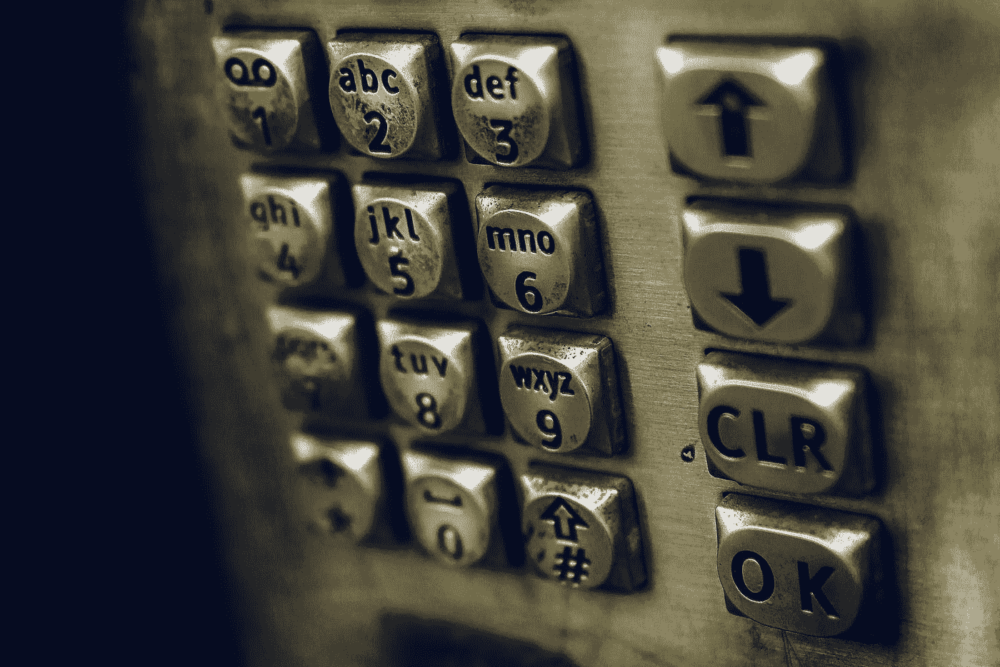

# 如何使用 JavaScript 禁用一个 HTML 按钮？

> 原文：<https://javascript.plainenglish.io/how-to-disable-an-html-button-using-javascript-79d55ddc2f6c?source=collection_archive---------1----------------------->



Photo by [James Sutton](https://unsplash.com/@jamessutton_photography?utm_source=medium&utm_medium=referral) on [Unsplash](https://unsplash.com?utm_source=medium&utm_medium=referral)

有时，我们想用 JavaScript 禁用一个 HTML 按钮。

在本文中，我们将了解如何使用 JavaScript 禁用 HTML 按钮。

# 将按钮的 disabled 属性设置为 true

要使用 JavaScript 禁用 HTML 按钮，我们可以选择该按钮，然后设置它的`disabled`属性。

例如，如果我们有下面的 HTML:

```
<button>
  click me
</button>
```

然后，我们可以选择带有`document.querySelector`的按钮，并通过编写以下内容来设置其`disabled`属性:

```
document.querySelector("button").disabled = true;
```

现在我们应该看到按钮被禁用了。

# 使用 setAttribute 方法设置按钮的禁用属性

设置按钮的`disabled`属性的另一种方法是使用`setAttribute`方法。

例如，如果我们有下面的 HTML:

```
<button>
  click me
</button>
```

然后我们可以用`document.querySelector`选择按钮，并用`setAttribute`设置它的`disabled`属性:

```
document.querySelector("button").setAttribute("disabled", "disabled");
```

我们调用`setAttribute`，分别将属性名和属性值作为参数进行设置。

此外，我们可以写:

```
document.querySelector("button").setAttribute("disabled", true);
```

将`disabled`属性设置为 top `true`禁用按钮。

# 结论

我们可以用 JavaScript 通过设置选中按钮的`disabled`属性来禁用一个 HTML 按钮。

*更多内容看* [***说白了。报名参加我们的***](https://plainenglish.io/) **[***免费周报***](http://newsletter.plainenglish.io/) *。关注我们*[***Twitter***](https://twitter.com/inPlainEngHQ)*和*[***LinkedIn***](https://www.linkedin.com/company/inplainenglish/)*。查看我们的* [***社区不和谐***](https://discord.gg/GtDtUAvyhW) *加入我们的* [***人才集体***](https://inplainenglish.pallet.com/talent/welcome) *。***