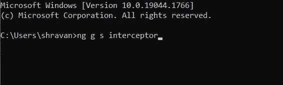
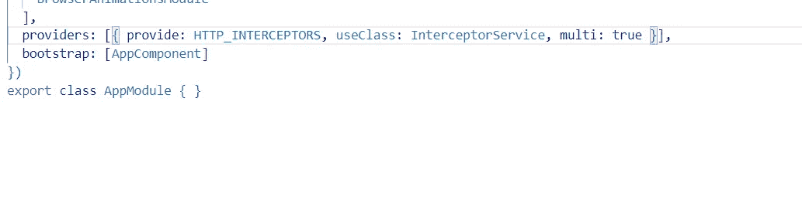
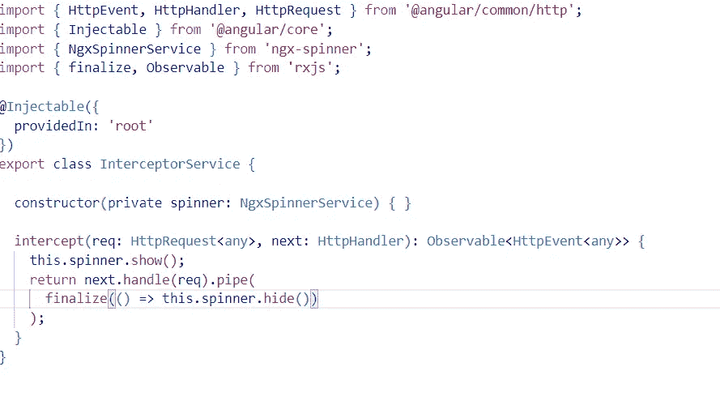
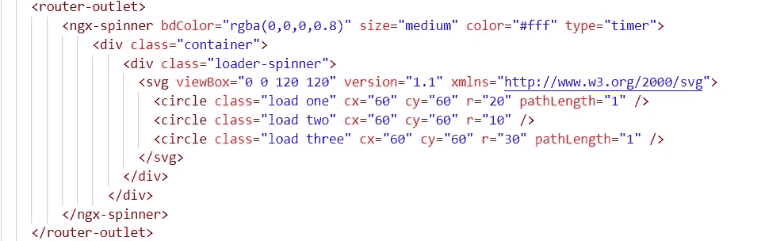

# Angular 中调用任何 API 时如何显示加载屏幕？

> 原文：<https://javascript.plainenglish.io/how-to-display-the-loading-screen-when-calling-any-api-in-angular-2bbb93a599f9?source=collection_archive---------4----------------------->

本文旨在向您展示当您在整个项目中调用任何 API 时，如何显示加载指示器。


开始一个新的角度项目。

我将使用 HTTP 拦截器。

让我们通过键入以下命令来创建一个新服务:

```
ng g service interceptor
```



将此服务添加到您的模块文件中，即 providers array 部分中的 **app.module.ts** :



```
providers: [{ provide: HTTP_INTERCEPTORS, useClass: InterceptorService, multi: true }],
```

让我们处理服务文件:



```
import { HttpEvent, HttpHandler, HttpRequest } from ‘@angular/common/http’;import { Injectable } from ‘@angular/core’;import { NgxSpinnerService } from ‘ngx-spinner’;import { finalize, Observable } from ‘rxjs’;@Injectable({providedIn: ‘root’})export class InterceptorService {constructor(private spinner: NgxSpinnerService) { }intercept(req: HttpRequest<any>, next: HttpHandler): Observable<HttpEvent<any>> {this.spinner.show();return next.handle(req).pipe(finalize(() => this.spinner.hide()));}}
```

在上面的代码中，我为加载器使用了 ngxspinnerservice。如果您已经创建了一个 spinner 服务，您可以使用它。

现在 app.component.html**的最后一步**:



使用 ngx-spinner 的加载器和内部，使用一些 SVG 的显示。

干杯，我们成功集成了 HTTP 拦截器。

*更多内容看* [***说白了就是***](https://plainenglish.io/) *。报名参加我们的* [***免费周报***](http://newsletter.plainenglish.io/) *。关注我们关于*[***Twitter***](https://twitter.com/inPlainEngHQ)*和*[***LinkedIn***](https://www.linkedin.com/company/inplainenglish/)*。查看我们的* [***社区不和谐***](https://discord.gg/GtDtUAvyhW) *加入我们的* [***人才集体***](https://inplainenglish.pallet.com/talent/welcome) *。*