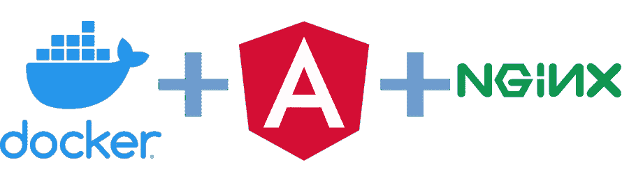
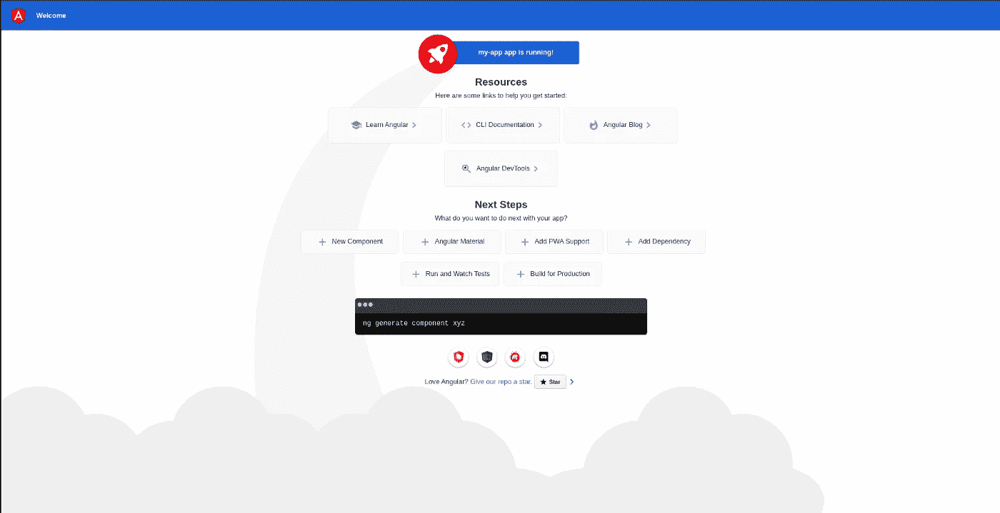
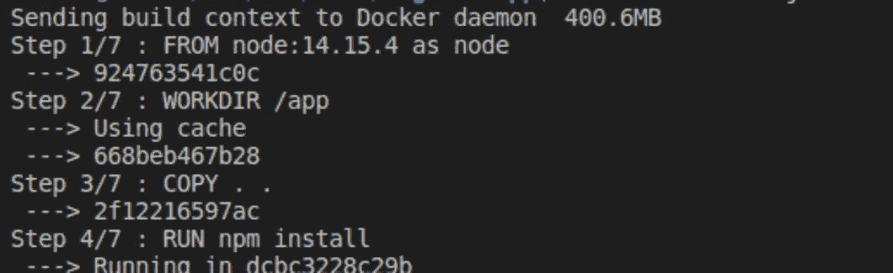
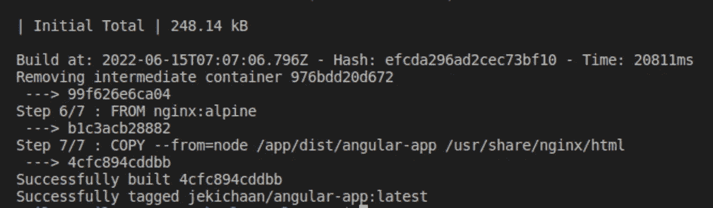
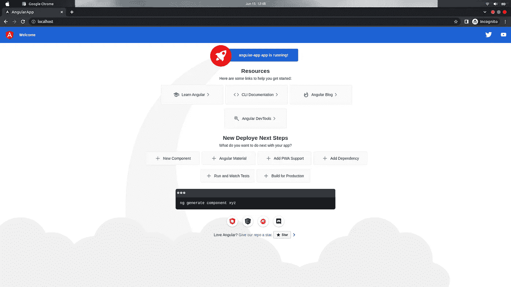
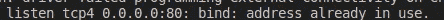

# 如何记录您的角度应用

> 原文：<https://javascript.plainenglish.io/how-to-dockerize-angular-application-3cd67e963832?source=collection_archive---------2----------------------->



# **码头工人介绍**

Docker 是一组平台即服务产品，使用操作系统级虚拟化来交付称为容器的软件包中的软件。简而言之，它为任何应用程序提供了一个环境，消除了每次团队中有新成员加入时设置项目的麻烦。🍻

# 先决条件

*   首先，我们需要在机器上安装一个 Docker 来构建 Docker 映像并运行 Docker 容器。Mac、Linux 和 Windows 有不同的安装。对于 Windows 10 专业版和企业版，从这个[链接](https://hub.docker.com/editions/community/docker-ce-desktop-windows)安装 Docker for Desktop，但如果你有 Windows 10 家庭版，使用这个[链接](https://docs.docker.com/toolbox/overview/)；对于 Linux，可以按照这个[链接](https://docs.docker.com/engine/install/ubuntu/)。
*   我们还需要在 Docker 中心注册一个帐户，以便我们可以拉和推 Docker 图像，检查这个[链接](https://hub.docker.com/)为自己创建一个。

# **步骤**

1.设置一个没有 Docker 的角度应用程序。如果你对这个不熟悉，我已经为它写了一篇中型文章，你可以先看看[和](https://medium.com/@jaykishan.khemani/how-to-setup-your-first-angular-app-77c1d6aa65f6)。

2.在应用程序的根文件夹中创建一个 docker 文件。

3.使用 Docker 构建容器。

4.最后，使用步骤 3 中构建的 Docker 映像运行应用程序。

# 1.设置角度应用程序

第一步，你需要准备一个 Angular 应用程序。如果你已经有了，那很好，但是如果你是初学者，你可以看看这篇[文章](https://medium.com/@jaykishan.khemani/how-to-setup-your-first-angular-app-77c1d6aa65f6)。一旦完成，你会得到这样的东西:

```
http://localhost:4200
```



# 2.创建 Dockerfile 文件

第二步确实在 Angular 应用程序的根目录下创建了一个 Dockerfile，这将是文件的内容:

```
# Stage 1FROM node:14.15.4 as nodeWORKDIR /appCOPY . .RUN npm installRUN npm run build --prod # Stage 2FROM nginx:alpineCOPY --from=node /app/dist/angular-app /usr/share/nginx/html
```

这两个阶段给出了在 Docker 中构建两个容器的思路，我们使用的是 node: 14.15.4 版本，下面是创建一个容器的步骤。这些是您可以使用的 prod 版本的步骤——staging 也可以根据项目的需求进行更改。

第二阶段是 Nginx，我们的静态应用程序构建将在其上部署。保存该文件，并进入下一步。

# 3.建造容器

下一步是使用以下命令构建容器:

```
docker build -t jekichaan/angular-app .
```

您可以在 [Docker hub](https://hub.docker.com/) 上使用您的用户名，而不是我的“jekichaan”😜。如果您是第一次构建它，这个过程可能需要一些时间，因为它将从 Docker hub 下载所有图像。所以在那之前，放松一下，喝杯咖啡吧，☕️.



这里是一些成功构建的日志，如果你有一些错误，你可以在下面评论。

# 4.最后一步

现在，最后一步是运行🏃使用 Docker 的应用程序使用这个命令。

```
docker run -d -it -p 80:80/tcp --name angular-app jekichaan/angular-app:latest
```

同样，用你的用户名替换 *jekichaan* 。现在，您已经准备好进入浏览器并输入 localhost，您可以看到您的应用程序像这样运行。



你们中的一些人可能会得到这个错误:



不要担心，这是由于一些其他服务，如 apache，可能在后台使用端口 80。因此，您可以在后台更改端口或停止其他服务使用端口 80。

# 奖励步骤

如果你使用 VS 代码作为编辑器，你可以使用不同的扩展来避免到处使用命令，你也可以使用其他 docker 功能。

我建议的扩展之一是:

名称:Docker
Id:ms-azure tools . vs code-Docker
描述:使创建、管理和调试容器化的应用程序变得容易。
版本:1.22.0
发行商:微软
VS 市场链接:[https://marketplace.visualstudio.com/items?itemName = ms-azure tools . vs code-docker](https://marketplace.visualstudio.com/items?itemName=ms-azuretools.vscode-docker)

# 收尾工作

最后，你的角度应用是 dockerized。如有任何疑问或建议，欢迎在下方留言。喜欢并分享这篇文章给有需要的人。谢谢你的时间。🍻 🍻

[](https://www.linkedin.com/in/jaykishan-khemani-a0452850/) [## Jaykishan Khemani -解决方案工程师- GAMMASTACK | LinkedIn

### 查看 Jaykishan Khemani 在世界上最大的职业社区 LinkedIn 上的个人资料。Jaykishan 列出了 3 个工作…

www.linkedin.com](https://www.linkedin.com/in/jaykishan-khemani-a0452850/) 

## 进一步阅读

[](/create-a-multi-page-job-application-form-using-angular-f0b1640f4195) [## 使用 Angular 创建多页工作申请表

### 一步一步的教程，以建立一个多页的工作申请表使用 Angular 和 SurveyJS，一个免费的，开源的…

javascript.plainenglish.io](/create-a-multi-page-job-application-form-using-angular-f0b1640f4195) 

*更多内容请看*[***plain English . io***](https://plainenglish.io/)*。报名参加我们的* [***免费周报***](http://newsletter.plainenglish.io/) *。关注我们关于*[***Twitter***](https://twitter.com/inPlainEngHQ)[***LinkedIn***](https://www.linkedin.com/company/inplainenglish/)*[***YouTube***](https://www.youtube.com/channel/UCtipWUghju290NWcn8jhyAw)*[***不和***](https://discord.gg/GtDtUAvyhW) ***。*****

*****对缩放您的软件启动感兴趣*** *？检查* [***电路***](https://circuit.ooo/?utm=publication-post-cta) *。***