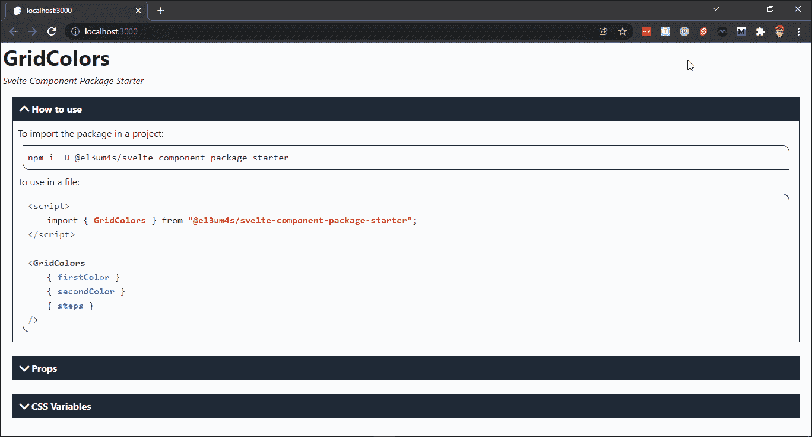
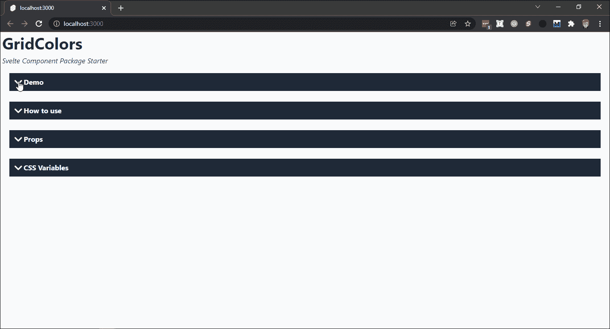
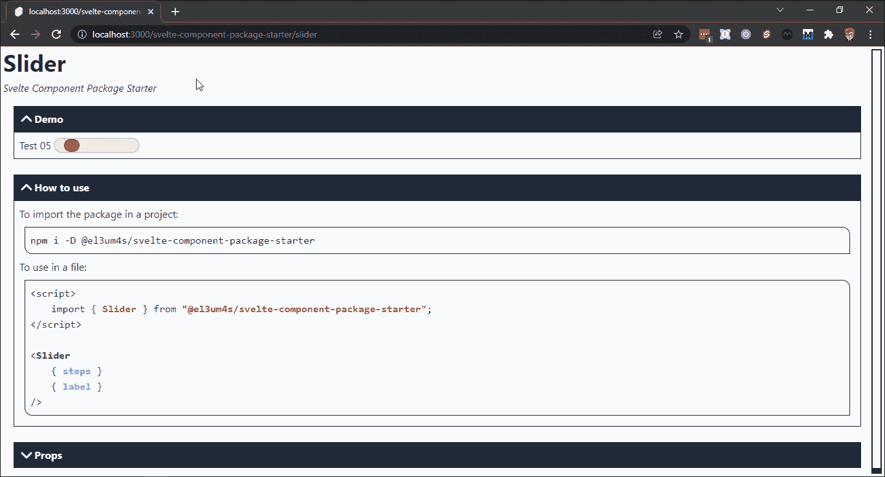

# 如何记录纤细的组件—第 2 部分

> 原文：<https://javascript.plainenglish.io/how-to-document-svelte-components-part-2-9db50dff8f38?source=collection_archive---------7----------------------->

## 一个关于如何简单地记录用 Svelte 创建的 web 组件的指南。


Photo by [Robo Wunderkind](https://unsplash.com/@robowunderkind?utm_source=medium&utm_medium=referral) on [Unsplash](https://unsplash.com?utm_source=medium&utm_medium=referral)

这篇文章花了我比预期更长的时间。一个多月了。两个主要的仓库花了我更多的时间。这是为了回答一个问题:如何轻松地文档化一个用 Svelte 创建的 web 组件？

# 介绍

开始之前，我必须澄清几件事。首先，这个帖子由三部分组成。

第一部分开始于这篇文章的论述:

[](https://betterprogramming.pub/how-to-document-svelte-components-ab504661a6fc) [## 如何记录纤细的组件

### 如何创建编写自己的文档的组件

better 编程. pub](https://betterprogramming.pub/how-to-document-svelte-components-ab504661a6fc) 

我从一个半月前的假设出发，提出了我将使用的两个存储库。

第二部分回顾了如何使用静态页面在 GitHub 上创建博客。这是这篇文章的摘要:

[](/sveltekit-github-pages-4fe2844773de) [## 如何在 GitHub 页面中使用 SvelteKit

### 我等了几个星期才写了一篇关于如何在 GitHub 页面上使用 Svelte 的新文章。今天我感兴趣的是…

javascript.plainenglish.io](/sveltekit-github-pages-4fe2844773de) 

最后，第三部分是关于如何将 Markdown ( `md`)文件与苗条组件一起使用。

我不是从一个新组件开始，而是从我已经创建的组件开始:

[](https://el3um4s.medium.com/how-to-create-and-publish-svelte-components-e770f1e94435) [## 如何创建和发布苗条的组件

### 在我的上一篇文章中，我主要谈到了如何整合苗条，顺风，笑话和如何使用 NPM。为什么都…

el3um4s.medium.com](https://el3um4s.medium.com/how-to-create-and-publish-svelte-components-e770f1e94435) 

所以说，让我们开始吧。

# 如何创建记录自身的文档

为了简化苗条组件文档的创建，我创建了 2 个 NPM 包。第一个，[@ El 3um 4s/svelte-get-component-info](https://www.npmjs.com/package/@el3um4s/svelte-get-component-info)，任务是解析组件并提取一个包含基本信息的 JSON 对象。第二个，[@ El 3um 4s/svelte-component-info](https://www.npmjs.com/package/@el3um4s/svelte-component-info)，负责将这些信息转换成屏幕上可读的格式。

为什么我要把项目一分为二？因为通过这种方式，如果有人想这样做，就有可能创建不同的图形展示。

我从安装第一个开始:

```
npm i -D @el3um4s/svelte-get-component-info
```

然后我创建一个`getInfoSvelteComponents.js`文件，允许我读取`src\lib\components`目录中的所有文件。提取我需要的数据后，我将它保存在`src\routes`文件夹的`infoSvelteComponents.json`文件中:

创建一个`getInfoSvelteComponents-watcher.js`文件来自动拦截对组件源代码的任何更改也是有用的，但不是必需的:

所以我给`package.json`添加了几个脚本:

当我运行`npm run get-info-svelte-components`时，我得到一个类似如下的文件:

对于`lib\components`目录中的每个组件，我得到一个具有 4 个属性的对象:

*   小道具
*   行动
*   时间
*   半铸钢ˌ钢性铸铁(Cast Semi-Steel)

我可以将这些信息导入到`src\routes\index.svelte`文件中，如下所示:

仅此一点就足以创建一个自动文档系统:只需提取包含在`infoSvelteComponents`中的信息。

我更喜欢创建一个特定的组件，[@ El 3um 4s/svelte-component-info](https://www.npmjs.com/package/@el3um4s/svelte-component-info)。我安装它时使用了:

```
npm i @el3um4s/svelte-component-info
```

然后我将组件导入到`index.svelte`文件中:

我得到一个这样的页面:



我添加了一个`slot="demo"`来显示组件的预览:

这样我就明白了。



就这样，我结束了第一部分。

但还有一个问题:如何将 SvelteKit 创建的页面自动上传到 GitHub？

# 如何在 GitHub 页面中使用 SvelteKit

我从文章[如何将 SvelteKit 与 GitHub Pages 一起使用](/sveltekit-github-pages-4fe2844773de)开始，使用 markdown 作为我的组件的文档。我安装 [gh-pages](https://www.npmjs.com/package/gh-pages) :

```
npm install gh-pages --save-dev
```

然后我给`package.json`添加了一个脚本:

我创建了`gh-pages.js`文件:

然后我添加了[静态适配器](https://www.npmjs.com/package/@sveltejs/adapter-static)来为 GitHub 准备页面:

```
npm i -D @sveltejs/adapter-static@next
```

我更新`svelte.config.js`文件:

我将`.nojekyll`文件添加到`static`文件夹中。

每当我创建文档的新版本时，都有必要清理包含前一个版本的`build`文件夹。我可以通过创建一个`clean-build.js`文件，直接从 NodeJs 完成这项工作:

我编辑`package.json`:

要将文档上传到 GitHub 页面，只需使用以下命令:

```
npm run build
npm run deploy
```

我得到一个类似这样的网页

*   [el3um4s.github.io/svelte-component-package-starter](https://el3um4s.github.io/svelte-component-package-starter/)

只要它是单个组件，这就足够了。然而，我更喜欢使用降价文件。

# 如何将 Markdown 与 SvelteKit 一起使用

一、进口 [mdsvex](https://mdsvex.pngwn.io/) :

```
npm i -D mdsvex
npx svelte-add@latest mdsvex
npm install
```

我设置了配置文件`mdsvex.config.js`

最后，我修改`svelte.config.js`来识别`md`文件:

现在我可以使用`md`文件作为`routes`目录中的页面。然后我将`index.svelte`文件重命名为`index.md`。

我可以创建一个`slider.md`文件来记录这个组件:

所以在 el3um4s.github.io/svelte-component-package-starter/slider 的第[页](https://el3um4s.github.io/svelte-component-package-starter/slider)上，我找到了这样的内容:



这就是全部。项目存储库在这里:

[](https://github.com/el3um4s/svelte-component-package-starter) [## GitHub-El 3um 4s/Svelte-Component-package-starter:创建苗条的组件包

### 我创建苗条组件包的模板 NPM 链接:@ El 3um 4s/Svelte-Component-package-starter 创建一个新的…

github.com](https://github.com/el3um4s/svelte-component-package-starter) 

感谢阅读！敬请关注更多内容。

***不要错过我的下一篇文章—报名参加我的*** [***中邮箱列表***](https://medium.com/subscribe/@el3um4s)

[](https://el3um4s.medium.com/membership) [## 通过我的推荐链接加入 Medium—Samuele

### 阅读萨缪尔的每一个故事(以及媒体上成千上万的其他作家)。不是中等会员？在这里加入一块…

el3um4s.medium.com](https://el3um4s.medium.com/membership) 

*原载于 2022 年 1 月 2 日 https://blog.stranianelli.com**的* [*。*](https://blog.stranianelli.com/how-to-document-svelte-components-part-2/)

*更多内容请看*[*plain English . io*](http://plainenglish.io/)*。报名参加我们的* [*免费每周简讯*](http://newsletter.plainenglish.io/) *。在我们的* [*社区*](https://discord.gg/GtDtUAvyhW) *获得独家写作机会和建议。*