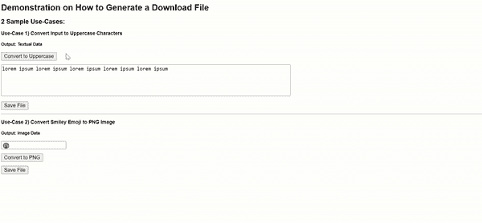
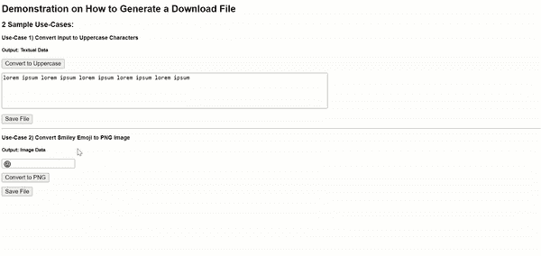

# 如何用 JavaScript 下载文本/图像文件(没有服务器)

> 原文：<https://javascript.plainenglish.io/how-to-download-a-text-image-file-in-javascript-without-a-server-9ccadfbe4694?source=collection_archive---------1----------------------->

## 不需要插件。2 个策略— (1)锚链接&(2)Blob 对象。带演示和用例。包括源代码。

在当今快节奏的社会中，在限制条件下高效工作的能力变得越来越重要。

基于这一前提，最关键的 web 技术之一毫无疑问被发明出来了——被称为 [JavaScript](https://developer.mozilla.org/en-US/docs/Web/JavaScript) 的脚本语言。由于其多样化的功能范围，客户端 JavaScript 已经导致像我一样的许多个人开发离线和便携式工具，以便以更快、更便宜和更有效的方式执行日常任务。

Illustration by Author | Generate/Trigger a file download with client-side JavaScript

# 使用客户端脚本进行文件导出

虽然任何生产力工具的核心特性都是让用户能够将输出保存为本地文件，但是由于没有内置的 JavaScript 函数可以实现这一点，所以这通常是一个开放式的问题，有许多不同的答案。因此，我认为分享我对两种主要文件类型的下载功能的实现可能是有益的— **(1)文本** & **(2)二进制**。

## (1)生成文本文件供下载

**用例:**将文本输入转换成大写字符

Screencapture by Author | Demo of use-case 1: <textarea></textarea> content is saved as a text file

Code snippet by Author | Generate a Blob object of type plaintext

或者，也可以使用`btoa()`函数将内容编码为 [Base64 字符串](https://developer.mozilla.org/en-US/docs/Glossary/Base64):

Code snippet by Author | Text content is encoded by btoa() function

## (2)生成供下载的图像文件

**用例:**将文本表情符号转换为图像

Screencapture by Author | Demo of use-case 2: Emoji ‘😃’ in <input type=’text’> is saved as an image file

Code snippet by Author | For the above example, multimedia content is encoded as a base64 string and assigned to the ‘href’ attribute value of an anchor link 

现在你知道了！非常感谢你坚持到这篇文章的结尾！❤希望这篇文章对你有用，如果你想了解更多地理信息系统(GIS)、数据分析& Web 应用相关的内容，请随时[关注我的媒体](https://medium.com/@geek-cc)。会非常感激—😀

— 🌮请给我买一份玉米卷🎀˶❛◡❛)

 [## 通过我的推荐链接加入灵媒——李思欣·崔

### 获得李思欣·崔和其他作家在媒体上的所有帖子！😃您的会员费直接…

geek-cc.medium.com](https://geek-cc.medium.com/membership) 

## 请随意查看以下 JavaScript 实用程序列表:

用于媒体内容(图像、视频等)的编码/处理。):

 [## 如何用普通 JavaScript 在 Base64 中编码图像文件

### 代码实现&链接到离线工具包括在内。

javascript.plainenglish.io](/how-to-encode-image-files-in-base64-with-plain-javascript-4927fa08e063)  [## 如何使用客户端 JavaScript 和 HTML5 Canvas 调整图像大小

### 输出图像保留其纵横比和分辨率。启用图像导出。包括完整的代码实现。

medium.com](https://medium.com/weekly-webtips/how-to-resize-an-image-using-client-side-javascript-and-html5-canvas-2fff73d15d0)  [## 将 SVG 转换为图像文件格式的 3 个步骤。PNG)

### 包括完整的源代码和用例演示。

javascript.plainenglish.io](/3-steps-to-convert-svgs-to-image-file-formats-png-in-javascript-5394bf837185)  [## 如何使用客户端 JavaScript 将视频剪辑转换为 GIF 文件

### 基于浏览器的离线实现。包含完整代码的链接。

javascript.plainenglish.io](/how-to-convert-a-video-clip-to-a-gif-file-with-client-side-javascript-56575d093191)  [## 使用客户端 JavaScript 将视频转换为 GIF—解码 GIF 的 FPS

### 帧速率= FPS。检索视频的 FPS 和指定 GIF 的 FPS。包括完整的源代码实现。

javascript.plainenglish.io](/video-to-gif-conversion-with-client-side-javascript-decoding-fps-for-gif-bf96b8bc4d7c) 

以人工智能/机器学习为中心的工具:

 [## 使用客户端 JavaScript 构建一个文本到语音的应用程序

### OCR 技术(Tesseract.js)和 Web 语音 API 的融合。包括完整的代码实现。

javascript.plainenglish.io](/build-a-text-to-speech-app-using-client-side-javascript-98cd72df73bb)  [## 使用客户端 JavaScript 通过 Tesseract OCR 构建图像和 PDF 文本提取工具

### pdf . js+tessera CT . js—OCR 和 Web 技术的融合。包括完整的代码实现。

towardsdatascience.com](https://towardsdatascience.com/build-an-image-pdf-text-extraction-tool-with-tesseract-ocr-using-client-side-javascript-6126031001) 

对于文本格式:

 [## Tableau 中的上标和下标——为什么以及如何实现它

### 让你的化学/数学方程式对用户更具可读性

towardsdatascience.com](https://towardsdatascience.com/superscript-and-subscript-in-tableau-why-and-how-you-can-implement-it-764caf0cc932)  [## 如何格式化 LinkedIn 帖子中的文本

### 𝗕𝗼𝗹𝗱/𝘐𝘵𝘢𝘭𝘪𝘤𝘴/u̲n̲d̲e̲r̲l̲i̲n̲e̲/s̶t̶r̶i̶k̶e̶t̶h̶r̶o̶u̶g̶h̶—包含文本格式化工具的链接

medium.com](https://medium.com/geekculture/how-to-format-text-in-linkedin-posts-808e322f9e59) 

对于地理空间用例:

 [## 数据文件格式转换(KML、SHP、GeoJSON)

### 使用这些 JavaScript 实用程序。没有成本。没有安装。没有配额。(包括 HTML 实用程序文件)

towardsdatascience.com](https://towardsdatascience.com/geospatial-file-format-conversions-kml-shp-geojson-25261beb2153)  [## 使用 Turf.js 合并空间数据集中相邻面的巧妙方法

### 用例+代码实现。我的 GitHub 提供的工具。

javascript.plainenglish.io](/a-neat-trick-to-merge-adjacent-polygons-in-spatial-datasets-with-turf-js-79e8ad84ee77)  [## 如何用 Proj4.js 将 XY 坐标转换为 LatLng 值

### 包括 XY 到 LatLng 转换器工具的代码实现

javascript.plainenglish.io](/transforming-xy-coordinates-to-latlng-values-with-proj4-js-d91a6139ba90) 

对于其他杂项任务:

 [## 离线二维码生成器/阅读器采用 100%普通 JavaScript 构建

### 为什么每个人都应该准备好这个。包含工具链接。

javascript.plainenglish.io](/an-offline-qr-code-generator-reader-built-in-100-vanilla-javascript-b7e8aec812e8)  [## 用 JavaScript 在 web 上实现 SQLite 用 sql.js 实现节点和浏览器

### 具有完整源代码和用例的最小设置

medium.com](https://medium.com/weekly-webtips/implement-sqlite-on-web-with-javascript-both-node-browser-with-sql-js-14448fd7a3cb)  [## 在本地支持 JavaScript 的浏览器中读取和导出 SQLite 数据

### 不需要设置服务器。独立于平台。只是🖱️双击 HTML 文件。包含完整源代码的链接。

medium.com](https://medium.com/weekly-webtips/read-export-sqlite-data-in-a-javascript-enabled-browser-locally-b655deda879d) 

*更多内容请看*[***plain English . io***](https://plainenglish.io/)*。报名参加我们的* [***免费周报***](http://newsletter.plainenglish.io/) *。关注我们关于*[***Twitter***](https://twitter.com/inPlainEngHQ)[***LinkedIn***](https://www.linkedin.com/company/inplainenglish/)*[***YouTube***](https://www.youtube.com/channel/UCtipWUghju290NWcn8jhyAw)***，以及****[***不和***](https://discord.gg/GtDtUAvyhW) *对成长黑客感兴趣？检查* [***电路***](https://circuit.ooo/) ***。*****