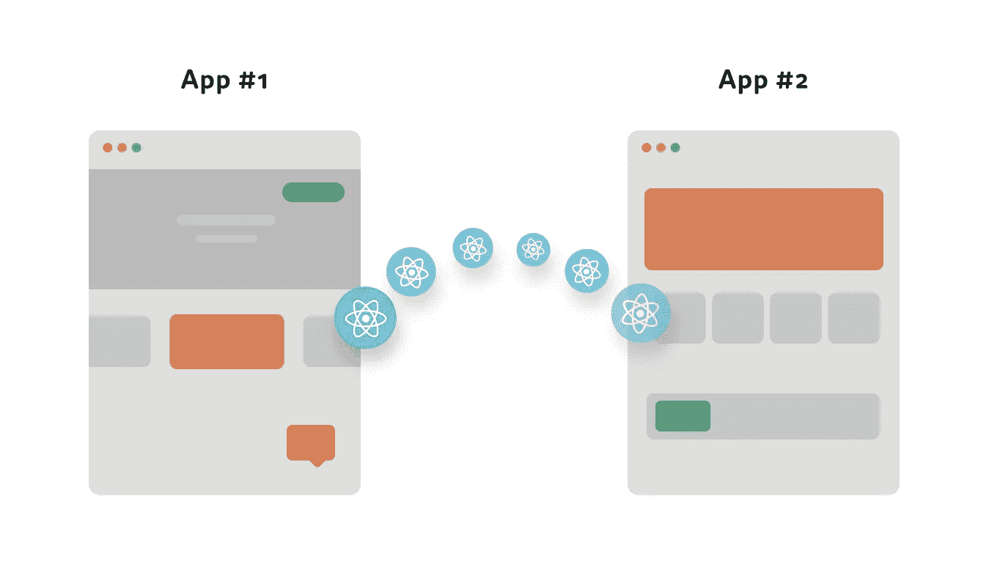
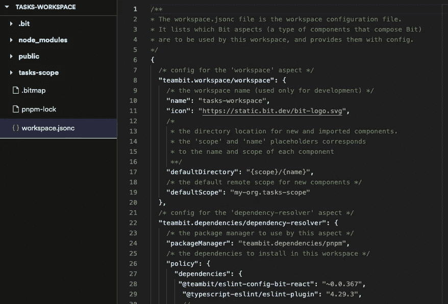
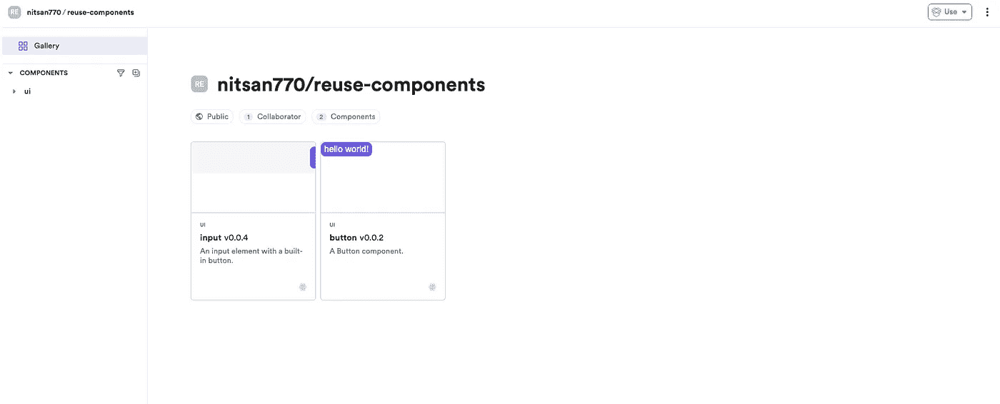
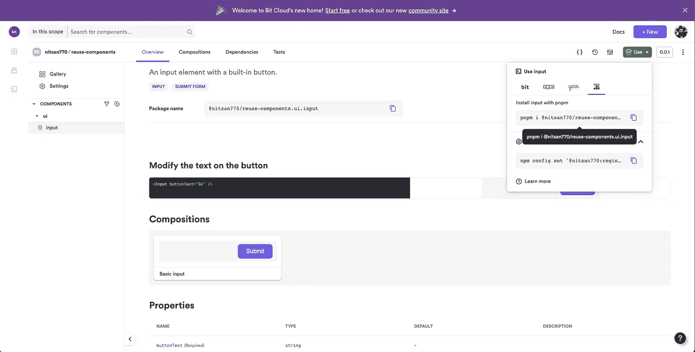
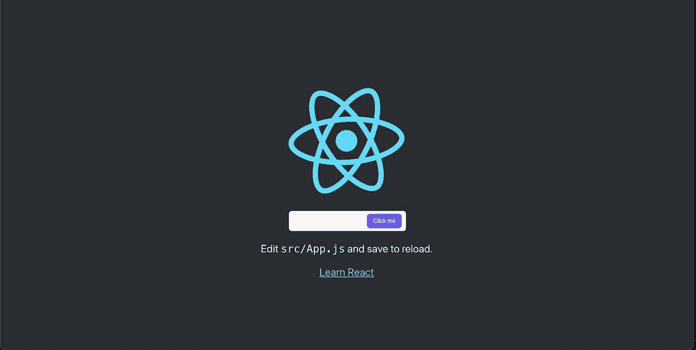

# 如何轻松重用 React 组件

> 原文：<https://javascript.plainenglish.io/how-to-easily-reuse-react-components-e9c8a9466038?source=collection_archive---------4----------------------->

## 以简单、快速和可伸缩的方式跨项目和应用程序重用 React 组件。



can be easier and more scalable than you think

在项目和应用程序之间共享可重用的 React 组件是加速开发和构建一致体验的一种非常强大的方式。然而，在过去，设计和分离可以重用、定制和管理的组件需要大量的工作和开销。

在本教程中，基于[这个精彩的例子](https://bit.cloud/blog/how-to-reuse-react-components-across-your-projects-l4pz83f4)，我将带你经历一个非常简单但可扩展的方法，以一种受管理的方式跨项目重用 React 组件。本教程中我们的堆栈将只是一些开源工具 [React](https://reactjs.org/) 、 [Bit](https://bit.dev) 、MDX 等等。

在本教程结束时，您将在一个项目中创建一个组件，对其进行版本控制、导出，然后在另一个项目中使用。

您还将拥有可重用 React 组件工具箱中的第一批组件，您可以在任何新项目中使用这些组件，并与他人共享，以加速和改进整个团队的开发。

让我们开始吧。

# 1.设置工作区

首先，我们将[安装钻头](https://bit.dev/docs/getting-started/installing-bit/installing-bit)。

```
npx @teambit/bvm install
```

接下来我们要做的是创建一个[位工作空间](https://bit.dev/docs/getting-started/installing-bit/start-bit-workspace)。

工作区充当组件的开发和登台区。我们创建新的组件，检索和修改现有的组件，并组合它们。它基本上是一个供您构建和组合组件的地方。

每个组件都是“独立的”——这意味着它有自己的开发环境、版本、依赖项、包等等。workspace 使这成为可能，并自动化了大部分配置和相关开销。

正如你所猜测的那样，通过使组件“独立”，Bit 使它们“开箱”即可重复使用，就像乐高一样，它们可以在任何数量的项目中消费和使用，几乎不需要额外的努力。

为了避免以后需要配置它，我们将把遥控器的细节添加到我们的工作区创建命令中，让 Bit 知道它应该是默认的。

您可以创建一个远程作用域来托管任何远程服务器上的组件，但是对于本教程，为了简单起见，让我们使用 [bit.cloud](https://bit.cloud) 。它对所有开发者和开源软件都是免费的，所以我们只需要创建一个帐户和一个范围。

在项目的根目录下，用 React 模板初始化一个[位工作空间](https://bit.dev/docs/workspace/workspace-overview):

```
bit new react reusing-react-components --empty --skip-git --default-scope [your-bit.cloud-user-name].[your-scope-name]cd reusing-react-components
```

*   花点时间[看看这里的工作空间](https://bit.dev/docs/getting-started/installing-bit/start-bit-workspace#workspace-files-and-directories)。

[](https://bit.dev/docs/getting-started/installing-bit/start-bit-workspace#workspace-files-and-directories)

# 2.创建一个反应组件

让我们制作第一个可重用的 React 组件！

在工作空间中，我们可以[创建组件](https://bit.dev/docs/getting-started/composing/creating-components)，甚至使用模板——或者创建我们自己的模板——来创建组件。

让我们使用 bit create 命令创建一个组件，并添加标志“react”来告诉 bit 为该组件使用 react-environment，并为该组件添加一个名称空间/名称。在这种情况下，输入:

```
bit create react ui/input
```

您可以将文件从[文件夹](https://static.bit.dev/blog/blog-posts/reusing-react-components/files/Input.zip)中复制到生成的文件夹(UI/input)中。遵循本指南，将片段复制到文件中。

以下是[输入实现](https://bit.cloud/nitsan770/reuse-components/ui/input/~code/input.tsx)的源代码:

```
import React from 'react';
import { Button } from '@nitsan770/reuse-components.ui.button';
import classNames from 'classnames';
import styles from './input.module.scss';export type InputProps = {
  buttonText: string;
} & React.InputHTMLAttributes<HTMLInputElement>;export function Input({ buttonText, className, ...rest }: InputProps) {
  return (
    <div className={classNames(styles.inputContainer, className)}>
      <input {...rest} className={styles.inputText}></input>
      <Button className={styles.button} children={buttonText} />
    </div>
  );
}
```

因为我们有`Button`和类名作为依赖项，所以我们必须将它们安装在我们的工作空间中:

```
bit install @nitsan770/reuse-components.ui.button classnames
```

在生成的文件夹中，创建一个名为`input.moudle.scss`的文件，并插入[这个 CSS](https://bit.cloud/nitsan770/reuse-components/ui/input/~code/input.module.scss) :

```
.inputContainer {
  height: 56px;
  min-width: 320px;
  display: flex;
  flex-direction: column;
  justify-content: stretch;
  align-items: stretch;
  position: relative;
  .button {
    position: absolute;
    width: 103px;
    height: 40px;
    right: 8px;
    top: 8px;
    width: 30%;
  }
  .inputText {
    border: none;
    background-color: var(--bit-bg-dent, #f6f6f6) !important;
    color: var(--bit-text-color-heavy, #2b2b2b);
    height: 100%;
    width: 100%;
    border-radius: 8px;
    &.error {
      border: var(--bit-error-color, #e62e5c) 1px solid;
      background-color: var(--bit-error-color, #e62e5c);
    }
    &:focus,
    &:active,
    &:hover {
      border: var(--bit-accent-color, #6c5ce7) 1px solid;
    }
  }
}.disabled {
  opacity: 0.5;
}
```

注意，组件将被添加到工作区的`.bitmap`文件中。打开来看一看:

```
"ui/input": {
  "scope": "",
  "version": "",
  "defaultScope": "nitsan770.reuse-components",
  "mainFile": "index.ts",
  "rootDir": "ui/input",
},
```

接下来让我们看看工作区 UI 中可爱的独立组件:

```
bit start
```

开发服务器已经启动并运行了！然而，我们什么也看不见😔。这是因为我们还没有为新创建的组件创建任何组合。

组合允许在不同的变化中模拟组件。这些可以用于测试、可视化和可发现性。

让我们为我们的组件创建一个组合:

```
import React from 'react';import { Input } from './Input';export const BasicInput = () => <Input buttonText="Submit" />;
```

现在，我们可以在工作区 UI 中看到该组件:


现在，作为负责任的开发人员，让我们添加一些文档。

Bit 组件的文档写在 [MDX](https://mdxjs.com/) 中。您可以嵌入任何您想要的东西，使您的组件在视觉上更吸引人，更易于使用。

让我们试试[这个](https://bit.cloud/nitsan770/reuse-components/ui/input/~code/input.docs.mdx):

```
---
description: An input element with a built-in button.labels: ["input", "submit form"]
---import { Input } from "./input";### Modify the text on the button'''js live<Input buttonText="Go" />'''
```

现在看起来好多了，消费者可以在安装前试用该组件:

最后但同样重要的是，一个好的组件是经过充分测试的。使用 Bit，每个组件都可以在任何特定的上下文之外独立测试。这是非常有用的，因为你可以很容易地了解什么打破了每一个变化。

你可以使用任何你喜欢的工具来测试组件，比如 Jest。

下面是为组件添加的测试[。](https://bit.cloud/nitsan770/reuse-components/ui/input/~code/input.spec.tsx)

```
import React from 'react';
import { screen, render } from '@testing-library/react';
import { BasicInput } from './input.composition';it('Renders the input', () => {
  render(<BasicInput />);
  const input = screen.getByRole('textbox');
  expect(input).toBeInTheDocument();
});it('Renders the button', () => {
  render(<BasicInput />);
  const button = screen.getByRole('button');
  expect(button).toBeInTheDocument();
});it('Renders the button text', () => {
  render(<BasicInput />);
  const button = screen.getByRole('button');
  expect(button).toHaveTextContent('Submit');
});
```

让我们进行测试:

```
bit test
```

所有测试都通过了。🎉

```
PASS src/input/input.spec.tsx
  ✓ Renders the input (67 ms)
  ✓ Renders the button (19 ms)
  ✓ Renders the button text (12 ms)Test Suites: 1 passed, 1 total
Tests: 3 passed, 3 total
Snapshots: 0 total
Time: 5.549 s
Ran all test suites.
test has been completed in 13.718 seconds.
```

# 3.将组件版本化并“导出”到远程

我们的组件现在已经在工作区中启动并运行了。多亏了 bit，我们现在可以给它一个版本，并将其导出到 bit.cloud 或本地托管的远程范围，然后安装或“Bit 导入”到新项目中。

让我们用组件的第一个版本来标记组件。

```
bit tag -m "first version"
```

当一个组件被标记时，除了锁定源文件的当前状态之外，它还将经历一个构建过程。

请注意，如果您现在运行 bit start 并查看本地 UI，您可以查看组件的版本历史——这在以后会非常方便，甚至可以使用 [component-compare](https://bit.cloud/blog/introducing-component-compare-easily-review-component-changes-l4qyxtoo) 来比较版本。

在这个过程中，组件将被编译成可分发的格式，并打包成一个 tar 文件。

一旦组件被标记，就该发布它了:

```
bit loginbit export
```

该组件将被导出到 bit.cloud 上的远程作用域，如本例中的[所示](https://bit.cloud/nitsan770/reuse-components)。

[](https://bit.cloud/nitsan770/reuse-components)

# 4.安装和重复使用组件

现在我们的组件已经被导出，我们可以通过多种方式使用它，包括使用 npm/yarn/pnpm 客户端作为一个包。

[](https://bit.cloud/nitsan770/reuse-components/ui/input)

我们来试试吧！

打开另一个 React 项目:

```
npx create-react-app another-project
```

让我们使用通常最快的`pnpm`:

```
pnpm i @nitsan770/reuse-components.ui.input
## if you haven't yet, remember to add your bit.cloud account as a scoped registry:
# npm config set '@nitsan770:registry' [https://node.bit.cloud](https://node.bit.cloud)
```

我们现在可以使用`app.js`文件中的组件:

```
import logo from './logo.svg';
import { Input } from '@nitsan770/reuse-components.ui.input';
import './App.css';function App() {
  return (
    <div className="App">
      <header className="App-header">
        
        <Input buttonText="Submit" />
        <p>
          Edit <code>src/App.js</code> and save to reload.
        </p>
        <a
          className="App-link"
          href="https://reactjs.org"
          target="_blank"
          rel="noopener noreferrer"
        >
          Learn React
        </a>
      </header>
    </div>
  );
}export default App;
```

让我们运行开发服务器:

```
npm start
```

简直绝配！



在大多数情况下，这就足够了——您可以使用这种方法将所有组件创建为像这样的可重复使用的乐高积木，并在您的远程范围内收集它们，您也可以与您的团队共享这些组件。

# 5.从新上下文中导入和编辑组件

当你想在一个新的上下文中使用一个组件——一个项目或者一个应用程序——但是你需要做一些改变并且可能创建一个组件的新版本时，会发生什么呢？

使用“Bit import”命令，bit 使得在新的上下文中直接编辑组件和版本变得非常容易。

“位导入”允许我们将任何组件检索到我们的本地工作区中，编辑它，然后用新版本标记和导出它。想象一下，你现在可以编辑任何节点模块的依赖关系…

让我们创建一个新的工作区，向其中导入一个组件，然后开始工作。

```
bit new react new-workspace --empty --skip-git --default-scope [your-cloud-user-name].[your-scope-name]cd new-workspace
```

将组件检索到我们新创建的工作区只需要运行一个命令:

```
bit import nitsan770.reuse-components/ui/inpu
```

使用位导入，我们可以将任何组件检索到我们的本地工作区中，编辑它和标签，并使用新版本导出它。

让我们[添加一个新的道具](https://bit.cloud/nitsan770/reuse-components/ui/input/~code/input.tsx)到我们的输入组件(在 TSX 文件中):

```
import React from 'react';
import { Button } from '@nitsan770/reuse-components.ui.button';
import classNames from 'classnames';
import styles from './input.module.scss';export type InputProps = {
  buttonText: string;
  disabled?: boolean;
} & React.InputHTMLAttributes<HTMLInputElement>;export function Input({
  buttonText,
  disabled,
  className,
  ...rest
}: InputProps) {
  return (
    <div className={classNames(styles.inputContainer, className)}>
      <input {...rest} disabled={disabled} className={styles.inputText}></input>
      <Button className={styles.button} children={buttonText} />
    </div>
  );
}
```

现在，我们的工作空间中有了修改后的组件，我们决定喜欢它，并希望将这个新版本添加到我们的工具箱中。让我们用一个新版本来标记这些变化:

```
bit tag -m "added the disabled prop"
```

当然，一定要导出来，让大家都能体验到这种奇妙的变化:

```
bit export
```

但是等等…如果现在我们想要在原始工作区中使用新版本呢？

一旦我们回到原来的工作区，我们可以使用`bit import`进行更新:

```
cd reusing-react-components
bit import
```

要查看源文件中的更改，我们还需要签出最新版本:

```
bit checkout latest -a
```

现在我们与新的更新:D 同步

我们现在还可以更新 React 项目中的组件，因为每次我们标记组件时，Bit 都会发布一个新的包:

```
cd another-project
pnpm update @nitsan770/reuse-components.ui.input
```

我们现在在原来的 React 项目中有了更新的按钮:)

# 6.共享并添加到您的可重用组件工具箱

随着时间的推移，您在不同应用程序甚至设计系统中创建的每个组件都将被版本化并添加到您的可重用工具箱中。

您可以创建组件，将它们组合在一起构建应用程序和体验，并获得您所做的一切的复合价值，就像用模块化和可重复使用的乐高积木一样。

这意味着您和您的团队将能够更快地构建、共享组件和协作，并保持同步。像设计系统或微前端这样的问题也变得相当容易解决。

顺便说一下，这个工作流并不局限于 React 甚至前端组件。你可以对任何 JS 代码做同样的事情，甚至在组件中构建整个[微服务。](https://www.youtube.com/watch?v=5wxyDLXRho4)

感谢阅读🍻

*更多内容请看*[***plain English . io***](https://plainenglish.io/)*。报名参加我们的* [***免费周报***](http://newsletter.plainenglish.io/) *。关注我们关于*[***Twitter***](https://twitter.com/inPlainEngHQ)**和*[***LinkedIn***](https://www.linkedin.com/company/inplainenglish/)*。查看我们的* [***社区不和谐***](https://discord.gg/GtDtUAvyhW) *加入我们的* [***人才集体***](https://inplainenglish.pallet.com/talent/welcome) *。**