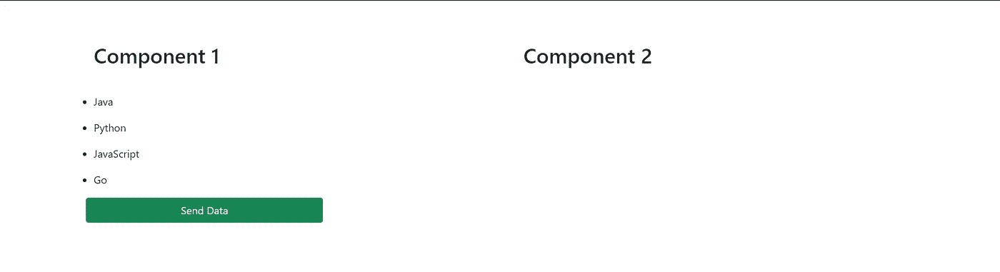
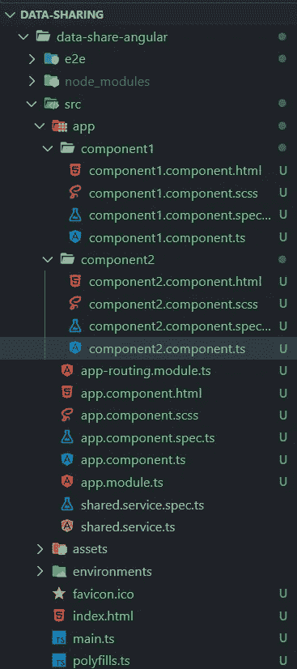
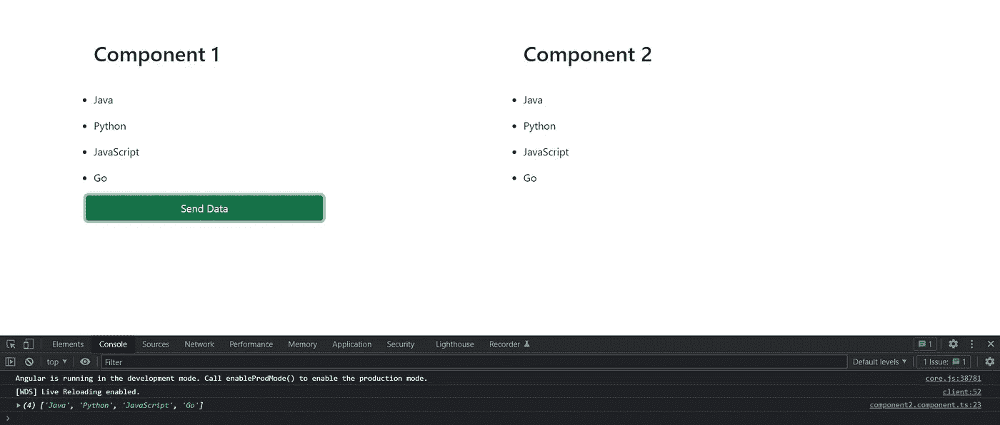

# 如何在两个角度组件之间轻松共享数据

> 原文：<https://javascript.plainenglish.io/how-to-easily-share-data-between-two-angular-components-b2c8ea93048d?source=collection_archive---------2----------------------->

## 使用 RxJS 主题在两个组件之间传递数据


Photo by [Christina @ wocintechchat.com](https://unsplash.com/@wocintechchat?utm_source=unsplash&utm_medium=referral&utm_content=creditCopyText) on [Unsplash](https://unsplash.com/s/photos/hosting?utm_source=unsplash&utm_medium=referral&utm_content=creditCopyText)

说到角度组件通信，首先想到的是通过@Input() decorator 的父子通信和通过@Output() decorator 的父子通信。这并不是组件之间传递数据的唯一技术。这里我们将使用 RxJS **Subject** 在两个组件之间传递数据。我们唯一需要的是一个共享文件。(一些服务文件)。

并且这两个组件不必一定是父组件和子组件。

让我们看看我们如何能做它。

我们有两个组件组件 1 和组件 2。我们的目标是将数据从第一个组件传递到第二个组件。



Component1 包含一些编程语言的名称。单击发送数据按钮后，它应该会填充到第二个组件中。

## 项目结构



Project Structure

在这个项目中，我们有 component1、component2 和共享服务文件。

共享服务是我们定义为“主题”的文件，以便在两个组件之间传递数据。

让我们进入编码部分。

## 共享服务文件

shared.service.ts

## 组件 1

[component1.component.html](https://gist.github.com/Kanchana46/bbfdfd38b4c4b27d04b88c95d279e572#file-component1-component-html)

[component1.component.ts](https://gist.github.com/Kanchana46/66bf6ae890cdbf072af1fd298656e553#file-component1-component-ts)

这里我们有一系列的编程语言。一旦点击发送数据按钮，这个数组将通过主题的***【next()***方法发出。

## 组件 2

[component2.component.html](https://gist.github.com/Kanchana46/ccf6836ebadc9b1cbcdd4a82bdede23a#file-component2-component-html)

[component2.component.ts](https://gist.github.com/Kanchana46/abdc1bcbd2f27f510990d4323d60479d#file-component2-component-ts)

在第二个组件中，我们有一个包含 ***语言*** 的空数组。我们要做的是用 component1 给出的数据填充这个数组。

因此，我们使用 **ngAfterContentInit** 生命周期钩子方法来订阅从 component1 传递的数据。您也可以使用 onInit。

在 onDestroy 中取消订阅已订阅的观察对象是一个很好的做法。

就是这样。请注意，您也可以使用 EventEmitter 代替 RxJS Subject。但这不是使用 EventEmitter 的子到父数据传递。

那么它应该在共享服务中定义如下。

```
***@Output() send_data = new EventEmitter<any>()***
```

并且在 component1 中我们做 ***emit()*** 而不是 ***next()*** 。

```
***this.sharedService.send_data.emit(this.languages)***
```

组件 2 没有任何变化。

让我们看看它是如何工作的。



单击发送数据后，数据已被填充到组件 2 中。我们也可以在控制台中看到数据。

当需要将数据从一个组件传递到另一个组件时，这种共享数据的方式非常有用。优点是我们可以应用这两个组件，并且本质上不需要父子关系。

它不仅可以用于在两个组件之间传递数据，还可以用于当一个组件中发生某个动作而另一个组件中需要发生某个动作时。

你可以在这里找到上面的样本代码[。](https://github.com/Kanchana46/angular-share-data.git)

希望这对您有所帮助。

谢谢大家！

*更多内容请看*[***plain English . io***](https://plainenglish.io/)*。报名参加我们的* [***免费周报***](http://newsletter.plainenglish.io/) *。关注我们关于*[***Twitter***](https://twitter.com/inPlainEngHQ)*和*[***LinkedIn***](https://www.linkedin.com/company/inplainenglish/)*。加入我们的* [***社区不和谐***](https://discord.gg/GtDtUAvyhW) *。*