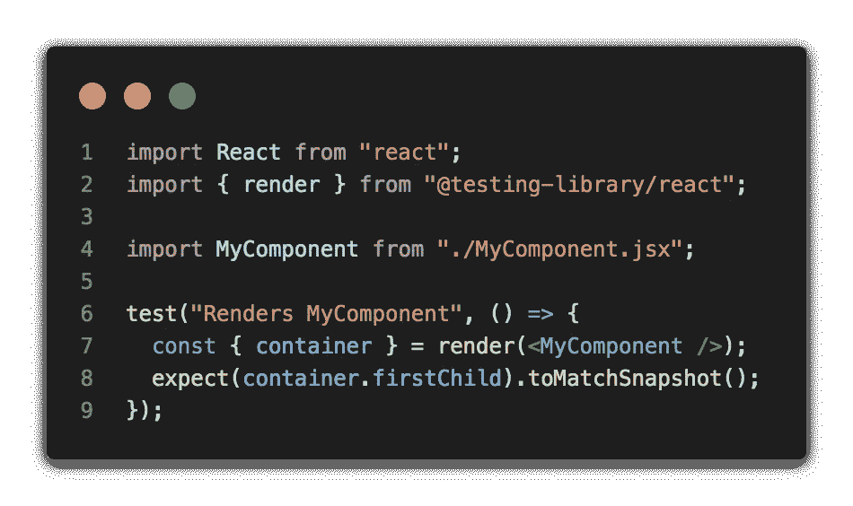

# 如何轻松测试 React 组件

> 原文：<https://javascript.plainenglish.io/how-to-easily-test-your-react-components-7b9040119fde?source=collection_archive---------20----------------------->

## Jest 基础教程，用于测试 SPA 应用中的 React 组件

这篇文章假设你知道什么是快照测试。



一旦您第一次运行测试，就会创建一个 *MyComponent* 的快照文件。在这种情况下，它将是 **MyComponent.test.js.snap** 。

```
// Jest Snapshot v1, https://goo.gl/fbAQLPexports[`Renders MyComponent`] = ` <div class="my-component-class">MyComponent rocks! 🤟</div>`;
```

新创建的快照文件代表了 *MyComponent* 呈现的内容。

如果您继续工作并对组件应用一些更改(HTML 或 CSS)并再次运行测试脚本，输出将返回一个基于收到的**与预期的**差异的错误。


Interactive Jest testing

感谢您阅读本文。如果这篇文章以任何方式帮助了你，一个关注或一些👏将不胜感激！

更多的东西[这里](https://github.com/sponsors/casvil)那里[那里](https://medium.com/@davidcasanellas)。🚀

*更多内容看* [***说白了就是***](http://plainenglish.io/) *。报名参加我们的* [***免费周报***](http://newsletter.plainenglish.io/) *。在我们的* [***社区不和谐***](https://discord.gg/GtDtUAvyhW) *获得独家获取写作机会和建议。*