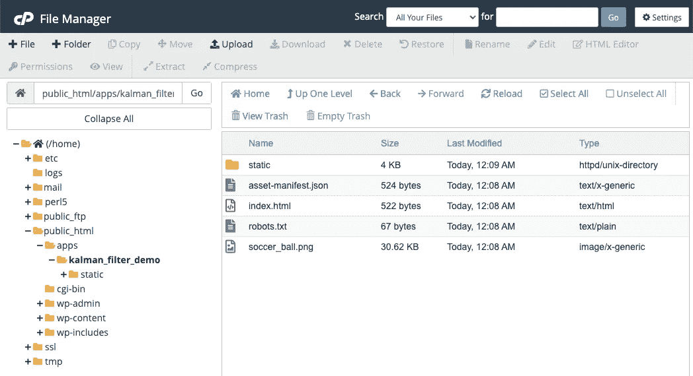

# 如何在 WordPress 网站中嵌入 React 应用程序

> 原文：<https://javascript.plainenglish.io/how-to-embed-a-react-app-inside-a-wordpress-website-923e0af0ea00?source=collection_archive---------6----------------------->

## 或者网络上的任何地方

Photo by [Florian Olivo](https://unsplash.com/@florianolv?utm_source=medium&utm_medium=referral) on [Unsplash](https://unsplash.com?utm_source=medium&utm_medium=referral)

这是一个简单的教程，介绍如何在现有的网页中嵌入一个完整的 React 应用，包括 WordPress 站点页面。我发现这是一种为我的个人网站快速构建演示应用和自定义交互组件的简单方法。

*注意:本指南使用* `npm` *，但是如果您使用* `yarn` *也是一样。*

# 第一步

**创建你的 react 应用**，比如`npx create-react-app my-app --template typescript`，像平常一样开发它。如果你计划将布局嵌入到一个具有响应性布局的网页中，考虑让布局适应不同的页面宽度和高度，这在 WordPress 主题中很常见。

# 第二步

**打造你的应用**。首先，设置应用程序的 build homepage 变量。在`package.json`中增加`"homepage": ".",`。这将把生成的`index.html`文件中的路径设置为相对路径。

然后，运行`npm run build`。要测试您的构建，只需导航到构建文件夹，例如`../my-app/build`，并在 web 浏览器中打开`index.html`。确认一切正常。

# 第三步

将构建文件夹上传到你的网络服务器。如果您使用托管服务，您可以使用 SSH、FTP 或提供的 UI 来完成这项工作。*这一步还不涉及 WordPress！*

This is what the upload looks like in BlueHost’s File Manager UI.

上传到你服务器上的`public_html`目录(WordPress 就在那里)。例如，我会将“我的应用程序”放在`public_html/apps/my-app-build/`下。它应该就是由`npm run build`生成的构建文件夹。

如果你没有使用 WordPress，想法是一样的——只需将构建文件夹上传到 web 服务器可以访问的目录中。

# 第四步

将应用程序嵌入网页。这可以使用`iframe`来完成。大多数 WordPress web builders 都有这样做的方法。例如，在 Elementor 中，您可以使用 Shortcode 小部件。

*注意:*确保如上所述用`</iframe>`关闭标签。如果你使用它作为一个自结束标签(`<iframe … />`)，它将会在你的页面上切断它下面的内容。

你也可以直接创建一个到 build 文件夹的超链接来获得整页的应用体验，例如`https://yourwebsite.com/apps/my-app-build`。可以根据需要手动修改`index.html`文件，因为它只是一个标准的 HTML 文件——只是不要删除根 div 或脚本/CSS。

# 尽情享受吧！

*更多内容看* [***说白了。报名参加我们的***](http://plainenglish.io/) **[***免费周报***](http://newsletter.plainenglish.io/) *。在我们的* [***社区获得独家访问写作机会和建议***](https://discord.gg/GtDtUAvyhW) *。***