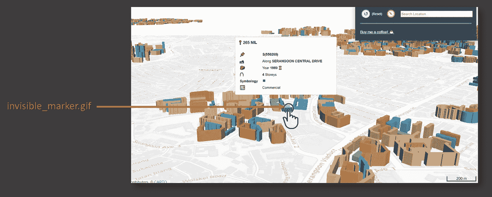
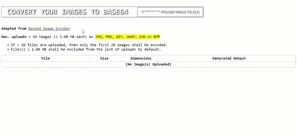

# 如何用普通 JavaScript 在 Base64 中编码图像文件

> 原文：<https://javascript.plainenglish.io/how-to-encode-image-files-in-base64-with-plain-javascript-4927fa08e063?source=collection_archive---------12----------------------->

代码实现&链接到离线工具包括在内。

在过去的几个月里，在创建可移植的、易于转移的基于浏览器的工具以提高工作效率的竞赛中，我经常发现自己转向在线工具，如[**Base64 Image Encoder**](https://www.base64-image.de/)来将图像或网站徽标嵌入到一个 HTML 文件中。

> *Base64 编码的正式定义，请参考这个* [*链接*](https://developer.mozilla.org/en-US/docs/Glossary/Base64) *。*

## 用例示例:在 Web 应用程序上呈现地图标记

*仅供参考:我在本文中重点关注的 Base64 编码的具体实例将缩小到仅嵌入 web 图像的* ***。***

1 将图像作为 Base64 字符串嵌入 web 应用程序的最大优势是*减少 web 应用程序每次部署所需的静态文件数量*。

例如，在网络应用[https://sg-hdb-building-layer-in-three-d.netlify.app/](https://sg-hdb-building-layer-in-three-d.netlify.app/)上，我选择在每栋建筑上放置一个可点击的地图标记，用于可选的工具提示显示:



Image by Author | The above illustrates the user clicking 1 of the buildings at a specific marker where the image “invisible_marker.gif” is positioned at. | Web app deployed at: [https://sg-hdb-building-layer-in-three-d.netlify.app/](https://sg-hdb-building-layer-in-three-d.netlify.app/)

而不是将图像 **invisible_marker.gif** 作为单独的文件保存在:[https://github . com/孵育-geek-cc/SG-hdb-building-layer-in-3D-offline/blob/main/asset/img/invisible _ marker . gif](https://github.com/incubated-geek-cc/sg-hdb-building-layer-in-3D-offline/blob/main/asset/img/invisible_marker.gif)

相反，我选择将文件嵌入为一个 Base64 字符串:

```
data:image/gif;base64,R0lGODlhAQABAIAAAAAAAP///yH5BAEAAAAALAAAAAABAAEAAAIBRAA7
```

> 当 web 应用程序的静态文件数量混乱、分散且只使用一次时，将图像编码为 base64 字符串非常有用。

因此，为了减少对外部 web 工具的依赖，如 [**Base64 图像编码器**](https://www.base64-image.de/) ，我创建了一个本地的和不依赖于服务器的版本，如下所示:



Screencapture by Author | Demonstrating usage of local browser tool to encode image file(s) into base64 formats.

## 你可以在我的 GitHub:[encodeBase64.html](https://gist.githubusercontent.com/incubated-geek-cc/37322f04504b253f3f1e619be1f5fc0e/raw/8229cd209f6e04d068cc67386188b22a217a1bf0/encodeBase64.html)或者在这个[链接](https://incubated-geek-cc.github.io/encode-base64/)尝试一下！

## 个人评论:

请注意，并非所有用例都适合以编码状态呈现图像。当无法在浏览器的本地存储中缓存文件成为用户的一大负担时，由于 web 应用程序性能的降低，这种情况尤其明显。这种情况包括:

**(1)** 图像文件很大(> 1MB) *(base64 字符串的大小往往比其原始文件大小大~ 33%)*

**(2)** 图像文件在不同的网页上渲染多次*(在这种情况下，缓存文件可以显著提高 web 应用程序的加载时间)*

现在你知道了！非常感谢你坚持到这篇文章的结尾！❤希望你觉得这个指南有用，如果你想了解更多 GIS、数据分析& Web 应用相关的内容，请随时[关注我的 Medium](https://medium.com/@geek-cc) 。会非常感激—😀

— 🌮请给我买个玉米卷🎀˶❛◡❛)

[](https://geek-cc.medium.com/membership) [## 通过我的推荐链接加入灵媒——李思欣·崔

### 获得李思欣·崔和其他作家在媒体上的所有帖子！😃您的会员费直接…

geek-cc.medium.com](https://geek-cc.medium.com/membership) 

**这里有一些其他的离线工具，你可能会发现它们对你的日常工作很有用:**

[](/an-offline-qr-code-generator-reader-built-in-100-vanilla-javascript-b7e8aec812e8) [## 100%纯 JavaScript 内置的离线二维码生成器/阅读器

### 为什么每个人都应该准备好这个。包含工具链接。

javascript.plainenglish.io](/an-offline-qr-code-generator-reader-built-in-100-vanilla-javascript-b7e8aec812e8) [](https://medium.com/geekculture/this-is-how-you-can-email-exe-or-bat-files-in-3-steps-in-the-year-2021-c0aa482e9e1) [## 这是你发邮件的方式。exe 或。2021 年 bat 分三步申请

### 绕过谷歌和微软的电子邮件协议比大多数人想象的要容易——对技术和非技术行家来说都是如此。是否…

medium.com](https://medium.com/geekculture/this-is-how-you-can-email-exe-or-bat-files-in-3-steps-in-the-year-2021-c0aa482e9e1) 

*更多内容看* [***说白了就是***](http://plainenglish.io/) *。报名参加我们的* [***免费周报***](http://newsletter.plainenglish.io/) *。在我们的* [***社区不和谐***](https://discord.gg/GtDtUAvyhW) *获得独家获取写作机会和建议。*