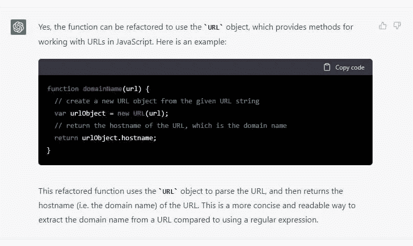

# 如何用 JavaScript 从 URL 中提取域名

> 原文：<https://javascript.plainenglish.io/how-to-extract-the-domain-name-from-a-url-in-javascript-abe123d02cc?source=collection_archive---------1----------------------->

## 毁灭 2022

## 或者，如果你依靠人工智能来完成你的工作，你会失败吗


起初我想让一个人工智能来写这篇文章。看过很多对 [ChatGPT](https://openai.com/blog/chatgpt/) 的热情评价。今天的倒霉事很简单。为什么不呢？

问题是没有办法让他解决一个微不足道的问题。我没有期待最好的解决方案(这篇文章的第三个)，但至少是正确的。然而，现在我用传统的方法解决了这个问题。

但是让我们从今天的问题开始。

# 问题是

链接到[形](https://www.codewars.com/kata/514a024011ea4fb54200004b)

编写一个函数，当给定一个字符串形式的 URL 时，它只解析出域名并以字符串形式返回。例如:

> URL = "[http://github.com/carbonfive/raygun](http://github.com/carbonfive/raygun)"->域名= " github "
> URL = "[http://www.zombie-bites.com](http://www.zombie-bites.com)"->域名= "僵尸咬"
> URL = "[https://www.cnet.com](https://www.cnet.com)"->域名= cnet "

# 我的解决方案


我的解决方案是依次使用 [String.replace()](https://developer.mozilla.org/en-US/docs/Web/JavaScript/Reference/Global_Objects/String/replace) 方法。我对正则表达式不太了解，无法一步完成所有工作。

```
const domainName = (url) => url.replace(/^https?:\/\//, "")
                              .replace(/^www\./, "")
                              .replace(/\..*/, '');
```

为了更好地解释，我将我的职能分为 3 个部分:

*   `replace(/^https?:\/\//,"")`从字符串中删除`http://`和`https://`
*   `replace(/^www\./,"")`移除`www.`
*   `replace(/\..*/,"")`删除第一个点之后的所有内容

显然，那些更好地处理正则表达式的人可以尝试编写一个单独的表达式:

```
const domainName = (url) => url.match(/(?:http(?:s)?:\/\/)?(?:w{3}\.)?([^\.]+)/i)[1];
```

但我最喜欢的解决方案是:

```
const domainName = (url) => url.replace(/.+\/\/|www.|\..+/g, '');
```

我觉得很优雅，比我的简洁多了。所以我推荐用这个最新版本。

感谢阅读！敬请关注更多内容。

***不要错过我的下一篇文章—报名参加我的*** [***中邮箱列表***](https://medium.com/subscribe/@el3um4s)

[](https://el3um4s.medium.com/membership) [## 通过我的推荐链接加入 Medium—Samuele

### 阅读萨缪尔的每一个故事(以及媒体上成千上万的其他作家)。不是中等会员？在这里加入一块…

el3um4s.medium.com](https://el3um4s.medium.com/membership) 

## PS:

写完这个故事后，过了几天，我试着再次询问 ChatGPT。这次结果更好。

第一个提出的解决方案完全不合适:

```
function getDomainName(url) {
  // create a new anchor element
  var a = document.createElement('a');
  // set the href of the anchor element to the URL passed to the function
  a.href = url;
  // return the hostname of the URL (the domain name)
  return a.hostname;
}
```

另一方面，第二种解决方案是正确的，并且能够通过各种测试:

```
function domainName(url) {
  // create a regular expression to match the domain name
  var regex = /^(?:https?:\/\/)?(?:w{3}\.)?([^\.]+)/;
  // use the regex to extract the domain name from the URL
  var match = url.match(regex);
  // return the matched domain name, or an empty string if no match was found
  return match ? match[1] : '';
}
```


但是如果我让人工智能折射这个函数，结果还是错的:

```
function domainName(url) {
  // create a new URL object from the given URL string
  var urlObject = new URL(url);
  // return the hostname of the URL, which is the domain name
  return urlObject.hostname;
}
```



所以总结一下:

*   ChatGPT 在某些情况下令人震惊
*   如果你不知道如何编程，依靠 ChatGPT 简直是灾难
*   有一个测试机制总是更好，因为有时人工智能提出的解决方案是可信的，但却是错误的

*更多内容请看*[***plain English . io***](https://plainenglish.io/)*。报名参加我们的* [***免费周报***](http://newsletter.plainenglish.io/) *。关注我们关于*[***Twitter***](https://twitter.com/inPlainEngHQ)[***LinkedIn***](https://www.linkedin.com/company/inplainenglish/)*[***YouTube***](https://www.youtube.com/channel/UCtipWUghju290NWcn8jhyAw)*[***不和***](https://discord.gg/GtDtUAvyhW) ***。*****

*****对缩放您的软件启动感兴趣*** *？检查* [***电路***](https://circuit.ooo/?utm=publication-post-cta) *。***