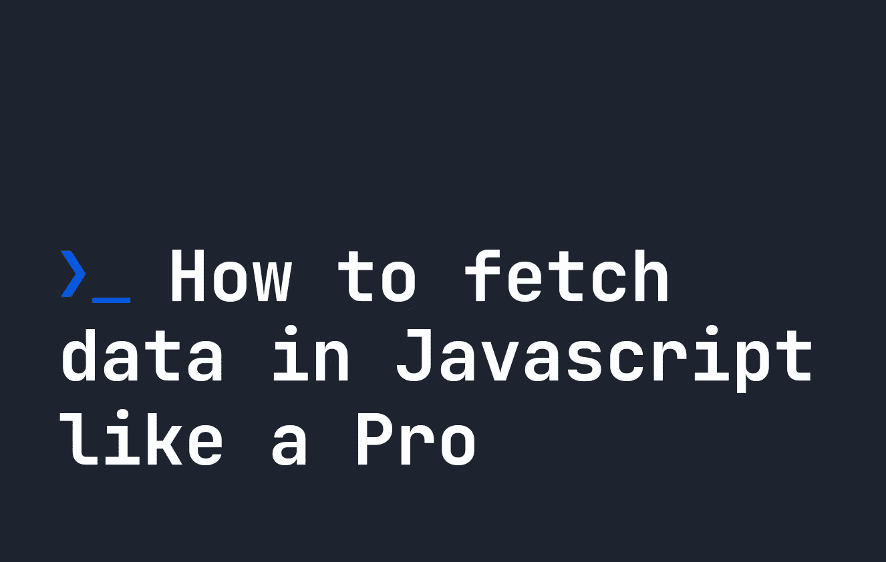

# 如何像专业人士一样在 JavaScript 中获取数据

> 原文：<https://javascript.plainenglish.io/how-to-fetch-data-in-javascript-like-a-pro-6394d38ed255?source=collection_archive---------6----------------------->

## 你在摸索 API 吗？本教程将教你如何像专业人士一样使用 fetch API 获取 JavaScript 中的数据。



`fetch` API 允许我们创建一个 HTTP 请求，这样我们就可以在 JavaScript 中完成很多事情——比如从 API 中检索数据，向服务器发送数据，或者甚至只是获取一个网页的全部内容。这个 HTTP 请求将从提供的 URL 中异步检索数据，并生成某种 HTTP 响应。让我们看看它是如何工作的。

`fetch()`函数是一个全局函数，它最常用于与 API 交互。如果你是新手，你并不孤单——所以让我们来看看`fetch()`是如何工作的。

# 在 JavaScript 中使用 fetch

fetch 最基本的用法是接受一个参数——我们要获取的 URL。由于`fetch`生成 HTTP 请求，我们总是需要提供一个 URL:

```
let fetchExample = fetch("https://fjolt.com").then((res) => {
    // Do something with res
});
```

由于获取的结果是异步的，我们可以使用`then()`来捕捉响应，并对其进行处理。关于返回的`res`或响应，很酷的一点是它有一堆内置方法，让我们可以立即解析从`fetch`获得的内容:

*   `res.text()` -返回一个 URL 的文本内容。如果是一个网站，它返回 HTML。
*   `res.json()` -返回格式化的 JSON 数据，如果存在的话。
*   `res.blob()` -返回 blob 数据，如果有的话。
*   `res.arrayBuffer()` -返回 arrayBuffer 数据，如果有的话。
*   `res.formData()` -返回表单数据数据(如果有)。

由于不同的 URL 产生不同类型的内容，上述方法允许我们以任何我们喜欢的方式解析内容。为了理解这一切是如何工作的，让我们看两个非常常见的例子。

# 示例 1:使用 JavaScript fetch 获取网站的 HTML 内容

如上所述，`res.text()`给了我们一个 URL 的文本内容——所以我们可以用它来获得一个 URL 的全部 HTML 内容。一旦我们使用`res.text()`捕捉到我们的响应，我们就可以使用另一个`then`捕捉响应，允许我们下载并返回所提供的 URL 的内容:

```
let websiteData = fetch("https://fjolt.com").then(res => res.text()).then((data) => {
    return data;
}); 
// Now contains our website's HTML.
```

如果链接不存在，或者发生错误，我们的`response`对象将包含一个错误。例如，未找到的页面将返回`404`，或者坏网关错误将返回`502`。

# 示例 2:通过 JavaScript Fetch 获取 JSON

如果一个 URL 的内容由 JSON 组成，我们可以使用`res.json()`。例如，下面的代码将从 URL 返回一个 JSON 对象，假设 URL 发送回有效的 JSON:

```
let apiResponse = fetch("https://fjolt.com/api").then(res => res.json()).then((data) => {
    return data;
});
// Now contains a JSON object - assuming one exists
```

# JavaScript 提取选项

理解 fetch 中可用的选项也很重要。它们跟在 URL 后面，作为一个对象—即`fetch(URL, { options })`。如果您以前处理过 HTTP 请求，有些可能会很熟悉。下面显示的`fetch`功能包含了您可以使用的所有可能选项:

```
fetch("https://fjolt.com/", {
    body: JSON.stringify({ someData: "value" })
    method: 'POST'
    mode: 'cors'
    cache: 'no-cache'
    credentials: 'same-origin'
    headers: {
      'Content-Type': 'application/json'
    },
    redirect: 'follow'
    referrerPolicy: 'no-referrer'
});
```

以下是对每一项含义的总结:

*   `body`包含正文的正文。在这个例子中，我们发送一些 JSON，需要进行字符串化。
*   `method`是一种标准的 HTTP 方法。可以是`POST`/`GET`/`DELETE`/`PUT`/`CONNECT`/`PATCH`/`TRACE`/`OPTIONS`。
*   `mode`表示是否接受跨来源请求。可以是`cors` / `no-cors` / `same-origin`。
*   `cache`指浏览器将如何与缓存交互。可以是`default` / `no-cache` / `reload` / `force-cache` / `only-if-cached`。
*   `credentials`指跨来源 cookies 是否应随请求一起发送。可以是`include` / `same-origin` / `omit`。
*   `headers`包含任何与请求相关的头。它可以包含任何 HTTP 头——例如，这里显示的是`Content-Type`——但是也可以有自定义的 HTTP 头。
*   `redirect`确定如果提取的 URL 重定向会发生什么。可以是`follow` / `error` / `manual`。
*   `referrerPolicy`确定请求中传递了多少推荐信息。可以是`no-referrer`/`no-referrer-when-downgrade`/`origin`/`origin-when-cross-origin`/`same-origin`/`strict-origin`/`strict-origin-when-cross-origin`/`unsafe-url`。

# 记住，JavaScript 获取是异步的

当我们使用 fetch 时，它会转到 URL，收集信息，并向我们返回一个`response`。这并不是立竿见影的，因为加载、下载和恢复 URL 需要时间。如果我们简单地单独运行 fetch，紧随其后的控制台日志将只返回一个`Promise`，而不是来自我们想要的 URL 的`response`:

```
let apiResponse = fetch("https://fjolt.com/api");console.log(apiResponse); // Returns Promise<Pending>
```

发生这种情况是因为`fetch()`函数运行了，但是 JavaScript 没有等待`response`。因此，如果我们想要访问`response`，我们必须明确地告诉 JavaScript 等待它。

等待`fetch()`有两种方式:

*   我们可以使用`then`，并在`then()`中操纵`fetch()`的响应。
*   我们可以使用`await`，并在使用其内容之前等待 fetch 返回。

# 使用 then 等待 JavaScript 中的提取

Using `then`经常用于捕捉和处理 fetch 的响应。可以在`then()`回调函数内操作`fetch()`的内容，但不能在函数外操作。例如:

```
let apiResponse = fetch("https://fjolt.com/api").then(res => res.json()).then((data) => {
    console.log(data);
    // We can do anything with the data from our api here. 
    return data;
});console.log(apiResponse); // This will return Promise<Pending>
                          // That means we can't use the apiResponse variable
                          // outside of the then() function.
```

如果我们想在`then`之外使用`fetch()`中的内容，我们必须使用`await`。

# 在 JavaScript 中使用 await 等待提取

另一种等待获取的方法是使用`await`关键字。大多数现代浏览器支持[顶级等待](https://caniuse.com/?search=top%20level%20await)，但是如果你担心支持，还是使用 Node 的版本。在 14.8 之前的 JS 中，您会希望将任何`await`代码包装在一个`async function`中。

如果我们使用 await，我们可以在函数或代码中的任何地方使用来自 API 的响应，并在其上使用任何`response`函数，比如`text()`或`json()`。例如:

```
// Typically we wrap await in an async function
// But most modern browsers and Node.JS support
// await statements outside of async functions now.
async getAPI() {
    let apiResponse = await fetch("https://fjolt.com/api");
    let response = apiResponse.json();
    // Since we waited for our API to respond using await
    // The response variable will return the response from the API
    // And not a promise.
    console.log(response);
}getAPI();
```

如果你想了解更多关于异步操作的知识，[点击这里](https://fjolt.com/article/javascript-async)阅读我们的异步 JavaScript 教程。

# 结论

在本指南中，我们已经了解了 fetch 的工作原理。我们已经展示了可以随`fetch()`请求一起发送的不同选项，以及如何使用 JavaScript 中的异步概念等待响应。`fetch()`是 JavaScript 中一个非常强大的工具，在大型产品中经常使用。我希望你喜欢这篇文章。

*更多内容看* [***说白了。报名参加我们的***](https://plainenglish.io/) **[***免费周报***](http://newsletter.plainenglish.io/) *。关注我们关于* [***推特***](https://twitter.com/inPlainEngHQ) ，[***LinkedIn***](https://www.linkedin.com/company/inplainenglish/)*，*[***YouTube***](https://www.youtube.com/channel/UCtipWUghju290NWcn8jhyAw)*，* [***不和***](https://discord.gg/GtDtUAvyhW) *。对增长黑客感兴趣？检查* [***电路***](https://circuit.ooo/) *。***