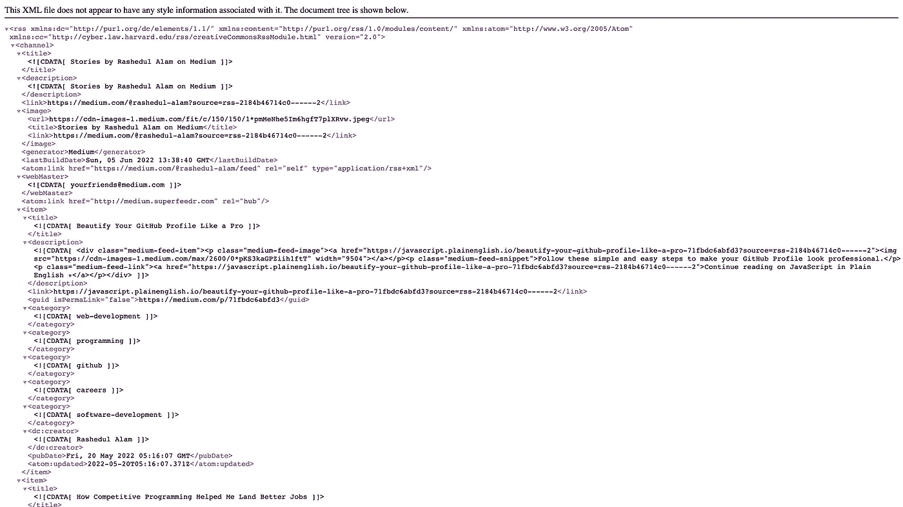
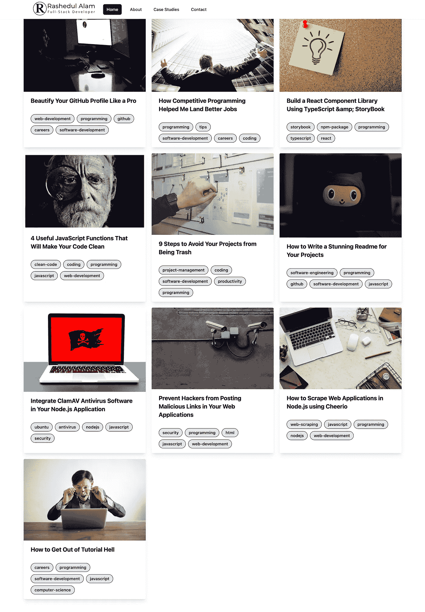

# 如何在你的网站中获取你的媒体文章

> 原文：<https://javascript.plainenglish.io/how-to-fetch-your-medium-articles-in-your-website-31b79df9377f?source=collection_archive---------6----------------------->

## 轻松获取你的作品集或个人网站中的中型文章


Photo by [Jess Bailey](https://unsplash.com/@jessbaileydesigns?utm_source=medium&utm_medium=referral) on [Unsplash](https://unsplash.com?utm_source=medium&utm_medium=referral)

作为开发者和作者，我们喜欢在我们的网站上展示我们的文章。因此，我们想在我们的投资组合网站上显示我们的文章列表，因为我们写在媒体上。

Medium 有自己公开可用的 API，通过它我们可以从任何地方向 Medium 写入数据。但不幸的是，它没有提供任何方法来获得你写的文章列表，并在你的网站上显示出来。

幸运的是，这个问题有一个解决方法。这篇文章将展示如何使用 JavaScript 获取我们的媒体文章，并在我们的网站上显示它们。

因此，没有进一步的行动，让我们直接进入它。

# 变通办法

虽然我们不能从 Medium 获得 API，但是我们可以从这个端点:[https://medium.com/feed/@username](https://medium.com/feed/@username)获得我们的故事的 RSS 提要。这里，我们需要将用户名替换为您的中级用户名。

用你的用户名点击这个 feed，你就可以获得你所有故事的 RSS feed。例如，在我的例子中，大概是这样的:



## 将 RSS 转换为 JSON

我们的下一步是将 RSS 数据转换成 JSON 对象。幸运的是，我们可以从这个 URL:【https://api.rss2json.com/v1/api.json? 的 RSS 提要中获得 JSON 数据 RSS _ URL = https://medium . com/feed/@ username。我们需要将用户名更改为您的中级用户名。

在我的例子中，我们得到了类似下面的数据:

```
{
  "status":"ok",
  "feed":{
    "url":"[https://medium.com/feed/@rashedul-alam](https://medium.com/feed/@rashedul-alam)",
    "title":"Stories by Rashedul Alam on Medium",
    "link":"[https://medium.com/@rashedul-alam?source=rss-2184b46714c0------2](https://medium.com/@rashedul-alam?source=rss-2184b46714c0------2)",
    "author":"",
    "description":"Stories by Rashedul Alam on Medium",
    "image":"[https://cdn-images-1.medium.com/fit/c/150/150/1*pmMeNhe5Im6hgfT7plXRvw.jpeg](https://cdn-images-1.medium.com/fit/c/150/150/1*pmMeNhe5Im6hgfT7plXRvw.jpeg)"
  },
  "items":[
    {
      "title":"Beautify Your GitHub Profile Like a Pro",
      "pubDate":"2022-05-20 05:16:07",
      "link":"[https://javascript.plainenglish.io/beautify-your-github-profile-like-a-pro-71fbdc6abfd3?source=rss-2184b46714c0------2](/beautify-your-github-profile-like-a-pro-71fbdc6abfd3?source=rss-2184b46714c0------2)",
      "guid":"[https://medium.com/p/71fbdc6abfd3](https://medium.com/p/71fbdc6abfd3)",
      "author":"Rashedul Alam",
      "thumbnail":"[https://cdn-images-1.medium.com/max/2600/0*pKS3kaGPZiih1ftT](https://cdn-images-1.medium.com/max/2600/0*pKS3kaGPZiih1ftT)",
      "description":"<div class=\"medium-feed-item\">\n<p class=\"medium-feed-image\"><a href=\"[https://javascript.plainenglish.io/beautify-your-github-profile-like-a-pro-71fbdc6abfd3?source=rss-2184b46714c0------2\](/beautify-your-github-profile-like-a-pro-71fbdc6abfd3?source=rss-2184b46714c0------2%5C)"></a></p>\n<p class=\"medium-feed-snippet\">Follow these simple and easy steps to make your GitHub Profile look professional.</p>\n<p class=\"medium-feed-link\"><a href=\"[https://javascript.plainenglish.io/beautify-your-github-profile-like-a-pro-71fbdc6abfd3?source=rss-2184b46714c0------2\](/beautify-your-github-profile-like-a-pro-71fbdc6abfd3?source=rss-2184b46714c0------2%5C)">Continue reading on JavaScript in Plain English \u00bb</a></p>\n</div>",
      "content":"<div class=\"medium-feed-item\">\n<p class=\"medium-feed-image\"><a href=\"[https://javascript.plainenglish.io/beautify-your-github-profile-like-a-pro-71fbdc6abfd3?source=rss-2184b46714c0------2\](/beautify-your-github-profile-like-a-pro-71fbdc6abfd3?source=rss-2184b46714c0------2%5C)"></a></p>\n<p class=\"medium-feed-snippet\">Follow these simple and easy steps to make your GitHub Profile look professional.</p>\n<p class=\"medium-feed-link\"><a href=\"[https://javascript.plainenglish.io/beautify-your-github-profile-like-a-pro-71fbdc6abfd3?source=rss-2184b46714c0------2\](/beautify-your-github-profile-like-a-pro-71fbdc6abfd3?source=rss-2184b46714c0------2%5C)">Continue reading on JavaScript in Plain English \u00bb</a></p>\n</div>",
      "enclosure":{

      },
      "categories":[
        "web-development",
        "programming",
        "github",
        "careers",
        "software-development"
      ]
    },
    ...
  ]
}
```

万岁！我们已经成功获取了我们最新媒体故事的 JSON 数据。我们现在可以在我们的网站上分享这些数据。

## 履行

在这一点上，我们明白了如何获取数据并在我们的网站上显示我们的媒体故事。现在是时候从我们的应用程序调用 API 并呈现我们的故事列表了。

我们可以使用任何 HTTP 客户端(如 Axios 或 Ajax)或 web 应用程序支持的任何客户端从 URL 获取数据。

在本例中，我们将在 React 应用程序中构建一个自定义挂钩来获取媒体文章。

在这里，我们构建了一个简单的 React 挂钩，它将获取我最新的中型文章。

拿到文章后，我们可以在我们的网站上呈现它们。就我而言，是这样的:



# 结论

我们最终设法获得了我们最新的媒体故事列表，并将其展示在我们的投资组合网站上。我们甚至可以在自己的网站上随心所欲地呈现我们的故事。因为我们现在可以从 Medium 网站获取 JSON 数据。

感谢阅读我的文章。祝您愉快！

*更多内容请看*[***plain English . io***](https://plainenglish.io/)*。报名参加我们的* [***免费周报***](http://newsletter.plainenglish.io/) *。关注我们关于*[***Twitter***](https://twitter.com/inPlainEngHQ)*和*[***LinkedIn***](https://www.linkedin.com/company/inplainenglish/)*。查看我们的* [***社区不和谐***](https://discord.gg/GtDtUAvyhW) *加入我们的* [***人才集体***](https://inplainenglish.pallet.com/talent/welcome) *。*