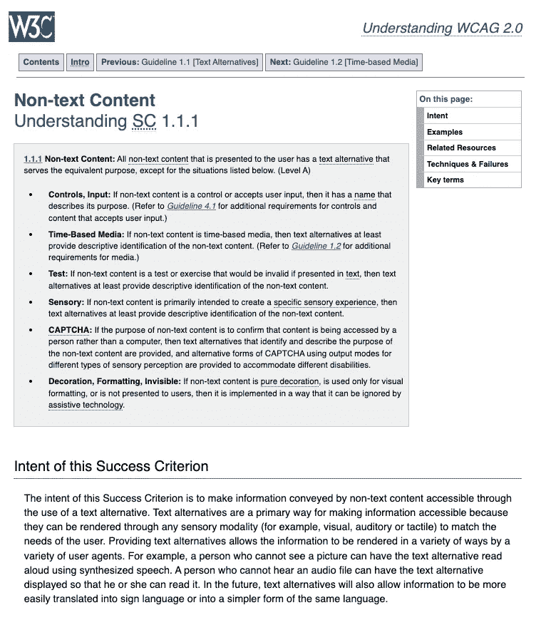

# 如何填写自愿产品可及性模板(VPAT)

> 原文：<https://javascript.plainenglish.io/how-to-fill-in-voluntary-product-accessibility-template-vpat-78ff28552e35?source=collection_archive---------7----------------------->

VPAT 报告有助于满足政府法规要求并赢得政府合同


Image by author

可访问性(accessibility)(`a11y`)是使应用程序对能力受到某种限制的人有用的实践。应用可以是网络应用、电子文档、软件和/或创作工具。这种限制可以是身体上的，也可以是精神上的，例如视力、听力、语言、行动能力和/或认知能力。它也可能来自设备的功能，例如移动设备。

实施可访问的应用程序具有以下优势:

1.  它赋予每个人包容的力量。
2.  它让产品看起来比竞争对手更有竞争力。
3.  它符合政府法规，并有助于赢得政府合同。

我们已经写了[构建具有可访问性的 Web 应用程序的 10 个步骤(a11y)](https://medium.com/better-programming/10-steps-to-building-web-applications-with-accessibility-a11y-81cd2c1dd499) ，这适用于第 1 项和第 2 项。

在本文中，我们将重点讨论第 3 项，以符合政府法规。我们将使用一个 Web 应用程序作为例子，尽管同样的概念可以应用于其他应用程序类型。

# 什么是 VPAT？

[自愿产品可访问性模板(VPAT )](https://www.section508.gov/sell/vpat/) 是一份说明信息和通信技术(ICT)产品(如软件、硬件、电子内容和支持文档)如何满足或符合针对 IT 可访问性的[修订版 508 标准](https://www.access-board.gov/guidelines-and-standards/communications-and-it/about-the-ict-refresh/final-rule)的文档。

VPAT 帮助联邦机构合同官员和政府购买者在进行市场研究和评估提案时评估 ICT 的可访问性。建议供应商生成一个 VPAT。

VPAT 第 508 章修订版包括以下标准/指南:

*   [网页内容无障碍指南(WCAG) 2.0](http://www.w3.org/TR/2008/REC-WCAG20-20081211)
*   [2017 年 1 月 18 日发布的第 508 节标准修订版，2018 年 1 月 22 日更正](https://www.access-board.gov/guidelines-and-standards/communications-and-it/about-the-ict-refresh/final-rule/text-of-the-standards-and-guidelines)

VPAT 报告针对特定的产品版本。如果多个版本共享相同的信息，它们可以合并到一个报告中。否则，每个产品版本都应该有自己的报告。

# 哪里可以得到 VPAT 模板？

为了填写 VPAT 报告，我们需要一个 VPAT 模板。以下是可以从[政府网站](https://www.itic.org/policy/accessibility/vpat)下载的模板列表:

*   [VPAT 2.4 修订版欧盟(2022 年 3 月)](https://www.itic.org/dotAsset/2e0ea4cb-5aec-417a-8046-8efbe478ccbd.doc)(2022 年 3 月 16 日):欧盟的无障碍要求适用于欧洲 ICT 产品和服务的公共采购
*   [VPAT 2.4 rev 508(2022 年 3 月)](https://www.itic.org/dotAsset/353efda0-598d-4593-aa53-f4f1f0f61d82.doc)(2022 年 3 月 16 日):美国联邦无障碍标准
*   [VPAT 2.4 rev WCAG(2022 年 3 月)](https://www.itic.org/dotAsset/7edcd54d-c6a6-4649-8375-4a0f0c68eff2.doc)(2022 年 3 月 16 日):WCAG 2.1 或 ISO/IEC 40500(相当于 WCAG 2.0)和 WCAG2.1，W3C/WAI 最近更新的网页内容可访问性指南
*   [VPAT 2.4 rev INT(2022 年 3 月)](https://www.itic.org/dotAsset/e201819b-a04e-43fa-b789-43a4080b2f7a.doc)(2022 年 3 月 16 日):整合了上述所有三项标准

拿起其中一个模板。对于我们的例子，我们将使用 VPAT 2.4 rev 508(2022 年 3 月)(2022 年 3 月 16 日):美国联邦无障碍标准。

# VPAT 2.4Rev 508

文件的第一部分解释如何填写表格，第二部分是实际表格，由以下部分组成:

*   [信息部分](#c586)
*   [表 1:成功标准，A 级](#a9ff)
*   [表 2:成功标准，AA 级](#8425)
*   [表 3:成功标准，AAA 级](#af51)
*   [修订后的 508 条款报告—第 3 章](#547c)
*   [修订后的 508 条款报告——第 4 章](#54af)
*   [修订后的 508 条款报告—第 5 章](#4df6)
*   [修订后的 508 条款报告—第 6 章](#2a75)
*   [法律免责声明(公司)](#a072)

填写每个部分的过程很繁琐，但表明特定产品符合政府法规是至关重要的。我们将参观每一个部分。

## 情报室

信息部分位于文档的开头。包括公司名称、产品名称、版本、报告日期等。

假设公司名为 ABC，产品是一个名为 BubbleLand 的 Web 应用程序。以下是信息部分的示例:

> ABC 无障碍合规报告
> 
> 修订版第 508 节
> 
> (基于 VPAT 版本 2.4Rev)
> 
> 产品名称/版本:泡泡乐园版第四版，第五版
> 
> 报告日期:2022 年 8 月 27 日
> 
> 产品描述:BubbleLand 是一个管理个人社交生活的网络应用程序。
> 
> 联系方式:lawyer@bubbleland.com
> 
> 使用的评估方法:ABC 工作人员主要使用手动测试方法来评估是否符合列出的可访问性标准。一些 Chrome 可访问性扩展用于帮助测试。

## 表 1:成功标准，A 级

WCAG 2.0 指南按标准编号组织，如`1.1.1`、`1.2.1`、`1.2.2`、`1.2.3`、`1.2.4`。`1.2.5`等。以下是指南的第一页:


Image by author

每个标准被划分为以下符合性级别之一:

*   A 级 **:** 这是最低级别的一致性，网页满足所有 A 级成功标准。
*   AA 级 **:** 是较高的一致性级别，其中网页满足所有 A 级和 AA 级成功标准。
*   AAA 级 **:** 这是最高级别的一致性，网页满足所有 A 级、AA 级和 AAA 级成功标准。

表 1 列出了所有的 A 级成功标准。以下是共 5 页的第一页，显示了 A 级标准`1.1.1`、`1.2.1`、`1.2.2`、`1.2.3`和`1.3.1`。


Image by author

为什么`1.2.4`不显示？

因为`1.2.4`是 AA 级标准。

应使用以下术语之一填写符合性级别栏。

*   *支持*:产品的功能至少有一种方法满足标准，无已知缺陷或满足等效简化。
*   *部分支持*:产品部分功能不符合标准。
*   *不支持*:大部分产品功能不符合标准。
*   *不适用*:该标准与产品无关。
*   *未评估*:产品未根据标准进行评估。这只能在 WCAG 2.0 AAA 级使用。

要知道*支持*只需要至少一个符合标准的方法。这使得大多数列可以用*支撑*填充。否则，不管做了多少测试努力，总会有一些遗漏的案例。

对于每个标准，都有一个包含两个链接的框:


Image by author

打开第一个链接，它会显示标准的完整描述:


Image by author

打开第二个链接，它会显示更多详细信息:



Image by author

这些内容有助于我们提供备注和解释。因此，对于标准 1.1.1，我们可以声称 BubbleLand 支持带有描述其用途的名称的控件和输入。对于修饰、格式化和不可见的内容，它是以一种可以被辅助技术忽略的方式实现的。

有道理，对吧？

对于一些不适用的标准，我们可以宣称 BubbleLand 没有预先录制的纯音频或纯视频内容。

这里有一个填写第 1 页的例子:


Image by author

## 表 2:成功标准，AA 级

表 2 列出了所有的 AA 级成功标准。以下是全部 3 页的第一页，显示了`1.2.4`、`1.2.5`、`1.4.3`、`1.4.4`、`1.4.5`的 AA 级标准。


Image by author

与表 1 相同，表 2 的每个标准都有一个带有两个链接的框:


Image by author

打开第一个链接，它会显示标准的完整描述:


Image by author

打开第二个链接，它会显示更多详细信息:


Image by author

对于标准`1.2.4`，我们可以简单的说是*不适用*，因为 BubbleLand 没有多媒体。

这里有一个填写第 1 页的例子:


Image by author

对于表中其余部分的标准，我们可以声称一些支持来自商业 web 浏览器中的辅助技术。例如，浏览器可以放大或缩小字体大小。下面的陈述会使这些标准更容易通过吗？

> BubbleLand 支持商业网络浏览器中的辅助技术，如 Google Chrome，它会以视觉和文本格式返回结果。可以使用这种商业网络浏览器来编辑显示。

## 表 3:成功标准，AAA 级

表 3 列出了所有 AAA 级成功标准。以下是共 2 页的第一页，显示了`1.2.6`、`1.2.7`、`1.2.8`、`1.2.9`、`1.4.6`、`1.4.7`、`1.4.8`、`1.4.9`、`2.1.3`、`2.2.3`、`2.2.4`、`2.2.5`、`2.3.2`和`2.4.8`的 AAA 级标准。


Image by author

如果您的产品具有出色的可访问性支持，请填写表 3。

但是有一个选择*没有评价*。

> *未评估*:产品未根据标准进行评估。这只能在 WCAG 2.0 AAA 级使用。

这是一条简单的出路！


Image by author

## 修订后的 508 条款报告—第 3 章

修订后的 Section 508 报告要求访问由联邦机构开发、采购、维护或使用的产品。它确保有身体、感官或认知障碍的人可以使用。

第 3 章列出了功能性能标准，标准有`302.1`、`302.2`、`302.3`、`302.4`、`302.5`、`302.6`、`302.7`、`302.8`和`302.9`。


Image by author

此处列出了详细要求[，以下是第 3 章中填写的示例:](https://www.access-board.gov/ict/#301-general)


Image by author

## 修订后的 508 条款报告—第 4 章

第 4 章列出了硬件标准。以下是共 3 页的第一页，需要填写`402.2.1`、`402.2.2`、`402.2.3`、`402.2.4`、`402.2.5`、`402.3.1`、`402.3.2`、`402.4`、`402.5`、`403.1`、`404.1`、`405.1`、`406.1`、`407.2`、`407.3.1`、`407.3.2`、`407.3.3`的条件。


Image by author

详细要求列在[这里](https://www.access-board.gov/ict/#401-general)。由于 BubbleLand 不是硬件产品，我们有了另一个简单的方法。


Image by author

## 修订后的 508 条款报告—第 5 章

第 5 章列出了软件标准。以下是共 2 页的第一页，需要填写`502.2.1`、`502.2.2`、`502.3.1`、`502.3.2`、`502.3.3`、`502.3.4`、`502.3.5`、`502.3.6`、`502.3.7`、`502.3.8`、`502.3.9`、`502.3.10`、`502.3.11`、`502.3.12`、`502.3.13`、`502.3.14`、`502.4`、`503.2`的条件。


Image by author

此处列出了详细要求[，以下是第 1 页填写的示例:](https://www.access-board.gov/ict/#501-general)


Image by author

你可能想知道为什么我们没有在注释中指明*不适用*。这是因为表格其余部分的一些行有*支持*。

## 修订后的 508 条款报告—第 6 章

第 6 章列出了支持文档和服务标准。需要填写`602.2`、`602.3`、`602.4`、`603.2`和`603.3`的标准。


Image by author

此处列出了详细要求[，以下是第 6 章中填写的示例:](https://www.access-board.gov/ict/#601-general)


Image by author

## 法律免责声明(公司)

如果需要的话，我们可以在这一部分加入公司的法律免责声明。我们可以放在这里的是关于浏览器可支持性的信息:

BubbleLand 支持移动设备、Windows 和 MacOS 桌面上的以下浏览器:

*   谷歌浏览器(最新的 5 个主要版本)
*   Firefox(最新的 5 个主要版本)
*   Opera(最新 5 个主要版本)
*   Safari(最新的 5 个主要版本)
*   Microsoft Edge(最新的 5 个主要版本)

而且，它不正式支持 Internet Explorer。

# 结论

我们已经展示了如何填写 VPAT 2.4 版 508 的示例。希望这些例子能帮助您填写 VPAT 模板，帮助您的产品符合政府法规并赢得政府合同。

感谢阅读。

> 感谢洪章、S·斯里拉姆、悉达多·钦塔帕利和拉贾塞卡·甘达瓦拉布与我一起制作[多米诺产品](https://www.dominodatalab.com/)。

```
**Want to Connect?** If you are interested, check out [my directory of web development articles](https://jenniferfubook.medium.com/jennifer-fus-web-development-publications-1a887e4454af).
```

*更多内容请看*[***plain English . io***](https://plainenglish.io/)*。报名参加我们的* [***免费周报***](http://newsletter.plainenglish.io/) *。关注我们关于*[***Twitter***](https://twitter.com/inPlainEngHQ)[***LinkedIn***](https://www.linkedin.com/company/inplainenglish/)*[***YouTube***](https://www.youtube.com/channel/UCtipWUghju290NWcn8jhyAw)*[***不和***](https://discord.gg/GtDtUAvyhW) *。***