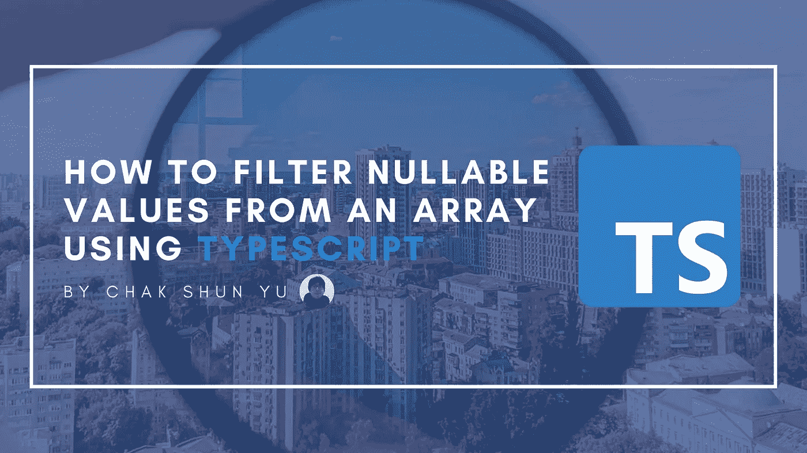

# 如何使用 TypeScript 从数组中筛选可为空的值

> 原文：<https://javascript.plainenglish.io/how-to-filter-nullable-values-from-an-array-using-typescript-30575cb25e3f?source=collection_archive---------21----------------------->



如果您在 JavaScript 开发中处理过任何类型的复杂数据，几乎可以保证您使用过函数数组方法。这些方法比传统实现更短，功能更强，通常使用 for 循环和有条件地填充数组来解决问题。

在正确的环境中使用这些方法可以显著提高代码的质量和可读性。当它们与 TypeScript 结合使用时尤其如此。但是尽管 TypeScript 出色地支持了 Array `map`函数，但对于 Array `filter`函数却不能这么说。

特别是，我们将从这样的数组中过滤出可空值。从开发人员的角度来看，当使用`filter`函数过滤掉可空值时，TypeScript 并不总是正确地选择类型。即使使用像`!!`或`Boolean`构造函数这样的操作符保证我们不再有可为空的值，TypeScript 仍然假设不是这样。

```
interface Array<T> {
  // ...
  filter<S extends T>(predicate: (value: T, index: number, array: T[]) => value is S, thisArg?: any): S[];
}
```

为了理解为什么会发生这种情况，我们必须看一下`filter`函数的 TypeScript 类型定义。要注意的主要事情是谓词函数，它是您定义为第一个函数参数的回调函数，负责确定结果数组中值的类型。这意味着，如果谓词中的操作没有具体产生新的类型，那么`filter`函数将假设函数调用前后的对象数组保持不变。

这是大多数问题出现的地方。开发人员通常内联定义谓词函数，这意味着他们将这一切都交给 TypeScript 来派生适当的类型。除此之外，JavaScript 还有一些非常规的方法来检查可空值。想想我们之前提到的`!!`操作符或`Boolean`构造函数方法。虽然我们作为开发人员知道这些方法是可行的，但是它们对于 TypeScript 来说并不明确。这导致打字不匹配。

本文将介绍在使用 TypeScript 从数组中过滤可空值时整理类型的不同方法。这些功能包括内联类型保护、类型转换和一个通用的实用函数。使用这些知识，您将能够使您的`filter`函数调用正确地与 TypeScript 同步，并享受您应得的类型派生。

# 直列式防护

在 TypeScript 中，存在类型保护的概念。基本上，在函数定义级别，您将函数的返回值作为类型谓词而不是具体类型键入。这向 TypeScript 表明，每当函数计算为 true 值时，对象的类型与类型谓词的结果相同。

但是，除了在函数定义级别上这样做，您还可以在回调中内联这样做。通过利用这种机制，您可以使用所需类型的类型谓词来键入`filter`函数回调的返回值。然后，您可以使用您喜欢的方式检查可空值，TypeScript 将在调用`filter`后自动推断不可空的类型。

```
type SomeObject = { /* */ };const arrayWithNullableValues: Array<SomeObject | null | undefined> = [/* */];const arrayNonNullable = arrayWithNullableValues.filter((value): value is SomeObject => !!value);
```

# 铅字铸造

将适当的类型放入可空过滤数组的另一种方法是利用类型转换。类型转换不是一个特定于 TypeScript 的概念，而是存在于几乎所有的类型系统或类型化编程语言中。这是一种机制，开发人员可以强制告诉类型系统将某个值视为某种类型。虽然不推荐，但是在有些情况下，当开发人员完全确定结果时，它们会很有用。

由于`filter`函数只接受谓词函数，所以不可能通过在回调中执行类型转换来影响结果数组的类型。相反，在应用`filter`功能后，必须在变量级别上执行。如前所述，对于`as Array<T>`,我们告诉 TypeScript 抛开他们所知道的关于数组的一切，把它看作是一个`T`类型的数组。

```
type SomeObject = { /* */ };const arrayWithNullableValues: Array<SomeObject | null | undefined> = [/* */];const arrayNonNullable = arrayWithNullableValues.filter(value => !!value) as Array<SomeObject>;
```

# 一般效用函数

最后，还可以创建一个实用函数来进行过滤，并确保输入正确无误。与第一种方法类似，这种方法使用了类型保护。然而，不同之处在于类型是用一个独立的函数定义的，而不是内嵌在`filter`函数回调中。

键入本身与我们研究的第一种方法没有什么不同。基本上，我们将函数的返回类型定义为类型谓词，向 TypeScript 表明传递的值是返回真值的实用函数的不可空值。

您甚至可以使这个实用函数成为一个通用函数，可以重用它来过滤任何对象或值的不可为 null 的值。为此，您必须更改函数的类型定义，以使用泛型类型。除此之外，一切都是一样的，现在您有了一个通用的实用函数，它将在 TypeScript 中正确地过滤不可为空的值。

```
function isNonNullable<TValue>(value: TValue | undefined | null): value is TValue {
	return value !== null && value !== undefined; // Can also be `!!value`.
}type SomeObject = { /* */ };const arrayWithNullableValues: Array<SomeObject | null | undefined> = [/* */];const arrayNonNullable = arrayWithNullableValues.filter(isNonNullable);
```

# 最后的想法

无论您使用 React、Node 还是其他形式的 JavaScript 库，您可能经常使用的一个函数是 Array `filter`函数。一个常见的用例，尤其是在 JavaScript 开发领域，是从数组中过滤出可空值。但是，如果将它与 TypeScript 结合使用，键入的结果并不总是如预期的那样。

为了解决这个问题，本文介绍了在使用 TypeScript 从数组中过滤出可空值时整理类型的 3 种方法。这包括在`filter`函数谓词上应用内联类型保护，对结果数组进行类型转换，以及使用类型保护的通用实用函数。使用这些方法，您将能够从数组中过滤可空值，并获得适当的类型。

```
**Want to Connect?**If you liked this article, consider checking out the other entries in the [Uncommon React](https://www.getrevue.co/profile/chakshunyu) newsletter and my [Twitter](https://twitter.com/keraito) for future updates.
```

*更多内容看* [***说白了。报名参加我们的***](https://plainenglish.io/) **[***免费周报***](http://newsletter.plainenglish.io/) *。关注我们关于*[***Twitter***](https://twitter.com/inPlainEngHQ)*和*[***LinkedIn***](https://www.linkedin.com/company/inplainenglish/)*。查看我们的* [***社区不和谐***](https://discord.gg/GtDtUAvyhW) *，加入我们的* [***人才集体***](https://inplainenglish.pallet.com/talent/welcome) *。***